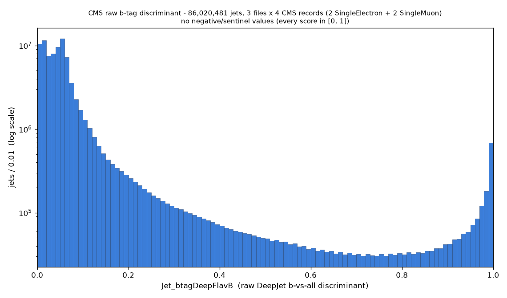
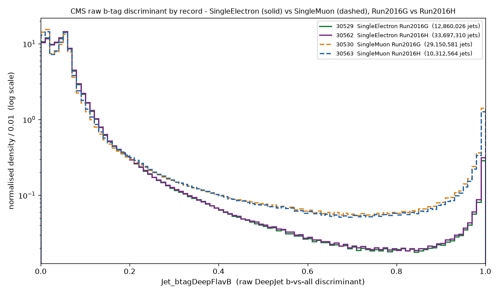

# CMS raw b-tag discriminant (`Jet_btagDeepFlavB`) distribution

**Date:** 2026-09-06, **extended to all 4 CMS records on 2026-09-07**
**Branch:** `analysis/btag-score-distribution`
**Script:** `scripts/btag_score_distribution.py` (run under the WSL venv
`~/btag_work/venv` - XRootD has no Windows wheel)
**Raw stats:** `stats.json`; cached bin counts for re-plotting: `hist_cache.json`

## Why this exists

The existing CMS b-jet work (`reports/cms_bjet_first_test/`,
branch `test/cms-bjet-with-histograms`) confirms b-tagging runs and tags
~7.69 % of jets at the DeepJet **Medium** working point
(`Jet_btagDeepFlavB > 0.2598`, SingleElectron records only). Before b-tagging
is considered for real production scope, Maryna asked to see the **raw
discriminant score itself** - its shape - and, for reference, where the 0.2598
cut used by the b-jet test falls within it.

The pipeline parser only ever stores the final tagged/untagged split, so the
score was re-read directly from the CERN NanoAOD source files. This run covers
**all four CMS records** at **3 files per record** (the scale used by the
medium-scale and b-jet-with-histograms runs):

- 30529, 30562 = `/SingleElectron/Run2016G,H`
- 30530, 30563 = `/SingleMuon/Run2016G,H`

No tagging cut, no event selection.

## What was read

| record | stream | files | events | jets |
|---|---|---:|---:|---:|
| 30529 | SingleElectron Run2016G | 3 | 2,926,989 | 12,860,026 |
| 30562 | SingleElectron Run2016H | 3 | 7,534,950 | 33,697,310 |
| 30530 | SingleMuon Run2016G | 3 | 7,279,257 | 29,150,581 |
| 30563 | SingleMuon Run2016H | 3 | 2,453,914 | 10,312,564 |
| **total** | | **12** | **20,195,110** | **86,020,481** |

(Record 30563's first two files are unusually small - 14 k and 56 k events - a
known quirk of that record; its third file is normal-sized, so its jet count is
still ~10 M.)

### Negative / sentinel values

NanoAOD stores **-1** for `Jet_btagDeepFlavB` on jets where DeepJet was not
evaluated (e.g. jets outside the tracker acceptance or below the algorithm's
minimum pt). We checked for these explicitly - both `score < 0` and the
never-expected `score > 1`:

| | count |
|---|---:|
| jets with score < 0 (NanoAOD -1 sentinel) | **0** |
| jets with score > 1 | **0** |
| jets with a valid score in [0, 1] | **86,020,481 (all of them)** |

`min` = 0.00093, `max` = 0.99951. Nothing had to be excluded; the histograms
cover the complete jet set. (`stats.json` records this per record too, and the
combined-plot subtitle states the count.)

## The combined distribution - all 86 M jets

**Where the bulk sits:** overwhelmingly near zero. Median **0.046**; **54.7 %**
of jets below 0.05, **85.9 %** below 0.10. That low-score peak is light-quark
and gluon jets, which dominate any inclusive jet sample.

**Shape (log-y):** a sharp peak at ~0.03-0.06, a steep fall-off across ~2.5
orders of magnitude to a broad shallow **minimum around 0.7-0.8**, then a
**clear rise back toward 1.0** with a spike in the last bin. Same bimodal shape
as before - a big light-jet peak at ~0 and a genuine b-jet accumulation near 1,
separated by a low-density valley - but with the SingleMuon records now
included, the high-score side is noticeably more populated (percentiles below).

**For reference, where the b-jet test's 0.2598 cut falls** (not marked on the
plot): out on the falling tail. Combined percentiles: p75 = 0.067, p90 = 0.136,
p95 = 0.303, p99 = 0.981. So 0.2598 sits around the ~94th percentile of the
combined sample - the region above it is a mix of the light-jet tail and the
rising b-jet population.

**How many jets fall above 0.2598:**

| | jets | above 0.2598 | fraction |
|---|---:|---:|---:|
| all jets (no selection) | 86,020,481 | 4,880,504 | **5.67 %** |
| jets with pt > 30 GeV & \|eta\| < 4.5 | 38,134,169 | 3,300,754 | **8.66 %** |

The combined "all jets" fraction (5.67 %) is higher than the 3.65 % from the
earlier SingleElectron-only run - because the two SingleMuon records, added
here, have roughly double the high-score fraction (see next section). This is
also why 8.66 % now exceeds the b-jet test's 7.69 %: that number was
SingleElectron-only. The b-jet test's 7.69 % additionally comes from applying a
`>= 1 electron` event selection, which enriches b-jet-producing processes; this
run applies no selection at all, so the two are not directly comparable.

## Split by record: do the four look the same?

**Short answer: era doesn't matter, but trigger stream does.** The two
SingleElectron records match each other; the two SingleMuon records match each
other; but SingleMuon jets have a **substantially heavier high-score tail** than
SingleElectron jets.

| record | stream | jets | median | p90 | p95 | p99 | frac > 0.2598 |
|---|---|---:|---:|---:|---:|---:|---:|
| 30529 | SingleElectron Run2016G | 12,860,026 | 0.0461 | 0.115 | 0.198 | 0.709 | **3.56 %** |
| 30562 | SingleElectron Run2016H | 33,697,310 | 0.0466 | 0.117 | 0.202 | 0.740 | **3.68 %** |
| 30530 | SingleMuon Run2016G | 29,150,581 | 0.0453 | 0.189 | 0.547 | 0.996 | **8.16 %** |
| 30563 | SingleMuon Run2016H | 10,312,564 | 0.0471 | 0.181 | 0.494 | 0.995 | **7.78 %** |

- **The low-score bulk is identical in all four** - median ~0.045-0.047, and
  ~54-55 % of jets below 0.05 in every record. Below ~0.15 the four normalised
  curves lie on top of each other (see plot).
- **Above ~0.2 the streams separate cleanly.** The SingleMuon curves sit a
  factor of ~2-3 above the SingleElectron curves through the mid range and stay
  higher all the way to 1.0. Concretely: p95 is ~0.20 for the electron records
  vs ~0.5-0.55 for the muon records; the fraction above 0.2598 is ~3.6-3.7 % for
  electron vs ~7.8-8.2 % for muon - about **2.2x more** high-score jets in the
  muon stream.
- **Within a stream, the two run eras are indistinguishable** - SingleElectron
  G vs H differ by 0.12 pp in the >0.2598 fraction, SingleMuon G vs H by 0.39 pp
  (and 30563 is the smaller, noisier sample).

**Plausible reason** (stated as plausible - there is no MC truth here to confirm
it): the SingleMuon dataset is a cleaner sample of real b-jet-producing physics.
Muon triggers in 2016 ran at lower pt thresholds and with far less QCD-multijet
fake contamination than electron triggers, so a larger share of SingleMuon
events are genuine leptonic-W events (W+jets, ttbar, single top - all of which
come with b-jets), whereas the SingleElectron sample carries more QCD events in
which a light jet faked the electron (light-jet-dominated, few real b's). The
result is a heavier b-tag-score tail in the muon-stream records. This is a
property of the *event mix* in each trigger stream, not of the tagger.

## Caveat - what this plot is and is not

This is **real collision data with no generator-level (MC truth) labels**. The
plots show the raw `Jet_btagDeepFlavB` distribution and nothing else - no
working-point line, no efficiency numbers. We can *describe* the shapes, compare
them between records, and note where the b-jet test's 0.2598 cut would fall, but
we **cannot** turn any of that into a b-tagging *efficiency*: knowing what
fraction of *true* b-jets a cut keeps needs MC truth flavour labels, which real
Open Data events do not carry. The electron/muon-stream difference above is a
statement about the jet populations in those datasets, not about tagger
performance. No threshold was computed or changed - 0.2598 is quoted only as the
existing b-jet test's cut, for orientation.

## Connectivity note

Earlier attempts were blocked: XRootD port 1094 to `eospublic.cern.ch` was
unreachable from this machine on one network (and HTTPS separately hit a
TLS-interception, which was not bypassed). After switching WiFi networks,
port 1094 connects normally; this four-record run read all 12 files in ~5
minutes total (~4-52 s per file). The block was this machine's network path, not
CERN's side.
