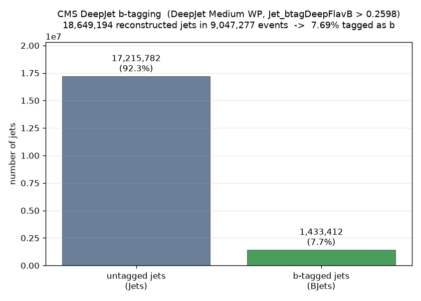
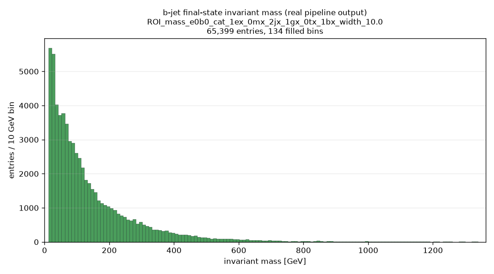

# CMS b-jet tagging - with real histogram output

**Date:** 2026-09-04
**Branch:** `test/cms-bjet-with-histograms`
**Config:** `config.cms_bjet_test_with_histograms.yaml`
**Run:** `output/cms_bjet_with_histograms_20260904_124107/` (pipeline output,
not committed; raw log trimmed to `run_log.txt` in this folder)
**Result:** parsing 6/6 files, 100% success, 9,047,277 events after selection;
mass-calc produced 4,041 IM arrays; post-processing 4,041 signatures;
**4,039 histograms written**; ~38 min end to end.

## What this adds

`config.cms_bjet_test.yaml` already confirmed the CMS b-tagging path works - see
`reports/cms_bjet_first_test/`. But that config had `do_post_processing` and
`do_histogram_creation` set to `false`, so it only produced a text tagging-rate
check and **never any histograms or plots**. This run enables both stages so the
b-tagged path produces real invariant-mass histograms, and plots two of them.

Setup (unchanged from `config.cms_bjet_test.yaml` except the two task flags and
`max_files_to_process: 3`):

| | |
|---|---|
| Records | 30529 + 30562 (`/SingleElectron/Run2016G,H`), 3 files each |
| b-tag algorithm | `Jet_btagDeepFlavB` (DeepJet / DeepFlavour) |
| Working point | **0.2598** - DeepJet Medium, UL2016 post-VFP |
| `objects_to_calculate` | Electrons, Muons, Jets, **BJets** |
| Stages | parsing -> mass-calc -> post-processing -> histogram creation |

## Results

### Tagging rate (confirmed again, at this scale)

From `plot_bjet_summary.py` on this run's `parsed_data` (9,047,277 events):

| | count |
|---|---:|
| untagged jets (`Jets`) | 17,215,782 |
| b-tagged jets (`BJets`) | 1,433,412 |
| total reconstructed jets | 18,649,194 |
| **b-tag fraction** | **7.69 %** |

**Identical to the 7.69 % measured in the first b-jet test**
(`reports/cms_bjet_first_test/`) - stable and reproducible. Plausible for a
SingleElectron sample: mostly light/gluon jets with a real-b minority from
ttbar, single-top and heavy-flavour QCD. Not zero, not all.

### A real b-jet-tagged invariant-mass histogram

Straight from this run's BumpNet ROOT file, the best-populated histogram whose
mass combination actually contains a b-jet:

- **channel:** `ROI_mass_e0b0_cat_1ex_0mx_2jx_1gx_0tx_1bx_width_10.0` -
  invariant mass of `electron + b-tagged jet`, in events with 1e / 2 jets /
  1 photon / **1 b-jet**
- **65,399 entries, 134 filled bins** (well past BumpNet's >30-bin bar)

It is a smooth, well-behaved falling distribution - the same kind of shape as
the non-b-tagged invariant-mass histograms in the medium-scale test. No spikes,
no ~0 GeV pile-up, no pathology.

`scripts/bjet_check.py` on this run confirms the b-jet mass spectra are
physically sane across the board: `j0b0` (jet+b-jet) median ~215 GeV, `e0b0`
~60-90 GeV, `e0j0b0` ~308 GeV, `j0j1b0` ~487 GeV - broad continua scaling with
body count, `<5 GeV` fraction ~0 (not self-pair spikes), negligible negative-mass
noise (overall min -1.0 GeV across 2.6M b-jet entries). Other well-populated b-jet
channels available: `j0b0` (61.9k), `e0j0j1b0` (59.6k, 275 bins),
`j0j1b0` (57.9k, 251 bins).

## How b-tagged combinations flow through the pipeline

The CMS b-tagging path **mirrors ATLAS's existing `enable_jet_tagging` feature**
(`config.yaml`): the parser reads a per-jet discriminant, compares it to a
configured threshold, and **splits the `Jets` collection into `Jets` (untagged)
+ `BJets` (tagged)** in `FileParser._calculate_btagging_and_split()`. The only
CMS-vs-ATLAS difference is the discriminant: CMS uses the precomputed
`Jet_btagDeepFlavB` NanoAOD branch; ATLAS computes a DL1d score from
`BTagging_*` PHYSLITE branches. After the split, `BJets` is just another object
collection - once it is listed in `objects_to_calculate` it goes through
mass-calculation, post-processing and histogram creation identically to
Electrons / Muons / Jets / Photons, producing `..._<N>b_..._IM_...b0...`
signatures and the corresponding BumpNet histograms. Nothing b-jet-specific
happens downstream of the parser.

## Scope note

This is a **demonstration only**. b-jets are **not** wired into
`config.cms_records_master.yaml` or any production config - that remains
out of scope. `config.cms_bjet_test.yaml` and `config.cms_records_master.yaml`
were not modified.
