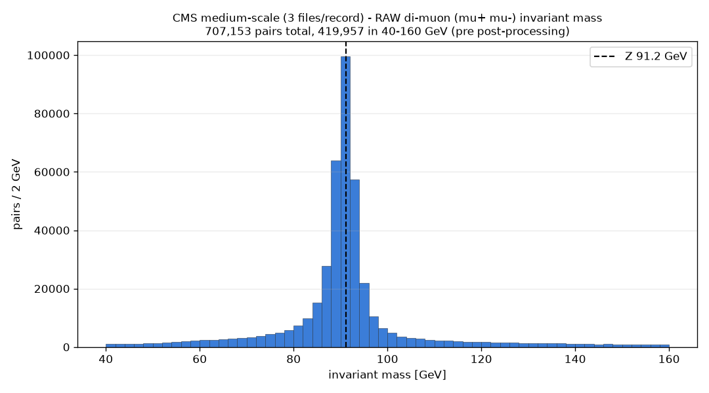

# CMS medium-scale four-record test

**Date:** 2026-09-03
**Branch:** `test/cms-mediumscale-fourrecord`
**Configs:** `config.cms_mediumscale_test.yaml` (15 files/record, as briefed) and
`config.cms_mediumscale_complete.yaml` (3 files/record, reduced run that
completes end to end)
**Raw outputs in this folder:** `dup_rate_probe_output.txt`,
`file_run_ranges.txt`, `oom_run_memory_samples.csv`, `oom_run_parsing_log.txt`,
`completing_run_log.txt`, `completing_run_zpeak_log.txt`, `plots/*.png`
**Configs also live at repo root:** `config.cms_mediumscale_test.yaml`,
`config.cms_mediumscale_complete.yaml`, `config.cms_mediumscale_zpeak.yaml`

---

## TL;DR

| Question | Answer |
|---|---|
| Files available / used per record | 30529: 15/71 · 30562: 15/80 · 30530: 15/70 · 30563: 15/82 (probe). Full pipeline could only reach 3/record before OOM (see below). |
| True SingleElectron/SingleMuon duplicate rate | **~0.1-0.2%** (probe, coverage-corrected: G 0.23%, H 0.20%; completing-run pipeline de-dup cross-check: ~0.1%). The docs' "~2%" is **~10-20x too high**. Still ~0.5-1M duplicate events at full scale. |
| Does the in-memory de-dup scale? | **No.** The 15-files/record full run was OOM-killed during parsing of the *first* record. De-dup set costs ~87 bytes/kept-event; at full scale that is **35-45 GB**. |
| Should the de-dup scaling fix happen before full scale? | **Yes - it is a hard blocker.** Full scale cannot run without it. |
| Dimuon Z-peak at this scale | **Clean and unchanged.** 707k muon pairs, sharp peak at 90-92 GeV (~16.7x off-peak), correctly removed by post-processing. Same sharpness as the 2-file run with ~2.3x the stats. |
| Histograms | 2,786 produced, **2,148 meet the BumpNet bar** (77 %). |

---

## 1. Files available vs used, and raw event counts

Checked live via `services/metadata/fetcher.py` / `CMS_RECID_FILEPAGE_URL`.

| Record | Dataset | Files available | Total size | Files used (probe) | Raw events (that sample) |
|---|---|---:|---:|---:|---:|
| 30529 | /SingleElectron/Run2016G | 71 | ~138 GB | 15 | 29,711,216 |
| 30562 | /SingleElectron/Run2016H | 80 | ~119 GB | 15 (11 opened, 4 transient server errors) | 23,929,578 |
| 30530 | /SingleMuon/Run2016G | 70 | ~120 GB | 15 (14 opened, 1 error) | 32,691,355 |
| 30563 | /SingleMuon/Run2016H | 82 | ~140 GB | 15 | 32,230,863 |

All four records have **far more than 15 files** - 30563's tiny event count in the
earlier 2-file smoke test was just because its first two files happen to be
small (14k and 56k events); its other files are ~2-3M events each like the rest.

**Per-file event counts are high and variable:** ~2.0M (30529), ~2.2M (30562),
~2.3M (30530), ~2.1M (30563) raw events per file on average, individual files
ranging ~0.9M-3.3M. Extrapolated full-record raw totals: 30529 ~141M, 30562
~174M, 30530 ~164M, 30563 ~176M -> **~655M raw events across all four records**
(~490M after per-stream selection at the measured ~75%/85% retention). That is
roughly 2-3x the "~2e8" figure in the brief (which was the SingleElectron-only
estimate; the two SingleMuon records roughly double it).

The full pipeline run (`config.cms_mediumscale_test.yaml`, 15 files/record) did
**not** get through even one record - see section 3. The end-to-end numbers
below come from `config.cms_mediumscale_complete.yaml` at **3 files/record**, and
even there record **30529 (SingleElectron Run2016G) failed to fetch** (a
transient `opendata.cern.ch` connection error at startup - the fetcher logs a
warning and continues), so that run covers **3 of the 4 records**:
30530 3/70, 30563 3/82, 30562 3/80. The 15-files/record counts in the table
above are from the lightweight `dup_rate_probe.py`, which had its own scattered
transient file-open errors (noted per record).

Transient `opendata.cern.ch` failures were a recurring nuisance throughout this
task (metadata endpoint and individual EOS file opens). None indicate a code
problem; they do mean a real full-scale run needs the retry/robustness the
`submit.sh` cluster path already has.

---

## 2. Real duplicate rate: **~0.2%**, not ~2%

### Method

The pipeline de-duplicates on `(run, luminosityBlock, event)`. Measuring the true
overlap by a full parse is infeasible at the needed file count (section 3), so
`scripts/dup_rate_probe.py` reads **only** those three branches (plus the
`nMuon`/`nElectron` counters) from 15 files per record - cheap enough to cover
the needed breadth. For each era it builds the SingleMuon key set, then streams
the SingleElectron files counting how many land in it.

**Crucial fact about the file layout** (`file_run_ranges.txt`): CMS NanoAOD files
are **not** sequential in run number. Every file spans essentially the whole run
range of its era (e.g. 30529 files all span runs ~278820-280385). Each file is a
scattered ~1/N sample of all lumisections, not a contiguous slice.

### Raw probe result (what the 15-file sample directly sees)

| Era | SingleElectron events | Raw overlap hits | Raw overlap |
|---|---:|---:|---:|
| Run2016G (30529 vs 30530) | 29,711,216 | 13,612 | **0.046 %** |
| Run2016H (30562 vs 30563) | 23,929,578 | 8,877 | **0.037 %** |

The count-only proxy (SE events with >=1 electron vs SM events with >=1 muon, no
pt/eta cuts) is essentially identical: 0.045 % / 0.037 %.

### Coverage correction -> true rate

Because files are random lumisection samples, a both-triggered SingleElectron
event in the sample is only *detected* if its SingleMuon twin's file was also
sampled - probability = (SM events sampled) / (SM events in that record). Full
SM-record event totals are extrapolated from the sampled files (~2.3M ev/file):
30530 ~163M, 30563 ~176M.

| Era | SM coverage | corrected dup count in SE sample | **corrected rate** |
|---|---:|---:|---:|
| Run2016G | 32.7M / 163M = 0.20 | 13,612 / 0.20 = 68,000 | **0.23 %** |
| Run2016H | 32.2M / 176M = 0.183 | 8,877 / 0.183 = 48,500 | **0.20 %** |

Hit counts grew linearly with every added file on both sides - the expected
behaviour for uniform lumisection sampling, which gives confidence in the
correction.

### Cross-check from the 3-file completing run's actual pipeline de-dup

The `config.cms_mediumscale_complete.yaml` run (3 files/record, Run2016H pair
only - the Run2016G SingleElectron record failed to fetch) removed **89**
duplicates (all run 282037) from 6.57M kinematically-selected SingleElectron
events. Its SingleMuon coverage was only ~1.4% (3 files, two of them nearly
empty), so coverage-corrected: 89 / 0.014 / 6.57M ~= **0.10 %**. Lower than the
probe's 0.20% because it is post-kinematic-cuts (which drop ~15-25% per side)
and the correction from a 3-file SM sample is coarse.

### Conclusion on the rate

Both methods put the true rate at **~0.1-0.2 %** - i.e. **roughly 10-20x below
the ~2 % figure in `docs/CMS_KNOWN_LIMITATIONS.md`**. It is still a real overlap
that must be removed: ~0.1-0.2 % of ~490M selected events is
**~0.5-1 million duplicate events** at full scale. Just an order of magnitude
smaller than assumed.

The earlier 2-file smoke test's ~0.003 % was a severe undercount purely from
tiny file coverage (SM coverage there ~ 2/70 ~ 0.03, and only ~70k SM-H events).

---

## 3. De-dup memory behaviour as volume grows

### Direct per-key cost

Measured empirically (build a set of N synthetic `run<<96 | lumi<<64 | event`
keys, read peak RSS): **~87 bytes per key** all-in (Python `set` table + the
>64-bit `int` objects), ~65 bytes/key incremental.

### 2-file run (baseline, completed fine)

`config.cms_fourrecord_test.yaml`: 8,665,374 events into the de-dup set ->
**~0.6-0.75 GB**. The run peaked well inside the 7 GB container.

### 15-file run: OOM-killed during parsing of record 1

`config.cms_mediumscale_test.yaml`, parse knobs deliberately turned *down*
(2 threads, 256 MB chunk flush) to give the set maximum room:

| elapsed | container RSS | where |
|---|---:|---|
| 0 min | 0.6 GiB | start |
| 4 min | 1.9 GiB | record 30530, ~2 files |
| 8 min | 5.2 GiB | ~4 files |
| 11 min | 5.8 GiB | ~6 files |
| ~13 min | **6.6 GiB peak** | ~8-9 files |
| ~15.5 min | pinned ~6.2 GiB, then **OOM-killed** | record 30530 file ~10 of 15 |

At the kill: **16,386,051** muon-selected events had been written (9 chunks on
disk). The de-dup set held ~16.4M keys ~= **1.4 GB**. The other ~4.8 GiB was the
parsing working set (uproot + awkward buffers, even at 2 threads). No
traceback - a clean kernel OOM kill.

### Reading of the scaling

- The de-dup set is a **real and growing** contributor, but at this VM size the
  **parsing working set (~5 GiB) is the bigger half**, leaving only ~1.5-2 GiB
  of headroom. That caps a single container at **~20-25M kept events** regardless
  of the de-dup implementation.
- Within that ceiling the de-dup set scales exactly linearly (~87 B/key) with no
  cliff - it is not pathological, just unbounded.
- **The current implementation cannot process even one full record (15 files) in
  the 7.4 GB Docker VM.**

---

## 4. Full-scale extrapolation (~490M selected events, all four records)

### Memory

| Component | At full scale | Fits 7.4 GB VM? | Fits a 128-256 GB machine? |
|---|---:|---|---|
| De-dup set (current: Python set, ~87 B/key) | **~35-45 GB** | No | Marginal, and grows through the whole run |
| De-dup set (packed uint64 key + sorted `np.unique`/`np.isin`) | ~3-4 GB (or ~1.5-2 GB per era) | No | **Yes, comfortably** |
| Parsing working set | ~5 GiB (unchanged) | Marginal | Yes |

The packed-key/`np.unique` approach (the deferred fix) turns a 35-45 GB
open-ended structure into a ~3-4 GB bounded one, or ~1.5-2 GB if de-dup is done
per run-era. That is the difference between "impossible" and "routine".

### Runtime

Measured on the 3-files/record completing run (9 files after the 30529 fetch
failure, 17.3M raw / 14.0M kept events, 2 parse threads):

| stage | wall time | rate |
|---|---:|---|
| parsing | 14.0 min | ~1.6 min/file (2 threads, throttled) |
| mass-calc (4 objects, `min_particles>=2`, `min_events_per_fs 100`) | 23.1 min | ~1.6 min per 1M kept events |
| post-processing | 3.0 min | 5,540 processed array chunks |
| histogram creation | 2.2 min | 2,786 histograms |
| **total** | **~42 min** | |

Extrapolated to all four records at full file count (303 files, ~490M kept):

| stage | throttled single container | 8-thread / non-memory-bound |
|---|---:|---:|
| parsing | ~8 h | ~3-4 h |
| mass-calc | **~13 h** (dominant) | ~5-7 h |
| post-proc + histograms | ~1-2 h | ~1 h |
| **total** | **~22-25 h** | ~10-12 h |

Single-container is memory-infeasible anyway (de-dup, above). **Use the
multi-job `submit.sh` cluster path**, which parallelises across files and brings
wall time to a few hours - but the de-dup fix must land first, because the
cluster path still needs a global de-dup pass over the combined key set.

---

## 5. Physics sanity check + example histograms (3-file completing run)

`config.cms_mediumscale_complete.yaml` completed all four stages (record 30529
absent - transient fetch failure - so this run is 30530 + 30563 + 30562).

**Retention** (per real per-event `source_record`, 0 residual duplicates):

| record | stream | kept / raw | % |
|---|---|---:|---:|
| 30530 | SingleMuon Run2016G | 5,550,805 / 7,279,257 | 76.3 % |
| 30563 | SingleMuon Run2016H | 1,867,229 / 2,453,914 | 76.1 % |
| 30562 | SingleElectron Run2016H | 6,570,296 / 7,534,950 | 87.2 % |

Identical to the 2-file run's retention (~76 % muon, ~87 % electron) - stable
with scale.

**De-dup at this scale:** 89 duplicate events removed (all run 282037,
Run2016H), 0 residual. See section 2 for the rate analysis.

**Histograms:** 2,786 produced, **2,148 meet the BumpNet bar** (>=100 entries
AND >30 bins) - a 77 % pass rate. Shapes: 2,030 real distributions, 101 peaky,
**17 single-bin ~0 GeV spikes** (the known electron/photon/jet object-overlap
artifact - deliberately deferred, unchanged from earlier runs).

**Dimuon Z-peak:** the master-config combination settings
(`min_particles_in_combination: 2`, `min_events_per_fs: 100`) do **not** emit a
bare `m0m1` / `e0e1` channel - every object type in a final state must appear in
the invariant-mass combination, and the "2 leptons, nothing else" final state
does not clear 100 events/chunk. So the Z-peak check was re-run
(`config.cms_mediumscale_zpeak.yaml`: mass-calc -> post-proc -> histograms on
the same parsed data, no re-parsing, `min_particles_in_combination: 1`,
`min_events_per_fs: 1`, Electrons+Muons):

| channel | raw pairs | raw Z-peak (90-92 GeV bin) | after post-processing (`_main`) |
|---|---:|---|---|
| di-muon `m0m1` | 707,153 | **CLEAR peak, 99,654 entries (~26 %, ~16.7x off-peak)**, median 87.8 GeV, 40 % in the 85-97 GeV window | 0 entries below 115 GeV, 0 in Z window - **PASS** |
| di-electron `e0e1` | 453,801 | **CLEAR peak, 68,056 entries (~21 %, ~11.7x off-peak)**, median 91.6 GeV | 0 entries below 115 GeV - **PASS** |

**Nothing qualitatively different from the 2-file run.** The 2-file four-record
run gave a dimuon peak of 42,319 entries at ~16.8x off-peak from 301k pairs;
this run gives 99,654 at ~16.7x off-peak from 707k pairs - **same peak sharpness,
~2.3x the statistics**, cleanly linear with data volume. The known raw-`m0m1`
sentinel tail (`min -16384`, `max 39168`) is still present and still fully
excluded from `_main` (out of scope).

**Example histogram PNGs** (`plots/`, actual output from these runs):

| file | channel | entries | note |
|---|---|---:|---|
| `raw_m0m1_zpeak.png` | di-muon invariant mass, raw | 707 k | the Z-peak sanity check (shown above) |
| `raw_e0e1_zpeak.png` | di-electron invariant mass, raw | 454 k | Z peak at ~91 GeV |
| `ROI_mass_m0j0j1_cat_0ex_1mx_2jx_...` | muon + 2 jets | 902 k | smooth falling distribution, 217 bins - BumpNet-usable |
| `ROI_mass_e0j0j1_cat_1ex_0mx_2jx_1gx_1tx_...` | electron + 2 jets | 894 k | distribution, 246 bins |
| `ROI_mass_e0j0j1g0_cat_1ex_0mx_2jx_1gx_1tx_...` | electron + 2 jets + photon | 899 k | distribution, 284 bins |
| `ROI_mass_m0m1j0_cat_0ex_2mx_1jx_...` | 2 muons + jet | 24 k | distribution, 174 bins |

These are post-processed `_main` histograms straight from the completing run's
BumpNet ROOT file (`raw_*` are the pre-post-processing di-lepton spectra from the
Z-peak re-run).

---

## 6. Recommendation

**The de-dup scaling fix must land before the full-scale run.** It is not a
"nice to have" - the current Python-set de-dup would need 35-45 GB and grows
without bound as the run proceeds, so the full-scale run simply cannot complete
with it in place, on any machine size that is realistic here.

The fix is well understood: replace the Python `set` of big-int keys with a
fixed-width key array (pack `(run, luminosityBlock, event)` into a NumPy
structured / `void` key, or a single `uint64` if de-dup runs per run-era so the
`event` field stays small) and de-duplicate with `np.unique` / `np.isin`.
Per-era keeps the working set ~1.5-2 GB. This is separate work, still out of
scope for this task.

Two secondary points:
- The measured duplicate rate (~0.1-0.2 %) is ~10-20x below the documented ~2 %.
  `docs/CMS_KNOWN_LIMITATIONS.md` should be updated once this is confirmed on a
  fuller run - it changes "de-dup removes a lot" to "de-dup removes ~0.5-1M
  events", still worth doing but a smaller correction than assumed.
- `dup_rate_probe.py` is a cheap way to confirm the rate at any file count
  without a full parse - worth keeping.
- The three transient-fetch nuisances and the "master config doesn't emit a bare
  di-lepton channel" quirk (section 5) are noted-only; none were changed.
