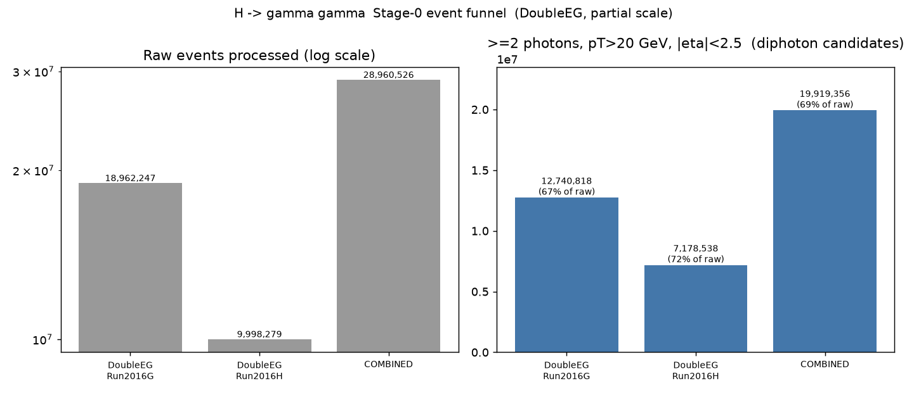
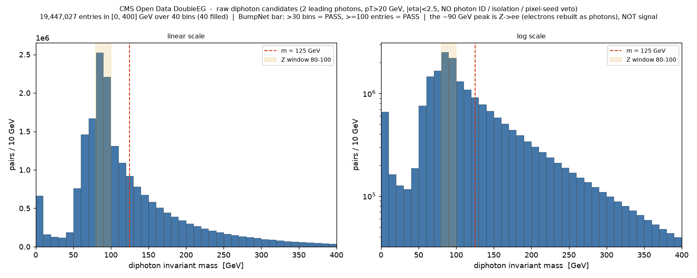

# H -> gamma gamma  -  Stage 0 statistics check (CMS DoubleEG)

**Date:** 2026-09-07
**Branch:** `analysis/higgs-diphoton-stage0-stats`
**Config:** `config.cms_higgs_diphoton_stage0.yaml`
**Analysis script:** `scripts/higgs_diphoton_stage0_report.py`
**Raw numbers:** [`diphoton_stage0_stats.json`](diphoton_stage0_stats.json)
**Run dir (pipeline output, not committed):** `output/cms_higgs_diphoton_stage0_20260907_105829/`

## Purpose

Before building an H -> gamma gamma selection, find out how many diphoton
candidate events we realistically have in the CMS Open Data DoubleEG datasets
with only a basic photon pT/eta acceptance cut - i.e. **before** any photon ID,
isolation, pixel-seed electron veto, or ECAL-gap handling. This is a counting
exercise, not a physics measurement.

## Record IDs (verified against opendata.cern.ch)

| Record | Dataset | Events | Files |
|---|---|---:|---:|
| **30521** | `/DoubleEG/Run2016G-UL2016_MiniAODv2_NanoAODv9-v1/NANOAOD` | 78,797,031 | 47 |
| **30554** | `/DoubleEG/Run2016H-UL2016_MiniAODv2_NanoAODv9-v1/NANOAOD` | 85,388,673 | 86 |

Record 30521 (Run2016G) is the value that was supplied; I confirmed it on the
portal. Record 30554 (Run2016H) I looked up via the portal's dataset search
(`/DoubleEG/Run2016H-UL2016_MiniAODv2_NanoAODv9` -> the only NANOAOD hit is
`-v1`, record 30554) and then verified the record page directly. Both record
descriptions state the events were "selected because of the presence of
different combinations of energetic photons, electrons and/or jets" (HLT
diphoton / dielectron / photon+jet paths) - the CMS 2016 stream for a diphoton
analysis.

## One required code change

`services/parsing/schemas.py`: added `30521` and `30554` to
`RECORD_ID_TO_SCHEMA` (mapped to the existing `cms-nanoaod` schema). Without a
record-id -> schema entry the parser falls back to auto-detection, which does
not understand NanoAOD's flat `Photon_pt` branch naming, and every file returns
zero particles. This is the same two-line registration every new CMS record
needs; **no change was made to how photon kinematics are read** - the
`cms-nanoaod` schema already extracts `pt/eta/phi/mass` for `Photons`.

## What was run

Parsing + mass-calculation only (no post-processing, no histogram stage).
Docker image `atlas-pipeline`, `threads: 1` (the 7.4 GiB Docker VM OOMs when
several ~1.5 GB NanoAOD files are read at once).

**Partial scale** - full scale (133 files, ~164 M events) would take many hours
on this machine's XRootD link. Processed **10 files per record**:

| Record | Files done | of total | Raw events | of dataset |
|---|---:|---:|---:|---:|
| 30521 DoubleEG Run2016G | 10 | 21.3 % | 18,962,247 | 24.1 % |
| 30554 DoubleEG Run2016H | 10 | 11.6 % | 9,998,279 | 11.7 % |
| **combined** | **20** | | **28,960,526** | **17.6 %** |

20/20 files parsed, 100 % success. The two DoubleEG run ranges are disjoint
(G: 278820-280385, H: 281613-284044), so the cross-record de-duplication that
`selection_by_record` switches on ran but removed **0 events**, as expected.

## Event funnel

| Stage | 30521 | 30554 | Combined |
|---|---:|---:|---:|
| Raw events processed | 18,962,247 | 9,998,279 | 28,960,526 |
| **>= 2 photons, pT > 20 GeV, \|eta\| < 2.5** | **12,740,818** | **7,178,538** | **19,919,356** |
| retention | 67.2 % | 71.8 % | 68.8 % |

**~69 % of DoubleEG events pass the >= 2-photon acceptance cut.** That number is
as high as it is because CMS NanoAOD reconstructs essentially every ECAL
supercluster as a photon candidate, including all electrons - and DoubleEG is a
dielectron/diphoton-triggered dataset dominated by Z -> ee. Almost every Z -> ee
event therefore counts as a ">= 2 photon" event here. This is exactly the
contamination the caveat below is about.

## Diphoton invariant-mass histogram

Built from the **2 leading (highest-pT) photons** of every one of the
19,919,356 selected events - one entry per event.

- BumpNet-format ROOT histogram:
  [`histograms/diphoton_stage0_bumpnet.root`](histograms/diphoton_stage0_bumpnet.root),
  TH1 named `mass_g0g1_cat_0ex_0mx_0jx_2gx_0tx_0bx_width_10.0`.
- Binning: **10 GeV bins, 0-400 GeV = 40 bins**, all 40 filled.
- Entries in range: **19,447,027** (a further 472,328 pairs fall above 400 GeV;
  full array min -0.125 GeV, max 5826 GeV, median 100.6 GeV, mean 131.7 GeV).

### Does it meet BumpNet's usability bar?

| Criterion | Required | This histogram | |
|---|---|---:|---|
| bin count | > 30 | **40** | PASS |
| entry count | >= 100 | **19,447,027** | PASS |

It clears both by a wide margin - the entry count is ~5 orders of magnitude
over the floor. Statistics are not the limiting factor at this stage; the
limiting factor is background composition.

### Shape

The distribution is **not** a diphoton signal spectrum. Its dominant feature is
a large peak at **~80-100 GeV** - **4,735,893 pairs (24 % of all entries) sit
in the 80-100 GeV Z window** - which is Z -> ee, with both electrons
reconstructed as photons because no pixel-seed electron veto is applied. Above
that is a steeply falling Drell-Yan + fake-photon continuum. 1,844,952 entries
land in 115-135 GeV, but on the log-scale panel that region is a smooth part of
the falling tail with **no visible bump at 125 GeV**. The small spike at
0-10 GeV is low-mass/near-collinear pairs.

## Caveat - what this histogram is and is not

**No photon identification or isolation of any kind is applied.** This histogram
is therefore dominated by:

- **electrons reconstructed as photons** (no pixel-seed veto) - the entire
  ~90 GeV Z peak, and much of the continuum;
- **jets misreconstructed as photons** (no shower-shape ID, no isolation) -
  broad, falling, everywhere;
- **ECAL transition-region artefacts** (no 1.44 < |eta| < 1.57 gap exclusion).

Any real diphoton signal - Higgs or otherwise - is a small fraction of a
percent of these 19.9 M entries and is completely buried. **Read the 19,919,356
figure as a loose upper bound on "events an ID/isolation selection would run
over", not as a candidate or signal count, and do not read the ~90 GeV
structure or anything near 125 GeV as physics.**

## Note on the mass-calculation stage

The config sets the combinatorics to one combination (Photons, 2 leading,
`max_total_particles_in_combination: 2`) and the mass-calc stage does run and
generate it. But that stage groups events by exact final state and caps every
final-state label at 4 objects/type (`IMCalculator._limit_particles_in_fs`).
Because this run cuts **photons only**, real DoubleEG events keep their uncut
jets and leptons and many have > 4 of some type, so the capping both drops
high-multiplicity events and re-counts low-multiplicity ones - its entry count
is not trustworthy for a pure statistics check. The diphoton mass here was
therefore computed **directly from the parsed photon collections** (2 leading
photons per event). That reproduces the parse-stage >= 2-photon event count
**exactly** (12,740,818 + 7,178,538 = 19,919,356), so it is the clean number to
quote. The selection and the "2 leading photons" definition are exactly as
configured.

## Honest next step

The statistics are plentiful; the work before this is a physics result is all in
background rejection. In rough order of impact:

1. **Pixel-seed electron veto** (`Photon_pixelSeed` / `Photon_electronVeto` in
   NanoAOD). This alone removes the Z -> ee peak - the single biggest
   contaminant - and is one branch and one boolean cut.
2. **Photon ID** - `Photon_cutBased` (loose/medium) or `Photon_mvaID` /
   `Photon_mvaID_WP80`. Removes most jet-faking-photon background.
3. **Isolation** - folded into the cut-based/MVA ID above, or
   `Photon_pfRelIso03_all` explicitly.
4. **ECAL gap exclusion** - drop 1.44 < |eta| < 1.57.
5. **Asymmetric pT** - the standard CMS Hgg preselection uses
   pT(lead)/m_gg > 1/3 and pT(sublead)/m_gg > 1/4 rather than a flat 20 GeV.

Each of items 1-3 needs one additional NanoAOD photon branch to be added to the
`cms-nanoaod` schema and a corresponding cut wired into the parsing selection
(the kinematic-cut path already supports per-object cuts; ID/veto flags would
need a small boolean-cut addition). With the full CMS Hgg preselection applied
to both DoubleEG records at **full** scale (~164 M events), of order 10^3-10^4
of these ~20 M pairs would survive into the analysis mass window, on top of
which the actual Higgs yield in the ~36 fb-1 of 2016 DoubleEG data is only
O(a few hundred) events sitting on a large smooth diphoton + Drell-Yan
background. Extracting it is a **peak fit over a fitted background**, not a
bin-count - so the real deliverable after ID/isolation is a background model and
a fit, not just a bigger histogram.
