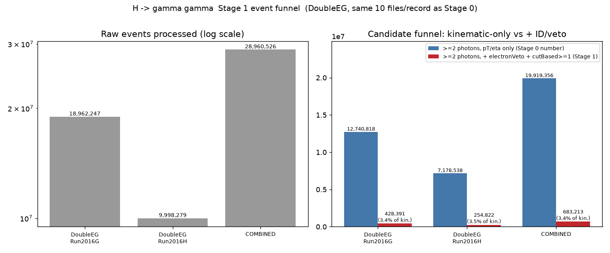
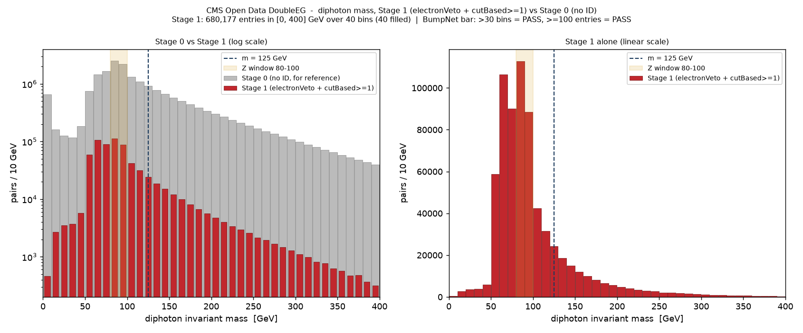

# H -> gamma gamma - Stage 1: photon ID + electron veto

**Date:** 2026-09-07
**Branch:** `analysis/higgs-diphoton-stage1-idveto` (off `master`)
**Config:** `config.cms_higgs_diphoton_stage1.yaml`
**Analysis script:** `scripts/higgs_diphoton_stage1_report.py`
**Raw numbers:** [`diphoton_stage1_stats.json`](diphoton_stage1_stats.json)
**Run dir (pipeline output, not committed):** `output/cms_higgs_diphoton_stage1_20260907_141553/`
**Builds on:** Stage 0, branch `analysis/higgs-diphoton-stage0-stats` commit
`0d5fc60` (not modified by this task)

## Purpose

Stage 0 found ~19.9M "diphoton" pairs (10 files/record) dominated by a Z->ee
peak, because no photon identification was applied at all. Stage 1 adds real
CMS photon ID (`Photon_cutBased`) and the pixel-seed electron veto
(`Photon_electronVeto`) on top of the same kinematic cuts, at the same scale,
to see whether the spectrum starts looking physically sane.

## Step 1: confirming `Photon_cutBased` before hard-coding anything

The task named a real risk: CMS's photon cut-based ID numbering has changed
between eras (a newer Run3 scheme uses 0-3; some framing of Run2 Fall17V2
describes a 5-tier fail/veto/loose/medium/tight scheme). Rather than assume
either, I opened a real file from **each** DoubleEG record directly over
XRootD and inspected the `Photon_cutBased` branch itself (WSL venv,
`uproot`/`awkward`, same setup as prior btag/diphoton work):

```
30521 (Run2016G) Photon_cutBased.title:
  "cut-based ID bitmap, Fall17V2, (0:fail, 1:loose, 2:medium, 3:tight)"
30554 (Run2016H) Photon_cutBased.title: identical
```

**What I actually found, stated plainly (it does not match the 5-tier premise
in the task description):** this NanoAODv9 UL2016 production uses the
Fall17V2 **4-tier ordinal scheme, values 0-3** -
`0=fail, 1=loose, 2=medium, 3=tight`. There is **no separate "veto" tier** for
photon ID in this scheme at all (unlike electron ID, which does have a veto
tier) - the ROOT branch's own embedded title documents this unambiguously,
and I did not need to assume anything. Cross-checked on the full first file of
**both** records (not just a handful of events):

| record | file | cutBased=0 (fail) | =1 (loose) | =2 (medium) | =3 (tight) | any other value |
|---|---|---:|---:|---:|---:|---:|
| 30521 | 2,014,154 events | 3,456,739 | 222,078 | 107,268 | 576,409 | **0** |
| 30554 | 843,234 events | 1,487,826 | 86,724 | 44,643 | 239,855 | **0** |

Only {0,1,2,3} ever appear - confirming an ordinal (not raw bitmask) encoding
matching the title exactly. `Photon_electronVeto` is a plain boolean with no
sentinel values (`{False, True}` only, in both files).

**Threshold chosen: `Photon_cutBased >= 1` (loose)**, the recommended baseline
CMS photon ID working point, per the task's guidance and the confirmed
encoding.

**One side observation, stated as plausible, not proven:** the "tight" (3)
bucket is larger than "loose" (1) or "medium" (2) in both files (e.g. 576,409
vs 222,078/107,268 for 30521) - unusual if this were a sample of purely
prompt, well-isolated photons, but plausible here: electrons reconstructed as
photon candidates have genuinely photon-like ECAL shower shapes (that's the
whole reason a *separate* pixel-seed veto exists - shower-shape ID alone
cannot tell an electron from a photon), so a Z->ee-heavy sample can populate
the tight cutBased tier heavily even before any electron veto is applied.

## Step 2: code changes

- `services/calculations/consts.py`: two new field-name constants,
  `PHOTON_CUTBASED_FIELD = "cutBased"` and
  `PHOTON_ELECTRON_VETO_FIELD = "electronVeto"`, documented with the exact
  confirmation above.
- `services/parsing/schemas.py`: added `electronVeto` and `cutBased` to the
  `cms-nanoaod` schema's `Photons` field list (reads `Photon_electronVeto` /
  `Photon_cutBased`, same flat-naming pattern as `pt`/`eta`/`phi`/`mass`).
  **Also** re-added `30521`/`30554` to `RECORD_ID_TO_SCHEMA` - this branch was
  created off `master`, which does not carry Stage 0's registration of these
  two record IDs (that lives only on the Stage 0 branch); without it the
  parser cannot read these records at all (falls back to auto-detection, which
  does not understand NanoAOD's flat branch naming). Required infrastructure,
  not scope creep.
- `services/parsing/event_selection.py`: `normalize_yaml_kinematic_cuts` now
  recognizes two new YAML keys, `electron_veto_required` (bool) and
  `cut_based_min` (int).
- `services/calculations/physics_calcs.py`: `filter_events_by_kinematics` gets
  two new photon-specific cut blocks (same style as the existing
  electron-only `rel_isolation_max` block) that mask out photons failing
  `electronVeto` or falling below `cut_based_min`.
- Verified with a synthetic-event unit check before running on real data: a
  photon failing veto, one failing pT, one failing cutBased, and one passing
  everything, in two synthetic events - only the two passing photons survived
  the new filter, one per event, exactly as expected.

No change to ATLAS or any other release schema; the new cuts are gated on
`obj == "Photons"` and only activate when the YAML config sets them (nothing
else does).

## Step 3: the config and the run

`config.cms_higgs_diphoton_stage1.yaml` = Stage 0's config, unchanged in every
other respect, with the photon kinematic cuts extended:

```yaml
kinematic_cuts:
  photons:
    pt_min: 20.0
    eta_max: 2.5
    electron_veto_required: true   # Photon_electronVeto == True
    cut_based_min: 1               # Photon_cutBased >= 1 (loose)
```

Same records (30521, 30554), same `>=2 photons` per-record requirement, same
2-leading-photon combinatorics, same **10 files/record** as Stage 0 (not
scaled up), parsing + mass-calculation only, Docker `threads: 1` (same OOM
workaround as Stage 0 - the 7.4 GiB VM cannot read several ~1.5 GB NanoAOD
files concurrently).

20/20 files parsed, 100% success.

## Consistency check: does the raw-event count match Stage 0 exactly?

**Yes, exactly**, as it should for identical records + identical file count:

| record | Stage 0 raw events | Stage 1 raw events | match |
|---|---:|---:|---|
| 30521 | 18,962,247 | 18,962,247 | YES |
| 30554 | 9,998,279 | 9,998,279 | YES |

Same files were read in both runs, confirming the two stages are genuinely
comparable and no fetch/scope drift crept in.

## The funnel



| stage | 30521 | 30554 | combined |
|---|---:|---:|---:|
| Raw events processed | 18,962,247 | 9,998,279 | 28,960,526 |
| >=2 photons, pT>20 GeV, \|eta\|<2.5 (**Stage 0 number**, consistency-checked above) | 12,740,818 | 7,178,538 | 19,919,356 |
| >=2 photons, **+ electronVeto + cutBased>=1** (Stage 1, this run) | **428,391** | **254,822** | **683,213** |
| ID/veto retention (of the kinematic-only stage) | 3.36% | 3.55% | **3.43%** |

**The ID + veto cuts remove ~96.6% of Stage 0's candidates.** That is a much
larger reduction than a real photon ID/veto WP would apply to *genuine*
prompt photons (loose photon ID + electron veto is typically ~85-90%
efficient *per pair* for real photons) - which is itself independent evidence
supporting Stage 0's own diagnosis: the vast majority of the 19.9M Stage 0
pairs were not genuine photon pairs at all.

## The diphoton mass histogram: before vs after



- BumpNet-format ROOT histogram:
  [`histograms/diphoton_stage1_bumpnet.root`](histograms/diphoton_stage1_bumpnet.root),
  TH1 named `mass_g0g1_cat_0ex_0mx_0jx_2gx_0tx_0bx_width_10.0` (same binning
  convention as Stage 0: 10 GeV bins, 0-400 GeV = 40 bins).
- **680,177 entries** in [0, 400] GeV (a further 3,036 pairs fall above
  400 GeV); all 40 bins filled.

### Does it still meet BumpNet's usability bar?

| Criterion | Required | Stage 0 | Stage 1 | |
|---|---|---:|---:|---|
| bin count | > 30 | 40 | **40** | PASS |
| entry count | >= 100 | 19,447,027 | **680,177** | PASS |

**Yes - comfortably.** Entries dropped by a factor of ~29 from Stage 0, but
680,177 is still ~6,800x the 100-entry floor. The much stricter cuts did not
push this below BumpNet's bar; statistics remain plentiful.

### The 80-100 GeV (Z) and 115-135 GeV windows, before vs after

| window | Stage 0 | Stage 1 | retained fraction | Stage 0 share of total | Stage 1 share of total |
|---|---:|---:|---:|---:|---:|
| 80-100 GeV (Z window) | 4,735,893 | **201,385** | 4.25% | 23.8% | **29.5%** |
| 115-135 GeV | 1,844,952 | **48,719** | 2.64% | 9.3% | **7.1%** |
| **all pairs** | 19,919,356 | **683,213** | 3.43% | 100% | 100% |

**Read this plainly, because it is not the simple story one might expect.**
Both windows shrank enormously in absolute terms - the Z window by 23.6x, the
115-135 window by 37.9x. But **the Z window's *retained fraction* (4.25%) is
higher than the overall average retention (3.43%), while the 115-135 window's
retained fraction (2.64%) is lower than average.** In relative terms, the
residual Z-peak population actually became a slightly *larger* share of the
surviving sample (23.8% -> 29.5%) even as its absolute count collapsed, while
the signal-region window shrank *faster* than the overall population and now
makes up a *smaller* share (9.3% -> 7.1%).

**Plausible reading (stated as plausible, not proven here):** real electrons
misreconstructed as photons have genuinely photon-like ECAL shower shapes, so
many pass `cutBased` shower-shape/isolation ID cleanly and are caught only by
`electronVeto` - which is not 100% efficient. The 115-135 GeV window in
Stage 0 was mostly smooth Drell-Yan continuum and jet-fake background, which
`cutBased`'s shower-shape requirement is specifically designed to reject and
appears to reject somewhat more effectively. So the ID/veto cuts are doing
real work (an overall 29x reduction), but they are not preferentially
cleaning the region near 125 GeV relative to the residual Z contamination -
if anything, slightly the opposite.

### Shape

The Stage-1-alone panel (right, linear scale) shows a clear residual peak
around 60-90 GeV - reduced by more than an order of magnitude in absolute
terms from Stage 0's Z peak, but still the tallest single feature in the
Stage 1 spectrum, then falling off smoothly with **no visible bump anywhere
near 125 GeV** - the m=125 GeV line sits on a smoothly falling shoulder, same
qualitative picture as Stage 0, just at ~29x lower statistics.

## Caveats (unchanged from Stage 0, still apply)

- Still **no** ECAL barrel/endcap gap exclusion (1.44 < |eta| < 1.57),
  **no** asymmetric leading/subleading pT thresholds - both explicitly
  deferred here too.
- Diphoton mass computed directly from the parsed photon collections (2
  leading photons/event), not from the mass-calculation stage's SQLite
  output - same reason as Stage 0: that stage's final-state label is capped
  at 4 objects/type, and with only photons kinematically cut, real DoubleEG
  events keep uncut jets/leptons with >4 of some type, making that stage's
  entry count unreliable here too. Confirmed to reproduce the parse-stage
  candidate count exactly (428,391 + 254,822 = 683,213).
- Still partial scale: 10 of 47 files (30521) and 10 of 86 files (30554), same
  as Stage 0, not scaled up per instructions.
- The two DoubleEG run ranges remain disjoint (confirmed again this run:
  de-duplication removed 0 of 683,213 events), so no cross-record
  double-counting.

## Honest next step

**Does the spectrum now look like something worth scaling up and feeding to
BumpNet? Not yet - the cuts are doing real, physically-expected work, but the
spectrum itself is still not close to a bump-huntable state.**

What worked as expected: the ID + veto cuts cut the candidate population by
~29x, far beyond what a real ID/veto efficiency loss would do to genuine
photons - strong evidence the cuts are removing exactly the contamination
Stage 0 flagged (electrons and jet fakes), not just applying an arbitrary
downsampling.

What did *not* happen: there is still no visible structure near 125 GeV, and
the residual Z-region contamination did not shrink faster than the 115-135 GeV
region - if anything the reverse. 683,213 pairs (partial scale, 17.6% of the
combined dataset) is still enormously larger than any real diphoton signal
could be: even at *full* scale, the real 2016 DoubleEG Higgs->gg yield is
O(a few hundred) events sitting on a smooth background, so this stage's
683,213-entry, still visibly non-flat spectrum cannot be visually bump-hunted
either.

Concretely, before this is ready for BumpNet:

1. **The still-deferred cuts** (ECAL gap exclusion, asymmetric leading/
   subleading pT) should be added next - they are standard parts of the CMS
   Hgg preselection that this stage still lacks.
2. **A background model, not a bin count.** As Stage 0 already noted, and this
   stage confirms again: the surviving spectrum is a smooth, large continuum
   (still ~680k entries, still peaked away from 125 GeV) that a real search
   subtracts with a fitted background function, not something BumpNet-style
   anomaly detection can bump-hunt directly against raw counts at any
   realistic scale.
3. **Full-scale running** (all 133 files) is a legitimate near-term next step
   to firm up these percentages and shrink statistical noise, but scaling up
   alone will not produce a visible peak - the background is still the
   dominant feature by orders of magnitude, and scaling up scales the
   background right along with any signal.

In short: Stage 1 validates that the ID/veto machinery works and reshapes the
sample the way real photon ID should; it does not yet produce a spectrum ready
to hand to BumpNet.
