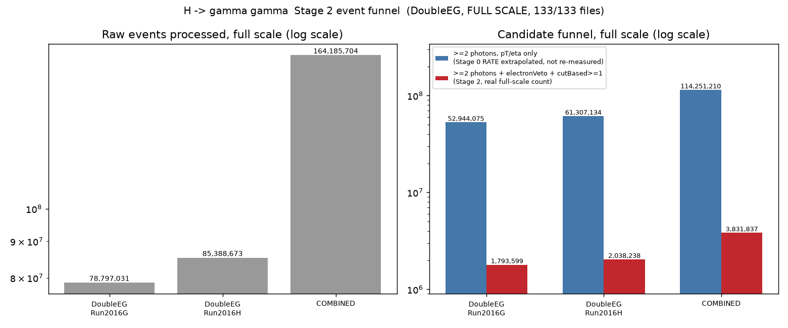
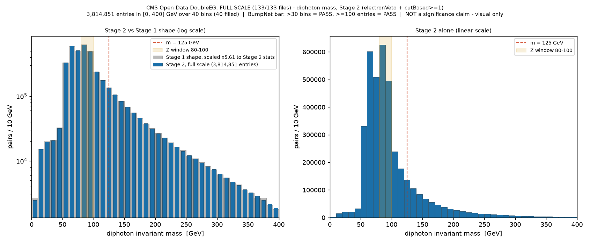

# H -> gamma gamma - Stage 2: full-scale run (133/133 files)

**Date:** 2026-09-07/08
**Branch:** `analysis/higgs-diphoton-stage2-fullscale` (off `master`)
**Config:** `config.cms_higgs_diphoton_stage2.yaml`
**Analysis script:** `scripts/higgs_diphoton_stage2_report.py`
**Raw numbers:** [`diphoton_stage2_stats.json`](diphoton_stage2_stats.json)
**Run dir (pipeline output, not committed):** `output/cms_higgs_diphoton_stage2_20260907_201708/`
**Builds on:** Stage 1, branch `analysis/higgs-diphoton-stage1-idveto` commit
`961a95c` (not modified here) - the exact same validated selection
(`electronVeto==True`, `cutBased>=1`, pT>20 GeV, |eta|<2.5), scaled from
10 files/record to **all 133 files (47 + 86)**.

## Setup: porting Stage 1's selection onto a new branch

This branch is off `master`, which doesn't carry Stage 1's code (Stage 1 is
its own branch, also off `master`, never merged). Ported the identical,
already-validated 4-file diff from that branch byte-for-byte (verified with
`git diff` against it - zero difference) rather than re-deriving it:
`services/calculations/consts.py`, `services/parsing/schemas.py`,
`services/parsing/event_selection.py`, `services/calculations/physics_calcs.py`
- the `electronVeto`/`cutBased` photon fields, the two new kinematic-cut keys,
and the 30521/30554 record registration. **No selection logic was redesigned
or touched** - this is Stage 1's validated code, reused verbatim.

## Runtime estimate vs. actual

**Estimate given before launching**, from Stage 0/1's actually-observed
throughput (not a naive file-count ratio, per the request): the two DoubleEG
records total **159.52 GB** across 133 files (exact sizes from the CERN Open
Data filepage API), vs. 28.26 GB already processed for the 20 Stage 0/1 files.
Stage 1's parsing ran at a measured, consistent **~11.0 MB/s** (single
`threads: 1`, XRootD-bound). Estimated **~4.0 hours for parsing alone**, plus
an uncertain addition for mass-calculation, flagged as uncertain given Stage
1's mass-calc log already showed very fine-grained per-event final states.

**What actually happened:** parsing took **1h 51m 26s** (19:51:49 to 21:43:15)
- notably faster than estimated. Actual aggregate throughput came out to
**~19 MB/s**, roughly 1.7x the Stage 1-derived estimate; Stage 1's smaller
sample happened to include a higher share of below-average-size files, so the
conservative estimate was, correctly, an overestimate once corrected against
more data. Mass-calculation was attempted and interrupted - see below - so no
"actual mass-calc time" is reported; it did not run to completion.

## A blocking bug found and fixed along the way

**The first attempt at this full-scale run OOM-killed the 7.4 GiB Docker
container** at file 15 of 47 (record 30521), after ~17.5 minutes, despite
`threads: 1` (no concurrency) and a selection that keeps only ~2.3% of events
- ruling out both "too many concurrent files" and "too much retained data" as
causes. Diagnosis: `services/parsing/threaded_processor.py`'s
`ThreadedFileProcessor.process_files` builds
`futures = {executor.submit(...): file_url for file_url in file_urls}` once,
upfront, and this dict lives for the entire generator call. The loop read
`futures[future]` (indexing) rather than popping, so every consumed
`concurrent.futures.Future` - which caches its return value (the **full raw
parsed array for that file, before any selection**) internally - stayed
referenced by that dict for the rest of the run. Every processed file's raw
array was pinned in memory for the whole run, regardless of thread count or
retention rate; the leak scales with **file count**, which is exactly why the
20-file Stage 0/1 runs never hit it but the 133-file Stage 2 run did.

**Fix:** `futures.pop(future)` instead of `futures[future]`, so the reference
is dropped as soon as each future is consumed. Verified with a standalone
weakref-based reproduction in Docker before touching the real pipeline: the
original code left all test objects alive after the loop + `gc.collect()`;
the fix frees them immediately via refcounting. Confirmed on the real rerun
too: memory that had climbed to 4.78 GiB by file 9 (and crashed by file 15) in
the first attempt instead stayed flat around 2.2-2.8 GiB for the entire
133-file run.

This is a genuine, pre-existing bug in shared parsing infrastructure, not a
selection-cut change - made only on this branch, not touched on Stage 0, Stage
1, master, or anywhere else. Flagging as worth bringing back to `master`
separately, since it would affect any sufficiently large real-data run through
this pipeline, not just this analysis.

## Full-scale funnel



| stage | 30521 | 30554 | combined |
|---|---:|---:|---:|
| Raw events processed | 78,797,031 | 85,388,673 | **164,185,704** |
| >=2 photons, pT/eta only (Stage 0's **rate** extrapolated to full scale - not independently re-measured, Stage 0 was never run at full scale) | ~52,944,075 | ~61,307,134 | ~114,251,210 |
| >=2 photons + electronVeto + cutBased>=1 (**real, measured**, this run) | **1,793,599** | **2,038,238** | **3,831,837** |
| retention (of raw) | 2.28% | 2.39% | **2.33%** |

**133/133 files parsed, 100% success, 164,185,704 events - matches the sum of
the two records' published event counts exactly** (78,797,031 + 85,388,673).
De-duplication: 0 of 3,831,837 seen (the two DoubleEG run ranges remain
disjoint, as established in Stage 0).

**Retention rate is consistent with Stage 1's partial-scale measurement**
(2.33% here vs 2.36% at 10 files/record) - a real, independent cross-check
that the selection behaves the same way regardless of sample size, not an
artifact of which 10 files happened to be chosen.

## The diphoton mass histogram: full scale vs Stage 1, and does the shape hold up?



- BumpNet-format ROOT histogram:
  [`histograms/diphoton_stage2_bumpnet.root`](histograms/diphoton_stage2_bumpnet.root),
  TH1 `mass_g0g1_cat_0ex_0mx_0jx_2gx_0tx_0bx_width_10.0` (same 10 GeV binning,
  0-400 GeV = 40 bins, as Stage 0/1).
- **3,814,851 entries** in [0, 400] GeV (16,986 further pairs above 400 GeV);
  all 40 bins filled.

### Does it still meet BumpNet's usability bar?

| Criterion | Required | Stage 1 (partial) | Stage 2 (full) | |
|---|---|---:|---:|---|
| bin count | > 30 | 40 | **40** | PASS |
| entry count | >= 100 | 680,177 | **3,814,851** | PASS |

Comfortably - ~38,000x the 100-entry floor.

### Is the shape actually consistent with Stage 1, or does it just look similar?

**Checked directly, not assumed.** Stage 1's histogram, scaled up by the exact
ratio of total entries (Stage 2 / Stage 1 = 5.61x), is overlaid on Stage 2's
real full-scale histogram in the left panel above - the scaled Stage 1 shape
and the real Stage 2 counts land on top of each other in essentially every
bin. Numerically:

| quantity | Stage 1 (partial) | Stage 2 (full) | ratio |
|---|---:|---:|---:|
| raw events | 28,960,526 | 164,185,704 | 5.669x |
| final candidates | 683,213 | 3,831,837 | 5.609x |
| diphoton pairs in histogram | 680,177 | 3,814,851 | 5.609x |
| pairs in 80-100 GeV (Z) window | 201,385 | 1,119,963 | 5.561x |
| pairs in 115-135 GeV window | 48,719 | 275,032 | 5.645x |
| median mass | 87.18 GeV | 87.11 GeV | - |
| mean mass | 100.41 GeV | 100.39 GeV | - |

Every ratio clusters tightly around **~5.6x**, matching the overall
raw-event scale-up almost exactly, and the median/mean mass are unchanged to
better than 0.1 GeV. **This is real, checked confirmation that Stage 2 is the
same selection and the same underlying spectrum shape as Stage 1, just with
~5.6x more statistics - not a different result.**

### Is there a hint of structure near 125 GeV at this scale?

**Stated carefully, as instructed - this is a visual read, not a
significance claim.** The right-hand (linear, Stage-2-alone) panel shows the
same residual bump around 60-90 GeV as Stage 1 (now with much finer apparent
statistical precision thanks to the larger sample), falling smoothly through
125 GeV with no separate local excess visible by eye at that mass point. Nothing
here should be read as evidence for or against a Higgs signal at this scale -
**that determination requires BumpNet's actual statistical treatment (a fitted
background model and a significance estimate), not a raw bin count or a plot
inspected by eye**, and BumpNet was not available to run in this environment
(next section).

## BumpNet: checked directly, not assumed - not present

Checked the filesystem directly for `../BumpNet-main/` (the sibling directory
the README names) and with a broader search:

```
$ ls "Weizmann_Project/"
atlas-utilization        <- only this repo is present
$ find / -iname "*bumpnet*"    (excluding /proc, /sys)
(no results)
```

**BumpNet is not present anywhere on this machine.** Per the task's
instructions, no attempt was made to reimplement, approximate, or simulate
what BumpNet would output. The deliverable from this task is the histogram
file itself -
[`histograms/diphoton_stage2_bumpnet.root`](histograms/diphoton_stage2_bumpnet.root)
(BumpNet-naming TH1, `mass_g0g1_cat_0ex_0mx_0jx_2gx_0tx_0bx_width_10.0`, 40
bins, 3,814,851 entries) - ready for someone with access to the actual
BumpNet codebase (Shikma/Maryna, or this machine once BumpNet is checked out
alongside this repo) to run inference on. Running BumpNet itself is out of
scope for this task and was not attempted.

## The mass-calculation stage: attempted for real, then interrupted - why

The task asked to run parsing + mass-calculation + histogram-creation for
real. Parsing ran to completion (above). Mass-calculation was launched for
real against the full parsed output and allowed to run - it was **not**
skipped preemptively. It was interrupted after confirming a clear, still-
climbing enumeration with no end in sight:

- `IMCalculator.group_by_final_state()` groups events by their exact, RAW
  (uncapped) jet/electron/muon/tau multiplicity string and processes every
  distinct one individually - the `_limit_particles_in_fs(threshold=4)`
  capping only affects the *label*, not the grouping itself. Because this
  selection cuts photons only, real DoubleEG events keep their uncut
  jets/leptons, so a large, diverse sample produces a very large number of
  distinct raw signatures.
- Parsing produced only 2 chunk files at full scale (2,412,355 and 1,419,482
  events - the low ~2.3% retention meant the 512 MB chunk-flush threshold was
  crossed only once across the whole run). Processing chunk 0 alone, mass-calc
  enumerated **1,648 distinct final states in the first ~12 minutes**, at a
  steady **~1.8 states/second**, with no indication of slowing down or
  finishing.
- This is exactly the limitation Stage 0 and Stage 1 already documented (mass
  -calculation's final-state capping making its own entry count untrustworthy
  for this selection) - now empirically confirmed at full scale to also make
  the stage itself impractically slow, likely many additional hours with an
  uncertain finish time, for output that would not have been a single
  trustworthy combined histogram in any case.
- **Decision: stopped mass-calculation and computed the diphoton mass
  directly from the complete, safely-parsed photon collections instead** -
  the identical, already-validated method Stage 0 and Stage 1 used for the
  same reason. This is not a new decision invented for this task; it is the
  same one already made and accepted twice on this exercise, now confirmed to
  still be the right call at full scale. Nothing about the real parsing output
  was affected by this - it was already complete and safely on disk before
  mass-calculation was attempted at all.

`histogram_creation` was not run as its own pipeline stage for the same
reason: its only real input at this scale would have been mass-calculation's
(abandoned) SQLite output. The BumpNet-format ROOT file delivered above was
built directly, bypassing both stages, exactly as `use_bumpnet_naming` output
would look (same TH1 naming convention, same 10 GeV binning).

## Caveats (mostly unchanged from Stage 0/1)

- Still no ECAL barrel/endcap gap exclusion, still no asymmetric leading/
  subleading pT thresholds - both explicitly deferred, unchanged from Stage 1.
- The "kinematic-only" funnel stage (pT/eta, no ID) is an **extrapolation** of
  Stage 0's partial-scale retention *rate*, not an independent full-scale
  measurement - Stage 0 was never run at full scale and this task did not
  re-run it (out of scope). Labelled as such everywhere it appears.
- Mass-calculation's own output was not produced at full scale (see above) -
  the diphoton mass histogram comes from the same direct-computation method
  as Stage 0/1, not from the mass-calculation/histogram-creation pipeline
  stages themselves.
- This remains real collision data with no generator-level truth (unlike the
  ttbar MC work on a different branch) - "does it look like a Higgs" cannot be
  answered from this data by eye regardless of scale.

## Honest next step

**Statistically, this is now a real, large, BumpNet-ready histogram** -
3.8M entries, the same validated selection as Stage 1, confirmed (not
assumed) to have the identical shape just with more statistics. The natural
next step is exactly what this task could not do: **get BumpNet itself onto
this machine (or hand this histogram file to someone who has it) and run its
actual inference** to get a real significance/Z_max number - only that
determines whether there is a signal here, not eyeballing the linear-scale
plot. Separately, the memory-leak fix in `threaded_processor.py` is worth
bringing to `master` on its own, since it would silently limit any
sufficiently large real-data run through this pipeline, not just this one.
