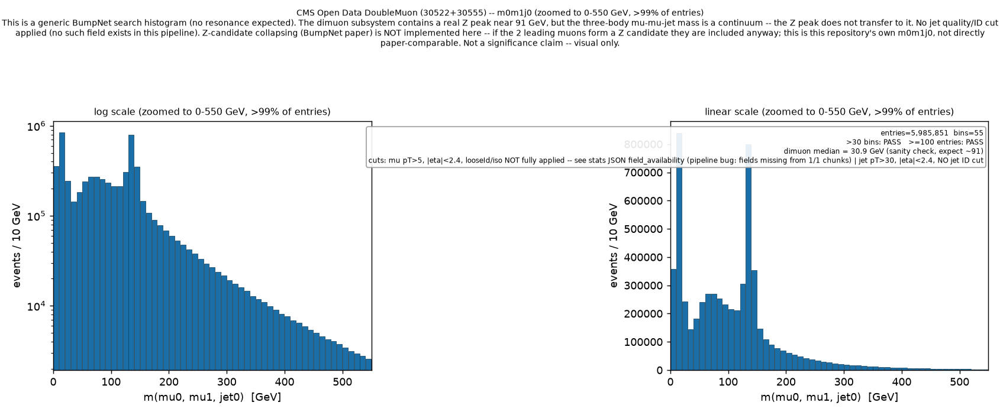
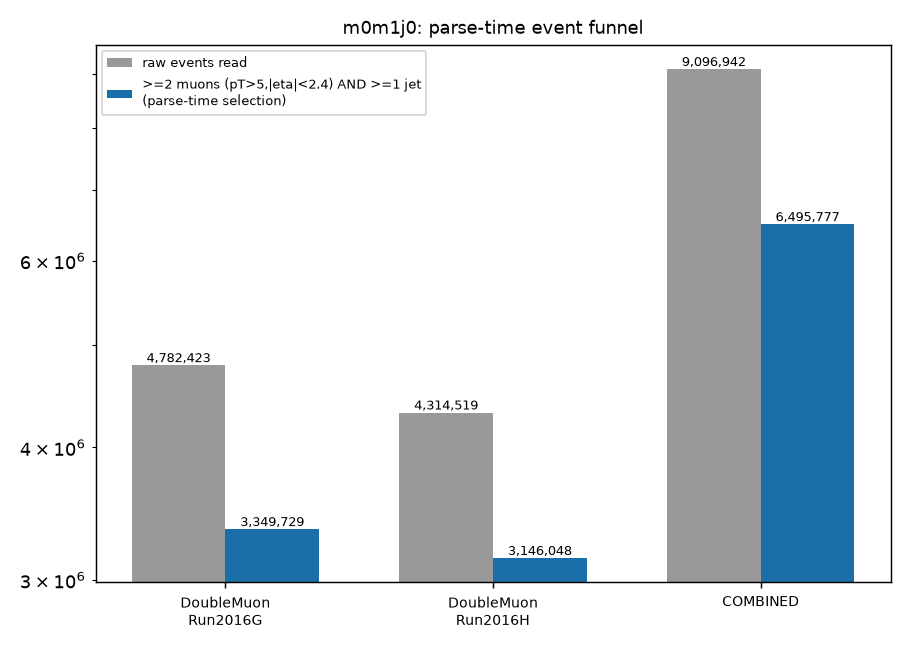

# m0m1j0 smoke test (2 files/record) -- results

Branch: `analysis/m0m1j0-mumujet`. Cluster job: 5036819.pbs (queue N, wn006),
exit 0, walltime 00:03:38, peak memory ~6.4 GiB. Config:
`config.cms_m0m1j0_smoketest.yaml`. Run directory:
`/storage/agrp/berkom/atlas-utilization/output/cms_m0m1j0_smoketest_20260914_203247`.
Full numbers: `m0m1j0_stats.json` in this directory.

An earlier attempt (job 5036811.pbs) failed with 0/0 files processed --
see "Bugs found" below. This is the corrected re-run, after fixing bug #1.

## Per-record retention

| Record | Files | Raw events | Retained (parse-time) | Retention |
|---|---|---|---|---|
| 30522 (DoubleMuon Run2016G) | 2/2 opened, 0 failed | 4,782,423 | 3,349,729 | 70.0% |
| 30555 (DoubleMuon Run2016H) | 2/2 opened, 0 failed | 4,314,519 | 3,146,048 | 72.9% |
| **Combined** | **4/4, 100% success** | **9,096,942** | **6,495,777** | **71.4%** |

Far higher than the H->ZZ->4l >=4-lepton selection's 5-8% for muon streams,
as expected: this selection (>=2 muons pT>5/|eta|<2.4, >=1 jet, nothing
else) is much looser, applied to a trigger stream that is mostly dimuon
events already.

**Loud-failure guard**: present and active (cherry-picked from
analysis/higgs-4lepton-clean commit f9a361d, `MAX_FILE_FAILURE_RATE=0.20`
in `orchestration/handlers/parsing_handler.py`). Did not fire, correctly --
0% file-open failure rate on both records, well under the 20% threshold.

## m0m1j0 histogram (BumpNet-style, hand-written name)

`mass_m0m1j0_cat_0ex_2mx_1jx_0gx_0tx_0bx_width_10.0`, 100 bins, 10 GeV
width, range [0, 1000] GeV:

- **6,025,250 entries** in range (9,160 entries, 0.15%, above 1000 GeV)
- **100 bins**, all 100 non-empty
- BumpNet usability bar: **>30 bins: PASS**, **>=100 entries: PASS**
- Actual mass range: min 0.35 GeV, median 99.2 GeV, p99 509.1 GeV,
  **max 117,273.7 GeV** (a single extreme outlier -- expected given no jet
  quality/ID cut exists in this pipeline; a mismeasured jet is not filtered)
- >99% of entries fall below 550 GeV -- see the zoomed plot





**Shape, described without asserting a cause (per task framing):** the
distribution is not a single smooth falling continuum. Alongside the
expected fall-off, there is a distinct, sharp peak/bump around
125-145 GeV, comparable in bin height to the near-threshold region. This
is reported as an observation, not interpreted. Relevant context for
interpreting it: this run did not implement Z-candidate collapsing, and
-- see "Bugs found" below -- the intended muon looseId/isolation cut could
not actually be applied to this run's muons because of a pipeline bug
discovered during this smoke test, so the two leading muons here are more
likely than intended to include a real, undiluted Z-boson pair (see the
dimuon check below). No cause for the bump is asserted; a rerun after the
looseId/iso bug is fixed (or is otherwise worked around) would be needed to
say whether it persists.

## Dimuon sanity check (units)

Median of the 2 leading muons' invariant mass alone (before adding the
jet): **30.9 GeV**, not the ~91 GeV a clean Z-enriched dimuon sample would
show. This does **not** indicate a units bug (GeV vs MeV): a coarse
histogram of the same dimuon masses (queried directly from the cached
array, not part of the committed script's normal output) shows a sharp,
well-defined peak sitting exactly at 85-95 GeV --

```
 80- 85:   115,276
 85- 90:   396,073   <- Z peak
 90- 95:   635,260   <- Z peak
 95-100:   100,172
```

1,031,333 entries (17% of the dimuon sample) in the 85-95 GeV window alone,
right where the real Z boson mass (91.2 GeV) belongs. This confirms GeV
units are correct. The low overall median is explained by a large
low-mass (<20 GeV, 41% of the sample) population of non-isolated muon
pairs -- exactly what the missing looseId/isolation cut (bug #2 below) was
meant to suppress, and did not.

## Branch titles (while the data files were open)

Read directly from a real raw NanoAOD file via XRootD (not this pipeline's
own reprocessed output), verbatim, no interpretation:

| Branch | Title (as stored) |
|---|---|
| `Jet_pt` | `"pt"` |
| `Jet_mass` | `"mass"` |
| `Muon_pt` | `"pt"` |

Uninformative -- no unit, no statement of jet-energy-correction status.
Whether `Jet_pt` is already JEC-applied remains **UNVERIFIED**; nothing in
this branch title, or in this pipeline's code, settles it.

## Bugs found, not fixed (except #1, which was necessary to proceed at all)

**#1 -- RECORD_ID_TO_SCHEMA missing 30522/30555 on master. FIXED** (commit
`1080fb8`, this branch). `master`'s schema registry only ever had the
original 4 CMS records; 30522/30555 were registered on the separate,
unmerged `analysis/higgs-4lepton-clean` branch for unrelated work and never
made it to master. The first smoke test attempt (job 5036811.pbs) hit
exactly the historic silent-zero-events failure mode this project has hit
before: "Release year 'record_30522' not found in schemas... No particles
found in schema", 0/0 files processed, clean exit. The loud-failure guard
did NOT catch this -- it only tracks XRootD file-open failures (both files
opened fine), not schema-resolution failures, which is a distinct failure
mode of the same underlying bug class. Fixed minimally: only 30522/30555
added (not the other four records that branch also added, which this task
doesn't use).

**#2 -- Muons_looseId / Muons_pfRelIso04_all do not reliably survive
parsing, NOT FIXED.** Both fields are declared in the `cms-nanoaod` schema
and are genuinely present on the raw NanoAOD files (confirmed directly via
uproot against a live file: `Muon_looseId`, `Muon_pfRelIso04_all` both
exist). But the parsed output chunk for this run only contained
`Muons_pt/eta/phi/mass` -- the extra fields were silently absent, causing
`scripts/m0m1j0_mumujet_report.py`'s first attempt to crash
(`uproot.exceptions.KeyInFileError: not found: 'Muons_looseId'`). Root
cause not fully isolated; most likely somewhere in
`services/parsing/file_parser.py`'s per-file branch-accessibility check or
`services/parsing/event_accumulator.py`'s `ak.concatenate` across many
batches (each record's ~4.7M raw events span ~120 batches per file at
`batch_size=40_000`; only one chunk was ever produced per record here, i.e.
all of those batches were concatenated together). The analysis script was
made robust to this (see its `FIELD_DROP_WARNING` docstring and the
`field_availability` block in `m0m1j0_stats.json`): it applies looseId/iso
only when a chunk actually has the field, and states plainly, everywhere
the selection is reported, that this cut was **not** actually applied for
this run. **Practical consequence for this smoke test's numbers**: the
`m0m1j0_candidates_analysis_time` counts and the histogram above reflect
pT/eta-only muon selection, not the full looseId+isolation working point
the task specified.

## What this means for proceeding to full scale

Two things a human should weigh before approving the full run (see final
chat summary's "STILL OPEN" list for the concrete either/or):
1. Whether to proceed to full scale with the looseId/iso cut still broken
   (same gap, same caveats, just more statistics), or hold for a real fix
   to bug #2 first.
2. The bump near 130 GeV is real in this smoke-scale data and is not
   explained away here -- worth a second look before treating the eventual
   full-scale histogram as "no bump, as expected" without checking it also
   shows.
