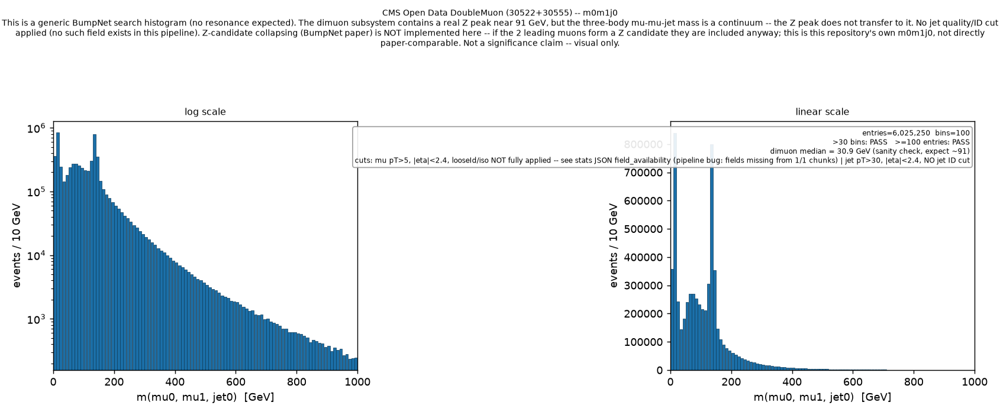

# m0m1j0 smoke test re-run on `sync/upstream-2026-09` — verification against baseline

Same exact configuration as the pre-sync baseline: records 30522 + 30555,
2 files/record, `config.cms_m0m1j0_smoketest.yaml`, same analysis script
(`scripts/m0m1j0_mumujet_report.py`), same selection. Cluster job:
5037211.pbs, exit 0, walltime 00:06:16, peak memory ~6.32 GiB (baseline:
5036819.pbs, walltime 00:03:38, ~6.4 GiB — the ~2.5-minute slowdown is not
investigated further here; nothing in the numbers below suggests it changed
any actual output).

**Bottom line: every number and every plot pixel is identical to the
pre-sync baseline.** None of the 16 upstream commits brought into
`sync/upstream-2026-09` (see `docs/UPSTREAM_SYNC_TRIAGE.md`) changed this
analysis's output in any way that could be measured.

## Side-by-side

| Quantity | Baseline (`analysis/m0m1j0-mumujet`) | Synced (`sync/upstream-2026-09`) | Changed? |
|---|---|---|---|
| Retention, 30522 | 70.0% (3,349,729 / 4,782,423) | 70.0% (3,349,729 / 4,782,423) | No |
| Retention, 30555 | 71.4% combined / 72.9% (3,146,048 / 4,314,519) | 72.9% (3,146,048 / 4,314,519) | No |
| Files opened | 4/4, 0 failed | 4/4, 0 failed | No |
| Entries in range [0,1000] GeV | 6,025,250 | 6,025,250 | No |
| Bins | 100 | 100 | No |
| Entries above 1000 GeV | 9,160 | 9,160 | No |
| Mass min/median/p99/max (GeV) | 0.348 / 99.17 / 509.10 / 117,273.7 | 0.348 / 99.17 / 509.10 / 117,273.7 | No |
| Dimuon 85-95 GeV window | 1,031,333 | 1,031,333 | No |
| Dimuon median (GeV) | 30.9 | 30.9 | No |
| Spike at 10-20 GeV | present, 838,526 entries in that 10 GeV bin | present, 838,526 entries | No -- same position, same height |
| Spike at 130-140 GeV | present, 799,755 entries in that 10 GeV bin | present, 799,755 entries | No -- same position, same height |
| `Muons_looseId` survives parsing? | No (bug) | **No (bug) -- still present** | No |
| `Muons_pfRelIso04_all` survives parsing? | No (bug) | **No (bug) -- still present** | No |
| Loud-failure guard | present, correctly inactive | present, correctly inactive | No |

The two PNG plots this run produced
(`plots/m0m1j0_mass.png`, `plots/m0m1j0_mass_zoomed.png`) are **byte-for-byte
identical** to the pre-sync baseline's PNGs (verified with `diff`, not just
visual comparison) -- included below for the record, not because they show
anything new.

## Why nothing changed -- this was expected, not a verification failure

The triage predicted this. `6046a5b` (native uproot XRootD source) was
flagged as the strongest *candidate* for fixing the muon field-drop bug,
explicitly with the caveat "I can't be certain without testing." The test
says no: even with that fix in place, `field_availability` in
`m0m1j0_stats.json` still reads
`"looseId_applied_to_every_chunk": false, "iso_applied_to_every_chunk": false`.
The other 15 commits taken were independently verified during triage to sit
entirely in code paths this analysis doesn't exercise (ATLAS-only branches,
the generic mass-calculation/post-processing stage we bypass, MC-vs-data
selection edge cases that don't affect `specific_record_ids`-based parsing,
etc.) -- so it would have been a triage error, not a good sign, if any of
those *had* moved these numbers.

**Conclusion on the muon isolation bug: NOT fixed by anything in this sync.**
The root cause remains unidentified. `6046a5b`'s XRootD race-condition fix
addresses a real, plausible failure mode, but empirically it is not (or not
the only) cause of the field drop this project is seeing. Whatever is
actually dropping `Muons_looseId`/`Muons_pfRelIso04_all` between batches is
still there on `sync/upstream-2026-09`, unchanged.

## Both spikes: unchanged, still unexplained

Neither the 10-20 GeV spike nor the 130-140 GeV spike moved, grew, shrank,
or disappeared. Per the task's framing rules, no cause is asserted for
either. The context from the baseline report still applies unchanged: this
run's muons are not looseId/isolation-filtered (same bug, still present)
and this repository does not implement Z-candidate collapsing, so if the
two leading muons form a Z candidate they are still included in the
combination that produces both spikes' region. Nothing in this sync rules
that in or out as a contributor -- it simply confirms the spikes are not
an artifact of any of the 16 commits brought in, since removing/adding them
made no difference.
