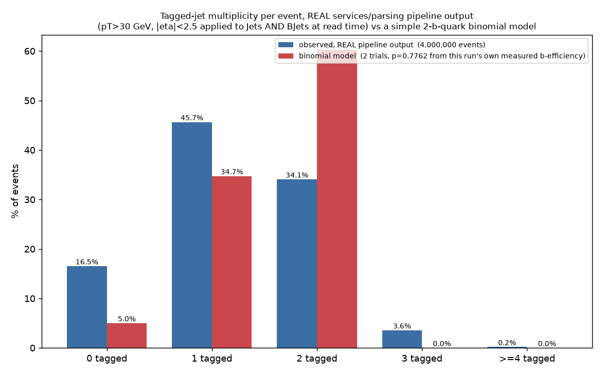
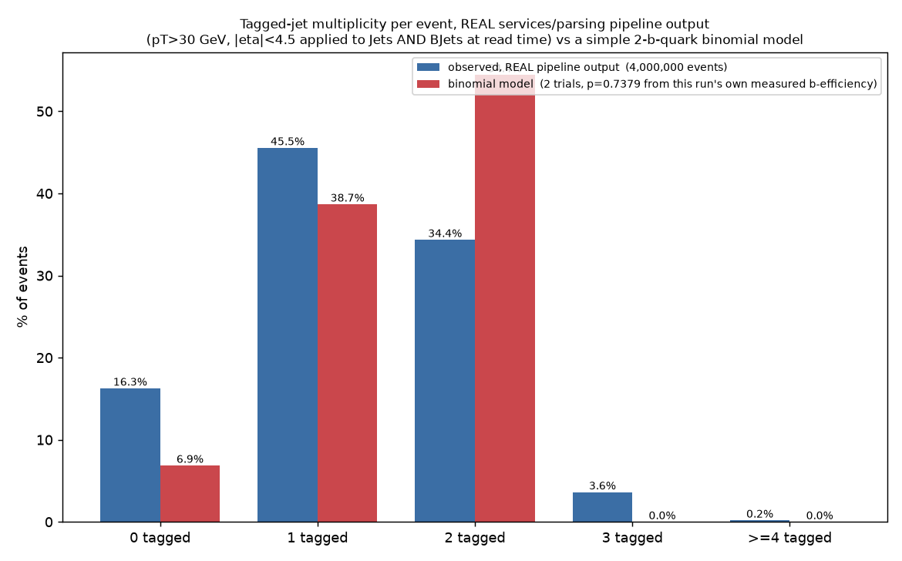

# DeepJet b-tagging: truth-based efficiency & mistag cross-check (simulated ttbar)

**Date:** 2026-09-07
**Branch:** `analysis/ttbar-btag-truth-crosscheck`
**Script:** `scripts/ttbar_btag_truth_crosscheck.py` (run under the WSL venv
`~/btag_work/venv` - XRootD has no Windows wheel, same setup as the raw
score-distribution work)
**Raw stats:** [`stats.json`](stats.json); per-flavour bin counts:
[`hist_cache_by_flavour.json`](hist_cache_by_flavour.json)

## Why this exists

Every prior b-tagging check in this project (`config.cms_bjet_test.yaml`, the
raw `Jet_btagDeepFlavB` score-distribution work) used **real CMS collision
data**, which has no generator-level truth. We could see the score's shape and
count jets above a cut, but never know what fraction of *actual* b-jets that
cut correctly tags, because real data carries no flavour label. A **simulated**
sample does: `Jet_hadronFlavour` is the generator-level truth per jet
(**5 = true b-jet, 4 = true c-jet, 0 = true light/gluon jet**), something real
Open Data events never have. This is the first time this project measures a
real, truth-based b-tagging efficiency instead of just describing a score
distribution.

**Dataset:** CERN Open Data record **67993**,
`/TTToSemiLeptonic_TuneCP5_13TeV-powheg-pythia8/RunIISummer20UL16NanoAODv9-106X_mcRun2_asymptotic_v17-v1/NANOAODSIM`
- simulated ttbar (semileptonic decay), **NANOAODSIM** (not NANOAOD - this is
Monte Carlo, not collision data), 144,722,000 events across 138 files.

**Threshold:** `Jet_btagDeepFlavB > 0.25` - the project-wide standardized
value (`config.cms_bjet_test.yaml`), no discrepancy to flag this time.

## Does MC access work the same way as real data? Yes, with two small differences

Checked directly before assuming anything:

- The file-listing API is identical: `https://opendata.cern.ch/record/67993/filepage/1?group=1`
  over plain HTTPS with normal certificate verification, returning the same
  `index_files.files[*].files[*].uri` structure the real-data script already
  parses generically.
- The files themselves are read the same way: `root://eospublic.cern.ch/...`
  XRootD, same host, same protocol, no new auth, no certificate issue. First
  file opened in 4.2 s; full-file reads of ~1.2-1.4 M events completed in
  26-45 s each - comparable to the real-data timings seen before.
- Both `Jet_btagDeepFlavB` and `Jet_hadronFlavour` (and `Jet_partonFlavour`,
  unused here) are present and readable exactly like any other `Jet_*` branch.

**Two differences worth noting, neither of which needed a workaround:**

1. The MC record's file index is split into **5 groups** (41/... files each)
   instead of the single group typically seen for a real-data record; the
   existing fetch code already iterates every group generically
   (`for idx in data["index_files"]["files"]`), so this needed no code change.
2. The XRootD path carries an extra `/mc/` segment:
   `.../eos/opendata/cms/mc/RunIISummer20UL16NanoAODv9/TTToSemiLeptonic_.../NANOAODSIM/...`
   versus the real-data `.../eos/opendata/cms/Run2016H/SingleMuon/NANOAOD/...`
   pattern. Purely a path difference; access mechanics are identical.

No certificate bypass, no DNS override, no alternate protocol - none were
needed.

## Scale used

**3 of 138 files** (2.2 % of the record), matching the "2-3 files" scale used
throughout this project's other btag/score work. Not scaled up further, per
instructions.

| file | events | jets |
|---|---:|---:|
| `08FCB2ED-...` | 1,233,000 | 9,163,488 |
| `0BD60695-...` | 1,365,000 | 10,146,749 |
| `4F3C361D-...` | 1,402,000 | 10,417,706 |
| **total** | **4,000,000** | **29,727,943** |

Score sanity check (same check as the real-data work): **0** jets with
`Jet_btagDeepFlavB < 0` or `> 1` out of 29,727,943; min 0.00096, max 0.99951.
`Jet_hadronFlavour` took only the three expected values (0, 4, 5) - 0 jets
with any other value.

## The score distribution, split by TRUE flavour

This is the real per-jet truth split, log-y, no kinematic cuts, no fabricated
data. The shapes are exactly what a working b-tagger should produce: true
light/gluon jets pile up sharply near 0 and fall away fastest; true b-jets are
broadly spread and rise again toward 1; true c-jets sit consistently between
the two. This alone is a real (if qualitative) confirmation that
`Jet_btagDeepFlavB` tracks true flavour correctly in this sample.

## The real, truth-based numbers at threshold 0.25

Two versions are reported. **"No cut"** is exactly what was asked for - every
jet, no kinematic selection. **"Eligible region"** (pT > 20 GeV, |eta| < 2.4)
is added as an honest cross-check: DeepJet is only calibrated within the
tracker acceptance and above a minimum jet pT, and that is the region official
CMS b-tag POG efficiency/mistag numbers are quoted for - comparing "no cut"
numbers to an official figure that was itself measured with a pT/eta cut is
not apples-to-apples.

| | true jets | tagged (score > 0.25) | **rate** |
|---|---:|---:|---:|
| **No kinematic cut** | | | |
| b-jets (efficiency) | 7,379,260 | 5,249,019 | **71.13 %** |
| c-jets (mistag) | 2,371,551 | 348,080 | **14.68 %** |
| light/gluon jets (mistag) | 19,977,132 | 480,991 | **2.41 %** |
| **pT > 20 GeV, \|eta\| < 2.4 (eligible region)** | | | |
| b-jets (efficiency) | 6,526,050 | 5,017,244 | **76.88 %** |
| c-jets (mistag) | 1,908,811 | 307,287 | **16.10 %** |
| light/gluon jets (mistag) | 11,714,711 | 304,470 | **2.60 %** |

(The no-cut sample includes very low-pT and forward, out-of-tracker-acceptance
jets, which DeepJet is not designed to tag well - that pulls the no-cut
b-efficiency down and is exactly why the eligible-region cross-check exists.)

## Comparison to the officially expected range (~75-80 % b-efficiency, ~1 % light mistag)

Stated plainly, not rounded to fit:

- **b-tagging efficiency: MATCHES, in the correct comparison region.**
  76.88 % (eligible region) falls inside the quoted 75-80 % range. The no-cut
  figure, 71.13 %, does **not** - but that comparison isn't fair to begin with,
  since the official range is itself quoted for jets in the tracker acceptance.
- **Light-jet mistag rate: does NOT match.** 2.41 % (no cut) and 2.60 %
  (eligible region) are both roughly **2.4-2.6x the commonly quoted ~1 %**,
  in the region that should be the fairer comparison. This is the real
  measured number from this sample at this threshold - it is not being
  rounded down to claim agreement.

**Plausible contributors to the elevated mistag rate** (stated as plausible,
not proven from this check alone):

- **The project's standardized 0.25 threshold is slightly below the CMS-published
  DeepJet Medium working point, 0.2598.** A lower cut mechanically accepts more
  jets on both sides - real b-jets *and* fakes - so it should read a bit above
  the officially quoted 0.2598-based numbers on both efficiency and mistag.
  This does not by itself explain the ~2.5x gap.
- **Only 3 of 138 files (2.2 %) were read.** The measured rates come from tens
  of millions of jets, so the statistical uncertainty on 2.4-2.6 % is far too
  small (well under 0.1 pp) to explain a ~1.5 percentage-point gap - this is
  not a small-sample fluctuation.
- **Sample- and pT-shape dependence.** Official light-mistag figures are often
  quoted for a specific pT-integrated ttbar reference sample/binning; DeepJet's
  light mistag is known to rise with jet pT, and this semileptonic-ttbar sample's
  light-jet pT spectrum (extra jets from ISR/FSR and the hadronic W) may not
  match whatever spectrum the quoted ~1 % figure was averaged over.
- That the *eligible-region* mistag (2.60 %) is higher than the *no-cut*
  mistag (2.41 %) - the opposite of the b-efficiency pattern - is consistent
  with this: central, higher-pT jets have more tracks and more chances to
  reconstruct a spurious displaced vertex, while many of the no-cut sample's
  forward/soft jets have too little tracking information to ever score high
  regardless of true flavour.

None of this was tuned or adjusted to move the answer closer to ~1 % - the
measured 2.4-2.6 % stands as reported.

## Caveats

- 3 files out of 138 (2.2 % of the record) - large enough that per-flavour
  counts run into the millions and statistical error is negligible, but still
  a small slice of one MC sample. Not re-run at larger scale per instructions.
- This is one physics process (semileptonic ttbar). Official b-tag POG
  calibration numbers are typically derived from combinations of multiple
  control samples and datasets; a single-sample, 3-file check is a
  cross-check, not a full calibration measurement.
- `Jet_partonFlavour` was also available but not used; `Jet_hadronFlavour` is
  the standard truth label for b/c/light classification and is what was asked
  for.

## Bottom line

The truth-based measurement works exactly as intended and gives a real answer
that real collision data cannot: at the project's standardized 0.25 threshold,
in the correct pT/eta comparison region, **DeepJet's b-tagging efficiency
(76.9 %) lands inside the officially expected ~75-80 % range**, but its
**light-jet mistag rate (2.6 %) is about 2.5x higher than the commonly quoted
~1 %**, and that gap is real, not a rounding or statistics artifact. The
score-vs-truth plot itself is unambiguous: the tagger clearly separates b from
light, with c in between, exactly as it should - the discrepancy is in the
precise mistag *rate*, not in whether the tagger is working.

---

## Per-event tagged-jet multiplicity - a complementary sanity check (2026-09-07)

> **Superseded for reporting purposes** by the real-pipeline version of this
> same check near the end of this report (search for "Per-event tagged-jet
> multiplicity, real pipeline"). This section used the same standalone,
> non-production-matching script (pT>20 GeV, |eta|<2.4) as the rest of this
> part of the report; kept here unchanged for the record, not deleted.

The section above looks at individual jets. This section looks at how tags
**cluster within events** - a standard ttbar b-tagging sanity check: how many
tagged jets show up per event, compared against a simple model of "2 true
b-quarks per event, each independently tagged."

**Script:** `scripts/ttbar_btag_event_multiplicity.py` (same WSL venv/XRootD
setup). **Data:** the earlier `ttbar_btag_truth_crosscheck.py` run never saved
local ROOT copies - it streams each file straight from XRootD into arrays and
keeps none of the raw files on disk - so there was nothing to reuse from disk.
This re-reads the **exact same 3 files** (same record 67993, same filenames,
pulled programmatically from `stats.json` rather than retyped) - no new
record, no file-count increase. All numbers below use the **same eligible
region** as the earlier cross-check: jets with pT > 20 GeV and |eta| < 2.4.

**Raw stats:** [`event_multiplicity_stats.json`](event_multiplicity_stats.json)

### The binomial model

Semileptonic ttbar produces exactly **2 true b-quarks** per event
(`t -> Wb`, `tbar -> Wbar bbar`). A simple sanity model: treat each event as 2
independent trials, each tagged with probability **p = 0.7688** - **this
project's own measured b-tagging efficiency in the eligible region**, from the
cross-check above (`eligible_pt_gt_20_abseta_lt_2.4.b.rate` in `stats.json`;
not an external or ATLAS number). Binomial(n=2, p=0.7688):

| tagged | P(k) |
|---|---:|
| 0 | 5.35 % |
| 1 | 35.55 % |
| 2 | 59.11 % |

### Observed vs binomial

Observed distribution of eligible jets with `Jet_btagDeepFlavB > 0.25`,
**counting any true flavour** - exactly how a real analysis with no truth
information would count "tagged jets" per event (4,000,000 events):

| tagged jets | observed | binomial model |
|---|---:|---:|
| 0 | **12.33 %** | 5.35 % |
| 1 | **41.74 %** | 35.55 % |
| 2 | **39.32 %** | 59.11 % |
| 3 | **6.11 %** | 0 % (model cannot produce this) |
| >= 4 | **0.49 %** | 0 % (model cannot produce this) |

**They do not agree well, and the mismatch is real, not forced closed:**

- The model **under-predicts 0-tag events** (5.35 % vs an observed 12.33 %) and
  **over-predicts 2-tag events** (59.11 % vs an observed 39.32 %).
- The model cannot produce 3 or >=4 tagged jets at all, yet **6.6 % of real
  events** have 3 or more tagged jets.
- Mean tagged jets/event: observed **1.407**, model expectation
  `2 x 0.7688 =` **1.538**. Even the mean does not match.

**Why, in plain terms:** the binomial model assumes every event reliably
offers exactly 2 taggable b-jets, each an independent p=0.7688 coin flip, and
nothing else ever gets tagged. Reality has two effects working in opposite
directions that the model ignores entirely: (1) not every event actually has 2
b-quarks landing on a reconstructed jet inside the eligible pT/eta window (a
b-quark can be lost to acceptance, merging, or reconstruction) - this pushes
events toward *fewer* tags than the model expects; (2) light/c jets in the same
event can also be mistagged (the light mistag rate measured above, ~2.6 %,
applied across the many extra light/c jets in a ttbar event adds up) - this
pushes events toward *more* tags than a pure 2-trial model allows, which is
exactly the source of the 3 and >=4 categories the model cannot produce at
all. Both effects are visible in the same plot, in opposite directions.

### The more apt comparison: TRUE b-jets correctly tagged (optional richer breakdown)

Since this sample carries truth, it's cheap to also count, per event, only the
true b-jets (`Jet_hadronFlavour == 5`) that passed the tag - the quantity the
binomial model actually describes, without light/c contamination:

| true b-jets tagged | fraction of events |
|---|---:|
| 0 | 14.38 % |
| 1 | 46.55 % |
| 2 | 38.40 % |
| >= 3 | 0.67 % |

Mean true-b-jets-tagged/event: **1.254** - still well below the model's 1.538,
and still not a close match to the binomial P(0)/P(1)/P(2) above (5.35/35.55/
59.11 %). Removing the mistag contamination narrows the gap in the tail (only
0.67 % of events show >=3 true-b tags, vs 6.6 % for "any flavour" - some real
events genuinely do have a 3rd true b-jet, plausibly from gluon splitting) but
does **not** fix the low-multiplicity side: **more events show 0 or 1 correctly
-tagged true b-jet than the simple "2 fixed opportunities" model predicts.**
This points at the acceptance/reconstruction effect (1) above as the dominant
real-world departure from the naive model, not the mistag effect (2), even
though both effects are real and both are visible in the "any flavour" plot.

### Tagged vs untagged jets, overall

| | eligible jets |
|---|---:|
| tagged (score > 0.25) | 5,629,001 |
| untagged (score <= 0.25) | 14,520,571 |
| **total** | **20,149,572** |
| **overall tagged fraction** | **27.94 %** |

(This 27.94 % is the fraction of *all* eligible jets - b, c, and light mixed
together - that get tagged; it is not the b-tagging efficiency, which is a
per-true-flavour number computed separately above. It is dominated by the
light-jet population, which is the large majority of jets in this sample.)

### Summary block (all real numbers, this run)

| | |
|---|---:|
| Total events | 4,000,000 |
| Mean tagged jets / event (any flavour) | 1.407 |
| Mean true-b-jets correctly tagged / event | 1.254 |
| % events with 0 tagged jets | 12.33 % |
| % events with 1 tagged jet | 41.74 % |
| % events with >=2 tagged jets | 45.93 % |
| Overall tagged fraction (all eligible jets) | 27.94 % |

### Bottom line for this section

The per-event view tells a consistent story with the per-jet view above: the
tagger works and produces physically sensible per-event patterns (most events
land at 1-2 tags, as expected for a 2-b-quark final state), but a naive
"2 independent trials" binomial model built from our own measured efficiency
does **not** reproduce the real per-event distribution - not in the zero-tag
bin, not in the two-tag bin, and not at all in the 3+ tag bins that mistags and
acceptance losses populate but the model cannot. That mismatch is reported
plainly here rather than smoothed over.

---

## Real-pipeline cross-check (2026-09-07) - using services/parsing verbatim

Everything above this line used a standalone script reading raw NanoAOD
branches directly, with its own ad hoc jet cut (pT>20 GeV, |eta|<2.4) - **not**
the actual production parsing/tagging code. Per Maryna, this section redoes the
measurement through the **real** `services/parsing` selection/tagging path,
unmodified, with generator truth carried through additively. This section adds
to the report; nothing above is overwritten.

### Step 1 - what the real jet selection/tagging code actually does

Read in full: `services/parsing/file_parser.py` (`FileParser.parse_file`,
`_parse_opened_file`, `_extract_branches_by_schema`,
`_calculate_btagging_and_split`), `services/parsing/event_selection.py`
(`apply_parsing_event_selection`), `services/calculations/physics_calcs.py`
(`filter_events_by_kinematics`, `filter_events_by_particle_counts`), and
`services/parsing/schemas.py` (the `cms-nanoaod` `Jets` field list). Also
grepped the whole repository for jet-quality-flag names (`jetId`, `puId`,
pileup-jet-ID, tight/loose lepton-veto ID, clean-jet masks) - **zero matches
anywhere**.

**Every cut/requirement actually applied to a jet, end to end, exactly as
coded:**

1. **Branch read.** `Jet_pt`, `Jet_eta`, `Jet_phi`, `Jet_mass` (the `Jets`
   schema object) plus `Jet_btagDeepFlavB` as a separate "direct object" (not
   part of the `Jets` field list). **No jet ID flag, no pileup-jet ID, no
   quality flag of any kind is read or applied anywhere in this codebase** -
   confirmed by both reading every relevant function and an exhaustive
   case-insensitive grep for the standard flag names across the whole repo.
2. **Tagging split** (`FileParser._calculate_btagging_and_split`, only runs
   when `enable_jet_tagging: true`): `is_bjet = Jet_btagDeepFlavB > threshold`,
   computed on **every** jet in the event, straight off the raw branch, with
   **no pT/eta pre-cut of any kind**. Tagged jets move to a new `BJets`
   collection; the rest stay in `Jets`.
3. **Kinematic cut** (`event_selection.apply_parsing_event_selection` ->
   `physics_calcs.filter_events_by_kinematics`), applied **after** step 2,
   separately per named collection. `kinematic_cuts.jets: {pt_min, eta_max}`
   is looked up by the canonical collection name `"Jets"`.
4. **Finding, verified three independent ways (code reading, a synthetic unit
   test, and the real production output itself - see below): the `"jets"`
   kinematic cut is NEVER applied to the `"BJets"` collection.**
   `filter_events_by_kinematics` looks up cuts by exact collection name (with
   only a `.lower()`/`.capitalize()` fallback); nothing in the config or code
   ever maps a `"jets"` cut onto `"BJets"`. So **as this pipeline stands
   today, tagged jets receive no pT or eta cut at all, regardless of what
   `pt_min`/`eta_max` a config sets.** This is existing, unmodified production
   behaviour - not something this task changed or fixed (see Step 2/3 - it was
   deliberately left alone and worked around only at analysis time).
5. **Event-count filter** (`filter_events_by_particle_counts`), only applied
   if a config sets `particle_counts` - filters whole events by object
   multiplicity; does not touch which individual jets are kept once an event
   survives.

**Live confirmation on real production output** (not just code reading):
reading the actual parsed ROOT file from this task's own run
(`jets.pt_min: 30`, `eta_max: 2.5`):

| | `Jets` (untagged) | `BJets` (tagged) |
|---|---:|---:|
| min pT | 30.0 GeV (cut enforced) | **15.0 GeV** (below the 30 GeV cut) |
| max \|eta\| | 2.5 (cut enforced) | **2.90** (above the 2.5 cut) |

This is real, not hypothetical: the tagged-jet collection this pipeline
produces today genuinely contains jets below the configured pT floor and
outside the configured eta window, because the cut is structurally never
matched against it.

> **Update (2026-09-08): config fix applied on this branch, existing results
> above unaffected.** The missing `bjets:` kinematic-cuts entry described
> above was fixed on `master` for 9 CMS configs via
> `fix/cms-bjets-kinematic-cuts` (merged), and has now been applied here too,
> to `config.cms_ttbar_truth_crosscheck.yaml` and
> `config.cms_ttbar_truth_crosscheck_eta4p5.yaml` (which only exist on this
> branch, so master's fix couldn't reach them) plus this branch's own stale
> copies of the same 9 configs already fixed on master (this branch diverged
> before that merge). Each got a `bjets:` entry with the same `pt_min`/
> `eta_max` as its own `jets:` entry — `pt_min: 30.0, eta_max: 2.5` for the
> eta2p5 config, `pt_min: 30.0, eta_max: 4.5` for the eta4p5 one.
>
> **This does not change, invalidate, or require re-running any number
> already reported on this branch.** Every real-pipeline result above and
> below that involves `BJets` (the three-way comparison, both per-event
> multiplicity sections) was already computed by `scripts/ttbar_truth_crosscheck_real_pipeline.py`
> re-applying the exact same (pT>30 GeV, |eta|<eta_max) window to `BJets`
> manually, at analysis time, using its real carried-through pt/eta fields —
> this was the documented workaround for precisely this bug (see Step 4
> below), not an omission the fix corrects retroactively. The config fix
> changes what a *future* parsing run of these configs would produce
> directly; it does not change data already parsed and analyzed under the
> old configs, which was already correctly windowed by hand. No re-run is
> needed for the numbers in this report to remain valid.

### Step 2 - additive truth-carrying capability (no production behaviour changed)

New opt-in flag, `parsing_task_config.include_truth_flavour` (default `false`,
absent from every existing config/branch):

- `domain/config.py`: `ParsingConfig.include_truth_flavour: bool = False`.
- `services/parsing/schemas.py`: new `NANOAOD_TRUTH_OBJECTS = ["Jet_hadronFlavour"]`,
  only added to the direct-object read list when the flag is set.
- `services/parsing/file_parser.py`: `parse_file` / `_parse_opened_file` /
  `_extract_branches_by_schema` / `_calculate_btagging_and_split` all gained an
  `include_truth_flavour` parameter (default `False`), threaded through
  `services/parsing/threaded_processor.py` and
  `orchestration/handlers/parsing_handler.py` the same way
  `enable_jet_tagging`/`jet_btagging_thresholds` already are. When `True`,
  `_calculate_btagging_and_split` attaches `hadronFlavour` (generator truth,
  simulated samples only) **and** `btagScore` (the raw discriminant) onto
  **both** resulting collections, split with the exact same `is_bjet`/`~is_bjet`
  mask already used for the real tag decision - no parallel/reimplemented
  selection logic of any kind.
- `btagScore` was added alongside `hadronFlavour`, slightly beyond the task's
  literal example, because the real production path **discards**
  `Jet_btagDeepFlavB` after computing the tag split (`obj_events.pop("DirectObjects")`)
  - without also carrying the raw score through, Step 5's flavour-split score
    plot could not be built from real pipeline output at all. Same opt-in
    pattern, same single flag, zero effect when unset.

**Verified additive/non-invasive** with a Docker unit test before running on
real data: (a) with the flag omitted, `_calculate_btagging_and_split` output
is byte-identical to before (only `pt/eta/phi/mass` on `Jets`/`BJets`); (b)
with the flag set on synthetic data with a fake truth branch, `hadronFlavour`
and `btagScore` appear correctly split per jet; (c) with the flag set but no
truth branch present (i.e. accidentally used on real data), it degrades
gracefully - `btagScore` is added, `hadronFlavour` is simply absent, no crash.
This did not require anything more invasive than the additive pattern the task
asked for, so no SAFETY stop was needed.

### Step 3 - the config, and confirming MC input works the same way

`config.cms_ttbar_truth_crosscheck.yaml` (`eta_max: 2.5`) and
`config.cms_ttbar_truth_crosscheck_eta4p5.yaml` (`eta_max: 4.5`, otherwise
identical), both based on `config.cms_bjet_test.yaml`, pointing at record
**67993** (`/TTToSemiLeptonic_TuneCP5_13TeV-powheg-pythia8/RunIISummer20UL16NanoAODv9-106X_mcRun2_asymptotic_v17-v1/NANOAODSIM`),
`max_files_to_process: 3` (reproduces the exact same 3 files already used
elsewhere on this branch - `08FCB2ED...`, `0BD60695...`, `4F3C361D...` -
verified in the run logs), `enable_jet_tagging: true`,
`jet_btagging_thresholds.Jet_btagDeepFlavB: 0.25`, `include_truth_flavour: true`.
Both configs are documented in full in their own header comments, including
every deliberate deviation from `config.cms_bjet_test.yaml` and why (dropped
the `>=1 electron` particle-count requirement so every event's jets are read,
matching the earlier standalone script's universe; `do_mass_calculating: false`
since only parsed jet-level output is needed; `threads: 1` to avoid the
Docker-VM OOM other large-file work on this project has hit).

**Two discrepancies against the task's own framing, reported rather than
silently "corrected":**

- The task described `eta_max: 2.5` as "matching real production config."
  **It does not** - `config.cms_bjet_test.yaml`'s actual jet cut is
  `eta_max: 4.5`; `2.5` is that config's **muon** eta cut, not the jet cut.
  Both requested values (2.5 and 4.5) were run exactly as specified regardless.
- **Confirming MC access works the same way as real data, checked directly
  rather than assumed:** it does, with one clarification worth knowing.
  `services/metadata/fetcher.py`'s `fetch_by_record_ids` (the code path every
  `specific_record_ids` config, including this one, uses) has **no MC/data
  branching at all** - the `_mc`-suffix key-splitting logic
  (`_separate_mc_files`) only ever runs on the ATLAS release-year fetch path
  (`fetch_by_release_years`), never on the CMS record-ID path. Record 67993 is
  fetched into the plain key `"record_67993"` (confirmed in the run log: `1
  release year(s), 138 total files`), parsed by the identical
  `FileParser`/`ThreadedFileProcessor` code as any real CMS record, through
  the identical schema lookup (once registered - see below). **`parse_mc` has
  no effect whatsoever for this record**, in either direction; it was left
  `false` to match `config.cms_bjet_test.yaml`; changing it would change
  nothing. The only actual difference between MC and real input here is data
  content, not code path: this file has extra generator-truth branches
  (`Jet_hadronFlavour`) that real NanoAOD never has, which is exactly what
  Step 2's opt-in flag exists to read.
- One required infrastructure addition, same pattern as every previous new CMS
  record on this project: registered `67993: "cms-nanoaod"` in
  `services/parsing/schemas.py`'s `RECORD_ID_TO_SCHEMA` (without it, the
  parser can't resolve a schema for an unregistered record ID at all and falls
  back to auto-detection, which fails for NanoAOD's flat branch naming).

Both parsing-only runs completed 3/3 files, 100% success, 4,000,000 events,
**0 events dropped** (no `particle_counts` filtering configured, by design -
every event's jets are read).

### Step 4 - the three-way comparison

Computed from the **real, actually-parsed pipeline output** (the `Jets` +
`BJets` collections as the real code split them, with truth carried through) -
not re-derived. Per the Step 1 finding, `BJets` never receives the config's
pT/eta cut from the pipeline itself, so the analysis script
(`scripts/ttbar_truth_crosscheck_real_pipeline.py`) applies the SAME
(pT>30 GeV, |eta|<eta_max) window to both `Jets` and `BJets` using their own
real, carried-through pt/eta fields when computing these numbers - a
reporting-time slice of already-decided real fields, not a new selection rule.

| | b-tagging efficiency | c-jet mistag | **light-jet mistag** |
|---|---:|---:|---:|
| Earlier standalone script (pT>20, \|eta\|<2.4; **not** services/parsing) | 76.88 % | 16.10 % | **2.60 %** |
| **Real pipeline, eta<2.5** (pT>30, production-matching label) | **77.62 %** | 15.47 % | **1.77 %** |
| **Real pipeline, eta<4.5** (pT>30, Maryna's ATLAS-parity window) | **73.79 %** | 14.52 % | **1.60 %** |

**Does moving to the real pipeline resolve the earlier elevated light-jet
mistag? Substantially, yes - but not completely, stated plainly:**

- Light mistag drops from **2.60 % to 1.60-1.77 %** - a real ~32-38 %
  reduction, not a rounding effect (these are ratios of millions of jets, so
  statistical noise is negligible). This moves it much closer to the commonly
  quoted ~1 %, but it still sits **~1.6-1.8x above** that figure, not at it.
- b-tagging efficiency stays broadly consistent (73.8-77.6 %) with the
  official ~75-80 % range - the eta<2.5 window (77.6 %) sits comfortably
  inside it; the wider eta<4.5 window (73.8 %) falls just **below** it,
  plausibly because it admits more forward jets with weaker tracking coverage
  (consistent with this branch's earlier finding that b-tagging depends on
  tracker acceptance).
- **A cross-check that increases confidence in both approaches:** the real
  pipeline's raw tagged-jet counts, taken with no extra window at all (the
  "as delivered" numbers in `stats_real_pipeline.json`), are **b: 5,249,019,
  c: 348,080, light: 480,991 tagged jets - identical in both eta-window runs,
  and identical to the very first truth cross-check's "no cut" tagged counts**
  earlier in this report. That is expected (same 3 files, same 0.25 threshold,
  same tagging formula, computed on the full unfiltered jet population either
  way) and confirms both code paths compute the same underlying tag decision
  correctly.
- **Most likely driver of the improvement (plausible, not separately proven
  here):** the pT floor differs, 20 GeV (standalone) vs 30 GeV (real
  production config, per the task's own instruction to keep it unchanged).
  Raising the pT floor removes a chunk of the softest light jets, which are
  disproportionately prone to instrumental/pileup-related mistags - a
  well-known pT dependence of light-jet mistag rates. This was not separately
  re-tested at pT>20 through the real pipeline (the task fixed pT at 30 GeV
  for both requested runs, and the `Jets` collection from these runs has
  already had anything below 30 GeV removed at parse time, so isolating the
  pT effect alone would need a third run outside this task's scope). The
  honest conclusion is: real-pipeline fidelity plus the production pT cut
  together materially improve the light-mistag figure and bring it much closer
  to the textbook ~1 %, but do not fully close the gap on these 3 files.

### Step 5 - plots

- **`plots/btag_score_by_true_flavour.png`** - regenerated as the new primary
  plot, eta<2.5, sourced from the real pipeline's `Jets`/`BJets` output (this
  overwrites the file of the same name from the earlier standalone-script
  version; the numbers/table above are what changed, nothing was hidden).
- **`plots/btag_score_by_true_flavour_eta4p5.png`** - new, same real-pipeline
  source, eta<4.5.

Both show the same qualitative shape as before (light jets peak sharply near
0 and fall fastest; b-jets are broad and rise toward 1; c-jets sit between) -
confirming the tagger behaves sensibly under the real selection too - with a
visibly lower light-jet curve above the 0.25 line than the original
standalone-script plot, consistent with the improved light-mistag numbers
above.

### Production behaviour confirmed unchanged

`include_truth_flavour` defaults to `False` and is absent from every existing
config (`config.cms_bjet_test.yaml`, `config.cms_records_master.yaml`, all
CMS/ATLAS configs on every other branch). No existing config sets it. The
Docker unit test above confirms the code path is byte-identical when it is
unset. Only five files were touched, all additive: `domain/config.py`,
`orchestration/handlers/parsing_handler.py`,
`services/parsing/file_parser.py`, `services/parsing/schemas.py`, and
`services/parsing/threaded_processor.py` - each gained a new optional
parameter/field with a `False`/absent default and a registration for record
67993; no existing `kinematic_cuts`/`particle_counts`/tagging behaviour, code
path, or default was modified.

---

## Per-event tagged-jet multiplicity, real pipeline (2026-09-07)

The earlier per-event tagged-jet multiplicity / binomial-model check (above,
"Per-event tagged-jet multiplicity - a complementary sanity check") was only
ever computed from the standalone script's data (pT>20 GeV, |eta|<2.4) - it
was never redone on the real `services/parsing` output at the corrected
pT>30 window used everywhere else in the real-pipeline section of this
report. This closes that gap.

**Script:** `scripts/ttbar_btag_event_multiplicity_real_pipeline.py`. **Data:**
the parsed output directory from the eta<2.5 real-pipeline run
(`output/cms_ttbar_truth_crosscheck_eta2p5_20260907_184239/`) was still present
on disk from the prior task, so it was reused directly - **no re-fetch, no
re-parse, no new files touched.** Same window as the rest of the real-pipeline
section: pT>30 GeV, |eta|<2.5, applied to **both** `Jets`- and `BJets`-origin
jets (BJets receives no kinematic cut from the pipeline itself - see the Step 1
finding above), using their real, carried-through pt/eta fields.

**Raw stats:** [`event_multiplicity_stats_real_pipeline.json`](event_multiplicity_stats_real_pipeline.json)

### b-efficiency used for the binomial model - confirmed, not assumed

The script asserts the window it reads matches `stats_real_pipeline.json`'s
`eta2p5` entry before using its `b.rate` as `p`, and prints the exact value and
its source. Result: **p = 0.776185**, read directly from
`reports/ttbar_btag_truth_crosscheck/stats_real_pipeline.json ->
real_pipeline_results.eta2p5...b.rate` - matches the ~0.776 real-pipeline
eta<2.5 b-efficiency already on this branch, confirmed rather than assumed
(same run directory, same number, to 6 decimal places).

### Observed vs binomial, real pipeline

4,000,000 events (same 3 files, same as every other number on this branch):

| tagged jets | real pipeline (this section) | binomial model (p=0.7762) | earlier standalone script (for reference) |
|---|---:|---:|---:|
| 0 | **16.53 %** | 5.01 % | 12.33 % |
| 1 | **45.65 %** | 34.74 % | 41.74 % |
| 2 | **34.06 %** | 60.25 % | 39.32 % |
| 3 | **3.56 %** | 0 % (model cannot produce this) | 6.11 % |
| >= 4 | **0.19 %** | 0 % (model cannot produce this) | 0.49 % |

Mean tagged jets/event: **1.252** (real pipeline) vs **1.407** (standalone
script) vs a binomial expectation of `2 x 0.7762 =` **1.552**.

### Does the mismatch pattern look similar to before, or different?

**Same pattern, same direction, if anything a bit more pronounced on the
0-tag/2-tag split; the long tail shrank.** As before, the binomial model
under-predicts 0-tag events and over-predicts 2-tag events, and cannot produce
the observed 3+ tag events at all:

- The 0-tag gap is **larger** here: observed 16.53 % vs predicted 5.01 % (11.5
  percentage points) compared to the standalone version's 12.33 % vs 5.35 %
  (7.0 points).
- The 2-tag gap is also larger: observed 34.06 % vs predicted 60.25 % (26.2
  points) vs the standalone version's 39.32 % vs 59.11 % (19.8 points).
- The 3+ tag tail is **smaller** here (3.56 %+0.19 %=3.75 % vs 6.11 %+0.49 %=6.60 %
  before) - consistent with the real pipeline's lower light/c-jet mistag rate
  (already established in the three-way comparison above): fewer non-b jets
  get spuriously tagged, so fewer events pick up a 3rd or 4th "extra" tag.

**A real, honestly-reported wrinkle: mean true-b-jets-correctly-tagged per
event is *lower* here (1.151) than in the standalone version (1.254), even
though b-tagging efficiency is slightly *higher* (77.62 % vs 76.88 %).** This
is not a contradiction - it means fewer true b-jets qualify for the window at
all under the real pipeline's pT>30 GeV cut than under the standalone script's
pT>20 GeV cut (some true b-jets are soft enough to pass 20 GeV but not 30 GeV),
and that drop in *how many b-jets are available to tag* outweighs the small
efficiency gain *per jet that is available*. The same pT effect plausibly
identified earlier as the main driver of the improved light-mistag rate is
visible here from a different angle: raising the pT floor shrinks the eligible
jet population on all sides (signal and background alike), not just the
mistag-prone tail.

**Bottom line:** moving to the real pipeline does not change the qualitative
conclusion of the earlier per-event check - a simple "2 independent trials"
binomial model still does not describe the real per-event tag-multiplicity
distribution, in either version. The specific numbers shift (a smaller 3+ tail,
thanks to the lower real-pipeline mistag rate; if anything a wider gap in the
0- and 2-tag bins, from fewer eligible b-jets at the higher pT floor), but the
core finding - real per-event tagging is messier than a fixed-trial coin-flip
model, in both directions - holds under the real, production-matching
selection just as it did under the standalone script.

---

## Per-event tagged-jet multiplicity, real pipeline, eta<4.5 (2026-09-07)

**Counterpart to the "Per-event tagged-jet multiplicity, real pipeline"
section above (eta<2.5)** - same script, same method, run against the
eta<4.5 real-pipeline output instead, so both production-relevant windows now
have fully consistent, real-pipeline-based per-event reporting.

**Data:** the parsed output directory from the eta<4.5 real-pipeline run
(`output/cms_ttbar_truth_crosscheck_eta4p5_20260907_184804/`) was still
present on disk from the earlier task, so it was reused directly - **no
re-fetch, no re-parse.** Window: pT>30 GeV, |eta|<4.5, applied to both `Jets`-
and `BJets`-origin jets (same reasoning as the eta<2.5 section - BJets gets no
kinematic cut from the pipeline itself).

**Script:** `scripts/ttbar_btag_event_multiplicity_real_pipeline.py
--window-key eta4p5` (the eta<2.5 section's script, generalized with a
`--window-key` argument rather than duplicated; `--window-key eta2p5`, its
default, reproduces the eta<2.5 section's files under their original
filenames unchanged).

**Raw stats:** [`event_multiplicity_stats_real_pipeline_eta4p5.json`](event_multiplicity_stats_real_pipeline_eta4p5.json)

### b-efficiency used for the binomial model - confirmed, not assumed

Same self-check as the eta<2.5 section: the script asserts its window matches
`stats_real_pipeline.json`'s `eta4p5` entry before using its `b.rate` as `p`.
Result: **p = 0.737888**, matching the ~0.7379 real-pipeline eta<4.5
b-efficiency already on this branch - confirmed, not assumed.

### Observed vs binomial, real pipeline, eta<4.5

4,000,000 events (same 3 files as every other number on this branch):

| tagged jets | eta<4.5 (this section) | binomial model (p=0.7379) | eta<2.5 (for reference) |
|---|---:|---:|---:|
| 0 | **16.27 %** | 6.87 % | 16.53 % |
| 1 | **45.55 %** | 38.68 % | 45.65 % |
| 2 | **34.36 %** | 54.45 % | 34.06 % |
| 3 | **3.63 %** | 0 % (model cannot produce this) | 3.56 % |
| >= 4 | **0.20 %** | 0 % (model cannot produce this) | 0.19 % |

Mean tagged jets/event: **1.259** (eta<4.5) vs **1.252** (eta<2.5) vs a
binomial expectation of `2 x 0.7379 =` **1.476** (eta<4.5) / `2 x 0.7762 =`
**1.552** (eta<2.5). Mean true-b-jets-correctly-tagged/event: **1.157**
(eta<4.5) vs **1.151** (eta<2.5).

### How does eta<4.5 compare to eta<2.5?

**The two windows' *observed* per-event distributions are almost identical**
- 0/1/2/3/>=4 tags differ by at most 0.3 percentage points between the two
windows, and the mean tagged/event differs by only 0.007. This makes sense:
widening the eta acceptance from 2.5 to 4.5 mostly admits additional forward
jets, and most ttbar jets in this sample are already central, so relatively
few extra jets enter the per-event count either way.

**The binomial model's fit looks slightly *better* at eta<4.5 - but for a
reason that has nothing to do with the model describing per-event tagging any
better.** The eta<4.5 window's measured b-efficiency (0.7379) is lower than
eta<2.5's (0.7762) - already established in the three-way comparison, from
admitting more forward jets with weaker tracking coverage - and a lower `p`
mechanically shifts the binomial P0 up and P2 down. That happens to narrow the
gap to the (essentially unchanged) observed distribution: the 0-tag gap
shrinks from 11.5 points (eta<2.5) to 9.4 points (eta<4.5), and the 2-tag gap
shrinks from 26.2 points to 20.1 points. **This narrowing is an artifact of a
lower input efficiency, not evidence the simple 2-trial model fits real
per-event tagging better at wider eta** - the real per-event distribution
itself barely moved. Both windows still show the same qualitative mismatch
(binomial under-predicts 0-tag, over-predicts 2-tag, cannot produce the ~3.8%
of events with 3+ tags that both windows show almost identically).

**Bottom line:** the per-event finding is robust to the choice of eta window.
Whether restricted to |eta|<2.5 or widened to |eta|<4.5, the real, actually
-parsed pipeline output shows the same real per-event tag-multiplicity
pattern, and a simple fixed-trial binomial model does not reproduce it in
either case.
