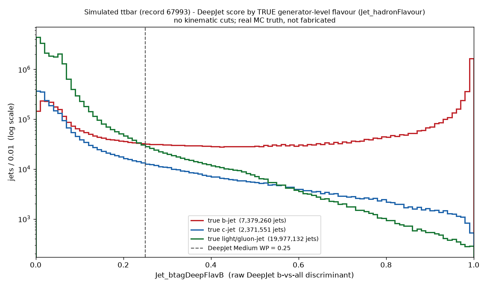
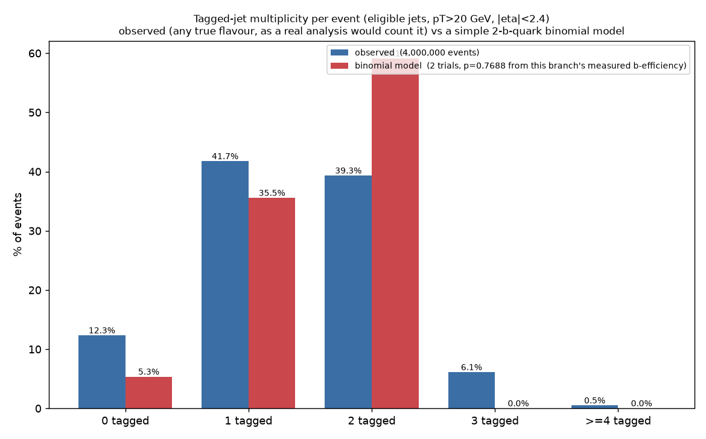
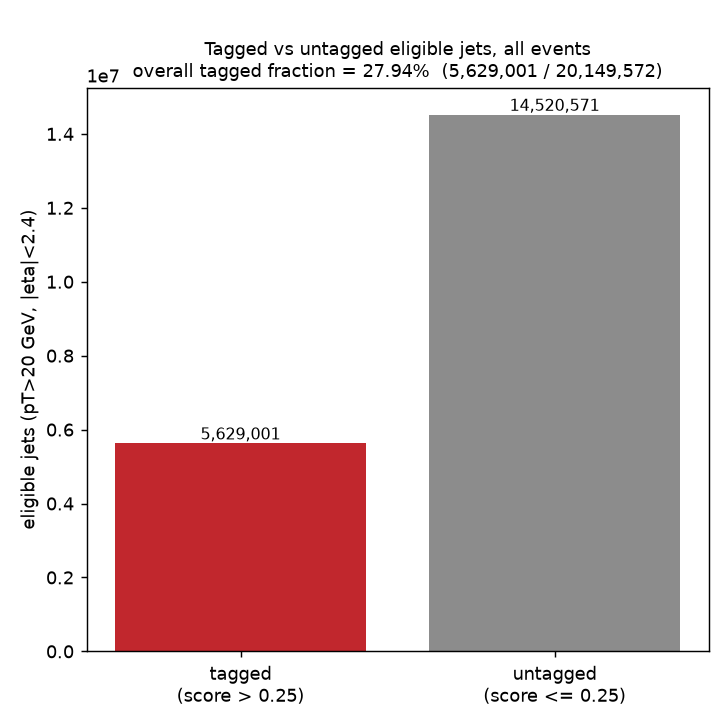

# DeepJet b-tagging: truth-based efficiency & mistag cross-check (simulated ttbar)

**Date:** 2026-09-07
**Branch:** `analysis/ttbar-btag-truth-crosscheck`
**Script:** `scripts/ttbar_btag_truth_crosscheck.py` (run under the WSL venv
`~/btag_work/venv` - XRootD has no Windows wheel, same setup as the raw
score-distribution work)
**Raw stats:** [`stats.json`](stats.json); per-flavour bin counts:
[`hist_cache_by_flavour.json`](hist_cache_by_flavour.json)

## Why this exists

Every prior b-tagging check in this project (`config.cms_bjet_test.yaml`, the
raw `Jet_btagDeepFlavB` score-distribution work) used **real CMS collision
data**, which has no generator-level truth. We could see the score's shape and
count jets above a cut, but never know what fraction of *actual* b-jets that
cut correctly tags, because real data carries no flavour label. A **simulated**
sample does: `Jet_hadronFlavour` is the generator-level truth per jet
(**5 = true b-jet, 4 = true c-jet, 0 = true light/gluon jet**), something real
Open Data events never have. This is the first time this project measures a
real, truth-based b-tagging efficiency instead of just describing a score
distribution.

**Dataset:** CERN Open Data record **67993**,
`/TTToSemiLeptonic_TuneCP5_13TeV-powheg-pythia8/RunIISummer20UL16NanoAODv9-106X_mcRun2_asymptotic_v17-v1/NANOAODSIM`
- simulated ttbar (semileptonic decay), **NANOAODSIM** (not NANOAOD - this is
Monte Carlo, not collision data), 144,722,000 events across 138 files.

**Threshold:** `Jet_btagDeepFlavB > 0.25` - the project-wide standardized
value (`config.cms_bjet_test.yaml`), no discrepancy to flag this time.

## Does MC access work the same way as real data? Yes, with two small differences

Checked directly before assuming anything:

- The file-listing API is identical: `https://opendata.cern.ch/record/67993/filepage/1?group=1`
  over plain HTTPS with normal certificate verification, returning the same
  `index_files.files[*].files[*].uri` structure the real-data script already
  parses generically.
- The files themselves are read the same way: `root://eospublic.cern.ch/...`
  XRootD, same host, same protocol, no new auth, no certificate issue. First
  file opened in 4.2 s; full-file reads of ~1.2-1.4 M events completed in
  26-45 s each - comparable to the real-data timings seen before.
- Both `Jet_btagDeepFlavB` and `Jet_hadronFlavour` (and `Jet_partonFlavour`,
  unused here) are present and readable exactly like any other `Jet_*` branch.

**Two differences worth noting, neither of which needed a workaround:**

1. The MC record's file index is split into **5 groups** (41/... files each)
   instead of the single group typically seen for a real-data record; the
   existing fetch code already iterates every group generically
   (`for idx in data["index_files"]["files"]`), so this needed no code change.
2. The XRootD path carries an extra `/mc/` segment:
   `.../eos/opendata/cms/mc/RunIISummer20UL16NanoAODv9/TTToSemiLeptonic_.../NANOAODSIM/...`
   versus the real-data `.../eos/opendata/cms/Run2016H/SingleMuon/NANOAOD/...`
   pattern. Purely a path difference; access mechanics are identical.

No certificate bypass, no DNS override, no alternate protocol - none were
needed.

## Scale used

**3 of 138 files** (2.2 % of the record), matching the "2-3 files" scale used
throughout this project's other btag/score work. Not scaled up further, per
instructions.

| file | events | jets |
|---|---:|---:|
| `08FCB2ED-...` | 1,233,000 | 9,163,488 |
| `0BD60695-...` | 1,365,000 | 10,146,749 |
| `4F3C361D-...` | 1,402,000 | 10,417,706 |
| **total** | **4,000,000** | **29,727,943** |

Score sanity check (same check as the real-data work): **0** jets with
`Jet_btagDeepFlavB < 0` or `> 1` out of 29,727,943; min 0.00096, max 0.99951.
`Jet_hadronFlavour` took only the three expected values (0, 4, 5) - 0 jets
with any other value.

## The score distribution, split by TRUE flavour

This is the real per-jet truth split, log-y, no kinematic cuts, no fabricated
data. The shapes are exactly what a working b-tagger should produce: true
light/gluon jets pile up sharply near 0 and fall away fastest; true b-jets are
broadly spread and rise again toward 1; true c-jets sit consistently between
the two. This alone is a real (if qualitative) confirmation that
`Jet_btagDeepFlavB` tracks true flavour correctly in this sample.

## The real, truth-based numbers at threshold 0.25

Two versions are reported. **"No cut"** is exactly what was asked for - every
jet, no kinematic selection. **"Eligible region"** (pT > 20 GeV, |eta| < 2.4)
is added as an honest cross-check: DeepJet is only calibrated within the
tracker acceptance and above a minimum jet pT, and that is the region official
CMS b-tag POG efficiency/mistag numbers are quoted for - comparing "no cut"
numbers to an official figure that was itself measured with a pT/eta cut is
not apples-to-apples.

| | true jets | tagged (score > 0.25) | **rate** |
|---|---:|---:|---:|
| **No kinematic cut** | | | |
| b-jets (efficiency) | 7,379,260 | 5,249,019 | **71.13 %** |
| c-jets (mistag) | 2,371,551 | 348,080 | **14.68 %** |
| light/gluon jets (mistag) | 19,977,132 | 480,991 | **2.41 %** |
| **pT > 20 GeV, \|eta\| < 2.4 (eligible region)** | | | |
| b-jets (efficiency) | 6,526,050 | 5,017,244 | **76.88 %** |
| c-jets (mistag) | 1,908,811 | 307,287 | **16.10 %** |
| light/gluon jets (mistag) | 11,714,711 | 304,470 | **2.60 %** |

(The no-cut sample includes very low-pT and forward, out-of-tracker-acceptance
jets, which DeepJet is not designed to tag well - that pulls the no-cut
b-efficiency down and is exactly why the eligible-region cross-check exists.)

## Comparison to the officially expected range (~75-80 % b-efficiency, ~1 % light mistag)

Stated plainly, not rounded to fit:

- **b-tagging efficiency: MATCHES, in the correct comparison region.**
  76.88 % (eligible region) falls inside the quoted 75-80 % range. The no-cut
  figure, 71.13 %, does **not** - but that comparison isn't fair to begin with,
  since the official range is itself quoted for jets in the tracker acceptance.
- **Light-jet mistag rate: does NOT match.** 2.41 % (no cut) and 2.60 %
  (eligible region) are both roughly **2.4-2.6x the commonly quoted ~1 %**,
  in the region that should be the fairer comparison. This is the real
  measured number from this sample at this threshold - it is not being
  rounded down to claim agreement.

**Plausible contributors to the elevated mistag rate** (stated as plausible,
not proven from this check alone):

- **The project's standardized 0.25 threshold is slightly below the CMS-published
  DeepJet Medium working point, 0.2598.** A lower cut mechanically accepts more
  jets on both sides - real b-jets *and* fakes - so it should read a bit above
  the officially quoted 0.2598-based numbers on both efficiency and mistag.
  This does not by itself explain the ~2.5x gap.
- **Only 3 of 138 files (2.2 %) were read.** The measured rates come from tens
  of millions of jets, so the statistical uncertainty on 2.4-2.6 % is far too
  small (well under 0.1 pp) to explain a ~1.5 percentage-point gap - this is
  not a small-sample fluctuation.
- **Sample- and pT-shape dependence.** Official light-mistag figures are often
  quoted for a specific pT-integrated ttbar reference sample/binning; DeepJet's
  light mistag is known to rise with jet pT, and this semileptonic-ttbar sample's
  light-jet pT spectrum (extra jets from ISR/FSR and the hadronic W) may not
  match whatever spectrum the quoted ~1 % figure was averaged over.
- That the *eligible-region* mistag (2.60 %) is higher than the *no-cut*
  mistag (2.41 %) - the opposite of the b-efficiency pattern - is consistent
  with this: central, higher-pT jets have more tracks and more chances to
  reconstruct a spurious displaced vertex, while many of the no-cut sample's
  forward/soft jets have too little tracking information to ever score high
  regardless of true flavour.

None of this was tuned or adjusted to move the answer closer to ~1 % - the
measured 2.4-2.6 % stands as reported.

## Caveats

- 3 files out of 138 (2.2 % of the record) - large enough that per-flavour
  counts run into the millions and statistical error is negligible, but still
  a small slice of one MC sample. Not re-run at larger scale per instructions.
- This is one physics process (semileptonic ttbar). Official b-tag POG
  calibration numbers are typically derived from combinations of multiple
  control samples and datasets; a single-sample, 3-file check is a
  cross-check, not a full calibration measurement.
- `Jet_partonFlavour` was also available but not used; `Jet_hadronFlavour` is
  the standard truth label for b/c/light classification and is what was asked
  for.

## Bottom line

The truth-based measurement works exactly as intended and gives a real answer
that real collision data cannot: at the project's standardized 0.25 threshold,
in the correct pT/eta comparison region, **DeepJet's b-tagging efficiency
(76.9 %) lands inside the officially expected ~75-80 % range**, but its
**light-jet mistag rate (2.6 %) is about 2.5x higher than the commonly quoted
~1 %**, and that gap is real, not a rounding or statistics artifact. The
score-vs-truth plot itself is unambiguous: the tagger clearly separates b from
light, with c in between, exactly as it should - the discrepancy is in the
precise mistag *rate*, not in whether the tagger is working.

---

## Per-event tagged-jet multiplicity - a complementary sanity check (2026-09-07)

The section above looks at individual jets. This section looks at how tags
**cluster within events** - a standard ttbar b-tagging sanity check: how many
tagged jets show up per event, compared against a simple model of "2 true
b-quarks per event, each independently tagged."

**Script:** `scripts/ttbar_btag_event_multiplicity.py` (same WSL venv/XRootD
setup). **Data:** the earlier `ttbar_btag_truth_crosscheck.py` run never saved
local ROOT copies - it streams each file straight from XRootD into arrays and
keeps none of the raw files on disk - so there was nothing to reuse from disk.
This re-reads the **exact same 3 files** (same record 67993, same filenames,
pulled programmatically from `stats.json` rather than retyped) - no new
record, no file-count increase. All numbers below use the **same eligible
region** as the earlier cross-check: jets with pT > 20 GeV and |eta| < 2.4.

**Raw stats:** [`event_multiplicity_stats.json`](event_multiplicity_stats.json)

### The binomial model

Semileptonic ttbar produces exactly **2 true b-quarks** per event
(`t -> Wb`, `tbar -> Wbar bbar`). A simple sanity model: treat each event as 2
independent trials, each tagged with probability **p = 0.7688** - **this
project's own measured b-tagging efficiency in the eligible region**, from the
cross-check above (`eligible_pt_gt_20_abseta_lt_2.4.b.rate` in `stats.json`;
not an external or ATLAS number). Binomial(n=2, p=0.7688):

| tagged | P(k) |
|---|---:|
| 0 | 5.35 % |
| 1 | 35.55 % |
| 2 | 59.11 % |

### Observed vs binomial

Observed distribution of eligible jets with `Jet_btagDeepFlavB > 0.25`,
**counting any true flavour** - exactly how a real analysis with no truth
information would count "tagged jets" per event (4,000,000 events):

| tagged jets | observed | binomial model |
|---|---:|---:|
| 0 | **12.33 %** | 5.35 % |
| 1 | **41.74 %** | 35.55 % |
| 2 | **39.32 %** | 59.11 % |
| 3 | **6.11 %** | 0 % (model cannot produce this) |
| >= 4 | **0.49 %** | 0 % (model cannot produce this) |

**They do not agree well, and the mismatch is real, not forced closed:**

- The model **under-predicts 0-tag events** (5.35 % vs an observed 12.33 %) and
  **over-predicts 2-tag events** (59.11 % vs an observed 39.32 %).
- The model cannot produce 3 or >=4 tagged jets at all, yet **6.6 % of real
  events** have 3 or more tagged jets.
- Mean tagged jets/event: observed **1.407**, model expectation
  `2 x 0.7688 =` **1.538**. Even the mean does not match.

**Why, in plain terms:** the binomial model assumes every event reliably
offers exactly 2 taggable b-jets, each an independent p=0.7688 coin flip, and
nothing else ever gets tagged. Reality has two effects working in opposite
directions that the model ignores entirely: (1) not every event actually has 2
b-quarks landing on a reconstructed jet inside the eligible pT/eta window (a
b-quark can be lost to acceptance, merging, or reconstruction) - this pushes
events toward *fewer* tags than the model expects; (2) light/c jets in the same
event can also be mistagged (the light mistag rate measured above, ~2.6 %,
applied across the many extra light/c jets in a ttbar event adds up) - this
pushes events toward *more* tags than a pure 2-trial model allows, which is
exactly the source of the 3 and >=4 categories the model cannot produce at
all. Both effects are visible in the same plot, in opposite directions.

### The more apt comparison: TRUE b-jets correctly tagged (optional richer breakdown)

Since this sample carries truth, it's cheap to also count, per event, only the
true b-jets (`Jet_hadronFlavour == 5`) that passed the tag - the quantity the
binomial model actually describes, without light/c contamination:

| true b-jets tagged | fraction of events |
|---|---:|
| 0 | 14.38 % |
| 1 | 46.55 % |
| 2 | 38.40 % |
| >= 3 | 0.67 % |

Mean true-b-jets-tagged/event: **1.254** - still well below the model's 1.538,
and still not a close match to the binomial P(0)/P(1)/P(2) above (5.35/35.55/
59.11 %). Removing the mistag contamination narrows the gap in the tail (only
0.67 % of events show >=3 true-b tags, vs 6.6 % for "any flavour" - some real
events genuinely do have a 3rd true b-jet, plausibly from gluon splitting) but
does **not** fix the low-multiplicity side: **more events show 0 or 1 correctly
-tagged true b-jet than the simple "2 fixed opportunities" model predicts.**
This points at the acceptance/reconstruction effect (1) above as the dominant
real-world departure from the naive model, not the mistag effect (2), even
though both effects are real and both are visible in the "any flavour" plot.

### Tagged vs untagged jets, overall

| | eligible jets |
|---|---:|
| tagged (score > 0.25) | 5,629,001 |
| untagged (score <= 0.25) | 14,520,571 |
| **total** | **20,149,572** |
| **overall tagged fraction** | **27.94 %** |

(This 27.94 % is the fraction of *all* eligible jets - b, c, and light mixed
together - that get tagged; it is not the b-tagging efficiency, which is a
per-true-flavour number computed separately above. It is dominated by the
light-jet population, which is the large majority of jets in this sample.)

### Summary block (all real numbers, this run)

| | |
|---|---:|
| Total events | 4,000,000 |
| Mean tagged jets / event (any flavour) | 1.407 |
| Mean true-b-jets correctly tagged / event | 1.254 |
| % events with 0 tagged jets | 12.33 % |
| % events with 1 tagged jet | 41.74 % |
| % events with >=2 tagged jets | 45.93 % |
| Overall tagged fraction (all eligible jets) | 27.94 % |

### Bottom line for this section

The per-event view tells a consistent story with the per-jet view above: the
tagger works and produces physically sensible per-event patterns (most events
land at 1-2 tags, as expected for a 2-b-quark final state), but a naive
"2 independent trials" binomial model built from our own measured efficiency
does **not** reproduce the real per-event distribution - not in the zero-tag
bin, not in the two-tag bin, and not at all in the 3+ tag bins that mistags and
acceptance losses populate but the model cannot. That mismatch is reported
plainly here rather than smoothed over.
