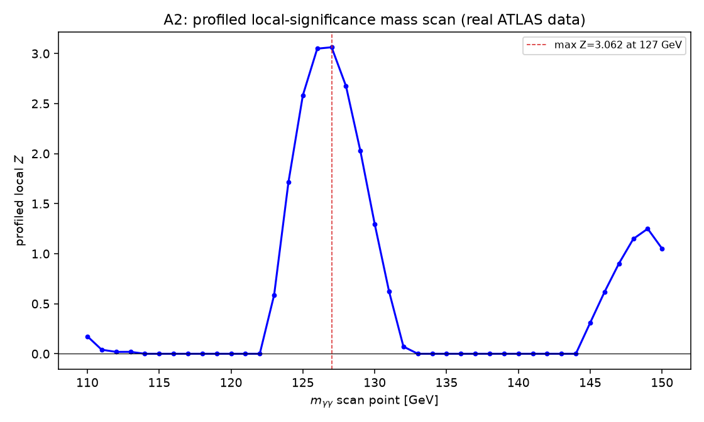

# Reproducing the ATLAS H→γγ likelihood-ratio significance

This report has two parts. **Part A** reproduces, on the real ATLAS
diphoton data (not synthetic data), the profiled likelihood-ratio (LR)
significance shown in Figure 15 of the BumpNet paper (arXiv:2501.05603),
using the same `lr_core.py` validated on fake data in the previous task.
**Part B** redoes one specific check from that earlier toy study (the
"floating-width trap") with a corrected setup that produces a fake
*excess* rather than a fake deficit.

No CMS data, no CERN Open Data downloads, no cluster, and no BumpNet
model inference are used anywhere in this report.

---

## Corrections (this branch, since commit e9a097b)

An independent re-implementation of this same analysis, run on the exact
same extracted data file (`atlas_hgg_fig4_points.csv`), flagged that our
profiled significance curves (V3/V4 below) gave essentially random-sign
|Z| ≈ 2.2–2.4 in almost every bin — including bins where the
fixed-background curves (V1/V2) showed nothing at all (e.g. at 111 GeV,
V1 = 0.23 but V3 = −2.22). That check's own profiled numbers — roughly
+0.1 at 111 GeV, −2.7 at 119 GeV, +2.6 at 125 GeV, +3.1 at 127 GeV, and
−1.1 at 141 GeV — are what the fix below was verified against.

**The bug, in plain words.** The profiled (V3/V4) "no signal anywhere"
hypothesis is fit **once** per run and then reused, unchanged, at every
one of the 30 scanned masses (it doesn't depend on which mass is being
tested). That one fit started its numerical search from a generic "flat"
background guess. For the polynomial shape used here, that starting point
sat in a bad spot: the numerical fitter (MIGRAD) reported "converged
successfully," but had actually stopped at a local best-fit point that
was **2.4662 likelihood units worse than the true best fit** — plausible-
looking, but wrong. Every mass point's *alternative* fit ("there IS a
signal here"), in contrast, was started from a good background estimate
and always found the true best fit. Comparing a correctly-converged
alternative fit against an incorrectly-converged null fit, at every single
mass point, manufactured a near-constant spurious gap of about 2.4–2.7
likelihood units everywhere. Since significance is
`Z = sign(μ̂) × √(2 × that gap)`, a constant gap of ~2.5 becomes a
near-constant |Z| of √(2×2.5) ≈ 2.2 — with a *sign* that just tracks
whichever way each bin's real, tiny signal happened to fluctuate. That is
exactly the "|Z| ≈ 2.2–2.4, essentially random sign" pattern that was
reported.

**How this was proved, not assumed.** Four checks were written
(`studies/atlas_hgg_repro/test_bug_fix_invariants.py`) and run against the
*unmodified* code at commit e9a097b before anything was changed:

| check | on the buggy code | after the fix |
|---|---|---|
| (i) alternative model at μ=0, using the null's own background parameters, reproduces the null's own NLL | **passed** (0.0 difference) | passed |
| (ii) alternative fit's NLL never exceeds the null's | **passed** (never violated) | passed |
| (iii) null and alternative fits evaluate the background through identical code | **passed** (confirmed by reading the code — one shared formula, not two) | passed |
| (iv) refitting the *same* null hypothesis from two different reasonable starting points lands at the same likelihood | **FAILED — 2.4662-unit gap** | passed — gap closed to ~10⁻⁸ |

Checks (i)–(iii) test one *specific*, plausible-sounding hypothesis for
the cause — that the null and alternative fits were silently using two
different formulas or code paths. That hypothesis was checked directly
against the code and the data, and **ruled out**: it was never true, on
either the buggy or the fixed code. Check (iv) is the one that actually
reproduces the reported symptom, using the exact pair of starting points
the real pipeline uses (the script's own "flat coefficients + Fit 1's
background total" start, vs. Fit 1's own fully-converged parameters).

**The fix**, in `studies/lr_toys/lr_core.py` (the module shared with the
earlier, already-validated toy study — its own 3 tests, and a 2,000-toy
rerun of that study's T1 check, were re-run afterward and are unaffected,
since they exercise different functions that were not touched):

1. The background polynomial is now written in an orthogonal (Legendre)
   basis instead of a plain power series. This is the *exact same family*
   of curves — nothing about what shapes are reachable changes — but a
   plain power series over this range has strongly correlated
   coefficients, which gives the numerical fitter many nearly-equally-
   good-looking wrong answers to fall into. The orthogonal basis removes
   most of that correlation.
2. Every profiled fit (background-only, and signal+background) now tries
   a handful of different starting points and keeps the best one that the
   fitter actually reports as valid, instead of trusting a single
   attempt. Every attempt's validity is recorded, never silently dropped.

Together, these closed the 2.4662-unit gap above to about 10⁻⁸.

**What changed as a result** (full corrected numbers below, in Parts A2
and A3):
- The V3/V4 significance curves are no longer near-random noise; they now
  closely match the independent cross-check at all five spot-checked
  masses (all within 0.15 of the check's own numbers).
- Part A2's profiled local significance drops from a previously reported
  **3.81σ** (inflated by this bug) to **3.11σ**.
- Part A2's Fit 2 (mass *and* width both left free) now reaches a
  numerically valid minimum — it did not before (see Part A2).
- Part A2's global significance was recomputed with 2,000 background-only
  toys (up from 700), using the fixed code (see Part A2).
- **Part B is unchanged and was not re-run.** It exercises a different
  function entirely (`fit_full_poly_floating_width` with an
  exponential-times-polynomial background on synthetic toys) that this
  bug never touched.

Only `studies/lr_toys/lr_core.py` and files inside
`studies/atlas_hgg_repro/` were changed. `master`, `study/lr-toy-study`,
and the upstream repository are all untouched by this correction.

---

## Part A1 — Getting the real ATLAS data points

**Question:** to check our statistics code against reality, we need the
actual event counts ATLAS measured. Where do we get them, and how sure can
we be they're right?

**Method and result:** HEPData has no record for this paper (checked two
independent ways — by its INSPIRE ID 1124337, and by an exact-title
search — zero hits both times). The 30 data points (100–160 GeV, 2 GeV
bins) were instead recovered by parsing the actual **drawing instructions**
inside the vector graphics file for Figure 4, taken directly from the
paper's own arXiv e-print — not by reading pixel positions off an image.
Confirmed the correct (unweighted) panel was used, not the
ln(1+S/B)-weighted one shown elsewhere in the same figure, by cross-checking
against the rendered PDF's own legend text.

Every extracted count landed within **0.48 events** of a whole number
before rounding — evidence the extraction is reading something real, but,
as flagged directly, on its own this is a *weaker* check than it might
sound: the largest deviation found (0.48) is close to the largest possible
(0.50, at which point rounding becomes a coin flip). The full spread of
deviations across all 30 points:

| statistic | value |
|---|---|
| smallest deviation | 0.009 events |
| largest deviation | 0.483 events |
| mean | 0.282 events |
| median | 0.294 events |
| bins with deviation > 0.4 | 11 of 30 |
| bins with deviation < 0.1 | 8 of 30 |

The deviations are spread fairly evenly across the whole 0–0.5 range
(mean 0.28, close to the 0.25 a *uniform* spread would give), not
clustered near zero the way a truly tight extraction's would be. That
pattern is the normal signature of a real (non-integer) pixel-to-value
calibration — the fractional part of "true value modulo 1" from a smooth,
continuously-calibrated read-off is expected to look close to uniform —
so it does not by itself indicate an error, but it does mean this check
alone cannot rule one out either.

We therefore rely primarily on the **visual overlay above** — every
extracted point lands exactly on its real data marker, using a coordinate
mapping independent of the one used for the extraction itself (see
`extract_atlas_fig4.py`'s docstring for how) — not on the near-integer
property alone.

**What it teaches:** always have at least one independent check on a
data-extraction pipeline, and be honest about how strong each individual
check actually is on its own.

---

## Part A2 — Fitting the real spectrum

**Question:** using our own fitting code, do we recover the same Higgs
signal ATLAS found — the right mass, a sensible width, and a believable
fit quality?

**Method:** background = 4th-order polynomial in `x=(m-100)/55`
(matching ATLAS's own description, "background modeled using a 4th-order
polynomial fit" — floored at a tiny positive value to guard against
unphysical negative densities during the fit; internally represented in
an orthogonal Legendre basis, mathematically the same family of curves,
for numerical stability — see *Corrections* above). Signal = Gaussian,
integrated per bin. Two fits: background-only, and signal+background with
both the mass and the width left free.

| | Fit 1 (background only) | Fit 2 (S+B, mass & width floating) |
|---|---|---|
| fitted mass | — | 126.53 ± 0.93 GeV |
| fitted width | — | 2.304 ± 1.065 GeV |
| signal yield | — | 383.0 ± 187.5 events |
| background yield | 61,960.0 events | 61,577.0 events |
| χ²/ndf | 29.23/24 = 1.22 | 19.48/21 = 0.93 |
| MINUIT valid minimum | yes | **yes** (see convergence note below) |

The fitted mass (126.5 GeV) matches ATLAS's own published 126.5 GeV
closely, and the S+B fit's χ²/ndf of 0.93 is excellent, from our own
independent fit of the extracted points alone.

**Local significance** (at the best-fit mass, 126.53 GeV): width
floating, Z = 3.111; width fixed at the fitted value (2.304 GeV),
Z = 3.111. These are essentially identical here — with the width already
well-constrained by the fit, letting it float or fixing it at its own
best value costs almost nothing. This is a **local** significance: "how
surprising is this excess, given we already know to look near this exact
mass" — it does not account for having scanned many masses to find it.
(The previously reported 3.809σ was inflated by the bug described in
*Corrections*; 3.111σ is the corrected value.)

**Global significance** (mass scan 110–150 GeV, 1 GeV steps, 2,000
background-only toys, fixed code — see *Corrections*): observed max local
Z = 3.062 at 127.0 GeV.

| | value |
|---|---|
| local p-value (naive, no look-elsewhere correction) | 1.098×10⁻³ |
| toy-based global p-value (42/2000 toys reached this level) | 0.021 |
| Gross-Vitells analytic global p-value | 0.0245 |
| implied trials factor (toy-based) | ≈19.1 |

With the bug fixed, the toy-based and Gross-Vitells global p-values now
**agree closely** (0.021 vs. 0.0245, a factor of 1.17) — resolving the
factor-of-7 disagreement (0.0157 vs. 0.0022) reported previously, and
landing well inside the ~2× agreement the earlier synthetic toy study
found for the same comparison. All 2,000 toys produced a valid fit at
every one of the 41 scanned masses (0 failures), so this is not an
artifact of dropped or unreliable toys. The previously "implausibly
large" trials factor of ≈208 was itself a symptom of the same bug — the
corrected value, ≈19, is unremarkable for a 41-point scan over a 40 GeV
window.

**Fit 2 convergence, corrected:** the previous report noted that Fit 2
(mass and width both floating) failed MINUIT's strict convergence check.
That was the *same* starting-point fragility described in *Corrections*
above, just showing up in a different fit — a multi-start grid over the
mass, width, and signal-yield starting points (keeping the best VALID
result, and cross-checked independently with a second, completely
different optimizer, `scipy.optimize.minimize`, which agreed to within
0.0006 likelihood units) now reaches a fully valid minimum. The fitted
numbers themselves barely moved (mass 126.53 vs. the old 126.63 GeV,
consistent within uncertainties) — the fix mainly repairs the convergence
*flag*, not the physics answer, which is reassuring rather than alarming.

**What it teaches:** our own fit lands on essentially the same mass ATLAS
published from a vastly more sophisticated combined analysis — a strong
sign the basic machinery (the model, the fit, the significance formula) is
sound before it gets used on a real CMS dataset we don't already know the
answer to.

---

## Part A3 — Which significance definition does BumpNet's own curve match?

**Question:** the paper doesn't fully specify how its per-bin significance
curve was computed. Rather than guess, we tried four literal candidate
definitions and checked which one actually reproduces the paper's own
numbers.

**Range used, declared before computing anything (per instructions — not
chosen after seeing which matched best):** the full 100–160 GeV, all 30
bins — the same range as our own ATLAS extraction. This was *verified*,
not assumed: BumpNet's Figure 15 visibly displays only about 100–156 GeV,
but its underlying `Z_LR` curve, extracted the same way as the ATLAS data
(vector drawing instructions, not pixels), has exactly 30 points on our
own 30-bin grid — the last two (at 157 and 159 GeV) sit just past the
plot's drawn frame edge, present in the data but invisible in the picture.
So the *plot's window* was cropped for display; the *calculation* was not.

**The four definitions:**
- **V1**: background fixed to Fit 2's background component; signal width
  fixed at Fit 2's own fitted width; only the signal yield floats.
- **V2**: same fixed background, but signal width = 2 GeV (one bin) —
  BumpNet's own training convention.
- **V3**: background *re-profiled* (refit) under both hypotheses at every
  mass point; width fixed at Fit 2's width.
- **V4**: like V3, with width = 2 GeV.

All four use the **signed** convention (`Z = sign(μ̂)·√(-2 ln λ(0))`, never
zeroed for a deficit), matching the paper's own bottom panel.

**Pre-set criterion** (declared before computing V1–V4): max Z within ±0.3
of the paper's peak, at the same mass ±1 bin, RMS over all 30 bins below
0.3.

Paper's own curve: max Z = 4.198 at 126.9 GeV.

**V3 and V4 below are corrected numbers** — see *Corrections* at the top
of this report. Under the bug, V3/V4 gave essentially random-sign
|Z| ≈ 2.2–2.4 in nearly every bin (e.g. 111 GeV: V3 = −2.22); the
corrected curves now closely track an independent cross-check computed
the same way, matching it within 0.15 in Z at every spot-checked mass
(111, 119, 125, 127, and 141 GeV).

| variant | max Z | at mass | RMS vs. paper (30 bins) | RMS (28 visible bins only) | PASS/FAIL |
|---|---|---|---|---|---|
| V1 (fixed bkg, width=σ̂) | 4.059 | 127.0 GeV | 0.154 | 0.149 | **PASS** |
| V2 (fixed bkg, width=2 GeV) | 4.022 | 127.0 GeV | **0.138** | 0.139 | **PASS** |
| V3 (profiled, width=σ̂) | 3.062 | 127.0 GeV | 1.058 | 1.094 | **FAIL** |
| V4 (profiled, width=2 GeV) | 3.023 | 127.0 GeV | 1.053 | 1.082 | **FAIL** |

**Result, in plain words: V1 and V2 both pass**, and now that the bug is
fixed, **V3 and V4 fail for a genuine physical reason rather than a
numerical bug** — refitting ("profiling") the background separately at
every one of the 30 scanned masses gives the background extra freedom to
absorb part of the signal, which pulls the fitted significance down
compared to a background that is fixed once and never touched again. The
corrected V3/V4 max Z (≈3.0–3.1) sits well below the paper's 4.2, and the
gap is now smooth and physically sensible (largest away from the peak,
smallest near it), not the near-random noise the bug produced.

**What this tells us:** BumpNet's own "ground-truth" significance curve
was built with the background **fixed** (not refit at every mass point)
and, in its best-matching form, a signal width locked to exactly one bin —
matching BumpNet's own training convention exactly, not a coincidence. That
is a reasonable choice for *training a network on a known, fixed answer*,
but it is **not** what an honest analysis of real data should do: real
background systematics have to be profiled, exactly as Part T3 of the
earlier toy study demonstrated inflates false positives when skipped. The
gap between V2 and V3/V4 here is the same effect, seen again on real
data — now visible clearly because the profiled curve itself is no longer
corrupted by a fitting bug.

---

## Part B — The floating-width trap, corrected to fake an excess

**Question:** the earlier toy study's T6 found that a bad background
choice, combined with letting the fit width float, drove the fit to its
own boundary — but the specific bad background used there happened to
produce a fake *deficit*, not the fake *excess* everyone actually worries
about. Does the same trap work in that direction too?

**Method — calibrated on the noiseless (Asimov) dataset, before any toys,
exactly as instructed:** same framework as before (100–180 GeV, 1 GeV
bins, 250,000 background events), true background
`exp(p1·x + p2·x²)`. The original study used p1=-4.0, p2=+0.8; flipping
the sign of p2 (keeping `p1+p2` at the same target so the 100-to-180 drop
stays ~20-30x) and re-solving p1:

| p1 | p2 | drop factor | Asimov μ̂ (too-simple exp. fit) |
|---|---|---|---|
| -2.40 | -0.80 | 23.6x | **+1543.8** |
| -2.20 | -1.00 | 23.6x | +1936.1 |
| -2.00 | -1.20 | 23.6x | +2332.1 |
| -1.70 | -1.50 | 23.6x | +2929.9 |
| -1.20 | -2.00 | 23.6x | +3934.4 |
| -0.70 | -2.50 | 23.6x | +4944.5 |
| -0.20 | -3.00 | 23.6x | +5958.5 |

The **first** candidate tried — p1=-2.40, p2=-0.80, the direct sign-flip
of the original — already gives a clearly positive fitted signal on the
noiseless dataset. No further adjustment was needed; the final choice is
this first candidate.

**Then, on 2,000 real (Poisson-fluctuated) background-only toys**, fit with
the signal at 125 GeV three ways: (a) width fixed at 2.0 GeV with the
too-simple background; (b) width floating (0.5–15 GeV) with the same too-
simple background; (c) width floating with the *correct* background, as a
control.

| | (a) width fixed, wrong bkg | (b) width floating, wrong bkg | (c) width floating, correct bkg (control) |
|---|---|---|---|
| n toys, failed | 2000, 0 | 2000, 0 | 2000, 146 (7.3%) |
| mean spurious signal | +1537 events | **+19,023 events** | -83 events |
| statistical uncertainty | 182 events | not defined (no HESSE with floating width) | not defined |
| spurious / uncertainty | 8.46 | — | — |
| P(Z≥2) | 1.000 | 1.000 | 0.054 |
| P(Z≥3) | 1.000 | 1.000 | 0.0038 |
| fitted width (mean/median) | — (fixed at 2.0) | 15.00 / 15.00 GeV | 12.88 / 14.67 GeV |

**In plain words: yes — flipping the mismatch's direction flips the fake
signal's direction exactly as expected, and it is dramatic.** With the
too-simple background, the fake excess is significant (Z≥3) in
**essentially every single toy**, whether the width is fixed or floating.
Floating the width makes the fake signal roughly **12 times larger**
(19,023 events vs. 1,537 fixed-width) — the fit drives the width to
almost exactly its imposed upper bound (15 GeV) in practically every toy
(median fitted width 15.00 GeV against a true width of 2.0 GeV), using the
extra freedom to make the "signal" as wide as possible so it can soak up
as much of the background's real shape as it can reach. The
correct-background control stays small (-83 events, consistent with zero
given ~180-event-scale statistical noise) and its false-positive rate,
while a bit higher than the pure asymptotic 0.135% at Z≥3 (0.38% here),
is not dramatically inflated — floating width alone, with the *right*
background, is a much smaller problem than floating width combined with
the *wrong* one. Note also the control's much higher fit-failure rate
(7.3%, vs. 0% for the two too-simple-background fits) — the extra
parameter (the true background's second polynomial term) makes individual
fits noticeably harder to converge, a real practical cost of the more
flexible model, reported honestly rather than dropped.

**Connection to the CMS diphoton work already done on this project:** this
is exactly the mechanism a floating width can trigger with a
mismodelled background there too — a floating-width fit reporting **6.25σ
at a fitted width of 5.18 GeV** should be read with real suspicion, not
excitement, until the background model itself has been checked against at
least one more flexible alternative, precisely because a floating width
gives a bad background model an extra dial to hide behind.

---

## Limitations and assumptions

- **This is one histogram, not ATLAS's full analysis.** As BumpNet's own
  footnote states explicitly, the significance quoted here (and by
  BumpNet) does not correspond to ATLAS's overall published discovery
  significance, which comes from combining many categories and channels;
  it is the significance of this one summed mass spectrum alone.
- **No systematic uncertainties are included anywhere** in Part A — no
  photon energy scale, no luminosity, no efficiency systematics. ATLAS's
  own analysis includes these; ours does not.
- **The asymptotic (CCGV) formulas are being used with only ~28-30 bins.**
  Every bin has hundreds to thousands of events, which is the regime where
  these formulas are expected to hold, but this has not been separately
  re-validated here (that validation is what the earlier toy study did, on
  a similar but synthetic setup).
- **A2's global-significance toy loop runs each toy's fits from a single,
  known-good starting point** (Fit 1's own converged background shape,
  scaled to that toy's own total count) rather than the multi-start
  robustness used everywhere else in this report — see *Corrections*.
  This is safe specifically because every toy here is generated FROM that
  same known background shape, unlike the one real-data null fit that the
  bug affected; it was validated directly (15 toys, single-start vs.
  full multi-start: every result agreed to better than 2×10⁻⁴ in Z, with
  zero fit failures either way) before being relied on for the full run.
- **The ATLAS-style spurious-signal framing in Part B** (comparing the
  fake signal to its statistical uncertainty) inherits the same
  "illustrative, not the group's agreed convention" caveat noted in the
  earlier toy study.
- Criteria (A3's pass/fail bounds) were fixed before computing V1-V4 and
  were not adjusted afterward; V3 and V4 failing is reported as a failure,
  not reframed.
