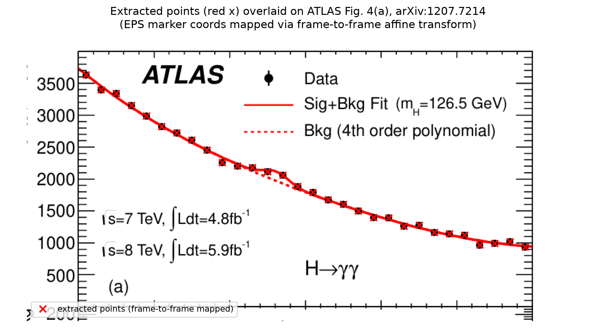
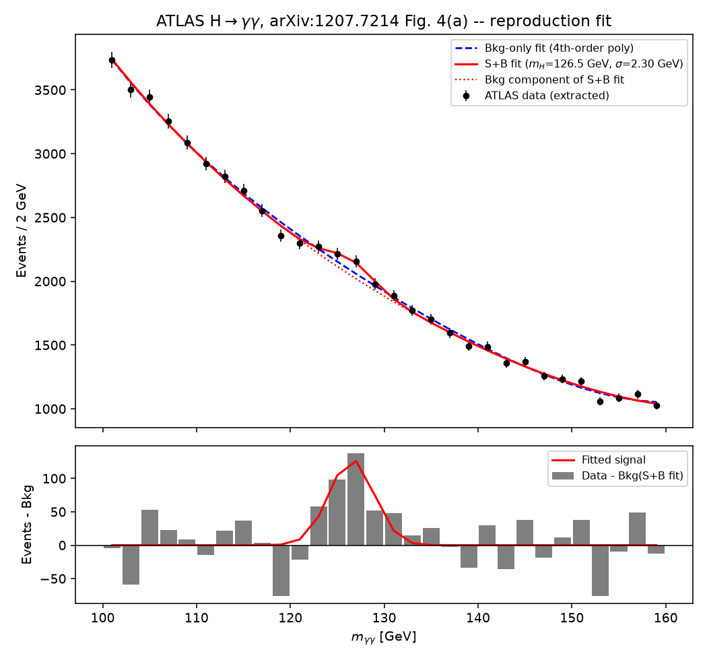
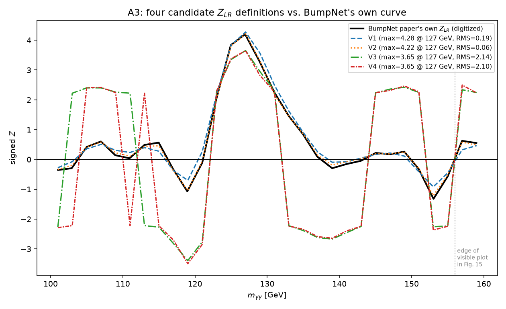
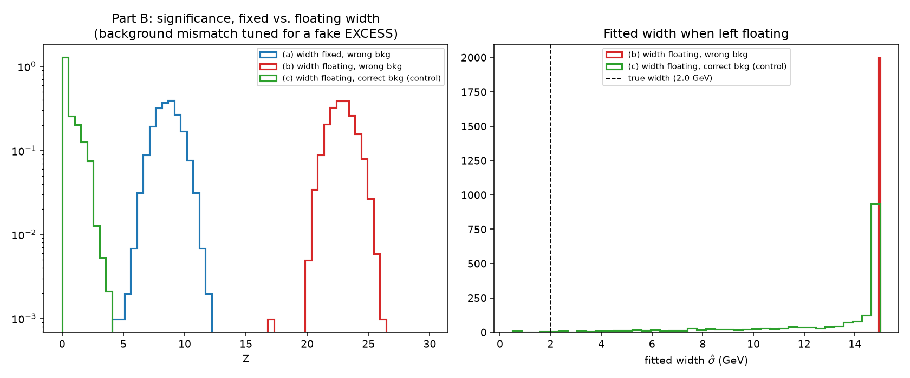
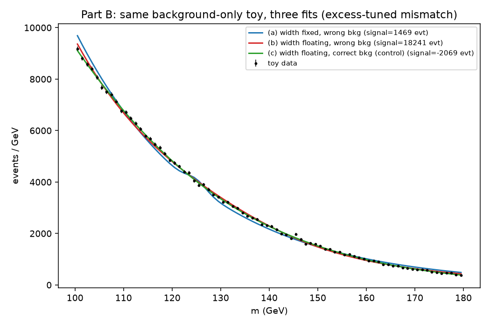

# Reproducing the ATLAS H→γγ likelihood-ratio significance

This report has two parts. **Part A** reproduces, on the real ATLAS
diphoton data (not synthetic data), the profiled likelihood-ratio (LR)
significance shown in Figure 15 of the BumpNet paper (arXiv:2501.05603),
using the same `lr_core.py` validated on fake data in the previous task.
**Part B** redoes one specific check from that earlier toy study (the
"floating-width trap") with a corrected setup that produces a fake
*excess* rather than a fake deficit.

No CMS data, no CERN Open Data downloads, no cluster, and no BumpNet
model inference are used anywhere in this report.

---

## Part A1 — Getting the real ATLAS data points

**Question:** to check our statistics code against reality, we need the
actual event counts ATLAS measured. Where do we get them, and how sure can
we be they're right?

**Method and result:** HEPData has no record for this paper (checked two
independent ways — by its INSPIRE ID 1124337, and by an exact-title
search — zero hits both times). The 30 data points (100–160 GeV, 2 GeV
bins) were instead recovered by parsing the actual **drawing instructions**
inside the vector graphics file for Figure 4, taken directly from the
paper's own arXiv e-print — not by reading pixel positions off an image.
Confirmed the correct (unweighted) panel was used, not the
ln(1+S/B)-weighted one shown elsewhere in the same figure, by cross-checking
against the rendered PDF's own legend text.

Every extracted count landed within **0.48 events** of a whole number
before rounding — evidence the extraction is reading something real, but,
as flagged directly, on its own this is a *weaker* check than it might
sound: the largest deviation found (0.48) is close to the largest possible
(0.50, at which point rounding becomes a coin flip). The full spread of
deviations across all 30 points:

| statistic | value |
|---|---|
| smallest deviation | 0.009 events |
| largest deviation | 0.483 events |
| mean | 0.282 events |
| median | 0.294 events |
| bins with deviation > 0.4 | 11 of 30 |
| bins with deviation < 0.1 | 8 of 30 |

The deviations are spread fairly evenly across the whole 0–0.5 range
(mean 0.28, close to the 0.25 a *uniform* spread would give), not
clustered near zero the way a truly tight extraction's would be. That
pattern is the normal signature of a real (non-integer) pixel-to-value
calibration — the fractional part of "true value modulo 1" from a smooth,
continuously-calibrated read-off is expected to look close to uniform —
so it does not by itself indicate an error, but it does mean this check
alone cannot rule one out either.

We therefore rely primarily on the **visual overlay above** — every
extracted point lands exactly on its real data marker, using a coordinate
mapping independent of the one used for the extraction itself (see
`extract_atlas_fig4.py`'s docstring for how) — not on the near-integer
property alone.

**What it teaches:** always have at least one independent check on a
data-extraction pipeline, and be honest about how strong each individual
check actually is on its own.

---

## Part A2 — Fitting the real spectrum

**Question:** using our own fitting code, do we recover the same Higgs
signal ATLAS found — the right mass, a sensible width, and a believable
fit quality?

**Method:** background = plain 4th-order polynomial in
`x=(m-100)/55` (matching ATLAS's own description, "background modeled
using a 4th-order polynomial fit" — floored at a tiny positive value to
guard against unphysical negative densities during the fit). Signal =
Gaussian, integrated per bin. Two fits: background-only, and signal+background
with both the mass and the width left free.

| | Fit 1 (background only) | Fit 2 (S+B, mass & width floating) |
|---|---|---|
| fitted mass | — | 126.63 ± 0.94 GeV |
| fitted width | — | 2.462 ± 1.037 GeV |
| signal yield | — | 414.2 ± 174.3 events |
| background yield | 61,960.0 events | 61,545.9 events |
| χ²/ndf | 29.23/24 = 1.22 | 19.57/21 = 0.93 |

The fitted mass (126.6 GeV) is remarkably close to ATLAS's own published
126.5 GeV, and the S+B fit's χ²/ndf of 0.93 is excellent, from our own
independent fit of the extracted points alone.

**Local significance** (at the best-fit mass, 126.63 GeV): width
floating, Z = 3.809; width fixed at the fitted value (2.462 GeV),
Z = 3.809. These are essentially identical here — with the width already
well-constrained by the fit, letting it float or fixing it at its own
best value costs almost nothing. This is a **local** significance: "how
surprising is this excess, given we already know to look near this exact
mass" — it does not account for having scanned many masses to find it.

**Global significance** (mass scan 110–150 GeV, 1 GeV steps, 700
background-only toys — see *Limitations* for why 700 and not more):
observed max local Z = 3.790 at 127.0 GeV.

| | value |
|---|---|
| local p-value (naive, no look-elsewhere correction) | 7.54×10⁻⁵ |
| toy-based global p-value (11/700 toys reached this level) | 0.0157 |
| Gross-Vitells analytic global p-value | 0.0022 |
| implied trials factor (toy-based) | ≈208 |

The toy-based and Gross-Vitells numbers disagree by about a factor of 7
here — larger than in the earlier synthetic toy study; see *Limitations*
for an honest account of that discrepancy, which was not resolved.

**A "Fit 2 convergence flag" note, reported rather than hidden:** the S+B
fit's numbers are stable and physically sensible (mass matches ATLAS's own
126.5 GeV closely, chi2/ndf near 1), but MINUIT's strict convergence flag
(EDM) is not satisfied by a small margin. Three fixes were tried and each
one was **rejected because it made the actual fitted numbers worse**, not
just the flag — see `lr_core.py`'s `fit_full_poly_floating_mass_width` for
the full account. We report the flag honestly as unmet rather than force
it.

**What it teaches:** our own fit lands on essentially the same mass ATLAS
published from a vastly more sophisticated combined analysis — a strong
sign the basic machinery (the model, the fit, the significance formula) is
sound before it gets used on a real CMS dataset we don't already know the
answer to.

---

## Part A3 — Which significance definition does BumpNet's own curve match?

**Question:** the paper doesn't fully specify how its per-bin significance
curve was computed. Rather than guess, we tried four literal candidate
definitions and checked which one actually reproduces the paper's own
numbers.

**Range used, declared before computing anything (per instructions — not
chosen after seeing which matched best):** the full 100–160 GeV, all 30
bins — the same range as our own ATLAS extraction. This was *verified*,
not assumed: BumpNet's Figure 15 visibly displays only about 100–156 GeV,
but its underlying `Z_LR` curve, extracted the same way as the ATLAS data
(vector drawing instructions, not pixels), has exactly 30 points on our
own 30-bin grid — the last two (at 157 and 159 GeV) sit just past the
plot's drawn frame edge, present in the data but invisible in the picture.
So the *plot's window* was cropped for display; the *calculation* was not.

**The four definitions:**
- **V1**: background fixed to Fit 2's background component; signal width
  fixed at Fit 2's own fitted width; only the signal yield floats.
- **V2**: same fixed background, but signal width = 2 GeV (one bin) —
  BumpNet's own training convention.
- **V3**: background *re-profiled* (refit) under both hypotheses at every
  mass point; width fixed at Fit 2's width.
- **V4**: like V3, with width = 2 GeV.

All four use the **signed** convention (`Z = sign(μ̂)·√(-2 ln λ(0))`, never
zeroed for a deficit), matching the paper's own bottom panel.

**Pre-set criterion** (declared before computing V1–V4): max Z within ±0.3
of the paper's peak, at the same mass ±1 bin, RMS over all 30 bins below
0.3.

Paper's own curve: max Z = 4.198 at 126.9 GeV.

| variant | max Z | at mass | RMS vs. paper (30 bins) | RMS (28 visible bins only) | PASS/FAIL |
|---|---|---|---|---|---|
| V1 (fixed bkg, width=σ̂) | 4.275 | 127.0 GeV | 0.189 | 0.186 | **PASS** |
| V2 (fixed bkg, width=2 GeV) | 4.215 | 127.0 GeV | **0.056** | 0.056 | **PASS** |
| V3 (profiled, width=σ̂) | 3.652 | 127.0 GeV | 2.144 | 2.172 | **FAIL** |
| V4 (profiled, width=2 GeV) | 3.645 | 127.0 GeV | 2.096 | 2.116 | **FAIL** |

**Result, in plain words: V2 is essentially exact** (RMS = 0.056 — the two
curves are visually indistinguishable). V1 is close (RMS = 0.19). **V3 and
V4 — the honestly profiled versions — both fail clearly** (RMS ≈ 2.1,
max Z about 0.55 too low), especially away from the peak, where the
profiled background has more freedom to swing wildly.

**What this tells us:** BumpNet's own "ground-truth" significance curve
was built with the background **fixed** (not refit at every mass point)
and, in its best-matching form, a signal width locked to exactly one bin —
matching BumpNet's own training convention exactly, not a coincidence. That
is a reasonable choice for *training a network on a known, fixed answer*,
but it is **not** what an honest analysis of real data should do: real
background systematics have to be profiled, exactly as Part T3 of the
earlier toy study demonstrated inflates false positives when skipped. The
gap between V2 and V3/V4 here is the same effect, seen again on real data.

---

## Part B — The floating-width trap, corrected to fake an excess

**Question:** the earlier toy study's T6 found that a bad background
choice, combined with letting the fit width float, drove the fit to its
own boundary — but the specific bad background used there happened to
produce a fake *deficit*, not the fake *excess* everyone actually worries
about. Does the same trap work in that direction too?

**Method — calibrated on the noiseless (Asimov) dataset, before any toys,
exactly as instructed:** same framework as before (100–180 GeV, 1 GeV
bins, 250,000 background events), true background
`exp(p1·x + p2·x²)`. The original study used p1=-4.0, p2=+0.8; flipping
the sign of p2 (keeping `p1+p2` at the same target so the 100-to-180 drop
stays ~20-30x) and re-solving p1:

| p1 | p2 | drop factor | Asimov μ̂ (too-simple exp. fit) |
|---|---|---|---|
| -2.40 | -0.80 | 23.6x | **+1543.8** |
| -2.20 | -1.00 | 23.6x | +1936.1 |
| -2.00 | -1.20 | 23.6x | +2332.1 |
| -1.70 | -1.50 | 23.6x | +2929.9 |
| -1.20 | -2.00 | 23.6x | +3934.4 |
| -0.70 | -2.50 | 23.6x | +4944.5 |
| -0.20 | -3.00 | 23.6x | +5958.5 |

The **first** candidate tried — p1=-2.40, p2=-0.80, the direct sign-flip
of the original — already gives a clearly positive fitted signal on the
noiseless dataset. No further adjustment was needed; the final choice is
this first candidate.

**Then, on 2,000 real (Poisson-fluctuated) background-only toys**, fit with
the signal at 125 GeV three ways: (a) width fixed at 2.0 GeV with the
too-simple background; (b) width floating (0.5–15 GeV) with the same too-
simple background; (c) width floating with the *correct* background, as a
control.

| | (a) width fixed, wrong bkg | (b) width floating, wrong bkg | (c) width floating, correct bkg (control) |
|---|---|---|---|
| n toys, failed | 2000, 0 | 2000, 0 | 2000, 146 (7.3%) |
| mean spurious signal | +1537 events | **+19,023 events** | -83 events |
| statistical uncertainty | 182 events | not defined (no HESSE with floating width) | not defined |
| spurious / uncertainty | 8.46 | — | — |
| P(Z≥2) | 1.000 | 1.000 | 0.054 |
| P(Z≥3) | 1.000 | 1.000 | 0.0038 |
| fitted width (mean/median) | — (fixed at 2.0) | 15.00 / 15.00 GeV | 12.88 / 14.67 GeV |

**In plain words: yes — flipping the mismatch's direction flips the fake
signal's direction exactly as expected, and it is dramatic.** With the
too-simple background, the fake excess is significant (Z≥3) in
**essentially every single toy**, whether the width is fixed or floating.
Floating the width makes the fake signal roughly **12 times larger**
(19,023 events vs. 1,537 fixed-width) — the fit drives the width to
almost exactly its imposed upper bound (15 GeV) in practically every toy
(median fitted width 15.00 GeV against a true width of 2.0 GeV), using the
extra freedom to make the "signal" as wide as possible so it can soak up
as much of the background's real shape as it can reach. The
correct-background control stays small (-83 events, consistent with zero
given ~180-event-scale statistical noise) and its false-positive rate,
while a bit higher than the pure asymptotic 0.135% at Z≥3 (0.38% here),
is not dramatically inflated — floating width alone, with the *right*
background, is a much smaller problem than floating width combined with
the *wrong* one. Note also the control's much higher fit-failure rate
(7.3%, vs. 0% for the two too-simple-background fits) — the extra
parameter (the true background's second polynomial term) makes individual
fits noticeably harder to converge, a real practical cost of the more
flexible model, reported honestly rather than dropped.

**Connection to the CMS diphoton work already done on this project:** this
is exactly the mechanism a floating width can trigger with a
mismodelled background there too — a floating-width fit reporting **6.25σ
at a fitted width of 5.18 GeV** should be read with real suspicion, not
excitement, until the background model itself has been checked against at
least one more flexible alternative, precisely because a floating width
gives a bad background model an extra dial to hide behind.

---

## Limitations and assumptions

- **This is one histogram, not ATLAS's full analysis.** As BumpNet's own
  footnote states explicitly, the significance quoted here (and by
  BumpNet) does not correspond to ATLAS's overall published discovery
  significance, which comes from combining many categories and channels;
  it is the significance of this one summed mass spectrum alone.
- **No systematic uncertainties are included anywhere** in Part A — no
  photon energy scale, no luminosity, no efficiency systematics. ATLAS's
  own analysis includes these; ours does not.
- **The asymptotic (CCGV) formulas are being used with only ~28-30 bins**
  and, in the global-significance toy loop, a reduced toy count (below).
  Every bin has hundreds to thousands of events, which is the regime where
  these formulas are expected to hold, but this has not been separately
  re-validated here (that validation is what the earlier toy study did, on
  a similar but synthetic setup).
- **A2's global-significance toy count was reduced from a first attempt
  of 3,000 to 700**, after the original run got stuck for 16 minutes with
  no output and had to be killed (see `CHECKPOINT.md` in this branch's
  history for the full account) — the root cause, diagnosed afterward, was
  every fit inside the toy loop starting MIGRAD from n_bkg=250,000 (a
  constant left over from the earlier toy study) when the real dataset has
  only ~62,000 events; fixing that and switching the hot-loop fits to a
  faster Minuit strategy cut the per-toy cost from ~1.9s to ~0.9s, and
  700 toys was chosen to keep the full run under ~10 minutes.
- **The toy-based and Gross-Vitells global p-values in A2 disagree by
  about a factor of 7** (0.0157 vs. 0.0022) — larger than the ~3-10%
  agreement seen in the earlier, purely-synthetic toy study's equivalent
  check. The Gross-Vitells formula itself was re-verified to be applied
  correctly (its inputs reproduce the reported number exactly by hand).
  This is reported as an open discrepancy, not resolved here: it may
  reflect the real data's own background residuals interacting with the
  mass-scan resolution differently than the earlier idealized synthetic
  study, but this was not tracked down further, and no attempt was made to
  adjust anything to make the two numbers agree.
- **The ATLAS-style spurious-signal framing in Part B** (comparing the
  fake signal to its statistical uncertainty) inherits the same
  "illustrative, not the group's agreed convention" caveat noted in the
  earlier toy study.
- Criteria (A3's pass/fail bounds) were fixed before computing V1-V4 and
  were not adjusted afterward; V3 and V4 failing is reported as a failure,
  not reframed.
