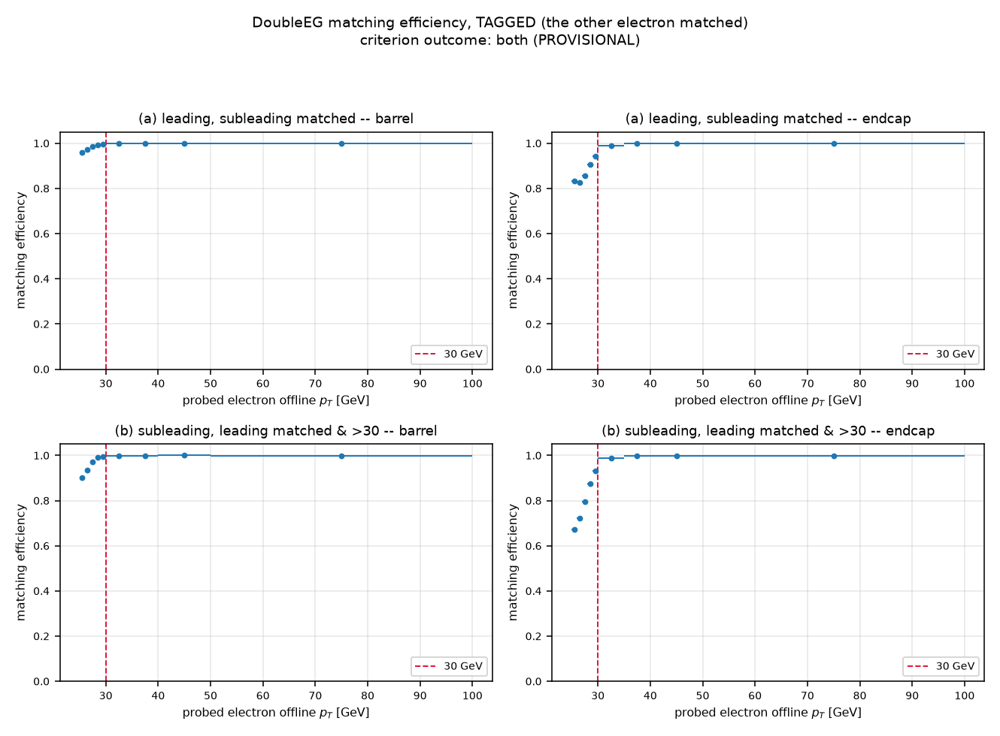
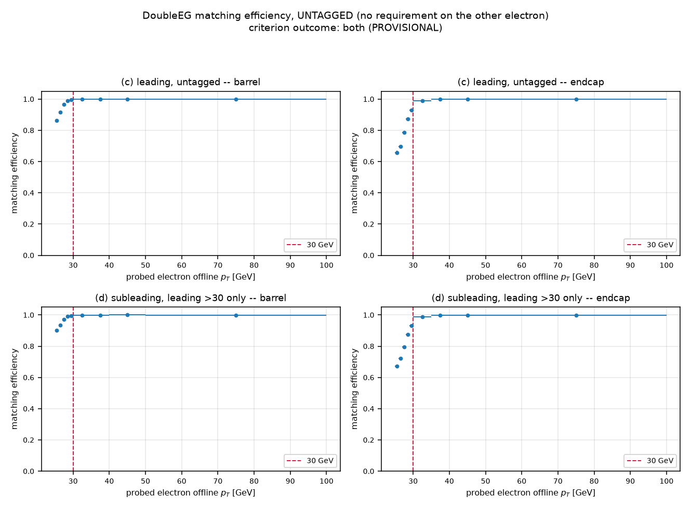
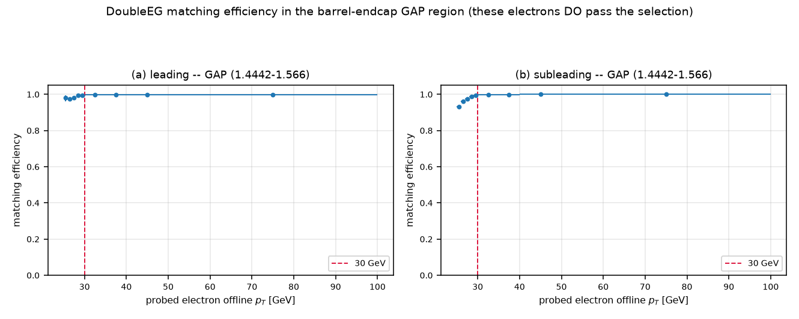
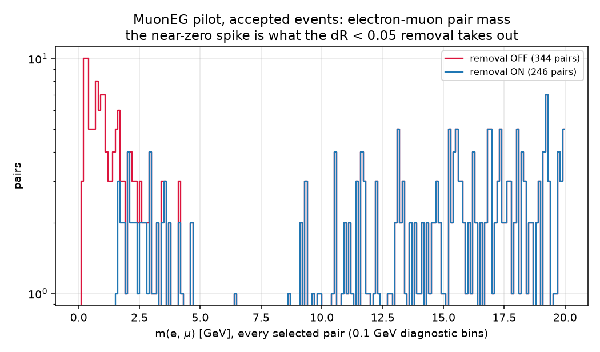
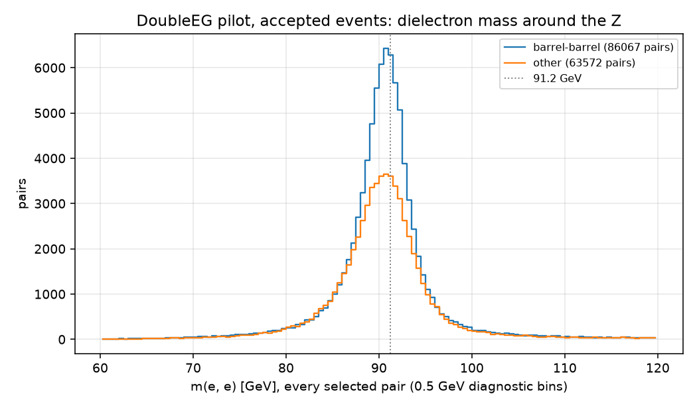
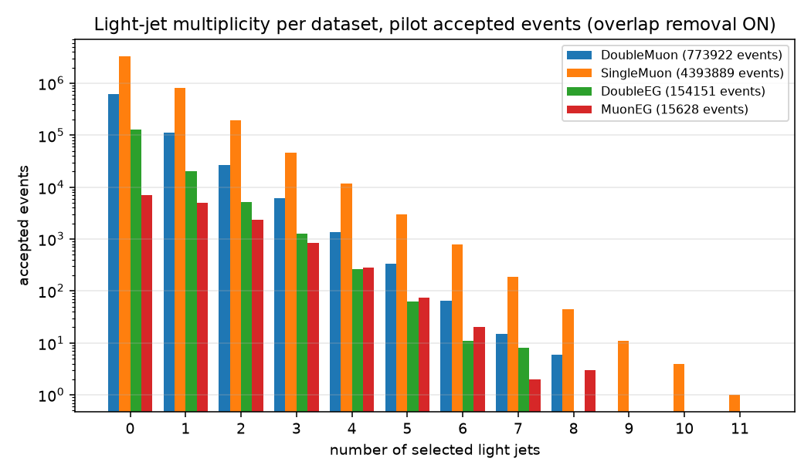
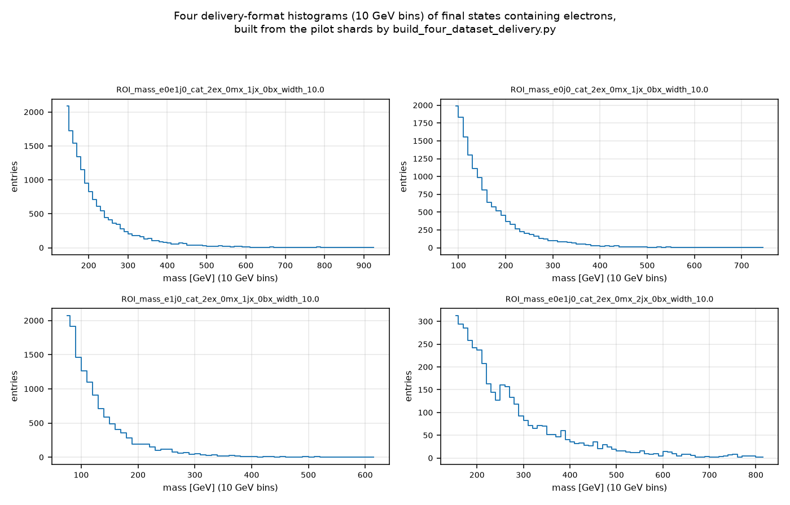

# Electron datasets, Version B — build, measure, pilot

Written for a reader who does not read code. Nothing was merged into master,
no full production was run, and no existing delivered file changed.

Every number below is labelled **VERIFIED BY RUNNING** (produced in this
round, with the script named) or **UNVERIFIED**.

**The one decision this round produces:** DoubleEG's offline-pT rule.
The pre-agreed criterion selects **`both`** — require *two* trigger-matched
electrons above 30 GeV — and the result is **not borderline**. That default
is in the code, marked PROVISIONAL. The final call is yours.

---

## 0. Summary of outcomes

| check | result | |
|---|---|---|
| Step D criterion | **`both`**, not BORDERLINE | VERIFIED BY RUNNING |
| Muon shards, new code vs master | **identical**, all 8 files | VERIFIED BY RUNNING |
| Muon shards, new code vs the 5 Oct production | **identical**, all 8 files | VERIFIED BY RUNNING |
| Muon events changed by overlap removal | **13** accepted events, all explained | VERIFIED BY RUNNING |
| Trigger-guard violations | **0**, everywhere | VERIFIED BY RUNNING |
| Histogram names vs upstream's own code | **1,099 / 1,099 match** | VERIFIED BY RUNNING |
| Closure, "exactly one exclusive set" | **pass** (0 in two sets, 0 in none) | VERIFIED BY RUNNING |
| Closure, "accepted by D ⇒ read from D's files" | **pass** (0 violations) | VERIFIED BY RUNNING |
| Closure, duplicates within a dataset | **pass** (0) | VERIFIED BY RUNNING |
| Closure, "same flags whichever file" | **35 keys out of 2,234,698 differ** — cause found, see §6 | VERIFIED BY RUNNING |
| Step C self-checks | **103 / 103 pass** | VERIFIED BY RUNNING |

---

## 1. What was implemented, file by file

### `studies/cms_datasets/cluster/run_dataset_on_file.py` (the per-file driver)

A **new** `--population matched4` mode. `generic`, `v0` and `matched` — the
mode the delivered muon file was produced with — are untouched in behaviour;
§5 proves that by re-running master on real files and comparing.

| decision | what the code does |
|---|---|
| **D2** de-duplication | New constant `DELIVERY_VETO_ORDER_4 = DoubleMuon > SingleMuon > DoubleEG > MuonEG`. The old `VETO_ORDER` in `datasets_records.py` is a *different* order and is deliberately left alone; the difference is documented at both places. Vetoes are **acceptance**-based for all four: an event is exclusive to a dataset if that dataset accepts it and no higher-priority dataset does, every acceptance evaluated on the same event with the same functions and the same objects. All four datasets' trigger branches are listed as **required**, so a missing one stops the job instead of being silently read as "did not fire". |
| **D3** electron–muon overlap removal | `remove_electrons_overlapping_muons`: drop every selected electron within dR < 0.05 of any selected muon, dR written out explicitly with the phi wrap. Muons are never removed. **ON by default**; `--no-emu-overlap-removal` exists for validation only. |
| **D4** DoubleEG acceptance | `doubleeg_acceptance`: path fired, ≥2 selected electrons each matched (dR<0.1) to an id-11 trigger object with bit 16, the higher-pT matched trigger object ≥23 GeV, plus the new offline rule selected by `--doubleeg-threshold-mode leading_only\|both`. Two offline electrons may share one trigger object — mirroring the DoubleMuon code exactly — and how often that happens is counted, not assumed. |
| **D5** MuonEG acceptance | `muoneg_acceptance`: either DZ path fired, ≥1 selected offline muon, and ≥1 selected electron matched to an id-11 bit-32 object whose online pT clears the electron-leg threshold **of a path that actually fired** (≥12 for Mu23_Ele12, ≥23 for Mu8_Ele23). Swapped legs accepted. |
| **D6** trigger-object guard | `trigobj_best_match` takes the object id as a parameter and filters on it *before* any dR is computed, so an electron can never match a muon trigger object or vice versa. It records, per offline object, the matched trigger object's index, id, filter bits and dR. `count_trigger_guard_violations` re-checks that independently by looking the id up again from the recorded index. `assert_trigobj_bit_meanings` reads the file's own branch titles at run time and stops the job unless bit 16 still means "2e" and bit 32 "1e-1mu". |
| **B2** pilot/debug output | `--debug-event-dump` writes one row per accepted event: run, lumi, event, dataset, the four acceptance flags, exclusive yes/no, final-state label, and how many electrons the removal took out. **Off by default.** |

The existing `trigobj_best_match_pt` now delegates to the id-parameterised
matcher so the muon and electron matching can never drift apart; it returns
exactly what it returned before (checked on 300 random synthetic events, and
on real data in §5).

### `studies/cms_datasets/deliver/build_four_dataset_delivery.py` (new)

The four-dataset delivery builder. It pools DoubleMuon **inclusive** +
SingleMuon, DoubleEG and MuonEG **exclusive**, then runs the same shared
post-processing chain every earlier delivery used. With **no flags at all**
it already does what this round requires: upstream-exact names ending
`_width_10.0`, no per-histogram minimum, no filled-bin cut, and the
≥100-events-per-final-state rule applied **once** over the combined shards.

`build_muon_combined_delivery.py` was deliberately **not edited** — the new
module imports its building blocks instead. That is the strongest possible
guarantee that the muon delivery's own invocations are unchanged.

### New study scripts under `studies/cms_datasets/electron_vB/`

`measure_doubleeg_efficiency.py` + `aggregate_doubleeg_efficiency.py` (Step
D), `find_run_files.py` (which files hold the closure run, and the
trigger-branch check), `closure_run.py` + `aggregate_closure.py` (E3),
`inspect_closure_mismatch.py` (§6), `compare_shards.py` (E1 a/c),
`diff_overlap_removal.py` (E1 b), `summarize_pilot.py` (E2/E4),
`gen_pilot_mapping.py` (E0), `make_pilot_plots.py` (E5), and the OpenPBS
array scripts in `cluster/`.

`studies/cms_datasets/tests/test_electron_datasets.py` holds the Step C
self-checks.

---

## 2. Step C — the tests (**VERIFIED BY RUNNING**, 103 checks, 0 failures)

Run: `python studies/cms_datasets/tests/test_electron_datasets.py --pilot-final-states evidence/pilot_final_states.json`.
Full output recorded in [`evidence/C_tests_with_pilot_final_states.json`](evidence/C_tests_with_pilot_final_states.json).
The three pre-existing test scripts still pass unchanged.

| | what it checks | result |
|---|---|---|
| **C1** | a final state with 12 light jets round-trips through naming (`0e_2m_12j_0b` → `ROI_mass_m0m1_cat_0ex_2mx_12jx_0bx_width_10.0`), and the known one-digit limitation of the shared parser is pinned by asserting its **current** behaviour, together with the reason it can never change a result: no combination ever needs more than 4 of a type (checked over all 186) | PASS |
| **C2** | an electron at dR 0.04 is removed, at 0.06 is kept, the wrap-around case (+3.13 vs −3.13, true dR 0.0232) is handled, muons are never removed, the option off removes nothing, and the explicit formula agrees with the library's own dR on 200 random pairs | PASS |
| **C3** | an electron sitting exactly on a muon trigger object never matches it, a muon on an electron object never matches it, the violation counter is 0, an event with no trigger objects does not crash it, and the branch-title assertion both accepts the real titles and stops on a changed one | PASS |
| **C4** | 13 synthetic events accepted by every subset of the four datasets each land in exactly the highest-priority accepting dataset's exclusive set; every accepted event is in exactly one set; the order constant is the required list and is confirmed different from the old `VETO_ORDER` | PASS |
| **C5** | the 25/30 GeV boundaries in both modes, including exactly 30.0 (rejected, the cut is strict `>`), the online 23 GeV rule, an unmatched electron not helping, and `leading_only` accepting a superset of `both` over 60 random pT pairs | PASS |
| **C6** | a matched electron at online 15 GeV is accepted when Mu23_Ele12 fired and rejected when only Mu8_Ele23 fired; exactly 12.0 and 23.0 accepted; no selected muon → rejected | PASS |
| **C7** | names from our code vs **upstream's own naming code**, imported from a read-only extract of upstream master `88d7a4b` — not re-implemented. **1,099 names** (all **157** final states the pilot actually produced × 7 mass combinations) match **string for string**, every one ending `_width_10.0` | PASS |
| **C8** | the delivery's per-histogram minimum still defaults to 100, the width suffix still defaults to the legacy form, and the shared muon matcher and acceptance mask return exactly their pre-change values | PASS |

Two findings from C7 worth recording, neither a problem:

* At **5** light jets upstream's own grouping still caps the label at `4j`
  (its `limit_particles_in_fs` call — the bug its authors are fixing). Ours
  keeps `5j`, which is the group's decision. **Out of scope here; not touched.**
* At **12** light jets upstream does *not* cap, because its capping function
  reads only the first digit. That is the same one-digit limitation C1 pins
  down in the shared parser, showing up in a second place.

---

## 3. Step D — the DoubleEG matching-efficiency measurement

**VERIFIED BY RUNNING** — `measure_doubleeg_efficiency.py` on **all 133**
DoubleEG files (a 2-file timing test gave 26 s and 18 s per file, so the full
set was nowhere near the 4-hour budget), combined by
`aggregate_doubleeg_efficiency.py`. Evidence:
[`evidence/stepD_doubleeg_efficiency.json`](evidence/stepD_doubleeg_efficiency.json).

Population: 164,185,704 events read → 159,107,970 after the validated-run
(golden) list → 17,599,145 with the path fired → **6,156,955** events with
≥2 selected electrons after overlap removal. Trigger-guard violations: **0**.

**Regions.** `barrel |eta| < 1.4442`, `endcap 1.566 < |eta| < 2.5`, both on
`Electron_eta` — the same variable the electron selection itself cuts on and
the same boundaries the preparation study used. Gap electrons (1.4442 ≤ |eta|
≤ 1.566) **do** pass our selection, so the gap is reported as a **third
region** and never merged into either; see
[`plots/stepD_efficiency_gap.png`](plots/stepD_efficiency_gap.png).

### The four efficiencies, in the two summary bins

Clopper–Pearson 68% intervals, raw numerator/denominator in each cell.
Per-pT-bin numbers (25–26, …, 29–30, 30–35, 35–40, 40–50, 50–100) are in the
evidence JSON and in the plots.

| measurement | region | 25–30 GeV | > 30 GeV |
|---|---|---|---|
| **(a)** leading, subleading matched | barrel | 0.9900 [0.9897, 0.9904]  75,983/76,748 | 0.9998 [0.9998, 0.9999]  4,303,495/4,304,155 |
| | endcap | 0.8979 [0.8963, 0.8996]  31,401/34,970 | 0.9989 [0.9989, 0.9990]  1,519,246/1,520,877 |
| | gap | 0.9892 [0.9870, 0.9911]  2,937/2,969 | 0.9995 [0.9994, 0.9996]  127,579/127,644 |
| **(b)** subleading, leading matched & >30 | barrel | 0.9656 [0.9654, 0.9659]  578,815/599,417 | 0.9996 [0.9996, 0.9996]  3,709,063/3,710,474 |
| | **endcap** | **0.8153 [0.8145, 0.8161]  193,208/236,966** | **0.9965 [0.9964, 0.9965]  1,313,127/1,317,754** |
| | gap | 0.9735 [0.9725, 0.9745]  24,189/24,847 | 0.9990 [0.9989, 0.9991]  131,918/132,047 |
| **(c)** leading, untagged | barrel | 0.9747 [0.9741, 0.9752]  86,245/88,485 | 0.9998 [0.9998, 0.9998]  4,349,929/4,350,632 |
| | endcap | 0.8447 [0.8429, 0.8465]  34,792/41,188 | 0.9988 [0.9988, 0.9988]  1,542,924/1,544,794 |
| | gap | 0.9818 [0.9791, 0.9842]  3,079/3,136 | 0.9995 [0.9994, 0.9995]  128,652/128,720 |
| **(d)** subleading, untagged | barrel | 0.9654 [0.9652, 0.9656]  579,664/600,439 | 0.9996 [0.9996, 0.9996]  3,709,922/3,711,333 |
| | endcap | 0.8152 [0.8144, 0.8159]  193,352/237,197 | 0.9965 [0.9964, 0.9965]  1,313,582/1,318,233 |
| | gap | 0.9735 [0.9724, 0.9745]  24,201/24,860 | 0.9990 [0.9989, 0.9991]  131,955/132,084 |
| **(d2)** subleading, no requirement at all | barrel | 0.9603 [0.9601, 0.9605]  660,280/687,572 | 0.9996 [0.9996, 0.9996]  3,709,922/3,711,333 |
| | endcap | 0.8020 [0.8013, 0.8028]  224,176/279,513 | 0.9965 [0.9964, 0.9965]  1,313,582/1,318,233 |
| | gap | 0.9726 [0.9716, 0.9736]  27,448/28,220 | 0.9990 [0.9989, 0.9991]  131,955/132,084 |

(d) drops only the "the other electron is matched" tag, keeping "leading
above 30"; (d2) drops both, so the two halves of (b)'s tag can be separated.
They barely differ, which says the tag itself is not what drives the result.

### The criterion, applied exactly as fixed in advance

Δ = eff_sub(>30) − eff_sub(25–30), from measurement (b):

| region | Δ | 68% interval on Δ | vs 2.0 pp |
|---|---:|---|---|
| barrel | **3.40 pp** | [3.38, 3.42] | **above** |
| endcap | **18.11 pp** | [18.04, 18.19] | **above** |

* Δ exceeds 2.0 pp in **both** regions → the criterion selects **`both`**.
* 2.0 pp lies **outside** both 68% intervals → **not BORDERLINE**.
* **Does the leading leg also show a 25–30 GeV inefficiency?** In the
  **endcap yes** (Δ = 10.1 pp); in the **barrel no** (Δ = 0.98 pp). So the
  "neither leg is inefficient" flag does **not** apply.

The uncertainty on Δ combines the two Clopper–Pearson intervals in
quadrature, treating the two pT ranges as independent samples (they are
disjoint sets of events).

**The code default is now `both`, marked PROVISIONAL.** In plain words: an
electron between 25 and 30 GeV in the endcap is matched to its trigger object
only about 82% of the time, against 99.6% above 30 — a large, sharp step
right where BumpNet looks for bumps. Requiring both matched electrons above
30 GeV removes that step. The price, measured on the pilot: **13.5% fewer
accepted DoubleEG events** (178,284 → 154,151 over the 4 DoubleEG pilot files).

---

## 4. The pilot: which files

**E0, VERIFIED BY RUNNING** (`gen_pilot_mapping.py`): the first and middle
file of each (dataset, era) record list — 16 files. The exact list, with
record IDs, file indices and URLs, is in
[`HANDOFF.md`](HANDOFF.md) §4. Record totals came out as DoubleMuon 57,
SingleMuon 152, DoubleEG 133, MuonEG 48, matching D1 exactly.

The pilot ran three times: with overlap removal **ON** (threshold mode
`leading_only`, before Step D had decided), with removal **OFF**, and again
**ON with mode `both`** once Step D selected it. The `both` run is the one
quoted below unless stated otherwise.

---

## 5. E1 — the muon datasets are unchanged except for overlap removal

### (a) New code with removal OFF vs master `4bbe972` — **IDENTICAL**

**VERIFIED BY RUNNING** (`compare_shards.py`,
[`evidence/E1a_master_vs_new_off.json`](evidence/E1a_master_vs_new_off.json)).
Master was re-run from its own pinned checkout on the same 8 files. For
every one of the 8 files, and for all four shard versions (normal, top4,
nonjet4, rare4) in both the inclusive and exclusive form, the comparison
found: the same signatures, the same mass values in the same order, and the
same per-final-state event counts. **No difference anywhere.**

### (b) Removal ON vs OFF — every difference traces to a removed electron

**VERIFIED BY RUNNING** (`diff_overlap_removal.py`,
[`evidence/E1b_overlap_on_vs_off.json`](evidence/E1b_overlap_on_vs_off.json)).

On the **8 muon files**: the set of accepted events is **identical** (as it
must be — the removal cannot change a muon-based acceptance). **13** accepted
events changed their Version B final state; in 10 of them an acceptance or
exclusivity flag also moved. Every one of the 13 has exactly one removed
electron. **Events differing without a removed electron: 0.**

| dataset | job | final states changed | flags changed | unexplained |
|---|---|---:|---:|---:|
| DoubleMuon | 0 / 1 / 2 / 3 | 3 / 0 / 0 / 1 | 2 / 0 / 0 / 1 | 0 |
| SingleMuon | 0 / 1 / 2 / 3 | 2 / 2 / 0 / 5 | 2 / 2 / 0 / 3 | 0 |

On the **8 electron files** the removal also drops whole events, which is
expected: if the removed electron was the trigger-matched one, the event no
longer passes. **100** events in total — MuonEG 19 + 6 + 28 + 46 = 99, and
DoubleEG 1 — and those numbers match the per-job counts of events with a
removed electron **exactly** (MuonEG 99, DoubleEG 1), so every dropped event
is accounted for. No event appears only with the removal ON.

The ordering choice inside the removal (jets stay cleaned against the
pre-removal electron list, so jet collections are bit-for-bit master's) could
only matter for events where a removed electron has a jet in its cleaning
cone that is not also in a muon's. Measured across the whole pilot:
**0 such events**.

### (c) The master re-run vs the 5 Oct production — **IDENTICAL**

**VERIFIED BY RUNNING** (`compare_shards.py`, 8 files, evidence files
`E1c_*.json`). The per-file outputs for all 8 pilot files **did** exist in
the master production directory, so the check was possible. All 8 reproduce
exactly, after converting the production's older six-field final-state labels
with the delivery's own conversion function. The production directory was
opened with a strict read-only database connection and was not modified.

---

## 6. E3 — the closure test on run 281707

**Run 281707 is in the production golden-JSON list** (**VERIFIED BY
RUNNING**; lumi ranges [[99, 982], [1000, 1065], [1087, 1089]]), so the
suggested run was used as-is. It exists only in the H era.

`find_run_files.py` read the run branch of **all 390 files** of the four
datasets and found 68 files holding 8,131,527 golden events of that run:
DoubleEG 33, SingleMuon 20, DoubleMuon 9, MuonEG 6. The same pass confirmed
that **every HLT branch the four acceptances need is present in every one of
the 390 files — 0 missing, 0 read errors** (**VERIFIED BY RUNNING**). That
was D2's stop condition; it is clear.

All four acceptances were then evaluated on **every** golden event of that
run in those 68 files, in **both** DoubleEG modes.

### Counts (mode `both`; the `leading_only` numbers are in the JSON)

| dataset | events of the run in its files | inclusive accepted | exclusive | vetoed by DoubleMuon | by SingleMuon | by DoubleEG |
|---|---:|---:|---:|---:|---:|---:|
| DoubleMuon | 1,142,326 | 123,786 | 123,786 | — | — | — |
| SingleMuon | 4,131,389 | 2,158,084 | 2,035,804 | 122,280 | — | — |
| DoubleEG | 2,041,536 | 65,245 | 65,236 | 1 | 9 | — |
| MuonEG | 652,078 | 2,115 | **201** | 19 | 1,912 | 10 |

### The four checks

| check | expected | measured | |
|---|---|---|---|
| (2) every accepted event in exactly one exclusive set | 0 in two sets, 0 in none | **0 and 0** | PASS |
| (3) accepted by D ⇒ read from D's own files | 0 | **0** for all four | PASS |
| (4) duplicate (run, lumi, event) within a dataset | 0 | **0** for all four | PASS |
| (1) same four flags whichever file the event came from | 0 | **20 rows differ; 15 further keys accepted in one dataset while another dataset holding the same event is silent** | see below |

### Check (1): what the 35 keys are, and why

This is **not** a bug in the pipeline, and it was chased down rather than
assumed. `inspect_closure_mismatch.py` went back to the original files and
compared the two datasets' copies of the same collision side by side
([`evidence/E3_mismatch_inspection.json`](evidence/E3_mismatch_inspection.json)).
For every key inspected:

* the **trigger decisions are identical** across copies;
* the raw particle counts and momenta are identical to six decimal places;
* but **`Muon_pfRelIso04_all` — the muon isolation — differs**, by about
  0.01, and sits right at our 0.15 cut. So a borderline muon passes the
  selection in one dataset's copy and fails in the other.

| collision | copy | muon isolation | selected muons |
|---|---|---|---|
| 281707 / 478 / 663374369 | DoubleMuon, SingleMuon | 0.158596 | 1 |
| | MuonEG | **0.139728** | 2 |
| 281707 / 104 / 29222538 | DoubleMuon | 0.151511 | 1 |
| | SingleMuon | **0.141795** | 2 |
| 281707 / 108 / 35185703 | SingleMuon | 0.153111 | 0 |
| | MuonEG | **0.139057** | 1 |

In other words: the same collision, written independently into two primary
datasets, carries slightly different reconstructed isolation, and when that
difference straddles our cut the event's acceptance flips. Our code gives the
same answer for the same input — which §5(a) proves directly.

**What it costs the delivery.** Because each dataset's job decides
exclusivity from its own copy, such a disagreement can make a collision
counted twice or lost. Measured directly over this run
(`aggregate_closure.py`):

| | mode `both` | per million delivered |
|---|---:|---:|
| counted exactly once | **2,224,999** | — |
| counted more than once | **8** | 3.6 |
| accepted somewhere but counted zero times | **20** | 9.0 |

The preparation study anticipated "~4 per million copy differences between
independently produced datasets". The measured effect is of that order, and
now the mechanism is known. It is a property of the CMS data, not of this
code, and no choice of priority order removes it.

**UNVERIFIED**: whether the same per-million rate holds over the whole
dataset. It was measured on one run (8.1 million collisions); nothing
suggests this run is special, but it has not been measured elsewhere.

---

## 7. E2 — the electron datasets on the pilot files

**VERIFIED BY RUNNING** (`summarize_pilot.py`,
[`evidence/E2_pilot_summary_both.json`](evidence/E2_pilot_summary_both.json)),
16 files, overlap removal ON, DoubleEG mode `both`, debug dump on.

| dataset | read | after golden JSON | after own trigger | accepted | exclusive | Version B rejected |
|---|---:|---:|---:|---:|---:|---:|
| DoubleMuon | 7,664,327 | 7,546,921 | 2,542,655 | 773,922 | 773,922 | 90 |
| SingleMuon | 8,603,039 | 8,584,688 | 5,457,454 | 4,393,889 | 4,142,582 | 110 |
| DoubleEG | 4,935,316 | 4,801,837 | 539,689 | 154,151 | 154,132 | 20 |
| MuonEG | 6,306,031 | 6,201,208 | 1,030,325 | 15,628 | 1,408 | 128 |

MuonEG loses most of its events to the veto, as expected: an e-µ event
almost always also satisfies SingleMuon's acceptance, which sits above it.

**The DoubleEG funnel** (summed over its 4 pilot files, mode `both`):

| stage | events |
|---|---:|
| path fired | 539,689 |
| ≥1 electron matched to a bit-16 trigger object | 324,670 |
| ≥2 matched | 181,659 |
| leading matched trigger object ≥ 23 GeV | 181,659 |
| the new offline rule (two matched electrons > 30 GeV) | **154,151** |
| — lost to that last cut alone | 27,508 |

The online 23 GeV requirement removes nothing beyond what "two matched
electrons" already implies, which is expected: our offline cut is 25 GeV, so
no selected electron can sit below either trigger leg.

**The MuonEG funnel** (same files): 1,030,325 fired (266,708 Mu23_Ele12,
919,108 Mu8_Ele23, 155,491 both) → 80,339 with ≥1 selected muon → **15,628**
with a matched electron clearing a fired path's leg threshold. Notably,
**0 events** were rejected by the leg-threshold rule alone — the stricter
Mu8_Ele23 branch never bit, exactly as the preparation study expected but
could not confirm.

**D4's two required counts** (over the events passing everything except the
new offline-pT rule, so they do not depend on the mode):

* **"leading matched electron" vs "leading selected electron": 0 events
  differ** — in every event, the highest-pT matched electron *is* the
  highest-pT selected electron. Counted two independent ways, both 0.
* **Two offline electrons matched to the same trigger object: 1 event**
  (in DoubleEG; 0 elsewhere). The code allows it, mirroring the DoubleMuon
  code; it is vanishingly rare in practice.

**A finding worth recording.** The electron collection in the files is **not
always sorted by energy**: 2,536 of 181,659 DoubleEG events in this sample
(1.4%) have it out of order, and over the Step D population 79,759 of
6,156,955. Every "leading / subleading" definition in this round therefore
sorts explicitly rather than taking the first entry. It changes nothing in
the delivered numbers — the shared code already sorts by pT before picking
e0/e1, and D4's own rule is a maximum over matched electrons — but reading
"first in the list" as "highest energy" would have been wrong.

**Per-object matching bookkeeping** (counts of offline objects, how many
matched, and which trigger-object id they matched):

| dataset | matcher | offline objects | matched | matched ids | largest dR |
|---|---|---:|---:|---|---:|
| DoubleEG | electrons, bit 16 (2e) | 513,382 | 506,368 | **all id 11** | 0.0995 |
| MuonEG | electrons, bit 32 (1e-1mu) | 76,740 | 76,403 | **all id 11** | 0.0999 |
| DoubleMuon | muons, bit 1 | 2,024,841 | 2,024,532 | **all id 13** | 0.1000 |
| SingleMuon | muons, bit 2 | 4,681,872 | 4,612,379 | **all id 13** | 0.1000 |

Every matched object has the right id and every dR is below 0.1, which is
the guard and the matching criterion confirmed from the data itself.

---

## 8. E4 — trigger-guard violations

**VERIFIED BY RUNNING. Total: 0.** Across all 16 pilot jobs (both modes and
the removal-off run), all 68 closure jobs, and all 133 Step D files — every
one of which counts violations independently — not a single offline object
was ever recorded as matched to a trigger object of the wrong kind.

---

## 9. E5 — the pilot plots

### m(e, µ) in MuonEG, overlap removal off vs on

The near-zero spike is exactly what the rule is meant to remove, and it
disappears completely: **59** electron–muon pairs below 1 GeV with the
removal off, **0** with it on (**VERIFIED BY RUNNING**). Fine bins are a
diagnostic only; the delivery binning is untouched.

### m(e, e) in DoubleEG around the Z

86,067 barrel–barrel pairs and 63,572 others, both peaking in the
90.5–91.0 GeV bin — the Z, where it should be.

### Light-jet multiplicity per dataset

### Four delivery-format histograms of final states containing electrons

Built from the pilot shards by the new four-dataset builder: **876
histograms over 59 final-state categories**, of which **306** are in final
states containing at least one electron — categories a muon-triggered
delivery cannot reach at all.

The builder was exercised end to end on the pilot shards and all its
build-time checks passed: upstream names ending `_width_10.0`, no
per-histogram minimum (0 histograms excluded by it), no filled-bin cut, and
the ≥100-events-per-final-state rule applied once on the combined shards.
This is a **pilot** build from 16 files; it is not a delivery and was not
treated as one.

---

## 10. Things I noticed and did **not** change (out of scope)

* **The b-tag working point.** We use DeepJet 0.2598, the 2016 **pre**-VFP
  medium value, on Run2016G+H data whose value is 0.2489. Unchanged, as
  instructed. Still open for the group.
* **Upstream's 5-light-jet capping**, confirmed again in C7. Ariel is fixing it.
* **The one-digit parser** in the shared `physics_calcs.py` — tested, documented, not fixed.
* **SingleElectron** — no code, no runs, as instructed.
* The shared shard helper still opens files read-write even when only
  reading (noted in the previous round's report). Everything this round did
  for reading used a strict read-only connection instead.

---

## 11. Open questions for Matan

1. **DoubleEG threshold — your call.** The criterion says `both` and is not
   borderline; the code default is set to it, PROVISIONAL. It costs ~13.5%
   of DoubleEG events and buys a flat matching efficiency (≥99.6%) instead
   of an 82% endcap efficiency between 25 and 30 GeV.
2. **The ~9-per-million collisions lost (and ~4 counted twice)** come from
   muon isolation differing between the datasets' own copies of the same
   collision (§6). Nothing in our code can remove it. Do you want it simply
   recorded, or should the group decide a policy (for instance, re-deriving
   the exclusivity from a single dataset's copy) before full production?
3. **The barrel–endcap gap** (|eta| 1.4442–1.566) passes our selection and is
   reported as its own region. Confirm it should keep being delivered rather
   than vetoed.

---

## 12. Where everything is

Branch, pinned commits, job IDs, output directories, the pilot file list and
how to resume: [`HANDOFF.md`](HANDOFF.md).
