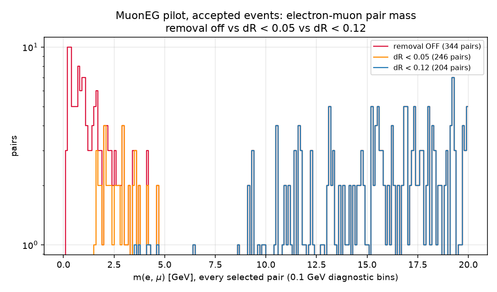
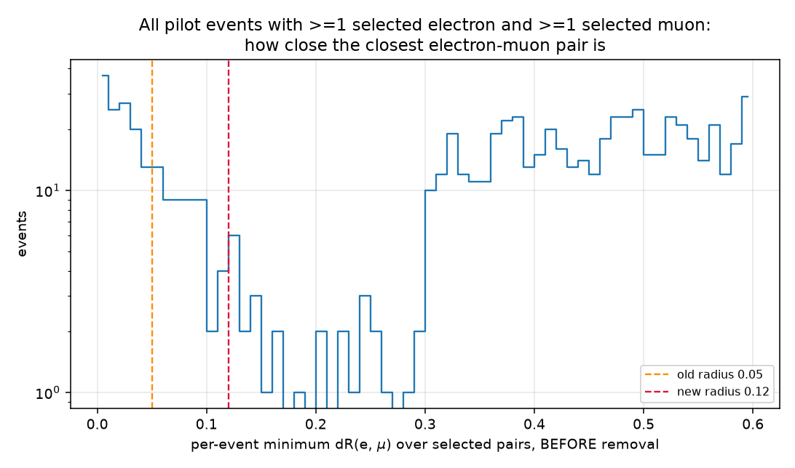
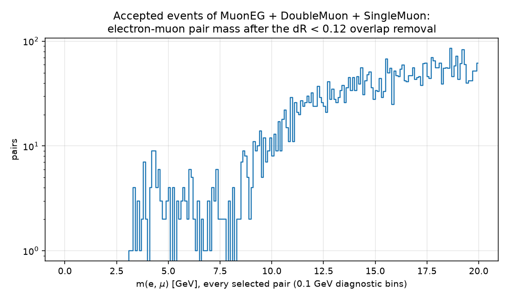
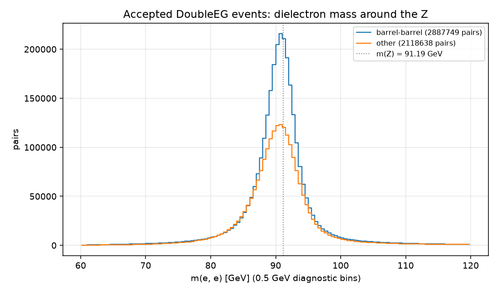
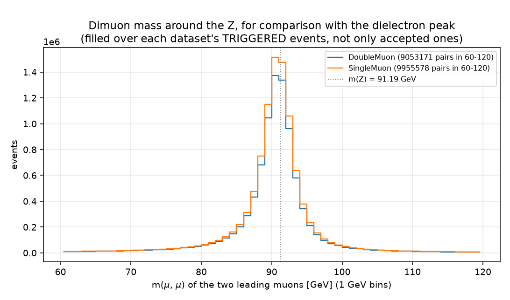
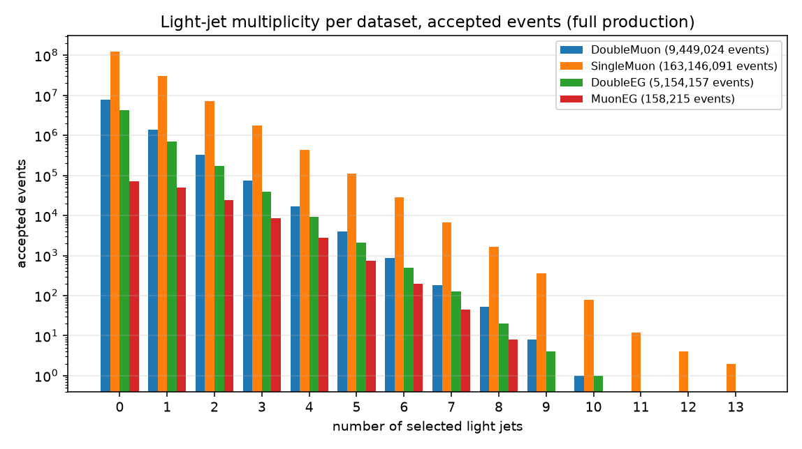
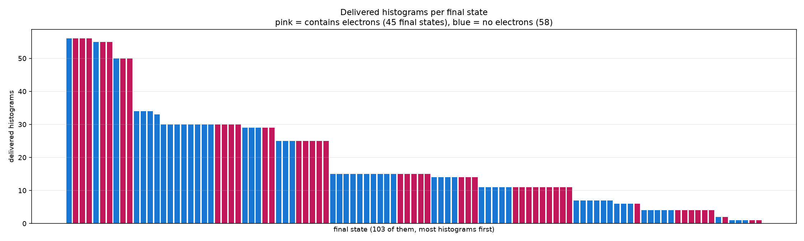
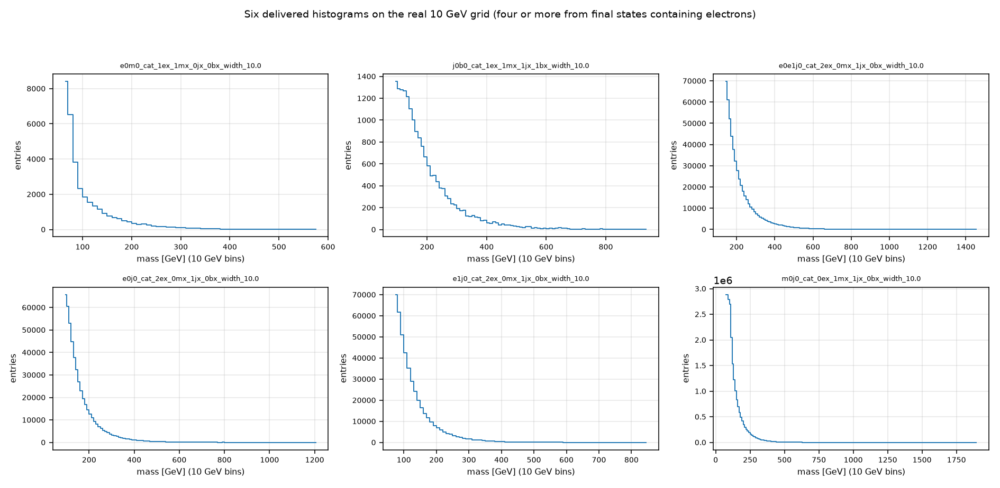

# Electron datasets, Version B — production and delivery

Prompt 2: the two approved decisions, the pilot re-check, the full
production of all 390 files, and the combined BumpNet delivery.

Written for a reader who does not read code. Nothing was merged into
master. Every number is labelled **VERIFIED BY RUNNING** (produced in this
task, with the script named) or **UNVERIFIED**.

**The deliverable:**
`/storage/agrp/berkom/atlas-utilization/output/cms_datasets/deliver/four_dataset_vB_upstreamnames_w10p0_dr012_20261007/four_dataset_matched_vB_upstreamnames_w10p0_dr012_bumpnet_cropped.root`
— **1,975 histograms, 103 final states, 82,956,880 entries.**
See [`DELIVERY_NOTES.md`](DELIVERY_NOTES.md) for the note to forward.

---

## 0. Summary of outcomes

| check | result | |
|---|---|---|
| Step C self-checks | **109 / 109 pass** | VERIFIED BY RUNNING |
| Gate 1 — low-mass e-µ cluster gone | **5 pairs** remain (pass needs ≤ 10) | VERIFIED BY RUNNING |
| Gate 2 — every change explained | **0 unexplained** | VERIFIED BY RUNNING |
| Full production | **390 / 390 files, 0 failures** | VERIFIED BY RUNNING |
| Trigger-guard violations | **0**, whole production | VERIFIED BY RUNNING |
| Delivery names vs upstream's own code | **1,975 / 1,975 match** | VERIFIED BY RUNNING |
| Every D2 read-back check | **pass** | VERIFIED BY RUNNING |
| 0-electron final states moving > 1% | **0** | VERIFIED BY RUNNING |

---

## 1. The two approved decisions, file by file

### DEC-1 — DoubleEG threshold mode `both` is final

`studies/cms_datasets/cluster/run_dataset_on_file.py`: the comment at
`DOUBLEEG_THRESHOLD_MODE_DEFAULT` and the `--doubleeg-threshold-mode` help
text now read "approved 7 Oct 2026 (Maryna/Matan), from the Step D
measurement" instead of "PROVISIONAL". **No logic changed** — the value was
already `both`.

### DEC-2 — overlap radius 0.05 → 0.12

Same file, `EMU_OVERLAP_DR_MAX = 0.12`, with the provenance recorded at the
constant itself:

* chosen by Maryna from the MuonEG/SingleElectron per-event min-dR(e,µ)
  distribution, where the collinear population extends to about 0.12;
* ATLAS uses dR < 0.1 for this removal in ttbar MC;
* the CMS ZZ paper arXiv:2009.01186 uses 0.05, which is what this pipeline
  used until today.

The comparison stays a strict `<`. Nothing else about the removal changed:
same place in the order (after object selection, before trigger matching,
the Version B count and the final-state label), all four datasets, muons
never removed, jet cleaning untouched. The `--no-emu-overlap-removal` help
text now quotes the constant rather than a hard-coded 0.05.

### Tests updated

`studies/cms_datasets/tests/test_electron_datasets.py`: the C2 boundaries
are now dR 0.11 removed, 0.13 kept, **0.06 now removed** (the old radius
kept it), and exactly 0.12 kept because the comparison is strict. The
phi-wrap and option-off cases are unchanged. Two checks were added: that
passing 0.05 explicitly still reproduces the old behaviour — which is how
Step B's comparison is made — and that the approved mode default is `both`.

**109 checks, 0 failures** (**VERIFIED BY RUNNING**;
[`evidence/C_tests_dr012.json`](evidence/C_tests_dr012.json)), up from 103.
The three pre-existing test scripts still pass unchanged. Upstream was
fetched **read-only** so the name check could run against upstream's own
code.

---

## 2. Step B — the pilot re-check, both gates PASS

The same 16 pilot files as Prompt 1, re-run at dR 0.12 with mode `both` and
the per-event debug dump on, compared against the existing 6 Oct runs at
dR 0.05 and with the removal off (both opened read-only).
Evidence: [`evidence/B_gates.json`](evidence/B_gates.json).

### Gate 1 — the leftover low-mass cluster disappears

Selected e-µ pairs with m(e,µ) < 5 GeV in accepted MuonEG events
(**VERIFIED BY RUNNING**):

| | pairs < 5 GeV | pairs < 1 GeV |
|---|---:|---:|
| removal OFF | 145 | 59 |
| dR < 0.05 | 47 | 0 |
| **dR < 0.12** | **5** | **0** |

**PASS** — 5 remain, the gate allows up to 10.

An independent cross-check agrees exactly: re-reading the four MuonEG pilot
files from the original data and listing every surviving pair found **5**,
the same number the histogram gives. All five sit at dR **0.123–0.168**,
i.e. just *outside* the new radius rather than hidden inside it:

| m(e,µ) | dR | electron pT | muon pT |
|---:|---:|---:|---:|
| 4.300 | 0.1425 | 33.9 | 26.8 |
| 4.192 | 0.1471 | 27.7 | 29.4 |
| 4.652 | 0.1679 | 29.5 | 26.0 |
| 3.739 | 0.1262 | 27.6 | 31.7 |
| 3.547 | 0.1230 | 26.0 | 31.9 |

### Gate 2 — every change is explained

**PASS — 0 unexplained differences** (**VERIFIED BY RUNNING**):

| dataset | accepted at 0.05 → 0.12 | lost | changed | unexplained |
|---|---|---:|---:|---:|
| DoubleMuon | 773,922 → 773,922 | 0 | 2 | 0 |
| SingleMuon | 4,393,889 → 4,393,889 | 0 | 4 | 0 |
| DoubleEG | 154,151 → 154,151 | 0 | 0 | 0 |
| MuonEG | 15,628 → **15,586** | 42 | 42 | 0 |

For events present at both radii, the test is that the event lost an extra
electron — exact, because the removal is monotonic in the radius, so the
difference between the two removed sets is precisely the electrons in the
0.05–0.12 band.

The 42 MuonEG events that the wider radius *drops* have no row at 0.12 to
compare against, so they were checked **against the original data files**
instead of argued about: `verify_radius_band.py` re-read each file with the
production selection functions and confirmed **42 of 42** contain a selected
electron with 0.05 ≤ dR(e, nearest selected muon) < 0.12. Those are MuonEG
events whose trigger-matched electron was the removed one, so the event no
longer passes — expected, and the only way the accepted count can fall.

### Step B also confirms

* **Trigger-guard violations: 0** (**VERIFIED BY RUNNING**).
* **The DoubleMuon and SingleMuon accepted-event sets are identical** to the
  dR 0.05 run, as they must be — the removal cannot change a muon-based
  acceptance.
* Against master (the removal-off run, which Prompt 1 proved shard-for-shard
  identical to master `4bbe972`): **6** DoubleMuon and **13** SingleMuon
  accepted events change final state, out of 5.17 million. Still very few.

### The plots

Removal off shows both the near-zero spike and a 1.5–5 GeV cluster; dR 0.05
removes the spike but leaves the cluster; **dR 0.12 clears both**.

This is the plot that justifies the number. Before any removal there is a
clear collinear population peaking at dR ≈ 0 and dying out around **0.12**,
followed by a visible valley before genuinely separated pairs begin near
0.3. The old 0.05 line cuts that population roughly in half; 0.12 lands at
its edge. Across the pilot: **122** events with min dR below 0.05, **55**
more in the 0.05–0.12 band, out of 21,189 events with at least one electron
and one muon.

---

## 3. Step C — full production, 390 / 390 files

`--population matched4`, mode `both`, dR 0.12, debug dump off, per-file
minimum of 1 event per final state, from pinned commit `06778c9`, four PBS
arrays (one per dataset, so no directory approaches the 1000-file limit).
Evidence: [`evidence/C3_production.json`](evidence/C3_production.json).

**Every one of the 390 files has exactly one complete output.** "Complete"
was checked as metadata **plus all eight shard files**, so a job that wrote
metadata but lost a shard would have been caught; none was. **No subjob
failed, nothing needed resubmitting**, and every job independently reports
the intended settings (mode `both`, dR 0.12, removal on).

**VERIFIED BY RUNNING** (`check_production_complete.py`):

| dataset | files | events read | after golden JSON | after own trigger | accepted | exclusive | Version B rejected | electrons removed | guard violations |
|---|---:|---:|---:|---:|---:|---:|---:|---:|---:|
| DoubleMuon | 57 / 57 | 94,148,416 | 92,609,925 | 30,943,565 | 9,449,024 | 9,449,024 | 1,112 | 233 | 0 |
| SingleMuon | 152 / 152 | 323,952,013 | 319,083,736 | 203,285,172 | 163,146,091 | 153,802,672 | 4,622 | 549 | 0 |
| DoubleEG | 133 / 133 | 164,185,704 | 159,107,970 | 17,599,145 | 5,154,157 | 5,153,591 | 621 | 48 | 0 |
| MuonEG | 48 / 48 | 63,091,128 | 62,385,800 | 10,137,471 | 158,215 | 13,443 | 1,330 | 1,328 | 0 |
| **total** | **390 / 390** | **645,377,261** | **633,187,431** | **261,965,353** | **177,907,487** | **168,418,730** | **7,685** | **2,158** | **0** |

Every figure is the sum over that dataset's per-job metadata, as recorded in
the evidence JSON.

Two of these are worth a sentence. **MuonEG has by far the most electrons
removed** (1,328 of the 2,158 total) despite being the smallest dataset —
expected, because it is the one dataset selected for having both an electron
and a muon, so it has the most chances for them to overlap. And **the
Version B rule rejects only 7,685 events in 177.9 million**, about 4 in
100,000, consistent with every earlier run.

MuonEG keeps only 13,443 of its 158,215 accepted events as exclusive — an
e-µ event almost always also satisfies SingleMuon's acceptance, which sits
above it in the priority order. That is the de-duplication working, not a
loss.

---

## 4. Step D — the delivery

### D1 — built with the builder's own defaults

`build_four_dataset_delivery.py` with **no extra flags**: DoubleMuon
inclusive pooled with SingleMuon, DoubleEG and MuonEG exclusive;
upstream-exact names ending `_width_10.0`; no per-histogram minimum; no
filled-bin cut; the ≥100-events-per-final-state rule applied **once** over
the combined shards of all 390 files; fixed 10 GeV bins, 0–10000 GeV. The
pruning step ran only on scratch copies, as always. Built in 5 min 18 s
using 2.3 GB (**VERIFIED BY RUNNING**, job 5195749).

324,099 distinct raw signatures entered the funnel; 1,975 histograms came
out; **0** were excluded by a per-histogram minimum at either stage.

### D2 — read back from the real ROOT files, every check passes

**VERIFIED BY RUNNING** (`verify_delivery.py`,
[`evidence/D2_D3_delivery_checks.json`](evidence/D2_D3_delivery_checks.json)):

| check | result |
|---|---|
| every name is what **upstream's own naming code** produces, `_width_10.0` included | **PASS**, 1,975 / 1,975, against upstream master `88d7a4b` fetched read-only |
| every name matches the upstream name shape | PASS, 0 unparsed |
| no duplicate names, and each appears exactly once | PASS, 1,975 keys / 1,975 distinct, in both files |
| cropped file holds exactly the same names as the uncropped one | PASS |
| no histogram is empty | PASS, 0 empty in either file |
| every final state has ≥ 100 events | PASS, 0 below |
| bin edges exactly 10 GeV over 0–10000 GeV (uncropped) | PASS |
| cropped histograms keep the 10 GeV pitch | PASS |

### D3 — counts against the muon-only delivery

| | this delivery | muon-only (6 Oct) | change |
|---|---:|---:|---:|
| histograms | **1,975** | 1,496 | +479 |
| final-state categories | **103** | 81 | +22 |
| entries (uncropped) | **82,956,880** | 78,754,866 | +4,202,014 |
| entries (cropped) | 82,956,880 | — | identical, as cropping only trims empty bins |

Split by electron content:

| | categories | histograms | entries |
|---|---:|---:|---:|
| with ≥ 1 electron | 45 | 931 | 5,418,308 |
| with no electrons | 58 | 1,044 | 77,538,572 |

**22 categories are new; none was lost** — all 81 muon-only categories are
still present.

Largest relative changes among the 81 shared categories, and the direction
is exactly what was expected:

| final state | muon-only | now | change | electrons? |
|---|---:|---:|---:|---|
| 2e_1m_0j_0b | 799 | 1,013 | +26.8% | yes |
| 2e_1m_1j_0b | 1,082 | 1,349 | +24.7% | yes |
| 1e_1m_4j_0b | 11,048 | 12,392 | +12.2% | yes |
| 1e_1m_0j_0b | 30,140 | 33,752 | +12.0% | yes |
| 1e_2m_1j_0b | 4,125 | 3,673 | −11.0% | yes |
| 1e_1m_2j_1b | 185,485 | 201,677 | +8.7% | yes |

**Every one of the largest movers contains electrons.** DoubleEG and MuonEG
add events to electron categories; the wider overlap removal moves a few
events out of them into no-electron categories and, where it removes a
trigger-matched electron, drops the event entirely — which is why one
category (1e_2m_1j_0b) goes down while the rest go up.

**No-electron categories flagged for moving more than 1%: 0.** The largest
is −0.47%; everything else is under 0.1%:

| final state | muon-only | now | change |
|---|---:|---:|---:|
| 0e_1m_7j_1b | 19,526 | 19,435 | −0.466% |
| 0e_2m_4j_1b | 36,746 | 36,769 | +0.063% |
| 0e_2m_2j_2b | 121,247 | 121,293 | +0.038% |

**The one worth explaining is `0e_1m_7j_1b`**, and I chased it down rather
than calling it expected (**VERIFIED BY RUNNING**). Of its 15 histograms, 14
gained about one entry each; a single histogram,
`ROI_mass_m0j0j1_cat_0ex_1mx_7jx_1bx`, lost 104. Comparing it bin by bin,
exactly **three contiguous bins (380–410 GeV) went from 43 / 35 / 27 entries
to zero**, with the upper edge of the histogram unchanged. That is the
shared post-processing chain's **peak-removal** step firing on this
combination because the pooled input grew slightly — not a change introduced
here. It is existing agreed behaviour, it is below the 1% flag threshold,
and it is noted in §6 for the group's awareness.

### D4 — the plots

#### (a) m(e, µ) over MuonEG + DoubleMuon + SingleMuon accepted events

**No near-zero spike and no 1.5–5 GeV cluster** (**VERIFIED BY RUNNING**).
Below 1.5 GeV there are **zero** pairs. The 64 pairs between 1.5 and 5 GeV
are not a cluster: the density *rises* monotonically with mass, so that
window is the sparsest part of the spectrum.

| window | pairs | pairs per GeV |
|---|---:|---:|
| 0–1.5 GeV | **0** | 0 |
| 1.5–5 GeV | 64 | 18.3 |
| 5–10 GeV | 206 | 41.2 |
| 10–15 GeV | 1,435 | 287 |
| 15–20 GeV | 2,560 | 512 |

#### (b) m(e,e) around the Z, barrel-barrel vs other

2,887,749 barrel-barrel pairs and 2,118,638 others, both peaking in the
90.5–91.0 GeV bin.

#### (c) m(µ,µ) around the Z, for comparison

Peaks in the 90–91 GeV bin for both muon datasets — consistent with the
dielectron peak. Note this one is filled over each dataset's **triggered**
events rather than only the accepted ones, because that is the diagnostic
the driver records; it is a shape comparison, not a yield comparison.

#### (d) light-jet multiplicity per dataset

#### (e) histograms per final state, by electron content

103 categories, 45 of them containing electrons; the richest single category
holds 56 histograms.

#### (f) six delivered histograms

Five of the six contain electrons and two are electron-muon final states
(`1e_1m_0j_0b`, `1e_1m_1j_1b`), as required.

---

## 5. Open questions for Matan

1. **Nothing blocks the delivery.** The cropped file and
   [`DELIVERY_NOTES.md`](DELIVERY_NOTES.md) are ready to forward once the
   technical lead has verified the branch.
2. **The ~9-per-million lost / ~4-per-million double-counted collisions**
   (muon isolation differing between datasets' own copies) remain
   documented-only, as instructed. Measured on one run; UNVERIFIED
   elsewhere. Does the group want it measured on a second run before this is
   used in a paper-facing result?
3. **The peak-removal side effect in §4 (D3)** — adding datasets can cause
   the shared chain to zero a block of bins in a *no-electron* category it
   previously kept. Small here (105 entries, 0.47% of one category), but it
   means no-electron categories are not perfectly frozen when new data is
   pooled in. Worth a group decision only if that matters to BumpNet.

---

## 6. Noticed and deliberately NOT changed (out of scope)

* **The b-tag working point** — DeepJet 0.2598, the 2016 preVFP medium
  value, used on postVFP G+H data whose value is 0.2489. Unchanged, pending
  a group decision.
* **The peak-removal step's input sensitivity**, §4 — existing shared
  behaviour, reported not altered.
* **The cross-dataset isolation-copy effect** — documented as a limitation
  only, as instructed.
* **SingleElectron** — no code, no runs.
* **Upstream's 5+-jet capping**, the one-digit parser in
  `physics_calcs.py`, `VETO_ORDER`, and `build_muon_combined_delivery.py` —
  all untouched.

---

## 7. Where everything is

Branch, pinned commits, job IDs, output directories and how to resume:
[`HANDOFF.md`](HANDOFF.md).
