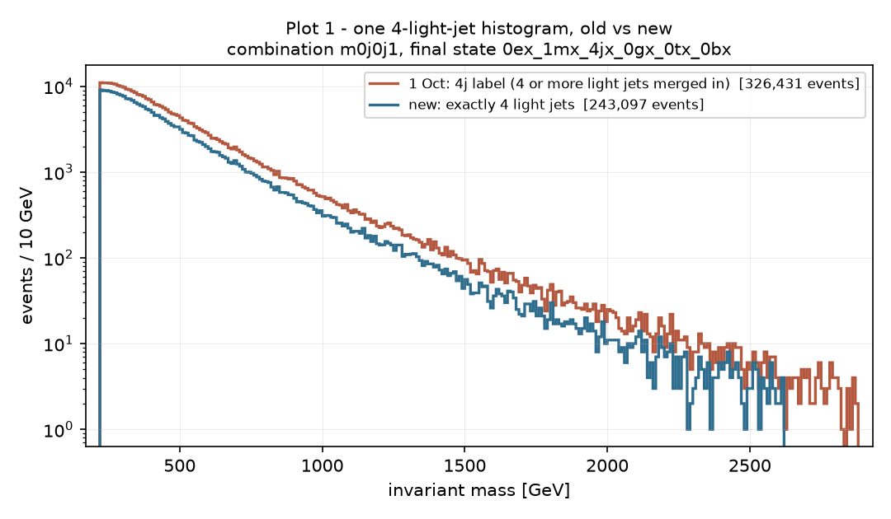
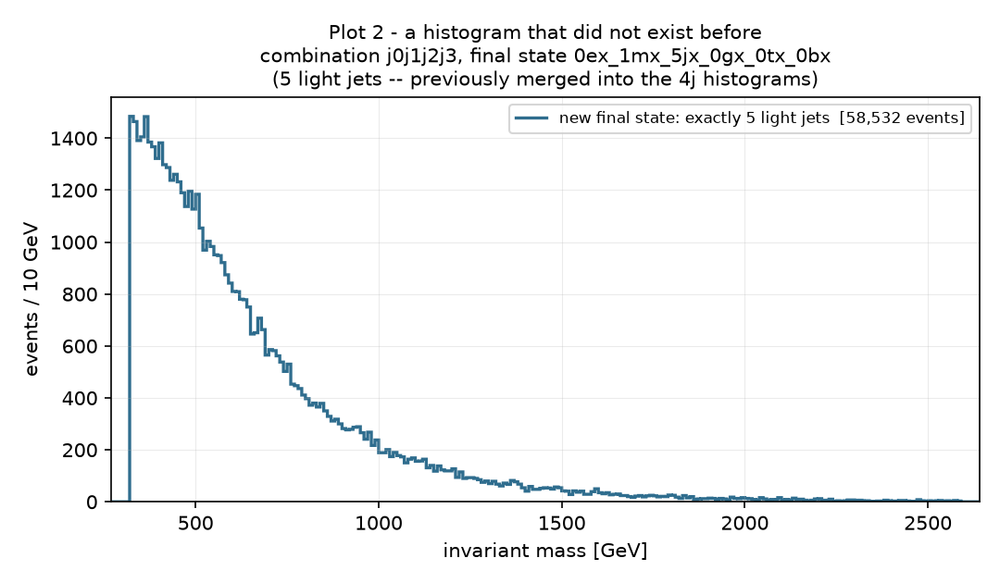
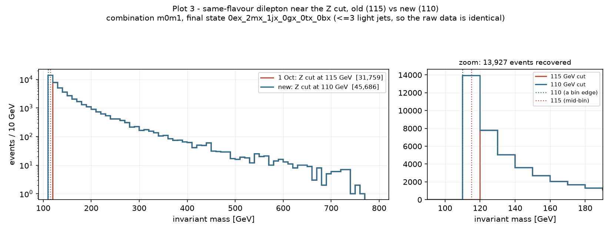
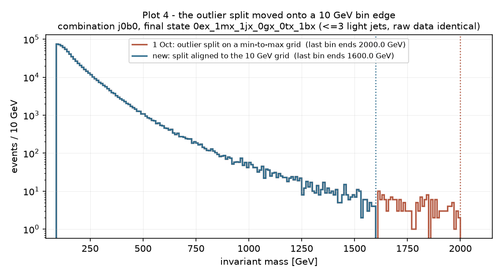
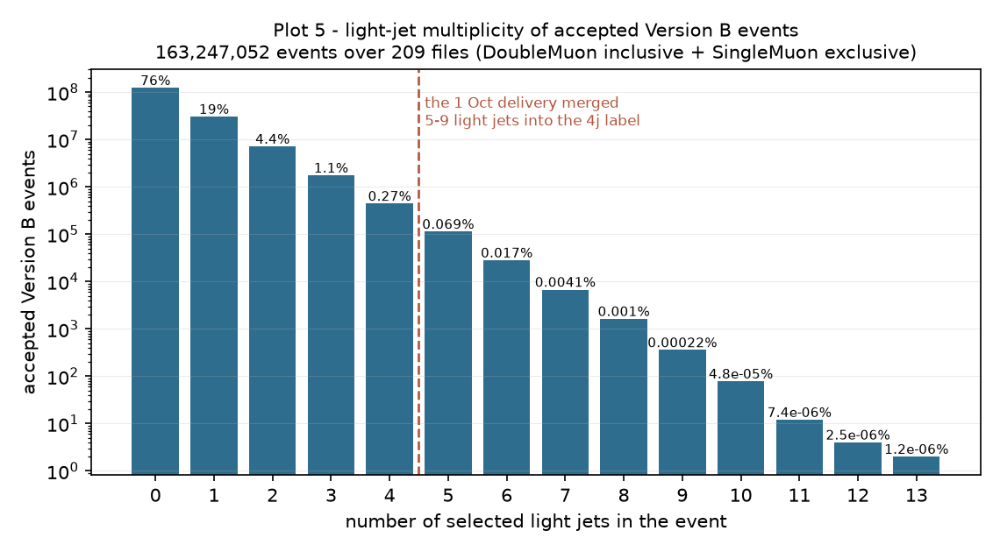

# Version B (rare4) re-delivered with exact light-jet final states

The CMS data we hand to BumpNet, rebuilt with three changes the group
decided, plus one change to how much we filter before handing it over.
Written for a reader who does not read code.

Everything here was produced on the Weizmann cluster from a fresh checkout
of Matan's fork pinned to one exact commit, `2666684`. Every number is
labelled either **VERIFIED BY RUNNING** (produced or checked in this
session, with the method named) or **UNVERIFIED**.

**The file for Maryna:**
`muon_combined_matched_vB_exactlabels_bumpnet_cropped.root`, in
`/storage/agrp/berkom/atlas-utilization/output/cms_datasets/deliver/muon_combined_vB_exactlabels_20261005/`.
A `README.txt` in that same folder says so too; a copy is committed here at
[`evidence/README.txt`](evidence/README.txt).

---

## 1. What changed, and why

### B1 — every light-jet count now gets its own final state

**Before.** An event was labelled by how many of each object it contained:
electrons, muons, light jets, photons, taus, b-jets. Any count above 4 was
written as "4". So an event with 5 light jets was filed under `4j` and its
masses went into the *same histograms* as genuine 4-light-jet events.

**Now.** The label is the true count. There are separate `5j`, `6j`, `7j` …
final states, and the 4-light-jet histograms contain only genuine
4-light-jet events.

**Why it matters.** Mixing jet multiplicities into one histogram mixes
different physics. Events with more jets produce a harder mass spectrum, so
merging them blurs exactly the kind of bump BumpNet looks for. Plot 1 below
shows this directly: the old merged `4j` histogram sits above the new pure
one everywhere, and the gap *widens* towards high mass.

**What did not change.** The name format is identical — still six
`<count><letter>` fields in the order e, m, j, g, t, b (e.g.
`0e_2m_5j_0g_0t_1b`); only the digits may now exceed 4. That format is still
an open question with Maryna and was deliberately left alone. No event was
added, dropped or altered — this is purely a relabelling, and that was
checked at full scale (section 3).

### B2 — the Z-peak cut moves from 115 GeV to 110 GeV

For channels containing a same-flavour lepton pair (two muons or two
electrons), masses below a threshold are discarded to remove the Z boson
peak, which would otherwise dominate. That threshold was 115 GeV.

Histograms are binned in 10 GeV steps from 0, so 115 GeV falls in the
*middle* of the 110–120 GeV bin. 110 GeV is a bin edge, so every bin is now
either wholly kept or wholly cut. Adopted by cherry-picking upstream commit
`8120fb8` (upstream PR #27) rather than re-typing the change.

Channels *without* a same-flavour lepton pair are untouched by this cut, as
before — checked explicitly and confirmed.

### B3 — the outlier split is aligned to the same 10 GeV grid

Far out in the high-mass tail the data thins out. The pipeline finds the
first completely empty bin and treats everything beyond it as outliers. The
problem: it used to build its own bins spanning the data's own minimum to
maximum, so those bins were neither 10 GeV wide nor lined up with the
histogram grid, and the cut landed at an arbitrary mass. Now it uses the
same fixed 10 GeV grid starting at 0. Same upstream commit `8120fb8`.

Plot 4 shows a real case: the old cut fell at 2000.0 GeV on its own skewed
grid, the new one at 1600.0 GeV on a real bin edge.

### B4 — the delivery no longer applies a filled-bin cut

Previous deliveries enforced a minimum number of filled bins here and
shipped **two** files: one requiring more than 30 filled bins, one more than
25. The group has settled that this cut belongs on **Maryna's** side, during
smoothing. So this delivery applies **no** filled-bin requirement and ships
**one** histogram set. For information, the count of delivered histograms
with 25 or more filled bins is reported below.

### What is deliberately unchanged

Object definitions, trigger matching, de-duplication between datasets, the
certified-run ("golden JSON") filter, the Version B reject rule (reject an
event if electrons + muons + b-jets > 4, otherwise keep **all** selected
light jets), the 186 mass combinations, the fixed 0–10000 GeV / 10 GeV
binning, the ">=100 events per final state" rule, the maximum-mass cut and
the peak-removal step.

Also unchanged, and still open: the **per-histogram ">=100 entries"
requirement**. It is counted below, not changed.

---

## 2. Counts: the 1 Oct delivery vs this one

All numbers in this table are **VERIFIED BY RUNNING** — the "new" column
from the build I ran this session (`build_summary_rare4_nobincut.json`,
committed at [`evidence/`](evidence/build_summary_rare4_nobincut.json)), the
"1 Oct" column by re-reading that delivery's own committed ROOT files and
manifests with a script I ran this session, except the three funnel figures
marked †, which were read from the 1 Oct build summary and not re-computed
(**UNVERIFIED** by re-running).

| | 1 Oct rare4 | new (exact labels) |
|---|---|---|
| files shipped | **two** sets (>30 bins and >25 bins) | **one** set |
| delivered histograms | 928 (>30 bins) / 960 (>25 bins) | **1,329** |
| distinct final states with a delivered histogram | 53 / 55 | **78** |
| delivered histograms with **>=25 filled bins** | 928 / 960 (all, by construction) | **1,243** |
| … with >25 filled bins (old "min26bins" rule) | 960 | 1,233 |
| … with >30 filled bins (old "min31bins" rule) | 928 | 1,177 |
| histograms excluded by the per-histogram **>=100-entries** rule | 44 † | **167** |
| delivered histograms with fewer than 100 entries | 0 | 0 |
| distinct raw signatures before any cut | 173,862 † | 247,833 |
| final states passing ">=100 events per final state" | 1,048 † | 1,496 |
| … surviving post-processing with >=100 entries | 1,004 † | 1,329 |

### Final states created by B1

Counted over the delivered population (DoubleMuon inclusive + SingleMuon
exclusive, all 209 files). All **VERIFIED BY RUNNING**
(`vB_check_step4.py`, output at [`evidence/step4_checks.json`](evidence/step4_checks.json)):

| | count |
|---|---|
| distinct final-state labels among accepted Version B events, 1 Oct | 106 |
| … the same, with exact labels | **163** |
| brand-new labels that did not exist on 1 Oct | **57** |
| final states with **>=5 light jets** | **71** |
| … of those, passing the ">=100 events per final state" rule | **23** |
| … **dropped** by that rule | **48** |
| final states with >=5 light jets that reach the delivered file | 21 |
| final states with >=10 light jets | 14 |

Two of the 23 final states that pass the event rule still produce no
delivered histogram, because every one of their histograms then falls below
the per-histogram >=100-entries rule. (That follows from the two measured
numbers 23 and 21.)

Of the 377 histograms that are new, by light-jet count: 5j **172**, 6j
**80**, 7j **54**, 8j **22**, 9j **2**, plus 72 at 0–4 light jets that
crossed the thresholds for other reasons (mostly the Z cut letting more
events through). **VERIFIED BY RUNNING.**

### Events by light-jet multiplicity

**VERIFIED BY RUNNING** (`vB_check_step4.py`, 163,247,052 accepted Version B
events over all 209 files):

| light jets | events | share |
|---|---|---|
| 0 | 123,347,522 | 75.56% |
| 1 | 30,432,437 | 18.64% |
| 2 | 7,125,112 | 4.37% |
| 3 | 1,748,610 | 1.07% |
| 4 | 443,155 | 0.271% |
| 5 | 113,234 | 0.069% |
| 6 | 28,144 | 0.017% |
| 7 | 6,758 | 0.0041% |
| 8 | 1,626 | 0.0010% |
| 9 | 358 | 0.00022% |
| 10 | 78 | 0.000048% |
| 11 | 12 | 0.0000074% |
| 12 | 4 | 0.0000025% |
| 13 | 2 | 0.0000012% |

**150,216 events (0.092%) have 5 or more light jets.** That is a small share
of events, but they were previously spread across the *most interesting*
high-mass part of the 4j histograms, which is why the effect on individual
histograms (plot 1) is much larger than 0.092% suggests.

---

## 3. Every check, and whether it passed

### Tests committed with the code

`studies/cms_datasets/tests/test_exact_jet_labels.py` — **all checks PASS**,
**VERIFIED BY RUNNING** (run locally on the final branch state):
synthetic events with 3/4/5/6/11 light jets give labels 3j/4j/5j/6j/11j;
event conservation and mask partitioning against the old grouping; the Z cut
keeping 110<=m<115 dilepton values that 115 removed while leaving every
non-dilepton signature untouched; and a concrete array where the old and new
outlier splits differ, the new cut landing on a 10 GeV edge (140.0 GeV) and
the old one off-grid (162.85 GeV).

Existing repo tests, **VERIFIED BY RUNNING**: the six `studies/m0m1j0_cms/tests/`
suites all pass. The full `tests/` suite: **346 passed, 11 skipped, 7
failed** — and all 7 failures are **pre-existing**, reproduced identically at
the unmodified baseline commit `f3d1d9b`. They are Windows-only
`PermissionError`s while deleting a temporary directory (a known SQLite
file-handle issue this repo already documents), not logic failures, and are
unrelated to this work.

### Step 3 — pilot validation on the 4 pilot files

**103 checks, 0 failures. VERIFIED BY RUNNING** — full output at
[`evidence/step3_pilot_validation_output.txt`](evidence/step3_pilot_validation_output.txt).

- **(a) Selection unchanged** — PASS. Events read, golden-JSON survivors,
  trigger survivors, gate survivors, exclusive events and every Version B
  reject diagnostic are identical to the 1 Oct run, file by file.
- **(b) Label redistribution only** — PASS. Total events identical; each old
  final state's count equals the sum of the new ones folding into it; every
  final state with <=3 light jets untouched.
- **(c) Raw data untouched below 4 light jets** — PASS. All 516, 402, 870,
  697, 225 and 209 `<=3`-light-jet raw mass arrays are identical,
  signature by signature.
- **(d) Post-processing differences only where expected** — PASS, and
  stronger than asked. Over 1,031 pooled `<=3`-light-jet channels (where (c)
  proved the input is identical): 826 unchanged, 2 changed because the
  peak boundary moved, 203 because the outlier-split boundary moved, **0
  for any other reason**. It was first proved, per channel and per side,
  that each histogram is *exactly* the raw array cut at its own three
  boundaries (Z floor, peak mass, split mass) — so no difference can come
  from anything but a boundary move: no altered values, no lost or
  duplicated events. Also confirmed: every moved split lands on a 10 GeV
  edge; only same-flavour dilepton channels moved via the Z cut; every newly
  admitted value sits at or above 110 GeV.

Concrete examples from that run:
- Z cut: final state `0e_2m_0j_0g_0t_0b`, combination `m0m1` — Z floor
  115 → 110 GeV, peak 120 → 110 GeV, **3,443 values recovered**, histogram
  6,132 → 9,575 entries.
- Split: the same channel's split mass moved from **548.56 GeV** (off-grid)
  to **550.0 GeV** (a bin edge).

A pilot-scale delivery was also built and worked end to end: 347 histograms,
no bin cut, 277 with >=25 filled bins, 129 excluded by the unchanged
>=100-entries rule. **VERIFIED BY RUNNING.**

### Step 4 — full production, all 209 files

**All checks PASS. VERIFIED BY RUNNING** (`vB_check_step4.py`):

- All 209 jobs present (57 DoubleMuon + 152 SingleMuon), every one produced
  by the single pinned commit `2666684`, every input file read exactly once,
  **zero failures and zero Python tracebacks**, every job exit code 0.
- Events read: DoubleMuon **94,148,416**, SingleMuon **323,952,013** — both
  exactly the CMS portal totals the 1 Oct production also matched.
- Zero capped signatures in any Version B shard.
- **Selection identical to 1 Oct, job by job**, across all five selection
  counts and all five Version B reject diagnostics, for all 209 jobs.
- Total Version B rejected events **5,738** — exactly the 1 Oct total.
  "Hidden" cases: **0**.
- **Label redistribution only**, job by job and pooled: total events
  identical, each of the 106 old final states equals the sum of the new ones
  folding into it, and every `<=3`-light-jet final state has an identical
  count.

### Hard-rule compliance

**VERIFIED BY RUNNING**: nothing under `output/` that existed before today
was modified. Checked by listing files newer than 20:30 under
`runs_matched/`, `runs_matched_rare4/`, `runs_matched_nonjet4/`,
`deliver/muon_combined*/` and `rare4_pilot/` — all empty. Existing shards
were only ever opened read-only (`mode=ro&immutable=1`). The pinned
production checkout stayed clean at `2666684` with zero modified files
throughout. Nothing was pushed to upstream; the upstream remote in the
working clone has its push URL disabled as a safeguard.

---

## 4. Plots

### Plot 1 — one 4j histogram, old vs new

Combination `m0j0j1` in final state `0e_1m_4j`. The 1 Oct histogram holds
**326,431** entries, the new pure-4j one **243,097** — **83,334 entries
moved out** to the new 5j, 6j, … histograms. Note the gap widens towards
high mass: the extra jets were adding exactly where a new-physics bump would
sit.

### Plot 2 — a histogram that did not exist before

Combination `j0j1j2j3` in final state `0e_1m_5j`, **58,532 entries**. On
1 Oct these events were inside the 4j histograms. There are **330** such
brand-new histograms at 5 or more light jets.

### Plot 3 — same-flavour dilepton near the Z cut, old (115) vs new (110)

Combination `m0m1` in final state `0e_2m_1j`. This final state has only one
light jet, so its raw data is provably identical between the two deliveries
— every difference here is the cut, nothing else. **13,927 entries
recovered**, 31,759 → 45,686. The zoom shows why: at 115 GeV the 110–120 bin
was cut through the middle and then removed entirely by peak detection; at
110 GeV the whole bin is kept.

### Plot 4 — the outlier split moved onto a bin edge

Combination `j0b0` in final state `0e_1m_1j_1b` (again `<=3` light jets, so
the raw data is identical). The old split kept data out to **2000.0 GeV** on
its own skewed grid; the aligned split cuts at **1600.0 GeV**, a real bin
edge, treating the sparse tail beyond it as outliers.

### Plot 5 — light-jet multiplicity of accepted Version B events

The distribution behind the table in section 2. Everything to the right of
the dashed line used to be merged into the 4j label.

---

## 5. Things worth the group's attention

### A — the old capping rule was itself inconsistent (new finding)

Found while writing the tests, **VERIFIED BY RUNNING**. The shared helper
that did the capping (`limit_particles_in_fs`) reads only the **first
character** of each count. The consequences:

- counts **5–9** were capped to 4 — as intended;
- counts **10–14, 20–24, 30–34, 40–44** were **not capped at all** — they
  already had their own separate final states;
- counts **50–99** were **mangled**: `99j` became `49j`, `50j` became `40j`.

So the 1 Oct delivery did not group high-multiplicity final states under 4j
the way its own documentation described.

**The good news, and it is checked, not assumed:** the 1 Oct *delivered*
file contains only final states with 0–4 light jets (**VERIFIED BY
RUNNING** — counted from its own committed manifests). No final state with
10 or more light jets ever had enough events to be delivered, so this never
reached anything Maryna received. The new code never calls that helper, so
it cannot affect the new delivery either. Nothing needs fixing; it is
recorded so the old numbers are interpreted correctly.

### B — eight histograms present on 1 Oct are not in the new delivery

Expected, and each one is explained. **VERIFIED BY RUNNING**:

| histogram | 1 Oct entries | new entries | why it fell below 100 |
|---|---|---|---|
| `e0m0m1j0_cat_1ex_2mx_2jx_0gx_0tx_0bx` | 116 | 99 | `<=3` jets: Z cut and aligned split moved the boundary |
| `j0j1j2_cat_0ex_2mx_4jx_0gx_0tx_2bx` | 257 | 39 | its 5+-jet events moved to the new labels |
| `j0j1j2b0_cat_1ex_1mx_4jx_0gx_0tx_2bx` | 281 | 85 | its 5+-jet events moved to the new labels |
| `j0j1j2j3_cat_1ex_1mx_4jx_0gx_0tx_2bx` | 159 | 55 | its 5+-jet events moved to the new labels |
| `m0j0_cat_2ex_1mx_1jx_0gx_0tx_0bx` | 104 | 93 | `<=3` jets: aligned split moved the boundary (no Z cut applies here) |
| `m0j0j1b0_cat_0ex_2mx_4jx_0gx_0tx_2bx` | 190 | 76 | its 5+-jet events moved to the new labels |
| `m0j0j1j2_cat_0ex_2mx_4jx_0gx_0tx_2bx` | 190 | 75 | its 5+-jet events moved to the new labels |
| `m0m1j0b1_cat_0ex_2mx_4jx_0gx_0tx_2bx` | 314 | 83 | its 5+-jet events moved to the new labels |

Six are 4j final states that lost their 5+-jet events — the intended effect
of B1. The other two had 3 or fewer light jets and were sitting just above
the 100-entry threshold (116 and 104); when the boundaries moved they fell
just below (99 and 93). Against this, **377** histograms are new, so the
delivery grew from 960 to 1,329.

### C — the per-histogram ">=100 entries" rule is now stricter in effect

It excluded **44** histograms on 1 Oct and **167** now (**VERIFIED BY
RUNNING**). That is expected: splitting 4j into 4j/5j/6j/… makes individual
final states smaller, so more of them fall under the threshold. The rule
itself was not touched. **This is the main thing worth a decision from
Maryna**: 48 of the 71 final states with 5 or more light jets are dropped by
the sibling ">=100 events per final state" rule before histograms are even
built.

### D — the Z-cut change affects other scripts if they are ever re-run

The Z cut lives in one study-local constant, now 110. Any script importing
it, or importing the funnel that uses it, would now use 110 instead of 115
**if re-run**: the per-dataset delivery builder, the coverage-survey
delivery builder, the per-dataset funnel measurement, and the report scripts
under `deliver/committed/`. **None of them were re-run here, and no
committed historical result was modified** (verified). Flagged only so
nobody is surprised by a changed number if they re-run an older script.

### E — the shared single-digit label parser cannot change a result here

`is_finalstate_contain_combination` also reads only one digit per count, so
for a count of 10 or more it skips that object's requirement. Checked
exhaustively over 2,250 labels × all 186 combinations against a correct
multi-digit reference: **zero disagreements** (**VERIFIED BY RUNNING**). The
reason is solid, not luck: the largest requirement across all 186
combinations is **4**, so a count of 10 or more satisfies every requirement
anyway. No study-local replacement was needed. The test carries a guard that
fails loudly if that largest requirement ever rises above 9.

### F — noted, not changed (out of scope)

- **b-tag working point.** We use DeepJet 0.2598, the 2016 *pre*-VFP medium
  value, while this data (Run2016G+H) is *post*-VFP, whose value is 0.2489.
  Unchanged here. Separately, the branch `analysis/btag-score-distribution`
  carries a 0.2598 → 0.25 change that must never be merged without a group
  decision; this is flagged in `docs/BRANCH_LAYOUT.md` too.
- **Final-state name format** — unchanged, waiting on Maryna.
- **Overlap removal** — ours drops jets within dR<0.4 of selected leptons;
  upstream PR #32 proposes an ATLAS-style scheme. No change.
- **The 5+-light-jet bug in the shared IMCalculator** — upstream is fixing
  it themselves. Nothing here works around or copies that fix, and no shared
  file was edited for B1.

---

## 6. Where everything is

| what | where |
|---|---|
| branch | `feature/exact-jet-labels-z110-aligned-split` (Matan's fork) |
| pinned commit for the production run | `2666684` |
| pinned production checkout | `/storage/agrp/berkom/atlas-utilization/checkouts/2666684/repo` |
| analysis checkout | `/storage/agrp/berkom/atlas-utilization/checkouts/analysis_944afe5/repo` |
| per-job outputs (209 jobs) | `.../output/cms_datasets/runs_matched_vB_exactlabels_20261005/` |
| **the delivery** | `.../output/cms_datasets/deliver/muon_combined_vB_exactlabels_20261005/` |
| **the file for BumpNet** | `muon_combined_matched_vB_exactlabels_bumpnet_cropped.root` |
| uncropped companion (cross-checks only) | `muon_combined_matched_vB_exactlabels_bumpnet.root` |
| pilot run and its validation | `.../output/cms_datasets/vB_exactlabels_pilot/` |
| PBS job IDs | `5184640[]` (DoubleMuon), `5184641[]` (SingleMuon) |

The uncropped file is on the full fixed 0–10000 GeV grid and is for
cross-checking and plotting. BumpNet needs the **cropped** one, because it
requires a non-empty first bin.
