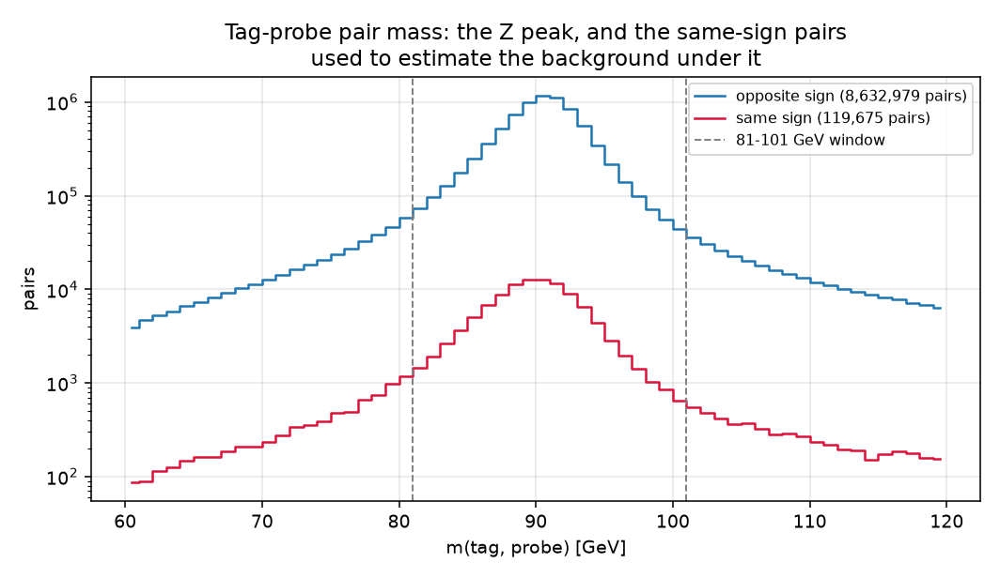
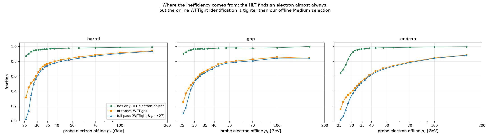
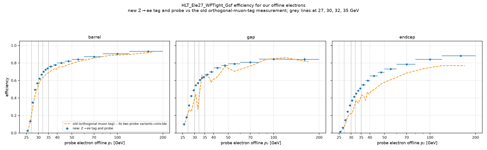
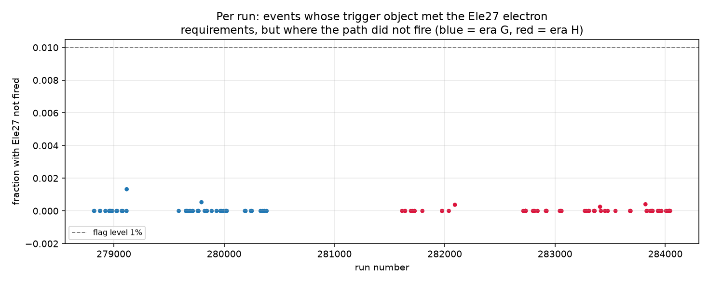

# SingleElectron, Step 1 — measurement only

Written for a reader who does not read code.

**Nothing in production changed.** No delivery was built, no production run
was made, and **no threshold is chosen here** — that is for Matan and
Maryna. Every production function used (object definitions, the dR < 0.12
electron-muon overlap removal, the trigger matcher with its id guard, the
four dataset acceptances, the Version B labelling) was **imported read-only**.

Every number is labelled **VERIFIED BY RUNNING** (with the script named) or
**UNVERIFIED**.

---

## 0. The three answers, in one paragraph

**The trigger is unprescaled** — confirmed two independent ways. **The old
measurement was broadly right, but it understated the efficiency**,
slightly in the barrel and substantially in the endcap. And the reason the
efficiency is far below 1 is **not** non-prompt contamination, as was
suspected: it is that the trigger's own "WPTight" electron identification is
tighter than the offline "Medium" identification we select on. That is now
shown directly, not inferred.

---

## 1. What was measured, and on what

**VERIFIED BY RUNNING** (`measure_singleelectron.py`, 151 files, pinned
commit `8670f8f`):

| | |
|---|---:|
| SingleElectron files, Run2016G+H | **151** (71 in G + 80 in H) |
| events read | 282,385,002 |
| after the validated-run (golden) list | 279,192,429 |
| with `HLT_Ele27_WPTight_Gsf` fired | 180,509,973 |
| electrons removed by the dR < 0.12 overlap removal | 1,072 |
| trigger-guard violations | **0** |

The file count matches the record pages: record 30529 states 71 files and
record 30562 the rest.
`HLT_Ele27_WPTight_Gsf` **exists in all 151 SingleElectron files and all 152
SingleMuon files** read — the reader refuses to run if a required branch is
missing, and no job failed.

### A caveat that had to be checked first: what does trigger bit 2 mean?

The "pass" test relies on trigger-object bit 2, documented in the files
themselves as `2 = 1e (WPTight)`. **This bit is not unique to our path.**
Its CMSSW definition is the wildcarded filter pattern
`hltEle*WPTight*TrackIsoFilter*`, and **six** WPTight single-electron paths
exist in these files: `Ele25`, `Ele25_eta2p1`, `Ele27`,
`Ele27_L1JetTauSeeded`, `Ele27_eta2p1` and `Ele32_eta2p1` — including one
*below* 27 GeV. So "bit 2 is set" does not by itself prove our path's filter
was passed, and `TrigObj_pt >= 27` does not fix that in principle.

**It does fix it in practice, and the size of the residual is measured, not
assumed.** Of 180,526,509 events holding a bit-2 object above 27 GeV, only
**16,536 — 0.009%** — had `HLT_Ele27_WPTight_Gsf` read 0 (**VERIFIED BY
RUNNING**). The independent muon-triggered test in §3 gives the same answer
(0.0035%). **Flagged, not papered over:** the requirement is sound at the
0.01% level, and anyone needing better than that would have to match on the
filter name, which NanoAOD does not store.

Two more checks that could have invalidated the method, both clean
(**VERIFIED BY RUNNING**):

* the probe never shares the tag's trigger object — **0** pairs out of 7.97
  million, so the "different object" requirement never silently fails a probe;
* widening the matching cone from dR < 0.1 to 0.2 adds **241** probes out of
  5,715,502 (**0.004%**), so the cone choice does not drive the result.

---

## 2. Step B — the Z→ee tag-and-probe efficiency

Tag: a selected electron above 30 GeV, outside the barrel-endcap gap,
matched to a WPTight trigger object above 27 GeV. Probe: any other selected
electron of opposite charge forming a mass between 81 and 101 GeV with the
tag. Pass: the probe is matched to a *different* WPTight object above 27 GeV.

**7,966,174** opposite-sign pairs in the Z window, against **106,864**
same-sign pairs (1.34%) — a small background, and subtracting it changes
**no bin by as much as 1 percentage point** (**VERIFIED BY RUNNING**). The
raw numbers are therefore quoted below.

### Efficiency vs probe pT (opposite sign, Clopper-Pearson 68%)

**VERIFIED BY RUNNING** (`aggregate_tnp.py`). Full per-bin table with raw
counts in [`evidence/stepB_tnp.json`](evidence/stepB_tnp.json).

| probe pT | barrel | endcap |
|---|---|---|
| 25-26 | 0.0263 [0.0256, 0.0270] 1,561/59,369 | 0.0148 [0.0141, 0.0156] 378/25,509 |
| 27-28 | 0.3478 [0.3461, 0.3495] 27,436/78,885 | 0.1483 [0.1463, 0.1502] 4,806/32,416 |
| 29-30 | 0.5675 [0.5660, 0.5691] 58,042/102,271 | 0.3155 [0.3133, 0.3178] 13,005/41,215 |
| 30-31 | 0.6231 [0.6216, 0.6245] 72,571/116,475 | 0.3715 [0.3692, 0.3737] 17,103/46,043 |
| 32-33 | 0.7015 [0.7003, 0.7027] 104,994/149,675 | 0.4499 [0.4478, 0.4519] 25,402/56,467 |
| 35-37.5 | 0.7585 [0.7580, 0.7591] 419,522/553,069 | 0.5511 [0.5500, 0.5523] 105,773/191,914 |
| 40-45 | 0.7997 [0.7994, 0.8000] 1,284,655/1,606,369 | 0.6534 [0.6528, 0.6541] 325,133/497,577 |
| 50-60 | 0.8418 [0.8413, 0.8422] 480,923/571,334 | 0.7328 [0.7317, 0.7338] 125,093/170,714 |
| 80-120 | 0.9057 [0.9045, 0.9069] 54,050/59,676 | 0.8414 [0.8385, 0.8443] 13,758/16,351 |
| 120-200 | 0.9342 [0.9323, 0.9359] 17,662/18,907 | 0.8831 [0.8782, 0.8879] 4,073/4,612 |

### The plateau, and how flat it is — it is **not** flat

The brief defines the plateau as 45-100 GeV. The binning has an edge at 120,
so the bins lying wholly inside are 45-50, 50-60 and 60-80:

| region | plateau | 68% interval | counts | spread across the bins | flat to 1 pp? |
|---|---:|---|---:|---:|---|
| barrel | **0.8326** | [0.8323, 0.8329] | 1,492,359/1,792,436 | **5.3 pp** | **no** |
| endcap | **0.7156** | [0.7150, 0.7162] | 386,300/539,827 | **9.0 pp** | **no** |
| gap | 0.7823 | [0.7804, 0.7842] | 37,986/48,557 | 3.5 pp | no |

**This is the single most important caveat in the report.** There is no
plateau in the usual sense. The efficiency is still climbing at 200 GeV
(barrel 0.93, endcap 0.88). Quoting "the plateau" as one number is
misleading, so the spread is given alongside it.

The barrel-endcap gap (|eta| 1.4442-1.566) is reported as its own region
throughout and never merged, since those electrons do pass our selection.

### Where the inefficiency actually comes from

This is the answer to the question the old study raised. Splitting the
requirement into its parts (**VERIFIED BY RUNNING**):

| probe pT, barrel | has *any* HLT electron object | of those, WPTight | full pass |
|---|---:|---:|---:|
| 27-28 | 0.931 | 0.508 | 0.348 |
| 32-33 | 0.962 | 0.730 | 0.702 |
| 40-45 | 0.974 | 0.821 | 0.800 |
| 60-80 | 0.983 | 0.887 | 0.872 |

The trigger **finds** the electron almost every time (93-98%). What it
mostly fails is the **online WPTight identification**, which is tighter than
the offline Medium identification our selection uses. The 27 GeV online
threshold costs essentially nothing above 31 GeV — above that point "WPTight
at any pT" and "WPTight above 27" are the same number.

**So the inefficiency is an identification mismatch, not a threshold effect,
and no choice of offline threshold removes it.**

### Comparison with the old measurement

**First, a finding about the old study itself.** Its two probe variants,
"all" and "prompt_like", are **numerically identical** in the barrel — the
same 44,632 probes, maximum difference 0.0000 — and differ by at most 0.0004
in the endcap (**VERIFIED BY RUNNING**). Its isolation cut removed almost no
probes, because the offline Medium identification already contains an
isolation requirement. **The old study therefore could not actually test the
non-prompt hypothesis it raised**, which is precisely why this measurement
was worth doing.

Now the comparison. The new sample is genuinely prompt (electrons from Z
decays); the old one was every selected electron in muon-triggered events.

| | new (Z→ee) | old (muon tag) | difference |
|---|---:|---:|---:|
| **barrel**, ~27 GeV | 0.348 | 0.288 | **+6.0 pp** |
| barrel, ~31 GeV | 0.669 | 0.626 | +4.3 pp |
| barrel, ~39 GeV | 0.777 | 0.728 | +4.9 pp |
| **barrel**, pooled 50-200 GeV | 0.8555 | 0.8632 | **−0.8 pp** |
| **endcap**, ~27 GeV | 0.148 | 0.096 | **+5.2 pp** |
| endcap, ~31 GeV | 0.415 | 0.295 | +12.1 pp |
| endcap, ~39 GeV | 0.600 | 0.443 | +15.7 pp |
| **endcap**, pooled 50-200 GeV | 0.7543 | 0.6877 | **+6.7 pp** |

**In plain words.** In the barrel the old measurement was essentially right:
a few points low during the turn-on, and its plateau agrees to within one
point. In the **endcap** it was materially too pessimistic — the real
efficiency for prompt electrons is 6 to 16 points higher, and the gap grows
with pT.

**Why.** Two effects, pulling the same way. The old sample contained
non-prompt electrons (from heavy-flavour decays and misidentified jets),
which fire a tight isolated-electron trigger far less often; and its probes
were whatever electron happened to be in a muon event, which is a softer,
less central, less well-measured population than an electron from a Z. Both
depress the old numbers, and both bite hardest in the endcap.

**What does not change.** The suspicion was that non-prompt contamination
was making the trigger "look less efficient than it is for real W/Z
electrons". It was **partly right** — but it does not rescue the trigger.
Even measured on clean Z electrons the efficiency is 0.83 (barrel) and 0.72
(endcap) in the 45-80 GeV range, still rising, and still far from 1. The old
study's practical conclusion — that no pT threshold buys a flat, high
efficiency — **survives this measurement**.

---

## 3. Step C — was the trigger prescaled?

### (1) Documentation

**VERIFIED BY RUNNING** — I downloaded and parsed the actual CMS HLT
configuration files published on the CERN Open Data portal, for **all 19
configurations covering Run2016G+H** (runs 278820-284044), listed at
<https://opendata.cern.ch/record/30300>. Files come from
`https://opendata.cern.ch/eos/opendata/cms/configuration-files/2016/`.
Result in [`evidence/stepC1_hlt_config_prescale_tables.json`](evidence/stepC1_hlt_config_prescale_tables.json).

In **every one of the 19**, `HLT_Ele27_WPTight_Gsf` is present in the menu
and **absent from the `PrescaleService` prescale table** — meaning prescale 1
in every column, i.e. unprescaled and enabled.

**That interpretation was verified rather than assumed.** In the same files,
`HLT_Ele25_WPTight_Gsf` *is* in the table, with prescales
`[0, 0, 0, 0, 0, 1, ...]` — disabled at high luminosity, enabled later. So
the table genuinely carries prescale and disable information, and absence
from it means unprescaled. Every other path this analysis relies on
(`HLT_IsoMu24`, `HLT_IsoTkMu24`, the DoubleEG and DoubleMuon DZ paths) is
likewise absent.

Two supporting quotes from the portal's own guides:

> "Trigger prescales are not stored in NanoAOD, but this information can be
> found using the `brilcalc` command line tool"
> — <https://opendata.cern.ch/docs/cms-guide-trigger-system>

> `brilcalc trg --prescale -c web -r 148002 --hltpath "HLT_Jet*"`
> — <https://opendata.cern.ch/docs/cms-guide-luminosity-calculation>

**UNVERIFIED:** I did not run `brilcalc`; it needs CMS infrastructure not
available here. The HLT configuration files are the primary source the
prescale tables come from, so this is documentary evidence of the same fact,
not a substitute measurement.

### (2) The empirical test

**VERIFIED BY RUNNING** (`prescale_check.py` + `aggregate_prescale.py`, all
**152** SingleMuon files — the full set, not the 40-file minimum, because a
file costs under a minute when only the run, HLT and trigger-object branches
are read).

Method: in muon-triggered events (so the test cannot be biased by the
electron path), find events holding a trigger object that met the Ele27
electron requirements, then ask how often the path nevertheless read 0.

| | events with a qualifying object | of those, Ele27 not fired | fraction |
|---|---:|---:|---:|
| era G | 65,193 | 2 | 3.1e-05 |
| era H | 76,555 | 3 | 3.9e-05 |
| **both** | **141,748** | **5** | **3.5e-05** |

**154 runs examined, 0 flagged.** No run, and no block of runs, shows a
clearly non-zero fraction.

**How sensitive is this test?** Honestly: good at spotting a real prescale,
not good enough to exclude a tiny one. 122 runs have at least 100
qualifying events, with a median of 747 per run. A
run that was prescaled by a factor of 2 would show about half its qualifying
events not firing and would be unmissable; a 1% effect would give roughly
7 events in the median run and would be seen.
An effect at the 0.1% level would not be distinguishable from the 0.0035%
floor already present. Combined with the configuration files, which are the
primary source and show no prescale entry at all in any of the 19 menus, the
conclusion is solid — but it is "no prescale", not "prescale exactly 1 proven
to one part in a thousand".

**Verdict: no evidence of a prescale or a disabled path anywhere in
Run2016G+H.** The documentary and empirical answers agree. Step D therefore
proceeded.

---

## 4. Step D — cost and benefit of the offline threshold

Candidate rule, **for measurement only**: Ele27 fired, at least one selected
electron (after the dR < 0.12 overlap removal) matched to a WPTight trigger
object above 27 GeV, and that electron's offline pT above T.

**VERIFIED BY RUNNING** (`aggregate_threshold.py`, 151 files).
Trigger-guard violations: **0**.

Of the 180,509,973 Ele27-fired events, only **5,017,895** are accepted by any
of the four existing datasets (DoubleEG 4,884,232; SingleMuon 126,359;
MuonEG 111,752; DoubleMuon 1,646) — so almost everything SingleElectron
accepts would be genuinely new.

| T (GeV) | (a) accepted | % lost vs 27 | (b) gain: no existing dataset takes it | % of T=27 gain | (c) final states ≥100 ev | of those, new categories | projected new histograms | (d) eff. barrel, T→T+5 (÷plateau) | (d) eff. endcap, T→T+5 (÷plateau) | (e) guard |
|---|---:|---:|---:|---:|---:|---:|---:|---|---|---:|
| **27** | 111,511,917 | 0.0 | 106,514,265 | 100.0 | 64 | 35 | 561 | 0.560 (0.67) | 0.314 (0.44) | 0 |
| **30** | 101,715,829 | 8.8 | 96,723,260 | 90.8 | 63 | 35 | 561 | 0.698 (0.84) | 0.452 (0.63) | 0 |
| **32** | 92,523,205 | 17.0 | 87,617,464 | 82.3 | 63 | 35 | 561 | 0.741 (0.89) | 0.517 (0.72) | 0 |
| **35** | 77,115,261 | 30.8 | 72,446,044 | 68.0 | 62 | 35 | 561 | 0.769 (0.92) | 0.577 (0.81) | 0 |

Efficiency in the **first 1 GeV** above each threshold, which shows how
steep the remaining turn-on is right at the cut:

| T | barrel | endcap |
|---|---:|---:|
| 27 | 0.348 | 0.148 |
| 30 | 0.623 | 0.372 |
| 32 | 0.702 | 0.450 |
| 35 | 0.759 | 0.551 |

The new-histogram figure is a **PROJECTION**: it counts how many of the 186
mass combinations each new final state satisfies, using the production's own
function. It is an upper bound — the real delivery then applies the Z cut,
the max-mass cut, peak removal and the outlier split, which can only remove
histograms.

### The trade-off, in plain words

**SingleElectron would be a large addition.** At 27 GeV it brings about
**106.5 million** collisions that none of the four current datasets accepts.
The current delivery holds 168.4 million, so this is roughly a **60%
increase** in events, reaching **35 final-state categories the delivery does
not have today** and a projected 561 extra histograms.

**Raising the threshold costs events but buys steadiness.** Going from 27 to
35 GeV throws away 31% of the events and 32% of the gain — but it moves the
cut from a point where the trigger is only 35% efficient in the barrel and
15% in the endcap, to one where it is 76% and 55%. In the endcap the
efficiency just above the cut nearly quadruples.

**What no threshold fixes**, and the group should be clear about it: even at
35 GeV the efficiency is still rising, and even far above the cut it never
reaches 1 — 0.83 in the barrel and 0.72 in the endcap. A threshold choice is
a choice about *how fast the efficiency varies across the cut*, not about
reaching a flat region, because there is no flat region.

**The number of new categories does not depend on T at all** — 35 at every
threshold tested. The category reach is bought by including SingleElectron
at all, not by where the cut is placed.

**No threshold is chosen here.** That is for Matan and Maryna.

---

## 5. Questions for Matan and Maryna

1. **Which offline threshold?** The table above is the input. 27 keeps the
   most data and the most new categories; 35 costs 31% of the events and
   gives a much less steep efficiency at the cut. Nothing in this
   measurement selects one — and note that because the efficiency never
   flattens, the usual "sit on the plateau" argument does not apply.
2. **Confirm SingleElectron goes LAST in the priority order**
   (DoubleMuon > SingleMuon > DoubleEG > MuonEG > SingleElectron). The gain
   figures in column (b) assume it, and they are what makes the dataset
   worth adding.
3. **Is a never-flat, 72-83% efficient trigger acceptable for BumpNet at
   all?** This is the question behind the other two. BumpNet looks for
   localised bumps; a smoothly varying efficiency is much less dangerous
   than a sharp one, but this efficiency varies across the whole mass range
   of interest. That is a physics-judgement call, not a measurement.

---

## 6. Noticed, not changed (out of scope)

* **A possible contradiction with earlier work, for the group to resolve.**
  The electron-prep specification states the MuonEG non-DZ paths are
  prescaled. In the HLT configuration covering runs 280187-280385 I find
  `HLT_Mu23_TrkIsoVVL_Ele12_CaloIdL_TrackIdL_IsoVL` and
  `HLT_Mu8_TrkIsoVVL_Ele23_CaloIdL_TrackIdL_IsoVL` **absent from the
  prescale table**, which by the verified interpretation means unprescaled
  there (**VERIFIED BY RUNNING**). This does not affect anything — the
  delivery uses the DZ paths and this task does not touch them — but the two
  statements cannot both be right in that run range. Options: (a) leave it,
  since the DZ paths are used regardless; (b) have someone re-check the
  earlier prescale-nesting test, which may have covered a different run
  range. I did not pursue it.
* Five other WPTight single-electron paths exist in the files; none is used.
* The b-tag working point, taus, photons, MC weighting and upstream's
  5+-jet bug are all untouched.

---

## 7. Where everything is

Branch, pinned commit, job IDs, output directories and how to resume:
[`HANDOFF.md`](HANDOFF.md).
