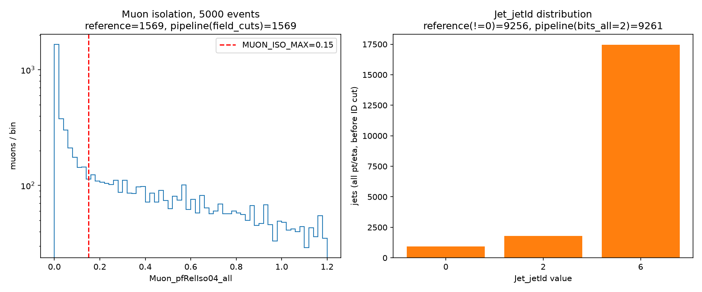

# Task D validation: generic field/bit-mask cuts vs. the standalone m0m1j0 script

Ground truth is `studies/m0m1j0_cms/selection.py` (read only, not modified —
imported directly and its own hand-written cuts run unmodified for
comparison). Everything below is **VERIFIED BY RUNNING** on one real CMS
file, 5,000 events (not a production run):

`root://eospublic.cern.ch//eos/opendata/cms/Run2016G/DoubleMuon/NANOAOD/UL2016_MiniAODv2_NanoAODv9-v2/2430000/05DD095C-F6C3-9A4F-9FB3-348A5A6403D5.root`

Script: `studies/generic_cuts/task_d_validation.py`. Raw result:
`studies/generic_cuts/assets/task_d_validation_result.json`. Plot:
`studies/generic_cuts/assets/task_d_validation.png`.

Ground-truth thresholds, read directly from `studies/m0m1j0_cms/selection.py`
(not assumed):

| constant | value | line |
|---|---|---|
| `MUON_PT_MIN_GEV` | 25.0 | selection.py:51 |
| `MUON_ETA_MAX` | 2.4 | selection.py:52 |
| `MUON_ISO_MAX` | 0.15 | selection.py:53 |
| `JET_PT_MIN_GEV` | 30.0 | selection.py:59 |
| `JET_ETA_MAX` | 2.5 | selection.py:60 |
| jet tight-ID cut | `(raw_jets.jetId & 2) != 0` | selection.py:201 |

The standalone script's own muon/jet cuts use **strict** inequalities
(`pt > `, `abs(eta) <`, `pfRelIso04_all <`), unlike this pipeline's existing
`pt_min`/`eta_max`, whose established convention is **inclusive**
(`pt >= min`, `min <= eta <= max` — see `docs/GENERIC_CUTS_DESIGN.md` and
`services/calculations/physics_calcs.py`). This difference is not something
this task introduced or is allowed to change (A2 requires `field_cuts` to
match the pipeline's own existing convention, not invent one) — it turned
out to matter for one of the two comparisons below, and is reported exactly
where it does.

## D1 — muon isolation (`field_cuts`)

Reference: `select_muons(events, apply_iso=True)`, called unmodified.
Pipeline reproduction: the real `services.calculations.physics_calcs.filter_events_by_kinematics`,
given `pt_min=25.0`, `eta_max=2.4` (existing capabilities), `bool_require:
["mediumId"]` (existing capability), and `field_cuts: {"pfRelIso04_all":
{"max": 0.15}}` (this task's new capability) — on the exact same raw
`Muon_pt/eta/phi/mass/mediumId/pfRelIso04_all` collection, so per-muon masks
are directly comparable, not just aggregate counts.

| | reference | pipeline |
|---|---|---|
| muons selected (5,000 events) | 1,569 | 1,569 |

**Per-muon selection mask identical for every single muon in the sample: 
True (0 of however many muons in the file disagree).**

Boundary check (the inclusive-vs-strict convention difference could only
ever matter for a muon landing exactly on a threshold): 0 muons with
`pt == 25.0` exactly, 0 with `|eta| == 2.4` exactly, 0 with
`pfRelIso04_all == 0.15` exactly, anywhere in the 5,000-event sample. The
convention difference never actually triggers here — **D1 reproduces the
reference exactly, with no caveat needed.**

## D2 — tight jet ID (`bit_cuts`)

The standalone script's jet cut is `(jetId & 2) != 0`, i.e. **`bits_any`**
semantics, not `bits_all`. Per the brief's note, `bits_all: 2` and
`bits_any: 2` are mathematically equivalent for a **single-bit** mask (`2` =
binary `10`; `x & 2` can only ever be `0` or `2`, never anything else, so
`!= 0` and `== 2` select exactly the same set). This was verified, not
assumed: computed both `(jetId & 2) != 0` and `(jetId & 2) == 2` on every
jet's actual `Jet_jetId` value in the sample (observed values: `{0, 2, 6}`)
and confirmed **bit-for-bit identical for all of them** — see
`bits_all_2_equals_bits_any_2_on_this_sample: true` in the result JSON. The
validation below therefore uses `bits_all: 2` for the pipeline side, on the
strength of this confirmed equivalence.

**Isolated check (bit-mask logic alone, pt/eta held out entirely):**
`bits_all: 2` and the reference's `!= 0` disagree on **0 jets**, out of
every jet in the sample. `bit_cuts`'s own new logic reproduces the
reference's jetId-based cut exactly.

**Full-selection check** (pipeline: `pt_min=30.0` + `eta_max=2.5` +
`bit_cuts: {"jetId": {"bits_all": 2}}`, vs. reference:
`pt>30 & |eta|<2.5 & (jetId&2)!=0`, on the same raw jet collection):

| | reference | pipeline |
|---|---|---|
| jets selected | 9,256 | 9,261 |

**5 jets disagree** (out of several thousand). This is a real,
reproducible discrepancy and is reported here exactly as found — nothing
below was adjusted to make it match.

**Cause, verified directly (not guessed):** all 5 disagreeing jets have
`pt` exactly equal to `30.0` GeV — the `JET_PT_MIN_GEV` threshold itself.
Full detail:

```json
[
  {"pt": 30.0, "eta": -0.0268, "jetId": 2},
  {"pt": 30.0, "eta":  1.1257, "jetId": 6},
  {"pt": 30.0, "eta":  0.3208, "jetId": 6},
  {"pt": 30.0, "eta":  1.7112, "jetId": 6},
  {"pt": 30.0, "eta": -0.6641, "jetId": 6}
]
```

The sample has 7 jets with `pt == 30.0` exactly; 5 of them have `jetId` with
bit 2 set (`2` or `6`) and so pass the tight-ID cut, landing them in this
disagreement (the other 2 presumably have `jetId=0` and fail the ID cut on
both sides, so they don't show up as a disagreement). The reference's
strict `pt > 30` excludes all 7; this pipeline's `pt_min`'s existing,
unmodified, inclusive `pt >= 30` convention keeps them. **This is not a
defect in `bit_cuts`** — the bit-mask logic itself is exact, confirmed
above with zero disagreement in isolation. It is a pre-existing property of
`pt_min`'s own convention (which this task was explicitly required to
match, not change) interacting with a downstream script's own, different,
independent choice of strict inequality, made visible only because CMS's
jet `pt` values in this file include several landing exactly on a round
GeV boundary.

**No boundary case occurred for `eta`**: 0 jets with `|eta| == 2.5` exactly.

## Plot



Left: `Muon_pfRelIso04_all` distribution (log scale) with the `0.15`
threshold marked; reference and pipeline counts shown in the title (equal).
Right: observed `Jet_jetId` values before any ID cut, with reference
(`!=0`) and pipeline (`bits_all=2`) counts shown in the title (differ by 5,
explained above).

## Summary

| | result |
|---|---|
| D1 (muon isolation, `field_cuts`) | **Exact match.** 1,569/1,569 muons, 0 of any disagree, no boundary case occurred. |
| D2 (jet ID, `bit_cuts`), isolated | **Exact match.** 0 disagreements on the bit-mask logic alone. |
| D2 (jet ID, `bit_cuts`), full selection | 5/9,261 jets (0.05%) disagree, **entirely and verifiably caused by the pre-existing, unmodified `pt_min` inclusive-boundary convention** at jets with `pt` exactly equal to the 30 GeV threshold — not by the new `bit_cuts` capability, which is exact in isolation. |

No discrepancy in the new capabilities themselves (`field_cuts`, `bit_cuts`)
was found. The one discrepancy found is real, reproducible, and reported
here in full rather than adjusted away — it lives entirely in an existing,
unrelated cut's boundary convention, triggered by a boundary condition this
one real file happens to contain.
