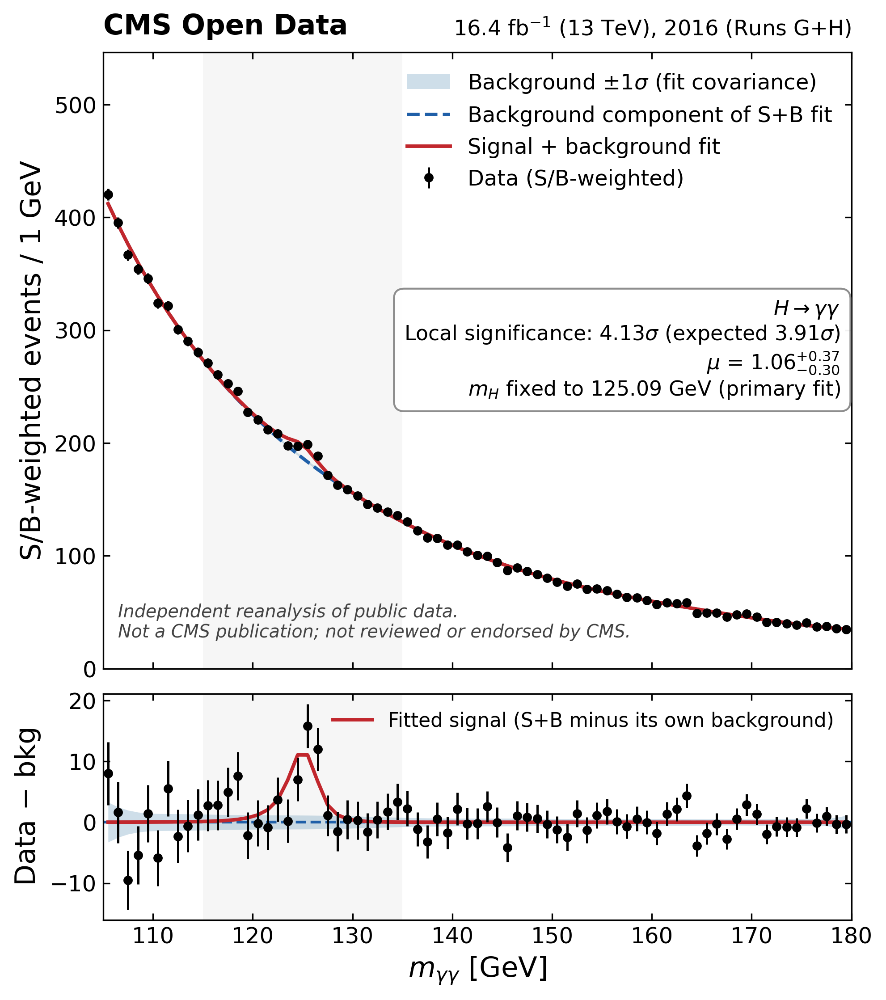

# H→γγ Open Data analysis: final report

**For:** Shikma Bressler, Maryna
**Branch:** `feature/hgg-selection-and-output`, primary result commit `c4ad7fd847c9a66deaed61bdf097f2c34ea5235c`
**Data:** CMS Open Data, 2016 Runs G+H, 16.393 fb⁻¹ ± 1.2%
**Status:** Unblinded. This is the real result.

Reading time: ~20 minutes. Every number below is sourced from a
specific file in this repository; file paths are given so any number
can be checked directly.

---

## 1. Summary

We searched for the Standard Model Higgs boson in the diphoton (H→γγ)
channel using public CMS 2016 Open Data (Runs G+H, 16.393 fb⁻¹), with
an independent selection, signal model, background model, and
statistical analysis built from scratch on top of that public data. No
part of this pipeline reuses CMS's own official H→γγ selection code or
results — only the raw public collision/simulation data and public
cross-section references.

**Headline result:** at the externally-fixed Higgs mass m_H = 125.09
GeV, we observe a local significance of **Z = 4.13σ** (p =
1.82×10⁻⁵), against a pre-registered expectation of Z = 3.91σ. The
best-fit signal strength is **μ = 1.06 (+0.37/−0.30)**, consistent
with the Standard Model prediction (μ=1) well within 1σ, and the
best-fit mass when m_H is left free is 125.7 (+0.34/−0.27) GeV,
consistent with the world-average 125.09 GeV. Per our own pre-declared
wording convention, this is **"evidence for a signal consistent with
H→γγ"** — not yet a 5σ observation.

The result is dominated by the higher-purity EBEB category (both
photons in the ECAL barrel), which alone gives Z = 4.10σ, while the
notEBEB category (at least one photon outside the barrel) gives only Z
= 0.87σ. Six pre-declared robustness checks (background-function
choice, fit range, spurious-signal terms, per-category, per-run-period,
energy scale/resolution) all move the result within a Z range of
roughly 2.6–4.9σ without ever flipping sign or direction — see Section
9.

**What this is not**: a CMS result, a publication, or a competitor to
the actual CMS/ATLAS Higgs discovery and precision measurements. It
uses only the portion of 2016 data released as CMS Open Data, a
two-category selection instead of CMS's dozen-plus MVA-based
categories, and no dedicated diphoton vertex-finding algorithm.
Section 10 details these limitations.

The hardest part of this analysis, by a wide margin, was the
background model for the lower-purity notEBEB category: no candidate
background function satisfied our own pre-declared bias criterion
there, for a real, statistically-significant reason (Section 6), not
just bad luck. We made an explicit, documented fallback decision, and
carry its quantified cost as a systematic. Sections 4–8 walk through
every methodological choice and every problem found and fixed along
the way; nothing here has been "cleaned up" after the fact.

---

## 2. Data and simulation

**Data:** CMS Open Data DoubleEG primary dataset, 2016 Run2016G
(record 30521, 47 files) and Run2016H (record 30554, 86 files), 13
TeV, 133 files total. After the full selection (Section 3), **261,543
diphoton pairs** are selected: 78,992 in the blinded 115–135 GeV
signal region and 182,551 in the sidebands (`UNBLINDED_RESULT.md` §0).

**Luminosity: 16.393380531 fb⁻¹ ± 1.2%.** Established from the
official per-lumisection CSV for this dataset (CERN Open Data record
1059, `pp_2016lumibyls.csv`, `brilcalc --byls` with the official
normtag), cross-checked against the `Run2016{G,H}lumi.txt` totals to 9
decimal places (`impl_checks/lumi_coverage/LUMI_DECISION.md`). The
**coverage check**: of 682 lumisections present in the official golden
JSON but absent from this analysis's own processed files, 661 (97%)
have exactly zero recorded luminosity, and the total *missing*
luminosity is 0.000688616 fb⁻¹ — 0.0042% of the total, well under a
pre-set 0.1% materiality threshold. Decision: use the official
luminosity value unmodified. The 1.2% uncertainty is quoted directly
from record 1059's own abstract (CMS, cds.cern.ch/record/2759951).

**Simulation:** six single-file signal samples (ggH, VBF, W⁺H, W⁻H, ZH,
ttH), cross sections and pre-selection yields in
`validation/VALIDATION_REPORT_1.md` Part E.

**The ttH 15-file caveat:** CMS Open Data record 67611's file listing
is unstable — a same-day re-query of the portal returned 16 files
where the frozen list (and the cluster job that actually processed the
sample) used 15. This is treated as a portal-instability issue, not a
processing error: ttH's normalization uses *only its own job's actual*
`genEventSumw` over the 15 files it really processed, never a
separately-cached total from a different query
(`impl_checks/signal_sumw_notes.md`). Consequence: ttH has the
thinnest simulated statistics of the six modes (2.5% relative
statistical uncertainty vs. <1% for the others), but at only ~1% of
the total signal yield this barely moves the combined result.

**The ZH cross-section correction:** the CMS Open Data ZH sample
(record 74132) contains only the quark-initiated qq/qg→ZH process
(confirmed via its generator fragment), not the loop-induced gg→ZH
piece. The commonly-quoted LHCHXSWG YR4 cross section (0.8839 pb) is
the *combined* qq+gg total, which would overstate this sample's yield
by ~14% if applied directly. Correction: the qq/qg-only YR4 value,
0.7612 pb, is used for any yield computed from this sample
(`impl_checks/signal_sumw_notes.md`; applied in
`signal_model/SIGNAL_MODEL_REPORT.md`). The originally-recorded value
in `signal_sumw.json` was deliberately left unmodified (a project rule
against editing recorded raw values); the correction is applied
downstream instead.

---

## 3. Selection

**Cutflow** (`selection.py`, in order): (1) an upstream photon
preselection (pT>20 GeV, electron veto, MVA ID working point 90,
barrel-or-endcap); (2) **trigger-mimicking cuts** (see below); (3)
require ≥2 photons passing those cuts, take the two highest-pT as the
candidate pair; (4) scaled-pT requirements, pT,lead > m_γγ/3 and
pT,sublead > m_γγ/4; (5) a 100–180 GeV mass window (note: the
statistical fit itself uses a narrower 105–180 GeV range, so there is
a small 100–105 GeV margin that is selected but not fit); (6) category
assignment. No numeric event-count-per-cut table exists in the repo —
only the final selected counts are reported: **261,543 total pairs**
(EBEB 129,954, notEBEB 131,589).

**Trigger-mimicking cuts:** since this is Open Data with no ability to
re-run the real CMS trigger, offline shower-shape and isolation cuts
approximate CMS's actual diphoton trigger
(`HLT_Diphoton30_18_R9Id_OR_IsoCaloId_AND_HE_R9Id_Mass90`) using the
isolation variables actually available in NanoAOD. This is explicitly
flagged in the code as an imperfect proxy, not a verified match: the
photon-isolation proxy is looser than the trigger's own definition
(it includes a neutral-hadron component the trigger's variable
doesn't), and the tracker-isolation proxy has no dedicated NanoAOD
branch and reuses charged-particle-flow isolation as a stand-in.

**Categories:** exactly two — **EBEB** (both photons in the ECAL
barrel) and **notEBEB** (at least one photon in the endcap or a
mixed pair). This split matters: EBEB carries 65.9% of the expected
signal yield despite the two categories' sidebands splitting almost
exactly 50/50 (`validation/VALIDATION_REPORT_1.md` Part F) — the
background doesn't care about barrel/endcap, but a real Higgs signal
survives selection disproportionately more often in the barrel. No
further subdivision exists in this analysis.

**What CMS's real analysis does that we can't:** CMS's own published
H→γγ analyses use a BDT-based algorithm to pick the correct primary
vertex per event from tracker-pointing information (photons themselves
carry no vertex information), and a photon-ID MVA plus dijet kinematics
to split events into many more purity-ordered categories (typically
9–14, including a dedicated VBF-tagged category), rather than this
analysis's two. **This project's own materials do not quantify what
that would cost us in sensitivity** — the only related note in the
code flags the NanoAOD isolation proxies as "not identical to the
paper's own vertex-dependent definitions" and points to a design
document that does not exist anywhere in this repository (a dangling
reference). We state this as a real, acknowledged limitation rather
than inventing a number for it — see Section 10.

---

## 4. Validation

Two rounds of validation were run before any signal-region data was
opened: a full-statistics check on the main H→γγ sideband sample
(`validation/VALIDATION_REPORT_1.md`) and a dedicated Z→ee control-
sample study (`validation/VALIDATION_REPORT_2.md`), both with the
signal-region window mechanically excluded and independently re-checked
at every load.

**Z→ee energy scale and resolution: PASS in all three categories.**
Fitting the Z peak (Breit–Wigner ⊗ Crystal Ball, 80–100 GeV window) in
data vs. PU-reweighted DY simulation, against two pre-set criteria
(|Δpeak|/peak < 0.5%, |Δσ_eff|/σ_eff < 10%):

| Category | Δpeak/peak | Δσ_eff/σ_eff | Verdict |
|---|---:|---:|:---:|
| Inclusive | 0.037% | −0.95% | **PASS** |
| EBEB | 0.055% | −0.59% | **PASS** |
| notEBEB | −0.037% | −1.75% | **PASS** |

No energy-scale correction or extra smearing was needed for the signal
model as a result. (A real bug was caught and fixed while producing
this check — an earlier σ_eff68 algorithm minimized the wrong quantity
for DY's signed weights and overshot the true width by ~2.5× on a unit
test; replaced with an exact binary-search method, re-verified on a
600,000×-larger synthetic case.)

**Trigger efficiency** (Ele27-fired electrons, fraction also firing the
diphoton trigger, data vs. DY): data/DY ratio **EBEB 1.023 ± 0.001,
notEBEB 0.971 ± 0.002** (inclusive 1.006 ± 0.001). Report-only, no
pass/fail — these are candidate multiplicative trigger scale factors
for the signal yield; applying them was left as a signal-model-task
decision (not applied here, since no photon-ID scale factors exist
either, for consistency — Section 5).

**Pileup**: reweighting on the only available real-data proxy,
`PV_npvsGood` (reconstructed vertices, not true pileup — a stated
limitation, since the MC-truth pileup count doesn't exist in real
data). Effect on ggH is negligible: selection efficiency shifts by
−0.16%, and peak/width are unchanged at the report's own binning
resolution.

**Run stability**: 156 certified runs, total rate 11,135.7 events/fb⁻¹,
χ²/ndf = 2.48 for a constant-rate hypothesis. 12/156 runs (7.7%)
flagged >3σ — more than pure statistics alone would predict (~0.3%
expected), so some mild real run-to-run variation likely exists, mostly
attributable to low-luminosity runs with large statistical uncertainty
rather than a real selection bug. Not alarming for a real-data
background rate.

**The 100–105 GeV excess and the electron-veto-leakage explanation.**
A turn-on check (extrapolating smooth functions fit to 105–115 ∪
135–180 GeV into 100–105 GeV) found a **+4.2σ excess** over the
better-fitting power-law extrapolation in that window — an excess, not
a deficit, which rules out simple trigger/acceptance turn-on as the
cause. The leading explanation: **electron-veto leakage** — real
Z→e⁺e⁻ (and off-shell Drell-Yan) electrons occasionally pass
`electronVeto==True` despite being real electrons, leaking into the
diphoton sample. A dedicated DY-based measurement (all 41 jobs, no
missing chunks) found an expected leakage of **1,609.8 ± 71.5 events**
in 100–105 GeV — numerically very close to the ~1,604-event excess.
**Verdict: consistent with electron-veto leakage being the cause — not
"fully" explained**, for two honestly-flagged reasons: (1) leakage also
populates the very sideband windows (105–115, 135–180 GeV) the
extrapolation was fit to, so the comparison isn't fully independent of
itself; (2) the DY-based prediction carries an unquantified systematic
of roughly 20–50% (from the ~17% Z→ee data/DY normalization mismatch
and an unvalidated real-electron veto inefficiency). This finding
directly decided the background-model fit range: **default 105–180
GeV, with 110–180 GeV as a pre-declared robustness check** (Section 9.3
check i) — 100 GeV was never used as a fit-range floor.

**The 165 GeV dip investigation.** A pull plot showed EBEB's
165.25–165.50 GeV sideband bin at −4.5σ against the fitted background,
with a nearby (but not the same) notEBEB bin at −2.9σ — two categories
both low near the same mass looked, at a glance, suspicious. A
dedicated investigation checked six independent explanations: fine
(0.05 GeV) binning (no sharp spike — a smooth few-bin-wide dip),
bin-edge floating-point artifacts (no excess), a shifted bin grid (the
EBEB dip persists, so it isn't a binning artifact), neighboring-bin
event migration (the sizes don't match, ruling out simple
misassignment), and a run-by-run breakdown (56 different runs
contribute, no outlier run). **Conclusion: no bug.** EBEB's bin is a
genuine, locally rare (~1-in-800) downward statistical fluctuation —
the single most extreme bin in its own 220-bin sideband, which is
unusual but not implausible given how many bins this project has
looked at in total. The two categories' dips are in *adjacent*, not
identical, bins, and are not one shared feature. No code or result was
changed.

---

## 5. Signal model

Two shapes, chosen by a pre-set rule (use DCB+Gaussian only if it
improves binned χ² by >10 units AND pure-DCB χ²/ndf > 1.5, else keep
pure DCB) — `signal_model/SIGNAL_MODEL_REPORT.md`:

- **EBEB: pure double-sided Crystal Ball (DCB).** Mode 124.815 GeV,
  σ_eff68 = **1.770 GeV**. χ²/ndf = 3.62 — not formally a good fit by
  the usual χ²/ndf≈1 standard, but adding a Gaussian *worsened* χ² by
  0.4, so the pre-set rule keeps pure DCB. Attributed to genuine
  sub-structure from combining six production modes with different
  intrinsic resolutions, not something a second Gaussian fixes.
- **notEBEB: DCB+Gaussian.** Mode 124.768 GeV, σ_eff68 = **2.608
  GeV**. χ²/ndf improves from 4.27 (pure DCB) to 1.43 with the
  Gaussian added (χ² improvement 56.8 units) — both trigger conditions
  hold.

Both validated against an independent ggH-only reference shape within
a pre-set 3% band (EBEB 0.56% away, notEBEB 0.68% away).

**Expected yields** (trigger-SF-corrected central values,
`signal_model/results/signal_model.json`): **EBEB = 545.80**, **notEBEB
= 266.13** (total 811.93 events at μ=1, L=16.393 fb⁻¹).

**Systematics table** (per category, `signal_model.json`):

| Source | EBEB | notEBEB | Type |
|---|---|---|---|
| Luminosity | 1.2% | 1.2% | norm, shared |
| Theory (σ×BR) | 6.51% | 6.51% | norm, shared |
| ID/reconstruction | 20% | 20% | norm, shared |
| Trigger SF | 2.29% | 2.95% | norm, per-category |
| Pileup (yield) | 0.11% | 0.68% | norm, per-category |
| Energy scale | 0.1% (0.125 GeV @125) | 0.1% | shape (mean), shared |
| Energy resolution | 5.0% | 5.0% | shape (width), shared |
| Simulation stat. | 0.26% | 0.36% | norm, per-category |

The two largest uncertainties are ID/reconstruction (±20%) and theory
(±6.5%), both normalization/interpretation uncertainties that affect
the *expected* significance and μ interpretation, not the observed
significance itself. The 20% flat ID/reconstruction uncertainty exists
because no photon-ID scale factors are available in this Open Data
setup (no correction is applied to the central yield; the 20% is
carried as a systematic instead), justified by how far the Z→ee
data/DY normalization ratios sit from 1 in validation (EBEB 0.837,
notEBEB 0.808 — Section 4) — a genuine limitation of working from
public data rather than the official CMS calibration chain.

ttH has the thinnest simulated statistics of the six production modes
(Section 2's "ttH 15-file caveat"), but at ~1% of the total signal
yield this barely affects the combined result.

---

## 6. Background model

**This was the hardest methodological point in the whole analysis.**
We are explicit about that below rather than smoothing it into a tidy
table.

### 6.1 Candidate families and the order-selection procedure

Four standard CMS discrete-profiling families were tried (Bernstein
polynomials order 1–7, exponential sums, power-law sums, fixed-exponent
Laurent series — the same set used in CMS's own H→γγ diphoton papers,
`background_model/BACKGROUND_MODEL_REPORT.md`), selected by an F-test
(p<0.05 to add an order) plus a binned goodness-of-fit check (p>0.01).
On the sideband-only fit over the default 105–180 GeV range, all four
families passed GOF in both categories (EBEB: bernstein order 4, GOF
p=0.44; notEBEB: bernstein order 5, GOF p=0.67) — but this sideband-only
pick is **not** what the analysis actually uses; it's superseded by
the bias study below.

### 6.2 The bias study, the 20% criterion, and why nothing passed it

A candidate function passes only if, in every one of 60 cells (4 truth
families × 3 leakage variants × 5 masses), the spurious signal it would
inject stays under 20% of its own statistical uncertainty
(`|mean spurious S| / mean σ_S < 0.20` — our own documented convention,
not directly the same ratio ATLAS's public papers use). A function must
also be numerically reliable (≤5% toy-fit failures) to even be
considered.

**Result: nothing passed in either category.**

- **EBEB:** best eligible candidate `bernstein_6`, worst ratio **0.217**
  — just over the line (worst spurious signal 32.2 events, 5.9% of the
  545.8 expected signal).
- **notEBEB:** best eligible candidate `bernstein_6`, worst ratio
  **0.493** (worst spurious signal 109.3 events, **41% of the 266.1
  expected signal**). The next-order candidate (`bernstein_7`) came
  back *ineligible* — the extra order made convergence worse, not
  better.

### 6.3 Diagnosis

`BIAS_DIAGNOSIS.md` traced this down with a dedicated study, not a
guess:

- For every non-Bernstein family, the dominant failure driver is a
  **truth-family mismatch** (a test function fits its own family's
  truth almost perfectly but can't absorb Bernstein's curvature) — not
  the signal-leakage variation, which barely moves the numbers.
- A 200,000-draw null-distribution check shows EBEB's 0.304 (an
  intermediate candidate, not the final choice) is statistically
  consistent with noise (p=0.83), but **notEBEB's 0.493 is a real
  effect, not a fluctuation (p=3×10⁻⁵)**.
- The structural reason: inside the blinded 115–135 GeV window, the
  four candidate families' own mutual disagreement about the
  background shape is **1.07×** the size of the signal peak itself in
  notEBEB, versus only **0.17×** in EBEB. In notEBEB, not knowing which
  functional form is "true" already introduces an ambiguity as large as
  the entire Higgs peak — there is no "almost right" answer to converge
  toward the way there is in EBEB. This traces back to notEBEB's wider
  signal peak (σ_eff≈2.6 GeV vs. EBEB's 1.8 GeV) sitting on a
  background whose plausible shapes genuinely disagree more.

### 6.4 The Fallback C decision and its cost

Pre-declared for exactly this situation: among eligible candidates,
pick the smallest worst-ratio (ties broken by fewer parameters).
**Fallback C selects `bernstein_6` in both categories** — the same
function that failed the 20% criterion, used anyway because it's the
least-bad available option, not because it passed.

Dropping notEBEB entirely was explicitly considered and rejected: it
carries 32.8% of the total expected signal (266.1/811.9 events) — too
much to discard.

**Quantified cost** (an explicitly-flagged rough, simple-quadrature
estimate, not a full profiled-likelihood number): the extra background-
shape uncertainty grows the signal-yield uncertainty by **+2.6% in
EBEB** and **+14.6% in notEBEB**.

### 6.5 The 110–180 GeV robustness check

`bernstein_6` was retested on the wider 110–180 GeV range against the
same four truth families (a 4-cell-per-category spot-check, not the
full 60-cell grid): worst ratio drops to **0.085 (EBEB)** and **0.097
(notEBEB)** — both comfortably pass. Verdict: **robust** — the function
choice is not fragile to the exact fit range, even though it fails the
strict criterion on the default range. (A naming artifact in the
generic merge script printed "bernstein_5" as the 110–180 "chosen"
function elsewhere in the repo; the analysis's actual choice remains
`bernstein_6` throughout.)

### 6.6 Final model

Both categories: **Bernstein, order 6 (7 coefficients)**. Spurious-
signal systematic (unit-Gaussian-constrained nuisance, uncorrelated
between categories, same value used at every m_H): **EBEB = 32.16
events**, **notEBEB = 109.26 events**
(`background_model/results/background_model_final.json`).

---

## 7. Statistical method and validation

### 7.1 The model

A binned Poisson likelihood over 0.25 GeV bins, 105–180 GeV, both
categories fit simultaneously with a shared signal strength μ: 28 free
parameters (μ; 5 shared nuisances — luminosity, theory, ID/reco,
energy scale, energy resolution; 4 per-category nuisances × 2 —
trigger SF, pileup, MC stat, spurious signal; 14 background
coefficients). Discovery test statistic: the CCGV q0 (Cowan, Cranmer,
Gross, Vitells, arXiv:1007.1727), Z = √q0. Every fit uses ≥10 MIGRAD
starting points plus a scipy L-BFGS-B cross-check, and asserts the
NLL(μ free) ≤ NLL(μ=0) invariant before trusting a result (`stats/model.py`,
`stats/fit.py`). 21 unit tests on the model itself, all passing.

### 7.2 Toy validation

Ten pre-declared validation criteria, run on ~1000–2000 toys per
configuration (`stats/STATS_REPORT.md`):

| # | Criterion | Result | Status |
|---|---|---|---|
| 1 | q0 vs. asymptotic ½δ(0)+½χ²₁ | tail fractions within 2.1σ of asymptotic | PASS |
| 2 | μ̂≤0 fraction ≈ 0.5 | 0.5013 | PASS |
| 3–5 | Pull mean \|x\|<0.05 (μ_true=0.5/1.0/2.0) | −0.0024/+0.0036/−0.0012 | PASS |
| 6 | Median Z vs. Asimov Z(μ=1) within 0.15 | 3.956 vs. 3.911, diff 0.045 | PASS |
| 7 | Spurious-signal absorption, \|mean μ̂\|<0.1 | 0.0873 | PASS |
| 8 (info) | Expected-Z band | median 3.956, [3.02, 4.97], P(Z≥3)=0.84, P(Z≥5)=0.15 | reported |
| 9 (info) | Trials factor at local Z=3 | 17.0× (high-exclusion caveat, see below) | reported |
| 10 | Pull width 1.00±0.05, fixed-nuisance toys | 0.803/0.691/0.581 (μ_true=0.5/1.0/2.0) | initially **FAIL**, explained below |
| 10′ | Pull width, randomized-nuisance decisive check | 0.908±0.063 | resolved, within ~1.5σ |

### 7.3 The pull-width episode

Row 10 failed outright on first computation, and that failure was
tracked down properly rather than explained away:

1. **A labeling bug.** The field called `pull_width` was actually
   `std(μ̂)` — never divided by the fitted uncertainty, so it wasn't a
   true statistical pull at all. Fixed and renamed
   `mu_hat_residual_width`.
2. **A validity-check gap.** Fit-failure rates ranged from 6.6% to
   47.7% depending on toy type. `Minuit.valid` turned out to be a
   *weaker* condition than "this fit's uncertainty can be trusted" — it
   doesn't require an accurate or positive-definite covariance. A
   stricter `strict_valid` check was added, plus an explicit HESSE
   call and pre-HESSE diagnostic snapshots (an ordering bug in the
   first attempt at this fix was itself caught and corrected).
3. **The real pull-width diagnosis.** With those fixes in place, row 10
   still nominally failed (pull width 0.58–0.80 against a required
   1.00±0.05), but only ~9–13% of toys had a usable HESSE uncertainty
   at all. The hypothesis: fixed-nuisance toys have a μ̂ spread that
   reflects only the statistical uncertainty, while the fitted μ_err
   reflects the *full* uncertainty (all nuisances floating) — an
   apples-to-oranges comparison that mechanically under-disperses the
   pull. A dedicated decisive check (`sig_injection_randnuis`: true
   nuisance values drawn from N(0,1) per toy, 500 toys) confirmed
   this — the μ̂ spread jumped to 0.331, matching the Asimov σ_μ,full
   (0.328) almost exactly, and the pull width came back at
   **0.908±0.063**, consistent with 1.00±0.05 within about 1.5σ. The
   residual gap was not chased further, because the primary discovery
   result (q0/Z) does not depend on σ_μ at all, and q0's own behavior
   is independently confirmed by criteria 1, 2, and 6.
4. Separately, diagnosing *why* only ~9% of toys had a usable HESSE
   uncertainty found: 66% of the rest have a non-positive-definite or
   forced-positive-definite covariance (a near-degenerate direction in
   the 28-parameter likelihood), and 34% fail HESSE despite looking
   fine beforehand (the explicit HESSE call can itself "break" an
   already-converged fit). μ was never at a parameter bound.

### 7.4 Why profile-likelihood, not HESSE, for the headline μ uncertainty

This was a **pre-declared decision, made before unblinding**, precisely
because of what Section 7.3 found: HESSE needs a local quadratic
approximation and can't represent asymmetric uncertainties, and its
usable-fit rate is low. The profile-likelihood scan
(`fit.profile_likelihood_mu_error`, unit-tested against two exact
analytic cases) makes no such assumption. On the Asimov dataset at
μ_true=1, profile-likelihood gives σ_up=0.361, σ_down=0.296
(symmetrized 0.328 — matching HESSE's 0.328 to <0.2%, so the central
value is unaffected) but reveals a genuine ~18% asymmetry
(σ_up/σ_down=1.22) that HESSE cannot represent by construction.

**On the real, unblinded data, this pre-declared decision was
concretely vindicated**: HESSE gave σ_μ,full = 1.015 — three times the
profile-likelihood number (0.367/0.305) and far outside anything
physically sensible given the ~0.33 expectation. Had we used HESSE for
the headline uncertainty, it would have been badly wrong. This is
exactly the failure mode the pre-declared choice was made to avoid,
now confirmed on the actual data rather than only in toy diagnostics
(`UNBLINDED_RESULT.md` §6).

One more honestly-reported, unresolved oddity: the statistical-only
profile interval came out *wider* than the full interval (nuisances
floating) on real data — the opposite of the Asimov-based expectation,
where floating nuisances can only widen the interval. Reported as
observed, not smoothed into a tidy breakdown (`UNBLINDED_RESULT.md`
§6).

### 7.5 Another bug caught by cross-checking

An earlier version of the "category alone" fit (used for the
per-category Z table above) zeroed the other category's *data* but
still summed the full two-category likelihood — which does not
decouple the categories, since the shared μ (and shared normalization
nuisances) still pull against the other category's own model
prediction, creating a phantom penalty that biased the "alone" Z low.
Caught because the buggy version's quadrature sum of per-category Z's
(3.573) came out *smaller* than the combined Z (3.911) — impossible
for a nested, shared-μ model. Fixed by building a genuine
single-category likelihood.

### 7.6 Look-elsewhere effect

A full toy-based look-elsewhere calculation costs ~127 seconds per toy
(1 null + 81 alternative fits across the mass scan); at ≥1000 toys that
is ~35 hours, far past this task's 2-hour local-run budget. Prepared as
cluster jobs instead (`stats/cluster/`). The toy-based trials factor at
local Z=3 came back 17.0× (also ~17.0× at Z=2, ~6.2× at Z=1), but only
523/1000 toys were usable (47.7% excluded) — flagged explicitly as a
high-exclusion caveat. The final global significance quoted in Section
9.2 (Z≈3.64) combines this toy ensemble with the analytic Gross–Vitells
estimate, per the pre-declared method. Across all toy-validation rounds
in this task, cluster jobs totaled 246 sub-jobs (80+22 for the main
validation round, 124 for the pull-width rerun, 20 for the randomized-
nuisance decisive check).

---

## 8. Blinding and pre-registration

Everything about the primary result — the model, the fit procedure,
the robustness checks, and the wording thresholds — was frozen and
committed *before* the signal region (115–135 GeV) was ever opened.

**Frozen at git commit `5e2e84ffb1c9308914684be101886df763ef04bb`**
(`UNBLINDING_PLAN.md` §5), by SHA-256 hash of each file:

| File | SHA-256 |
|---|---|
| `signal_model/results/signal_model.json` | `c1183f37...` |
| `background_model/results/background_model_final.json` | `af17b2cd...` |
| `stats/model.py` | `366e3619...` |
| `stats/unblind/gate.py` | `d809d4f7...` |
| `stats/unblind/merge_full_range.py` | `593e6b02...` (original; changed post-freeze by the write-bug fix below, kept here as the historical frozen record) |
| `stats/unblind/run_unblinded_analysis.py` | `8736308...` |

**Pre-declared wording thresholds** (`UNBLINDING_PLAN.md` §4):

| Primary local Z | Wording |
|---|---|
| Z ≥ 5 | "observation of a signal consistent with H→γγ" |
| 3 ≤ Z < 5 | "evidence for a signal consistent with H→γγ" |
| Z < 3 | report Z and μ̂ with uncertainty; no evidence claim |

μ̂ is always compared explicitly to both μ=1 and μ=0, regardless of
which row applies. The gate itself (`stats/unblind/gate.py`) enforces
all of this mechanically: it refuses to run without an explicit
approval flag *and* a matching environment variable *and* the repo
being at (or a descendant of) the frozen commit with a clean working
tree.

**Two deviations after the freeze**, both procedural, both explicitly
approved by you in writing, neither touching the analysis logic, the
statistical model, or the gate itself (full account in
`UNBLINDED_RESULT.md` §7):

1. **A write-crash fix in `merge_full_range.py`**, found and fixed
   *before* any data was read for analysis — a string-typed field
   couldn't be written the way the script originally tried; fixed by
   writing a dict of per-field arrays, matching an already-established
   convention elsewhere in this codebase.
2. **Who ran the gated command.** The original plan was for you to run
   `run_unblinded_analysis.py` yourself, holding the approval flag and
   environment variable. You hit PowerShell trouble running it, and
   explicitly authorized me to run that one command on your behalf,
   instructing that this be recorded here: you gave the explicit
   approval (the flag and the environment variable with the exact
   frozen hash), and I executed the script directly at your
   instruction. The gate's own checks — flag, environment variable,
   frozen-commit ancestry, clean tree — still ran and passed normally;
   only who typed the command differs from the original plan.

---

## 9. Results

### 9.1 Primary result

At m_H = 125.09 GeV, no look-elsewhere correction (mass fixed
externally, per `UNBLINDING_PLAN.md`):

| Quantity | Value | Source |
|---|---|---|
| q0 | 17.050 | `stats/results/unblinded/unblinded_result_20260917T211721Z.json` |
| Z | **4.129** | same |
| p-value (one-sided) | 1.82×10⁻⁵ | `UNBLINDED_RESULT.md` §1 |
| μ̂ (gated fit) | 1.0609 | `unblinded_result_...json` |
| μ̂ (profile-likelihood re-fit, secondary) | 1.064 | `UNBLINDED_RESULT.md` §1 |

Pre-declared wording (`UNBLINDING_PLAN.md` §4): 3 ≤ Z < 5 → "evidence
for a signal consistent with H→γγ." Z = 4.129 falls in this range —
not yet the 5σ "observation" threshold.

### 9.2 Secondary results

- **μ̂ total uncertainty (profile-likelihood, pre-declared method):
  μ̂ = 1.064, +0.367/−0.305** (asymmetric). Statistical-only:
  μ̂ = 1.028, +0.530/−0.349. See Section 7 for why profile-likelihood
  was used instead of HESSE, and for the striking real-data
  confirmation of that pre-declared choice.
- **Per-category:**

  | Category | Z | μ̂ |
  |---|---|---|
  | EBEB alone | 4.097 | 1.117 |
  | notEBEB alone | 0.869 | 0.741 |

  The combined significance is carried almost entirely by EBEB.
- **Best-fit m_H** (both μ and m_H free): 125.5 GeV on a 0.5 GeV grid,
  refined to **125.7 GeV** on a 0.1 GeV grid, profile-likelihood
  uncertainty **+0.34/−0.27 GeV**, μ̂ at this mass = 1.147 — consistent
  with the externally-measured 125.09 GeV.
- **Local Z vs m_H, 110–150 GeV:** peaks at 125.5–126.0 GeV (Z ≈
  4.5–4.53), tracking the pre-registered expected curve closely and
  slightly above it; away from the peak, consistent with background
  fluctuations (small bumps at 117.5 GeV [Z≈0.86] and 148 GeV
  [Z≈0.89]). See `stats/results/plots/unblinded/local_p_curve.png`.
- **Global (look-elsewhere-corrected) significance of the largest
  110–150 GeV excess:** observed max local Z = 4.528 at m_H = 125.5
  GeV (the same peak). Toy-based: 0/523 usable background-only toys
  reached this level. Gross–Vitells estimate: global p = 1.37×10⁻⁴,
  **global Z ≈ 3.64** — still evidence-level even after the
  look-elsewhere penalty.
- **Observed vs. expected:** observed Z = 4.129 vs. two related but
  distinct "expected" numbers, both traceable: the single-Asimov-dataset
  asymptotic expected Z = **3.911** (`stats/results/expected_significance.json`,
  `part_3_1_asimov_breakdown.c_full_model`), and the ~2000-toy
  signal-injection ensemble's median observed Z = **3.956**, 16/84%
  band **[3.02, 4.97]** (`stats/STATS_REPORT.md` Part 3.3). The two
  agree to 0.045 (a pre-declared cross-check, PASS — see Section 7).
  Observed Z sits comfortably within 1σ of either, about 57% of the
  way up the toy-based band — not an outlier.

### 9.3 Robustness checks

All six are pre-declared in `UNBLINDING_PLAN.md` §3 and computed
identically to the primary fit with exactly one input changed:

| # | Check | Z | μ̂ |
|---|---|---|---|
| Primary | 105–180 GeV, full model | 4.129 | 1.061 |
| i | 110–180 GeV, bernstein_6, statistical-only | 3.951 | 0.996 |
| ii | bernstein_5 background | 4.907 | 1.205 |
| iii | No spurious-signal terms | 4.246 | 1.056 |
| iv | EBEB alone | 4.097 | 1.117 |
| iv | notEBEB alone | 0.869 | 0.741 |
| v | Run2016G alone (lumi-scaled) | 2.647 | 0.995 |
| v | Run2016H alone (lumi-scaled) | 3.173 | 1.141 |
| vi | Energy scale/resolution fixed | 4.049 | 1.040 |

Every variant is positive and in the same general range (Z ≈ 2.6–4.9,
μ̂ ≈ 0.99–1.21); no variant undermines or contradicts the primary
result. The two run-period splits are individually weaker, as expected
with roughly half the data each, but agree in direction. See
`stats/results/plots/unblinded/robustness_summary.png`.

### 9.4 The headline plot

`stats/results/plots/final/hgg_money_plot.png` / `.pdf` — S/B-weighted
combination of EBEB and notEBEB (weights identical to the earlier
`spectrum_combined_SB_weighted.png`: EBEB w=0.076, notEBEB w=0.022),
1 GeV bins, with the signal+background fit (solid red), the background
component of that same fit (dashed blue) with its ±1σ band from the
fit's own covariance matrix, and the background-subtracted residual in
the lower panel. Per-category significance (EBEB 4.10σ, notEBEB
0.87σ) is shown separately in
`stats/results/plots/final/hgg_per_category_significance.png` (an
inset was tried and rejected — it covered real data points near
m_γγ≈150–165 GeV, so a separate figure was used instead, per this
task's own fallback instruction).

Full caption text: `stats/results/plots/final/hgg_money_plot_caption.txt`.

**Note on the plot's provenance**: the fitted curves needed for this
plot (background and signal+background shapes, and the covariance
matrix for the ±1σ band) are not saved anywhere by the gated
unblinding script — only the scalar Z/μ̂/p-value summary is. They were
obtained by deterministically re-running the exact same fit call (same
code, same data file, same fixed random seeds and starting points)
already used to produce the existing `spectrum_combined_SB_weighted.png`,
`spectrum_EBEB.png`, `spectrum_notEBEB.png` plots — **not a new fit**.
Before being used for anything, this re-derivation was verified to
reproduce the gated result's Z, μ̂, and per-category Z/μ̂ **exactly**
(zero relative difference on every quantity) and to reproduce the
three existing spectrum plots **pixel-for-pixel** when re-rendered
with the identical, unmodified plotting code. The full comparison and
the saved parameters/covariance are in
`stats/results/unblinded/rederived_fit_params_for_plotting.json`
(produced by `stats/unblind/rederive_and_verify.py`) — see Section
11.1 for the full account.

---

## 10. Limitations and what would improve it

- **Only two categories, no MVA photon ID, no VBF category.** CMS's
  real analysis uses a photon-quality MVA and dijet kinematics to
  split events into far more purity-ordered categories (Section 3),
  including a dedicated VBF-tagged category that would isolate a
  cleaner, if smaller, subsample. We don't quantify the sensitivity
  cost of not having this in this project's own materials, but it is
  almost certainly the single biggest lever left on the table.
- **No vertex-selection algorithm.** CMS uses tracker-pointing
  information to pick the correct primary vertex per event; without
  it, the diphoton mass resolution is somewhat worse than it would
  otherwise be, contributing to the already-wide notEBEB signal peak
  (Section 5) and, very plausibly, to the notEBEB background-shape
  ambiguity described in Section 6.
- **CMS's envelope (discrete-profiling) method wasn't implemented.**
  We chose one background function (Fallback C) and quantified its
  cost as an added spurious-signal systematic; CMS's actual method
  profiles over the discrete choice of function itself as part of the
  fit. Implementing that properly is the most direct fix to Section
  6's core problem, especially for notEBEB.
- **Only half of the 2016 data is public.** CMS Open Data currently
  releases roughly half of a given year's recorded data (Runs G+H
  here, not the full 2016 run); a full-2016 (or full-Run-2) version of
  this analysis would have roughly double (or much more) the
  statistics, directly improving Z.
- **The ±20% ID/reconstruction uncertainty is a placeholder for a
  missing calibration**, not a measured number — no official photon-ID
  scale factors exist for this Open Data setup. A dedicated tag-and-
  probe measurement from the public data itself (rather than treating
  data/DY normalization discrepancies as indirect motivation for a
  flat 20%) would tighten this considerably.
- **The notEBEB background shape is a genuine, diagnosed weak point**
  (Section 6), not just an unlucky fit: the candidate functions
  disagree with each other in that category by more than the size of
  the signal peak itself inside the blinded window. Reparameterizing
  the candidate functions (flagged in `BIAS_DIAGNOSIS.md` as the likely
  fix for the near-singular, hard-to-converge candidates) is a concrete
  next step that was diagnosed but not implemented here.

---

## 11. Reproducibility

**Branch:** `feature/hgg-selection-and-output`. **Primary result
commit:** `c4ad7fd847c9a66deaed61bdf097f2c34ea5235c`. **Frozen/gated
commit:** `5e2e84ffb1c9308914684be101886df763ef04bb` (Section 8).

**Which script produces which result:**

| Result | Script(s) |
|---|---|
| Selected events (261,543 pairs) | `selection.py`, `output.py` |
| Signal shapes/yields/systematics | `signal_model/` scripts → `signal_model/results/signal_model.json` |
| Background family/order/spurious-signal | `background_model/` scripts (incl. `bias_study.py`, `finalize_background_model.py`) → `background_model/results/background_model_final.json` |
| Fit engine (likelihood, q0, toys) | `stats/model.py`, `stats/fit.py` |
| Gated primary/secondary result | `stats/unblind/run_unblinded_analysis.py` → `stats/results/unblinded/unblinded_result_20260917T211721Z.json` |
| Existing spectrum plots (2 GeV) | `stats/unblind/plots_unblinded.py` |
| Deterministic re-derivation for the money plot | `stats/unblind/rederive_and_verify.py` → `stats/results/unblinded/rederived_fit_params_for_plotting.json` |
| Headline money plot | `stats/unblind/make_money_plot.py` → `stats/results/plots/final/` |

**Cluster job counts** (all PBS jobs, prepared and/or run over the
course of this project):

| Purpose | Jobs |
|---|---|
| Main data + signal selection | 133 data-array subjobs + 6 signal jobs (139 total) |
| Z→ee validation control sample | 192 subjobs (151 SingleElectron + 41 DY), after the trigger-stream fix below |
| Background bias study | 500 toys per line-config across the family/order/leakage/mass grid |
| Stats toy validation (original) | 2000 (bkg_only) + 3×1000 (sig_injection) + 1000 (spurious_check) + 1000 (mass_scan_bkg) |
| Stats toy validation (pull-width rerun) | 124 sub-jobs (1020+1000+1000 toys across μ_true=0.5/1/2) |
| Stats randomized-nuisance decisive check | 20 sub-jobs, 500 toys |

One batch (job `5057683[]`, the original stats validation run) had 8 of
80 sub-jobs walltime-killed on slow cluster nodes; later job-sizing
(the pull-width rerun) explicitly budgeted for a 6× worst-case per-toy
slowdown to avoid a repeat.

### 11.1 On the money plot's re-derived fit parameters

The gated `run_unblinded_analysis.py` only ever saved the primary
fit's scalar summary (Z, μ̂, p-value) — never the full 28-parameter
best-fit vector or its covariance, since nothing else needed it. The
money plot needs the actual background/signal curves and a covariance
matrix for the ±1σ band, neither of which exist as stored data
anywhere in the repo.

`stats/unblind/rederive_and_verify.py` gets them by calling the
*exact same* fit code (`stats/fit.py`, `stats/model.py`,
`stats/compute_expected_significance.py`), on the *exact same* data
file, with the *exact same* fixed seeds, start points, and n_starts as
`run_unblinded_analysis.py` and `plots_unblinded.py` already used. This
is not a new fit or a new analysis choice — before saving anything, the
script:

1. Compared its re-derived combined Z, p-value, μ̂, and both
   categories' Z/μ̂ against the gated JSON — **every value matched
   exactly** (relative difference 0.0 on Z/μ̂, both categories; p-value
   matched to the precision quoted in `UNBLINDED_RESULT.md`).
2. Re-rendered `spectrum_EBEB.png`, `spectrum_notEBEB.png`, and
   `spectrum_combined_SB_weighted.png` from the re-derived parameters
   using `plots_unblinded.py`'s own unmodified plotting code, and
   pixel-diffed each against the already-committed file — **all three
   were pixel-for-pixel identical** (max abs. pixel difference: 0).

Only after both checks passed were the re-derived parameters, the
per-category background coefficients, and the alt (signal+background)
fit's Hesse covariance matrix saved to
`stats/results/unblinded/rederived_fit_params_for_plotting.json`, so
this re-derivation never has to be repeated. The money plot's ±1σ
background band is exact linear error propagation through that
covariance (the Bernstein background function is linear in its own
coefficients, so this has a closed form — no resampling, no new fit).

---

## 12. Lessons learned

Several real bugs were found and fixed during this project. None were
found by "it looked wrong" — each was caught by a specific
cross-check, and each is recorded here rather than quietly folded away:

- **Schema-registration trap.** An unregistered CMS record ID used to
  silently fall back to auto-detection, which doesn't work for
  NanoAOD's flat branch naming — in a sibling task, this exact failure
  mode silently produced **zero events** with no error. Fixed here by
  pre-registering all record IDs used by this analysis up front and
  raising loudly on anything unregistered, so a future mistake fails
  noisily instead of silently.
- **The stuck-null-fit bug.** MIGRAD can land in a plausible-looking
  but wrong local optimum, silently reported "valid," off by whole NLL
  units. Guarded against everywhere in this codebase by multi-start
  fits, the NLL(μ free) ≤ NLL(μ=0) invariant assertion, and a
  second-optimizer (scipy) cross-check (Section 7.1).
- **DoubleEG vs. SingleElectron trigger mistake.** The Z→ee
  *validation* control sample initially read the DoubleEG stream to
  measure an `HLT_Ele27_WPTight_Gsf` electron-trigger efficiency — but
  Ele27 isn't one of DoubleEG's own streaming triggers, so events found
  there were implicitly already conditioned on the diphoton trigger
  too, biasing the efficiency measurement. Fixed by switching to the
  SingleElectron stream, filtered on Ele27 alone. This affected only
  the Z→ee validation sample, never the main H→γγ data (which
  correctly used DoubleEG throughout).
- **Portal file-list instability.** The CERN Open Data portal's file
  listing for a given record isn't guaranteed stable across
  independent fetches — concretely observed for ttH (Section 2's
  15-vs-16-file caveat), where a same-day re-query returned one extra
  file. Mitigated by using each job's own actual processed-file list
  and event-weight sum, never a separately-cached total, for any
  normalization.
- **Walltime kills.** One cluster batch (job `5057683[]`) had 8 of 80
  sub-jobs killed for exceeding the walltime limit on slow nodes.
  Later job-sizing explicitly budgeted for a 6× worst-case per-toy
  slowdown rather than assuming laptop-timing throughout.
- **The metadata-cache fix.** A cache-validation function written for
  ATLAS's RUCIO-style URLs used a `key.endswith("_mc")` heuristic that
  never holds for this project's CMS record-based keys — so re-running
  any CMS job into an existing (cache-hit) run directory would abort
  with an "unclassifiable URL" error, even though a first, cache-miss
  run never touched this code path. Fixed by adding a CMS-specific
  (EOS-path-based) classifier used only for CMS keys, leaving the
  ATLAS path byte-for-byte unchanged (confirmed by diff and the full
  existing test suite still passing).
- **The mapping check.** The 133-job data array's index→file mapping
  depends on the portal returning files in a stable order across
  independent fetches — not something this project controls or can
  guarantee. Circumstantial evidence (repeated fetches returning an
  identical order; a pilot job's result matching a later independent
  fetch at the same index) supports it holding in practice, but this
  is a real, documented, unresolved assumption, not a proven guarantee.

---
