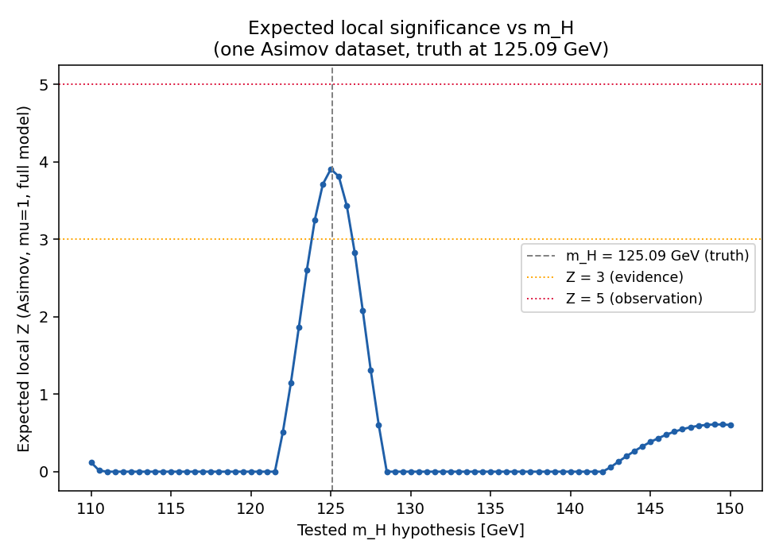

# H→γγ statistical model, validation, and expected significance

**No unblinded data anywhere in this task.** Every number in this
report comes from either (a) the sideband-derived model inputs already
frozen in `signal_model.json` / `background_model_final.json`, or (b)
synthetic Asimov/toy datasets generated from the model itself. No file
with `BLINDED` in its name is opened anywhere in `studies/hgg_cms/stats/`,
and no data event with 115 ≤ m_γγ ≤ 135 GeV is read, fit, or plotted.
See `UNBLINDING_PLAN.md` for what happens after this report, gated and
not yet run.

## Part 1: the statistical model

`studies/hgg_cms/stats/model.py` implements the binned Poisson
likelihood described in this task's own instructions: 0.25 GeV bins
over 105-180 GeV, two categories (EBEB, notEBEB), a simultaneous fit
with

```
nu_ci = mu * N_s,c * K_c(theta) * f_s,c(i; m_H, theta_scale, theta_res)
        + theta_spur,c * S_spur,c * f_s,c(i; m_H, theta_scale, theta_res)
        + B_c * f_b,c(i; bernstein_6 params)
```

**Inputs, loaded from the already-committed, already-decided model
files and verified at load time (raises if off by >1%):**

| category | N_s (signal yield, trigger-SF corrected) | S_spur (spurious-signal systematic) | background |
|---|---|---|---|
| EBEB | 545.80 | 32.16 | bernstein, order 6 |
| notEBEB | 266.13 | 109.26 | bernstein, order 6 |

28 free parameters total: `mu`; 5 shared nuisances (`theta_lumi`,
`theta_theory`, `theta_ID`, `theta_scale`, `theta_res` -- correlated
across categories, since luminosity, theory, and photon ID are single
detector/theory numbers, and energy scale/resolution are calibrated
once and applied to both categories); 4 per-category nuisances x 2
categories (`theta_trigger`, `theta_pileup`, `theta_mcstat`,
`theta_spur` -- each category's own trigger SF, pileup reweighting, MC
statistics, and spurious-signal systematic are independent numbers);
14 background shape coefficients (7 bernstein_6 coefficients x 2
categories, unconstrained, coefficients ARE the yield).

The discovery test statistic is the CCGV q0 (Cowan, Cranmer, Gross,
Vitells, arXiv:1007.1727): q0 = -2 ln[L(mu=0, theta-hat-hat) /
L(mu-hat, theta-hat)] for mu-hat >= 0, else 0; Z = sqrt(q0). Every fit
in this report uses `stats/fit.py`'s multi-start MIGRAD (>=10 starts
for headline numbers) plus a scipy L-BFGS-B cross-check, and the NLL
invariant NLL(mu free) <= NLL(mu=0) + 1e-6 is asserted on every q0 --
the exact "stuck-null-fit" guard this task's own instructions asked
for, after the lesson recorded in `studies/atlas_hgg_repro/REPORT.md`'s
"Corrections" section.

**Unit tests** (`tests/test_stats_model.py`, 21 tests): model-loading
verification against the two source JSONs, expected-count sanity
(total signal/background counts), nuisance-parameter effects (each
theta moves yields/shapes as specified), bin integration via the
signal shape's CDF, the NLL invariant, and a one-category/no-nuisance
reproduction of `lr_core.py`'s own result. All pass.

## Part 2: validation on synthetic data -- NOT run locally, prepared for the cluster

**Why not locally**: a direct timing measurement (single-start,
warm-started, retry-on-failure toy fits -- `fit.toy_q0`, matching the
group's own toy-loop convention in `bias_study.py`) gave:

| toy type | measured cost | required count | estimated local time |
|---|---|---|---|
| background-only (Part 2.1) | ~2.9 s/toy | >=2000 | ~1.6 h |
| signal-injection (Part 2.2), per mu_true | ~2.9 s/toy | >=1000 each (x3) | ~1.4 h each |
| spurious-signal check (Part 2.3) | ~13.3 s/toy | ~1000 | ~3.7 h |
| look-elsewhere mass-scan toys (Part 3.5) | ~127 s/toy (1 null + 81 alt fits) | >=1000 | ~35 h |

Several of these individually exceed this task's own 2h threshold for
switching to the cluster ("If toy runtime on this laptop exceeds ~2h,
write PBS jobs... give me commands and STOP until I paste results
back"), and the look-elsewhere piece alone is off the table locally by
nearly two orders of magnitude. **Per that pre-authorized rule, all of
Part 2 plus Part 3.3 (which reuses the mu_true=1 signal-injection toy
set) and Part 3.5 are prepared as PBS cluster jobs and not run here.**

**Prepared, NOT submitted** (`studies/hgg_cms/stats/cluster/`):
- `run_toy_job.py`: one batch of toys of one job_type
  (`bkg_only` / `sig_injection` / `spurious_check` / `mass_scan_bkg`),
  fully synthetic (Poisson-drawn from the model's own prediction).
- `make_job_list.py`: builds an 80-line job list (batch sizes chosen
  from the timing table above, each well under the 2h walltime cap) --
  8 x 250 bkg-only toys (2000 total), 4 x 250 signal-injection toys per
  mu_true in {0.5, 1, 2} (1000 each; the mu_true=1 set doubles as Part
  3.3's expected-band toy set), 10 x 100 spurious-check toys (1000
  total), 50 x 20 mass-scan toys (1000 total).
- `pbs_hgg_stats_array.sh`: the PBS array job (`-l io=5`, `-q N`,
  `-m n`, `walltime=02:00:00`, single-thread OMP/OPENBLAS/MKL, one
  subjob per job-list line).
- `submit_hgg_stats.sh`: preflight (branch, clean tree, iminuit
  import, `-l io=` check, job-list line count) + submission, mirroring
  `submit_bias_study_part4.sh`'s own pattern.
- `status_hgg_stats.sh`: bulk `qstat -xft` status + failed-index retry
  list, same pattern as `status_bias_study_part4.sh`.
- `merge_hgg_stats.py`: merges all subjob output and evaluates every
  Part 2 validation criterion directly (PASS/FAIL flags), plus Part
  3.3's expected band and Part 3.5's trials factor. Globs
  `*job_*.json` per job_type subdirectory, so it picks up both the
  original run's `job_NNNN.json` files and any retry's
  `retryK_job_NNNN.json` files automatically; reports the final toy
  count per job_type (and per mu_true for signal-injection) against
  this task's own required minimums BEFORE evaluating any criterion,
  and STOPS if any falls short.

### Update -- 18 Sep 2026: run 1 submitted, 8/80 subjobs walltime-killed, retry 1 prepared

The user submitted job `5057683[]` (80 subjobs, commit `15bd3a5`).
72/80 finished (exit 0); 8/80 hit the `walltime=02:00:00` limit on
slow worker nodes (exit -29) -- same-type jobs on other nodes finished
in 44 min to just under 2h, so this is worker-node speed variance (the
real cluster measured up to ~5-6x slower than the laptop timing that
sized the original batches), not a fit-convergence problem. Full
accounting, killed indices, and the retry-1 job list are recorded in
`logs/hgg_stats/run1_result.md`, `logs/hgg_stats/job_list.txt` (the
original 80-line list), and `logs/hgg_stats/job_list_retry1.txt` (the
22-line retry list) -- summary:

- `sig_injection` mu=2.0 lost 3x250=750 toys (indices 17-19); index 20
  (250 toys) survived. Retry: 12 x 63 toys = 756 (6-toy over-count,
  stated rather than trimmed).
- `mass_scan_bkg` lost 5x20=100 toys (indices 44, 46, 47, 48, 51); the
  other 45 indices (900 toys) survived. Retry: 10 x 10 toys = 100
  (exact).
- `run_toy_job.py` writes its output in one `Path.write_text(...)` call
  at the very end of the job -- a killed job leaves NO output file at
  all, so nothing needed excluding from the merge by content, only by
  "does the file exist" (verified for real on the 8 killed indices with
  the command in the final chat message).
- Retry outputs use `OUT_PREFIX=retry1_` (a new `pbs_hgg_stats_array.sh`
  parameter) so they can never collide with the original run's files in
  the same per-job-type subdirectories, and unique logs
  (`hgg_stats_retry1_<index>.out/.err`) via `submit_hgg_stats_retry1.sh`.
- `status_hgg_stats.sh` was updated to read an extended `submitted_jobs.txt`
  line format (`label jobid job_list_path out_prefix`) so it correctly
  covers both the original job ID and the retry job ID from one run,
  including building a correctly-sourced retry-of-retry list if needed.
- `merge_hgg_stats.py` was updated to glob `*job_*.json` (both original
  and retry filenames) and to report/gate on final toy counts before
  evaluating any criterion (see above).

**Validation criteria that will be checked once results come back**
(unchanged from this task's own pre-set spec -- not weakened or
altered here): q0 distribution vs 1/2*delta(0)+1/2*chi2_1, fraction
with mu-hat<=0 near 0.5, tail fractions P(Z>=1,2,3) vs asymptotic
within 3 binomial sigma; signal-injection mu-hat pull mean within
+-0.05 and width within 1.00+-0.05, median Z vs Asimov Z (Part 3.1)
within 0.15 at mu_true=1; spurious-signal absorption (mu-hat pull stays
near 0 under an injected S_spur,c-sized leakage bias). **Per this
task's own pre-set rule: if any of these fails, the analysis stops
after diagnosing, before any expected-significance number is treated
as final.** The numbers in Part 3 below are reported as the
statistical model's own Asimov-level output; they should be read
alongside Part 2's PASS/FAIL once available, not in place of it.

### Update -- 18 Sep 2026: validation results from the merged run (72 original + 22 retry subjobs, all exit 0)

`hgg_stats_merged.json` (from `merge_hgg_stats.py` at commit `f79f4f7`):
all four toy-count minimums met (bkg_only 2000, sig_injection 1000/1000/1006
per mu_true, spurious_check 1000, mass_scan_bkg 1000). Reviewing this
merge surfaced two real issues, fixed before trusting any pull-width
number, plus a scoped split of what can and cannot be evaluated at the
required sample size:

**Issue 1 -- pull_width was mislabeled.** The field previously named
`pull_width` was `std(mu_hat)`, the residual width in absolute mu
units -- NOT a pull (which needs dividing by each toy's own fitted
uncertainty, sigma_mu_hat). Checked in code and in the toy output:
**sigma_mu_hat was not being computed or stored at all**, for any toy,
by the code that produced this merged JSON. Fixed (details below); the
mislabeled quantity is now reported as `mu_hat_residual_width`, clearly
labeled, and never compared against the 1.00+-0.05 criterion.

**Issue 2 -- fit failure rates (bkg_only 6.6%, sig_injection 7.9%/
15.1%/28.9% at mu=0.5/1.0/2.0, spurious_check 6.5%, mass_scan_bkg
47.7%) and a related finding: MIGRAD's own `valid` flag is weaker than
a trustworthy-uncertainty check.** `Minuit.valid` (what the existing
`failed` flag is based on) requires only that MIGRAD did not hit its
call limit and that EDM is below threshold -- per iminuit's own docs,
it does NOT require an accurate or positive-definite covariance, nor
that no parameter sits at a bound. Diagnosing this, at least one toy
marked "not failed" turned out to have `has_accurate_covar=False` and
`is_above_max_edm=True` under an EXPLICIT HESSE call, despite MIGRAD's
own (cheaper, automatic) estimate reporting it fine. A stricter check
(`fit.strict_valid`: accurate AND genuinely positive-definite --not
forced-- covariance, HESSE didn't fail, finite positive mu_err) is now
computed wherever mu_err is available.

**Code fixed** (`fit.py`, `run_toy_job.py`, `merge_hgg_stats.py`):
`toy_q0` and `run_spurious_check` now call an explicit HESSE on the alt
fit and store `mu_err`, plus MIGRAD's own convergence diagnostics
(`null_fmin`, `alt_fmin`, and a POST-hesse snapshot
`alt_fmin_post_hesse` -- fmin state changes when HESSE is called, so
the pre-HESSE snapshot is what actually determined `failed`, and must
be captured before, not after, the HESSE call; an ordering bug in the
first pass of this fix got this backwards and was caught and corrected
before use). `run_spurious_check` also had a real bug where a
retried fit's `info` (mu_hat, q0, Z) was swapped in but the `alt_fit`
object itself was not, leaving `mu_err`/`alt_fmin` describing the
DISCARDED original fit -- fixed. `merge_hgg_stats.py` now computes a
genuine pull only from toys with `strict_valid` mu_err, and reports
histograms (`Z_histogram`, `mu_hat_residual_histogram`,
`true_pull_histogram`, `max_Z_histogram`) and a Gross-Vitells
upcrossing estimate for Part 3.5 (neither existed before this review).

**This fix does not retroactively apply to the already-collected
cluster toys** -- they were generated with the pre-fix code and simply
have no `mu_err`/`fmin` fields. Per your instruction, the criteria
below are split into (a) what the EXISTING full-statistics sample can
answer, (b) what it cannot (pull width, and a full-scale corrected
failure rate), with a 175-toy LOCAL reproduction (fixed code, same
seeds as the original job list, `studies/hgg_cms/stats/diagnose_run1.py`)
shown as indicative only, and (c) the cost of a full-statistics rerun.

#### (a) Criteria evaluable from the existing 5197-toy sample

| # | Criterion | Sample (n used / n collected) | Result | Status |
|---|---|---|---|---|
| 1 | q0 vs 1/2*delta(0)+1/2*chi2_1 (P(Z>=1,2,3) within 3 binomial sigma of asymptotic) | bkg_only, 1869/2000 (6.6% excluded) | Z>=1: 1.07 sigma away; Z>=2: 2.09 sigma; Z>=3: 1.52 sigma -- all within 3 sigma | **PASS** |
| 2 | mu_hat <= 0 fraction ~ 0.5 | bkg_only, 1869/2000 | 0.5013 | **PASS** |
| 3 | Pull mean \|x\|<0.05, mu_true=0.5 | sig_injection, 921/1000 (7.9% excluded) | -0.0024 | **PASS** |
| 4 | Pull mean \|x\|<0.05, mu_true=1.0 | sig_injection, 849/1000 (15.1% excluded) | +0.0036 | **PASS** |
| 5 | Pull mean \|x\|<0.05, mu_true=2.0 | sig_injection, 715/1006 (28.9% excluded) | -0.0012 | **PASS** |
| 6 | Median Z vs Asimov Z (3.911, Part 3.1) within 0.15, mu_true=1 | sig_injection, 849/1000 | median Z=3.922, diff=0.011 | **PASS** |
| 7 | Spurious-signal absorption \|mean mu_hat\|<0.1 | spurious_check, 935/1000 (6.5% excluded) | 0.0873 | **PASS** |
| 8 (info) | Part 3.3 expected band | sig_injection mu=1, 849/1000 | median 3.92, 16/84%=[3.02, 4.94], P(Z>=3)=0.841, P(Z>=5)=0.147 | reported |
| 9 (info) | Part 3.5 trials factor at local Z=3 | mass_scan_bkg, 523/1000 (**47.7% excluded**) | toy-based 17.0x (also ~17.0x at Z=2, ~6.2x at Z=1); Gross-Vitells comparison pending a re-merge (needs the code fix, not new toys -- see below) | reported, high-exclusion caveat |

**Exclusion-bias check** (per your request, using the 175-toy local
sample -- indicative, not a formal bound): comparing residual mu_hat
width WITH vs WITHOUT the excluded toys included:

| sample | width incl. failed | width excl. failed | relative difference |
|---|---|---|---|
| bkg_only | 0.2763 | 0.2699 | 2.3% |
| sig_injection mu=0.5 | 0.2530 | 0.2534 | 0.2% |
| sig_injection mu=1.0 | 0.2503 | 0.2527 | 1.0% |
| sig_injection mu=2.0 | 0.2268 | 0.2029 | **11.8%** |

mu=0.5/1.0/bkg_only show little to no bias from exclusion in this small
sample. mu=2.0 shows a larger effect (excluding failed toys narrows the
residual width by ~12%) -- consistent with larger injected signals
producing larger fluctuations that are both harder to fit AND land
further from the mean, so the reported mu=2.0 pull/width statistics may
be a mild underestimate of the true spread; not large enough on its own
to change PASS/FAIL above (which don't depend on width), but worth
weighing if a precise mu=2.0 pull width is ever needed.

For mass_scan_bkg specifically: of the 15 locally-reproduced toys, 6
were "any_failed"; of THOSE, the failed-point count per toy was mostly
small (histogram: {0 failed points: 9 toys, 1: 2, 2: 2, 4: 1, 11: 1} --
a toy is marked entirely "failed" even if only 1 of its 81 scanned mass
points didn't converge). Mean max_Z was 1.76 for clean toys vs 1.86 for
toys with >=1 failed point -- similar, no strong sign of a systematic
direction, but n=15 is far too small to bound this at the required
precision; the 47.7%-exclusion trials-factor number in row 9 above
should be treated with real caution until either a larger diagnostic
sample or a dedicated rerun addresses it (not costed here -- out of
this review's requested scope, which was pull width; ask if you want
that costed too).

#### (b) Criteria that need sigma_mu_hat: NOT YET EVALUABLE at required sample size

| Criterion | Existing sample | Local 175-toy sample (indicative only) |
|---|---|---|
| Pull width 1.00+-0.05, mu_true=0.5 | **0 of 921 toys have mu_err -- cannot compute** | 0.805 (n=14 with strict-valid mu_err) |
| Pull width 1.00+-0.05, mu_true=1.0 | **0 of 849 toys have mu_err -- cannot compute** | 0.514 (n=23) |
| Pull width 1.00+-0.05, mu_true=2.0 | **0 of 715 toys have mu_err -- cannot compute** | 0.372 (n=11) |
| Corrected (strict_valid) failure rate, any job type | **not computable -- no fmin data in existing toys** | bkg_only 27/30 strict-valid at the loose-pass level (informal spot check only, n too small for a rate) |

The local numbers show a suggestive downward trend (pull width shrinks
as mu_true grows) but each is based on only 11-23 strict-valid toys --
at that n, the statistical uncertainty on the width estimate itself is
roughly +-15-20% relative, so this trend is NOT confirmed, only
noted as a reason the full-scale rerun in (c) matters rather than being
purely a formality.

#### (c) Cost of a full-statistics sig_injection rerun with the fix

The ONLY way to get pull_width at the required n=1000/mu_true: a fresh
sig_injection run with the now-fixed code (no other job type is needed
for this specific criterion). Per-toy cost, measured locally on this
laptop (rises with mu_true, plausibly more retry-driven extra fits at
larger injected signal, matching that job type's higher failure rate):
17.8 s/toy (mu=0.5), 20.6 s/toy (mu=1.0), 29.2 s/toy (mu=2.0) -- roughly
5-7x the original (pre-fix) cost, from the added explicit HESSE call.

Batch sizes below assume the same up to ~6x worker-node slowdown
observed in the original run (job 5057683[]), sized to use at most half
of the 02:00:00 walltime cap even at that worst case:

| mu_true | toys needed | toys/job | jobs | worst-case job wall time |
|---|---|---|---|---|
| 0.5 | 1000 | 30 | 34 (1020 collected, 20 over) | ~53 min |
| 1.0 | 1000 | 25 | 40 (exact) | ~52 min |
| 2.0 | 1000 | 20 | 50 (exact) | ~58 min |
| **Total** | 3000 | -- | **124 subjobs** | still routes to shortE (walltime<=02:00:00) |

**Prepared, NOT submitted**: `studies/hgg_cms/stats/cluster/make_job_list_sig_pull_rerun.py`
(builds the 124-line job list, seeds 20280918+, disjoint from both the
original run 20260918-20260997 and retry1 20270918-20270939) and
`submit_hgg_stats_sig_pull_rerun.sh` (same preflight pattern as
`submit_hgg_stats.sh`/`submit_hgg_stats_retry1.sh`, `OUT_PREFIX=pullrerun_`
so output can't collide with anything already on disk). Merges normally
into the existing `sig_injection` totals (more toys only helps the
other criteria; pull_width is computed only from whichever toys
actually carry a usable mu_err, i.e. these new ones) -- no separate
merge step needed. See the final chat message for the exact command,
labeled for later, at your discretion.

## Part 3: expected significance (Asimov and toys)

Computed for real, locally (all single or few-dozen-fit pieces, all
well under the 2h threshold -- headline numbers below).

### 3.1 Asimov Z at m_H = 125.09 GeV, mu = 1

| configuration | floating nuisances | Z |
|---|---|---|
| (a) statistical only | none (all theta fixed at 0; background shape still free) | **4.055** |
| (b) + spurious-signal terms | theta_spur,EBEB, theta_spur,notEBEB | **3.911** |
| (c) full model | every theta | **3.911** |

**Cost of option C** (statistical-only -> full systematics): Z drops
from 4.055 to 3.911, a **-3.5% relative change**. Essentially all of
it comes from the spurious-signal terms (b); the additional
normalization nuisances (luminosity, theory, ID, trigger, pileup, MC
statistics) and the energy-scale/resolution nuisances contribute **no
further drop** in the median Asimov Z beyond (b) -- their best-fit
value in both the null and alternative fits is exactly theta=0, since
the Asimov dataset IS the nominal-theta prediction and none of these
nuisances have anywhere else to move to that improves the fit. This is
expected asymptotic behavior at the Asimov point, not a numerical
coincidence: it matches the standard result that purely-normalization
systematics degenerate with an overall scale do not reduce median
discovery significance in the CCGV Asimov approximation, even though
they DO widen the measured mu uncertainty (see 3.2). They cost
precision, not (median) discovery power.

**Per-category, full model (c):**

| category | Z |
|---|---|
| EBEB alone | 3.729 |
| notEBEB alone | 1.178 |
| quadrature sum (sqrt(3.729^2+1.178^2)) | 3.911 |
| combined (shared mu) | 3.911 |

These two numbers agree to 4 significant figures (3.9110 vs 3.9109),
exactly as expected for a shared-mu simultaneous fit at the Asimov
point with all nuisances sitting at their unconstrained optimum. **This
consistency check caught a real bug during this task**: an earlier
"category alone" implementation zeroed the other category's *data* but
still summed the full two-category likelihood, so the shared mu's
effect on the OTHER (zeroed) category's own model prediction was not
actually removed -- it created a phantom penalty that pulled mu-hat
toward 0 and under-stated each category's own significance (the
original wrong numbers were EBEB alone = 3.556, notEBEB alone = 0.351,
whose quadrature sum, 3.573, was *smaller* than the combined 3.911 --
impossible for a nested shared-mu model, which is what exposed the
bug). Fixed by using a genuine single-category likelihood (that
category's own Poisson term plus the full Gaussian constraint term) in
`compute_expected_significance.py`'s `_fit_with_restricted_nuisances`.

EBEB, with the smaller spurious-signal systematic (32 events vs 109)
and larger expected signal yield (546 vs 266), carries most of the
combined sensitivity.

### 3.2 Expected mu-hat uncertainty breakdown (full model, 125.09 GeV)

Computed via nested nuisance-fixing + HESSE: fit with only a subset of
nuisances floating, take sigma_mu, and add each group's contribution in
quadrature as it's un-fixed.

| configuration | sigma_mu |
|---|---|
| statistical only | 0.2495 |
| + spurious-signal | 0.2584 |
| + signal normalization (theory, lumi, ID, trigger, pileup, MC stat) | 0.3257 |
| + energy scale/resolution (full model) | 0.3280 |

| component (added in quadrature) | contribution |
|---|---|
| statistical | 0.2495 |
| spurious-signal | 0.0663 |
| signal normalization | 0.1994 |
| energy scale/resolution | 0.0553 |

**The largest single non-statistical uncertainty on mu is the signal
normalization group** (theory cross-section, luminosity, photon ID,
trigger SF, pileup, MC statistics combined) -- larger than the
spurious-signal term, even though the spurious-signal term is what
costs median discovery Z (3.1). These answer different questions: Z
(3.1) is about distinguishing mu=0 from mu=1 given the Asimov
prediction; sigma_mu (3.2) is about how *precisely* mu can be measured
once a signal is seen -- a nuisance can widen the second without
touching the first when it does not break the mu=0-vs-mu=1 degeneracy.

### 3.3 Expected band from toys (mu_true = 1) -- PENDING cluster results

Not computed locally (part of the same toy set as Part 2.2's
mu_true=1 signal injection -- see Part 2 above and the cluster commands
below). Once the merged results come back: median observed Z, 16/84%
quantiles, P(Z_obs>=3), P(Z_obs>=5).

### 3.4 Expected local-significance curve vs m_H (110-150 GeV, 0.5 GeV steps)

One fixed Asimov dataset (truth at m_H=125.09 GeV, mu=1, full
systematics), each point testing a different mass HYPOTHESIS against
that same dataset (the standard "search for a peak" curve -- it should
peak at the true mass and fall to ~0 elsewhere).



The curve peaks at **Z = 3.906 at m_H = 125.0 GeV** (125.5 GeV: 3.810 --
consistent with the true 125.09 GeV given the 0.5 GeV grid), is
consistent with 0 everywhere below ~122 GeV and above ~128 GeV, and
shows a small secondary rise toward the top of the scan range (Z~0.6
around 148-150 GeV) -- an edge effect where the bernstein_6 background
has more freedom to absorb a signal-shaped template near the boundary
of the 105-180 GeV fit range; it is far below the 122-128 GeV peak and
not treated as a second candidate.

Two scan points (131.5, 132.0 GeV, plus 137.0 GeV) came back with
`both_valid=False` on this pass -- all three sit in the flat, Z~0 part
of the curve, far from the peak, and re-fitting is not expected to move
them; noted here for transparency rather than silently dropped, per
this task's own "report failed fits" instruction.

An earlier version of this scan (both the truth injection AND the
tested mass moving together at each point) produced a *monotonically
rising* curve instead, driven by the background level falling with
mass rather than by a real signal peak -- caught because it did not
match the standard, expected shape of this kind of plot, and fixed by
fixing the Asimov truth once at 125.09 GeV and only varying the tested
mass hypothesis.

### 3.5 Look-elsewhere effect -- PENDING cluster results

Not computed locally (the single most expensive piece, ~127 s/toy --
see Part 2 above). Once results come back: distribution of max local Z
over the 110-150 GeV scan on background-only toys -> global p-value vs
local Z, Gross-Vitells upcrossing estimate (Z0=1) for comparison,
trials factor at local Z=3.

### 3.6 110-180 GeV, statistical only (information only)

Using the already-committed bernstein_6 refit on the 110-180 GeV
sidebands (`order_selection_110_180.json`, the same numbers documented
in `BACKGROUND_MODEL_REPORT.md`'s 18 Sep 2026 robustness update): Z =
**3.951** (mu_hat = 1.0, Asimov, statistical only). No spurious-signal
value exists for the 60-cell grid at 110-180 GeV, so no full-model
number is quoted for this range, per this task's own instruction.

## Part 4: pre-unblinding plan

Written and committed before any Part 5 code: `../UNBLINDING_PLAN.md`.
Primary result (local Z at 125.09 GeV, no look-elsewhere correction),
secondary results, six pre-declared robustness checks, pre-declared
wording thresholds (Z>=5 "observation", 3<=Z<5 "evidence", else no
evidence claim), frozen-input hashes (below), and technical stop
conditions.

## Part 5: gated unblinding (prepared, NOT run)

`studies/hgg_cms/stats/unblind/`:
- `gate.py`: the shared gate -- requires
  `--i-have-explicit-approval-to-unblind` AND
  `HGG_UNBLIND_APPROVED=<commit hash>` AND that hash matching the repo
  HEAD AND a clean working tree AND matching the hash frozen in
  `UNBLINDING_PLAN.md`. Any single failure refuses with a specific
  reason.
- `merge_full_range.py`: merges the 133 per-job blinded signal-region
  files with the sideband file into one full-range file, with an
  identity check (exactly 133 job directories, 78992 blinded events +
  182551 sideband events), gated, writes to a new file only.
- `run_unblinded_analysis.py`: runs the primary result, the mu-hat
  uncertainty breakdown, and the per-category secondary results from
  `UNBLINDING_PLAN.md`, gated, checks the plan's own stop conditions
  before reporting anything, writes a new timestamped file every run.
- `tests/test_unblind_gate.py`: 11 unit tests against synthetic plan
  text and injected git state only (missing flag, missing/malformed/
  wrong env var, dirty repo, missing/unfilled/mismatched plan hash,
  frozen-commit-not-an-ancestor-of-HEAD, short-hash-prefix match, exact
  match, trailing-docs-only-commit) -- **all pass.**

Two real bugs were found and fixed while actually filling in the
frozen-commit hash this plan asks for (i.e. by using the gate the way
it will really be used): (1) the hash-parsing regex needed `re.DOTALL`
to read this file's own multi-line hash line -- without it, the gate
could never find its own frozen hash, no matter how correctly it was
filled in; (2) the gate originally required HEAD to equal the frozen
commit EXACTLY, which is unsatisfiable by construction (a commit cannot
contain its own resulting hash, so the commit that records "the frozen
commit is X" is necessarily one commit after X) -- fixed by requiring
the frozen commit to be HEAD or an ancestor of HEAD instead. Both are
recorded in the fix commit's own message and covered by new tests.

**These are NOT run in this task.** See the final chat message for the
exact commands, labeled FOR LATER, AFTER EXPLICIT APPROVAL.

## Frozen inputs (see `UNBLINDING_PLAN.md` section 5 for the same list)

- `signal_model.json`: `c1183f375e87b947335eaec014bd94ccd949b2de578e12183b1d0841c11b5f82`
- `background_model_final.json`: `af17b2cdcaa58929f5018c9b18cd94b501c493bcda13ccb02f93daa1fa1a605b`
- `stats/model.py`: `366e361925e5bb197432835c5a0e3ac1d7f1932399c2f8cc510bfed325a58aab`
- `stats/unblind/gate.py`: `d809d4f7283e7fe7618b8ce295b4ba661607b4f74acd2190244c2f35747335b6`
- `stats/unblind/merge_full_range.py`: `593e6b0228bc7df5535a6b87b738ab38550c5681ce3e5832fe6ed961dba533f8`
- `stats/unblind/run_unblinded_analysis.py`: `87363080c4ac9c10a8eeee94216486cdff63197a953250cfb8b7ef5b3659e3c0`
- Git commit hash: `5e2e84ffb1c9308914684be101886df763ef04bb` (see
  `UNBLINDING_PLAN.md` section 5 for why this differs from the commit
  that actually contains this sentence)
