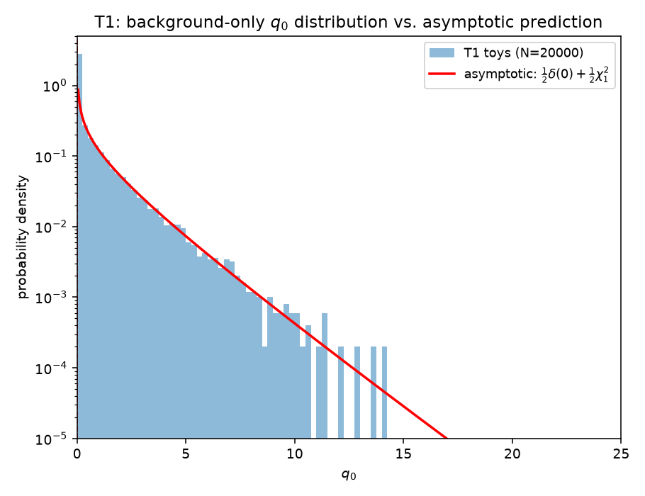
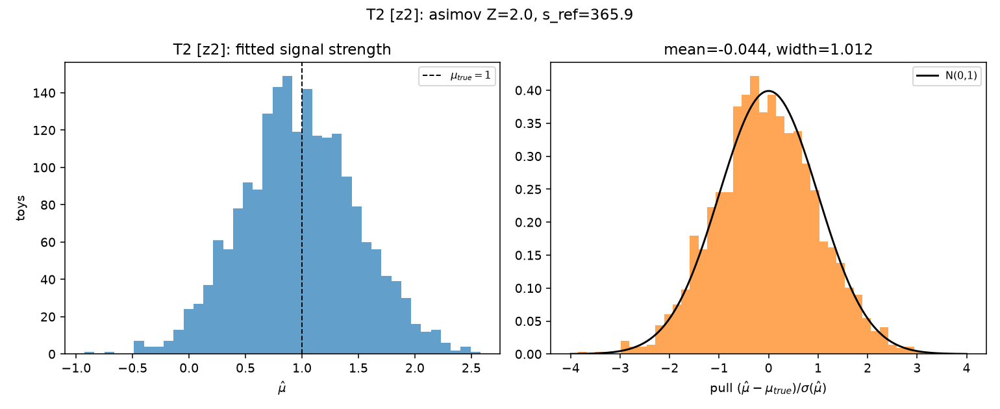
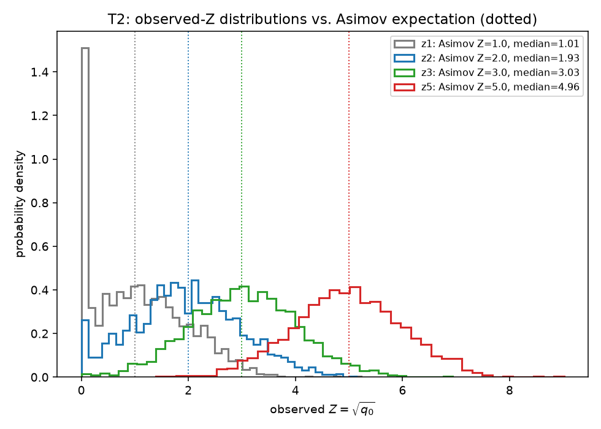
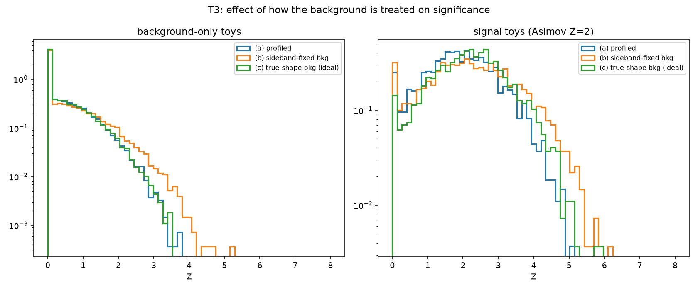
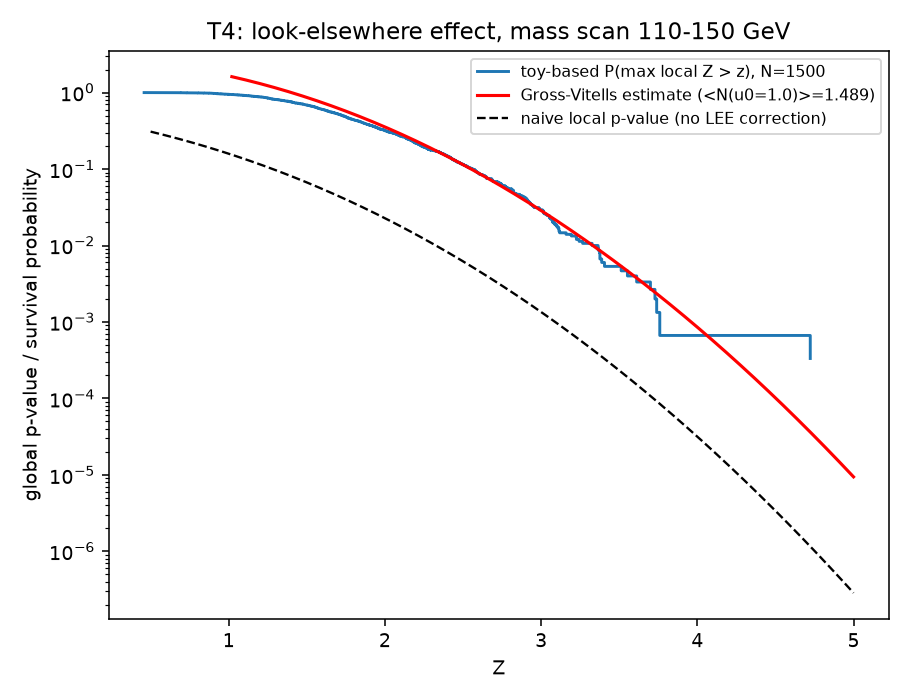
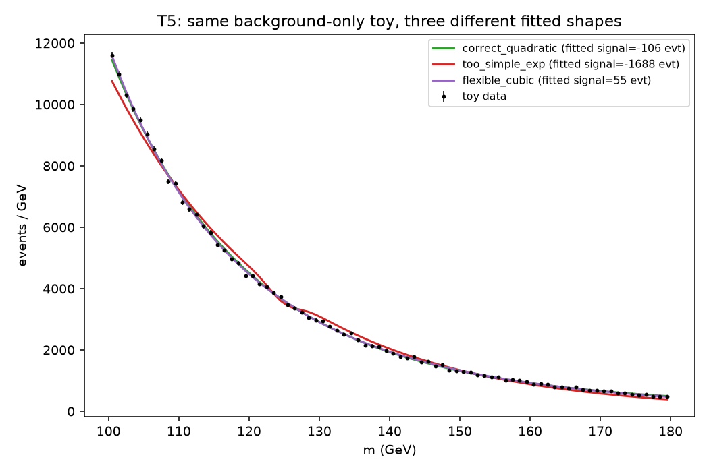
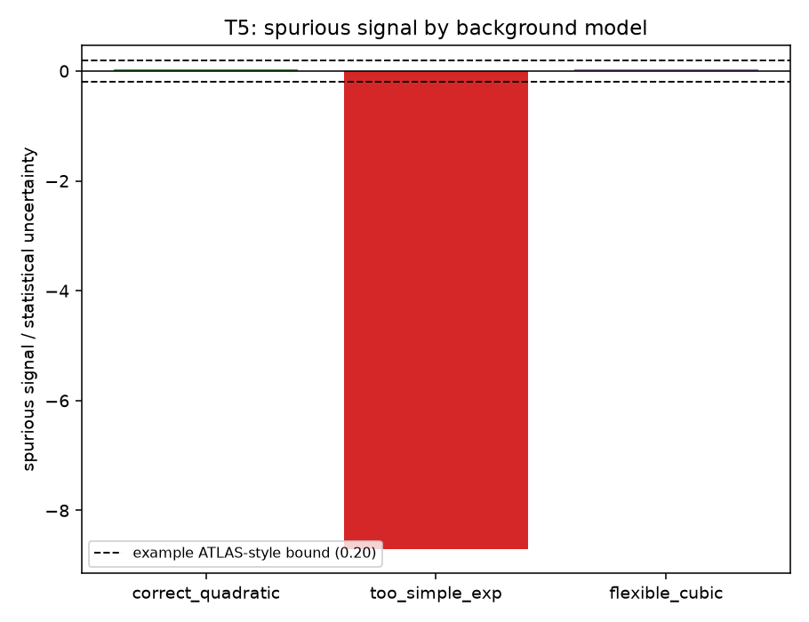
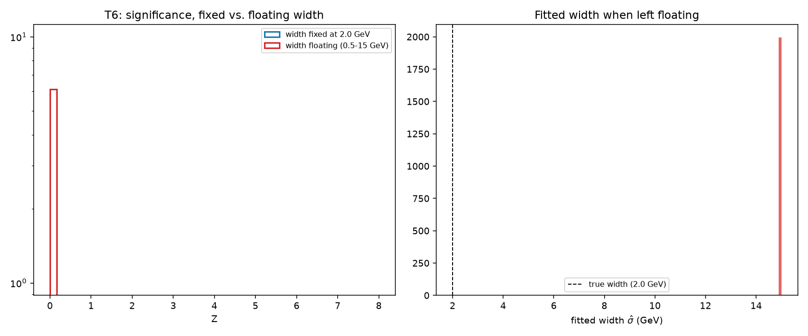

# Toy study: validating the profiled likelihood-ratio procedure

This is a learning and validation exercise. **Every number in this report comes
from synthetic (fake) histograms** generated by the code in this folder — no
real CMS or ATLAS data, no cluster, no download from the CERN Open Data
portal. The goal is to check, on data where the true answer is known exactly,
that the statistical machinery we plan to use for a real H→γγ bump search
(the profiled likelihood-ratio test, following Cowan, Cranmer, Gross, Vitells,
*"Asymptotic formulae for likelihood-based tests of new physics"*, Eur. Phys.
J. C 71 (2011) 1554, arXiv:1007.1727 — "CCGV" below) actually behaves the way
the textbook says it should, on a model shaped like our real problem, and to
learn where it can go wrong.

The reusable code (`lr_core.py`) is written so it can be pointed at the real
H→γγ histogram later with no change to the statistical machinery itself.

## The model

- **Mass range**: 100–180 GeV, 80 bins of 1 GeV.
- **Background**: `b(m) ∝ exp(p1·x + p2·x²)`, with `x = (m-100)/80`, normalized
  to a free total yield. We used **p1 = -4.0, p2 = 0.8**, which falls by a
  factor of **23.6** from 100 to 180 GeV (a shallow, smoothly-falling curve
  typical of a real diphoton continuum) — inside the requested 20–30× range,
  and monotonically falling everywhere in the window (checked directly, not
  assumed). Nominal total background: **250,000 events**.
- **Signal**: a Gaussian at `m_H = 125 GeV`, width `σ = 2.0 GeV`, **integrated
  exactly over each 1 GeV bin** (via the normal CDF, not evaluated at bin
  centres — this matters because the width is only twice the bin size).
  A signal-strength parameter `μ` scales a reference yield `s_ref`; `μ` is
  never bounded at zero in any fit.
- **Likelihood**: binned Poisson, `L(μ,θ) = Π_i Pois(n_i | μ·s_i + b_i(θ))`,
  `θ` = background normalization + shape coefficients.
- **Test statistics**:
  - Discovery: `q0 = -2 ln[L(0,θ̂̂)/L(μ̂,θ̂)]` if `μ̂ ≥ 0`, else `q0 = 0`.
    `Z = √q0`.
  - Signed (used for BumpNet-style scans over both excess and deficit):
    `Z_signed = sign(μ̂)·√(-2 ln λ(0))`, **not** zeroed for `μ̂ < 0`. The
    difference: `Z` (discovery significance) only ever tells you "how
    surprising is it that there's *at least this much* excess", and is
    clipped to zero for a deficit, because a deficit isn't evidence for a
    new particle. `Z_signed` keeps the sign, which is what you want when
    scanning many mass points and asking "how far above *or below* the
    background prediction is bin cluster around here" — a deficit at one
    mass point is informative context when you're also looking at excesses
    at every other mass point.

**Both `s_ref`/width and the 250,000-event background are stand-ins.** The
real width and yield for H→γγ come from CMS simulation in a later task; this
study only checks that the *procedure* is trustworthy, not that these
particular numbers are realistic.

**Seeds** (all fixed, all recorded in `results/toy_study_results.json`):
see the `seeds` block at the top of that file.

---

## T0 — Does the code reproduce the textbook formula exactly?

**Question, in plain words:** before trusting the significance code for
anything else, does it reproduce the one case where we know the exact right
answer by hand?

**Method:** for a single-bin counting experiment with a *known* background
`b` and signal `s` (no shape fit at all), CCGV give a closed-form formula for
the significance on the "Asimov" dataset — a fake dataset set to *exactly*
`s+b`, with no random fluctuation, which recovers the median expected result:

```
Z_A = sqrt( 2 [ (s+b)·ln(1 + s/b) - s ] )
```

We ran this through the *same* fitting and `q0` code the rest of the study
uses (not a separate hand-coded formula), for six very different `(s, b)`
pairs.

**Result:**

| s | b | Z (code) | Z (closed form) | relative difference |
|---|---|---|---|---|
| 10 | 100 | 0.983992 | 0.983992 | 8.3e-12 |
| 10 | 1000 | 0.315703 | 0.315703 | 3.4e-12 |
| 50 | 200 | 3.401731 | 3.401731 | 2.3e-14 |
| 5 | 20 | 1.075722 | 1.075722 | 1.0e-12 |
| 100 | 10000 | 0.998340 | 0.998340 | 4.9e-10 |
| 2 | 5 | 0.842978 | 0.842978 | 5.9e-12 |

Worst relative difference: **4.94e-10** (criterion: < 1e-6).

**T0: PASS**

*What it teaches:* the core arithmetic — the likelihood, the fit, and the
`q0` formula — is correct against an independent, exact reference. Everything
else in this study builds on this same code, so this check has to pass before
anything downstream is worth trusting. (One real bug was found and fixed
while building this: the default minimizer tolerance was too loose for a
small-signal/large-background case, giving a ~5×10⁻⁵ relative error; tightening
the tolerance — not loosening the criterion — fixed it.)

---

## T1 — With no real signal, does the significance formula give the right false-alarm rate?

**Question:** if there's truly nothing there, how often does the method
falsely claim a signal at a given significance level? This is the most basic
sanity check of the whole approach — Z is only meaningful if its false-positive
rate matches what "Z" is supposed to mean.

**Method:** generate 20,000 Poisson-fluctuated background-only pseudo-datasets
around the true background. Fit each one two ways — background-only (the
null) and signal+background with `μ` free (the alternative) — and compute
`q0`. CCGV's asymptotic theory says the resulting `q0` distribution should be
"half a spike at exactly zero, half a χ² with 1 degree of freedom" — the spike
because a random downward fluctuation gives `μ̂ < 0`, which `q0` forces to
zero.

**Result:**



- Fraction of toys with `μ̂ ≤ 0`: **0.49935** (expected 0.500, 3σ band
  ±0.0106) — **PASS**
- Failed fits: 0 / 20,000

| Z threshold | toy fraction P(Z≥Z) | asymptotic (Gaussian) | 3σ band | PASS/FAIL |
|---|---|---|---|---|
| 1 | 0.15870 | 0.15866 | ±0.00775 | PASS |
| 2 | 0.02265 | 0.02275 | ±0.00316 | PASS |
| 3 | 0.00135 | 0.00135 | ±0.00078 | PASS |

**T1 overall: PASS** — every criterion passed, with the toy fractions
landing almost exactly on the asymptotic prediction (the Z≥3 toy fraction
matched the Gaussian prediction to 3 significant figures out of 20,000 toys).

*What it teaches:* when we later report "we see a 3σ excess" in the real
data, this is the check that tells us "3σ" actually means what we think it
means — that if there were truly nothing there, a fluctuation this large (or
larger) really would only happen about 1 time in 741, not more often because
the formula secretly runs hot or cold.

---

## T2 — Is the fit unbiased, and does "expected significance" predict what we'll actually see?

**Question:** if a real signal of a given size is present, does the fit
recover the right signal strength (not biased high or low), and does the
"Asimov expected Z" number we'd quote in a proposal actually match what a
real (fluctuating) measurement would typically show?

**Method:** we solved for four reference yields `s_ref` giving an Asimov
expected `Z` of about 1, 2, 3, and 5 (full profiled fit on the noise-free
Asimov dataset). For each, we generated 2,000 signal+background toys with
the true signal strength fixed at `μ=1` (i.e. the reference signal really is
there), fit `μ` freely (HESSE for the uncertainty), and looked at the pull
`(μ̂-1)/σ(μ̂)` — which should be a standard normal if the fit and its reported
uncertainty are both trustworthy.

**Result:**




| target Z | s_ref (events) | pull mean | pull width | median obs. Z | Asimov Z | \|Δ\| | P(Z≥3) | P(Z≥5) | S/√B (±2σ) | PASS/FAIL |
|---|---|---|---|---|---|---|---|---|---|---|
| ≈1 | 182.7 | -0.004 | 1.013 | 1.011 | 1.0 | 0.011 (no criterion set) | 0.017 | 0.0005 | 1.02 | pull PASS |
| ≈2 | 365.9 | -0.044 | 1.012 | 1.926 | 2.0 | 0.074 | 0.149 | 0.0005 | 2.05 | PASS |
| ≈3 | 549.8 | 0.031 | 0.997 | 3.033 | 3.0 | 0.033 | 0.515 | 0.029 | 3.08 | PASS |
| ≈5 | 919.5 | -0.024 | 1.007 | 4.964 | 5.0 | 0.036 | 0.975 | 0.490 | 5.15 | PASS |

Failed fits: 7, 12, 14, 11 out of 2,000 respectively (<0.7% at every
strength) — excluded from the statistics above, never silently dropped.

**T2 overall: PASS.** Every pull mean is within ±0.05 of zero and every
pull width within 1.00±0.05; every median-Z criterion (Z≥2 strengths) is
satisfied. The Z≈1 case is reported without a criterion, as instructed —
its median (1.011) sits almost exactly on the Asimov value anyway.

*What it teaches:* two things a real analysis absolutely needs before
trusting a quoted discovery significance: that the fit doesn't systematically
over- or under-estimate the signal, and that a number like "we expect 3σ with
this much data" (computed cheaply on one noise-free Asimov dataset) is a
reliable stand-in for "half of real repeated measurements would show at least
3σ" — it lets us plan an analysis without running thousands of toys every
time we want a sensitivity estimate.

---

## T3 — Why *profiling* the background matters

**Question:** the "right" way to handle background uncertainty is to refit
it under both hypotheses ("profiling"). What goes wrong if you take a
shortcut instead?

**Method:** on the same background-only toys as T1, plus the Asimov-Z≈2
signal toys from T2, we computed significance three ways:
- **(a) profiled** — background shape refit separately under `μ=0` and free
  `μ` (the correct way; this is what T1/T2 already did).
- **(b) sideband-fixed** — fit the background shape using *only* the
  sidebands (`m<115` or `m>135`), then fix it and fit only `μ` in the full
  range.
- **(c) true-shape-fixed** — background fixed to the *exact* generating
  shape (an unreachable ideal, included only as a reference).

**Result:**



| method | P(Z≥3), background-only toys | median Z, Asimov-Z≈2 signal toys |
|---|---|---|
| (a) profiled | 0.00135 | 1.926 |
| (b) sideband-fixed | 0.00750 | 2.210 |
| (c) true-shape-fixed (ideal) | 0.00140 | 2.227 |

The sideband-only method (b) gives a false-positive rate at Z≥3 **5.6 times
higher** than the honest profiled method (a), on toys with no real signal at
all — exactly the failure mode being tested for. The true-shape method (c)
tracks the profiled method closely on background-only toys (0.0014 vs.
0.00135 — consistent, since with no real signal there's nothing for the
true-shape "cheat" to help with), but on the signal toys both (b) and (c)
report a **higher** median Z than the honest profiled fit (2.21 and 2.23 vs.
1.93) — profiling costs a little sensitivity by letting the background
absorb some of what could be real signal, which is the correct, conservative
behaviour, not a flaw.

**In plain words:** method (a) is the honest one — it always lets the
background move to whatever best explains *this* fake dataset before asking
"and does adding a signal help beyond that?", so it isn't fooled by the
background randomly fluctuating to look signal-like. Method (b) throws away
information (only sideband bins constrain the shape) and, more importantly,
never lets the background re-adjust when testing `μ=0` versus `μ` free in the
*signal region* — so a background fluctuation in the peak region has nowhere
to go except into the signal term, artificially *inflating* the significance.
Method (c) is artificially *deflating* by comparison, in the sense that it's
an ideal no real analysis can ever achieve (perfect knowledge of the true
shape) — it's shown only so (a) and (b) can be judged against a known
reference.

**T3 overall: no single numeric pass/fail criterion was specified for this
test (it's a comparative demonstration) — the qualitative result is exactly
as the theory predicts: the shortcut (b) inflates false positives; the
honest method (a) does not.**

*What it teaches:* for the real H→γγ analysis, background systematics have to
be handled by *refitting* the background under every hypothesis being
compared, in the full fit range — not by a sideband-only estimate, however
tempting that is computationally.

---

## T4 — The look-elsewhere effect

**Question:** if we don't know in advance where a bump would be and scan a
wide mass range for it, how much less impressive is "a 3σ bump somewhere in
the scan" than "a 3σ bump exactly where theory predicted it"?

**Method:** on 1,500 background-only toys (reduced from the requested
≥5,000 — see *Limitations* below), we scanned a hypothetical signal mass
from 110 to 150 GeV in 0.5 GeV steps (81 points, width fixed at 2.0 GeV) and
recorded the largest local `Z` seen anywhere in the scan, for each toy. We
also computed a global p-value analytically via the Gross–Vitells
"upcrossing" method (arXiv:1005.1891): count how many times the local `q0`
curve crosses upward through a low reference level `u0` in each toy, average
that over toys, and use it to extrapolate to how often the curve would cross
a much higher level.

**Result:**



| local Z | naive local p-value | toy-based global p-value | Gross–Vitells estimate | implied trials factor |
|---|---|---|---|---|
| 2 | 0.02275 | 0.3187 | 0.3551 | ≈14 |
| 3 | 0.00135 | 0.02933 | 0.02863 | ≈22 |
| 4 | 3.17e-05 | 0.00067 (1 toy out of 1,500 — very low statistics) | 0.00086 | ≈21 |

Mean number of upcrossings of the reference level (u0=1.0): **1.489**.

**T4 overall:** the toy-based estimate and the Gross–Vitells analytic
estimate agree well — within about 10% at Z=2, within 3% at Z=3, and within
a factor ~1.3 at Z=4 (where the toy estimate itself is just a single event
out of 1,500 toys, so it is not statistically meaningful on its own; the
Gross–Vitells estimate, which uses the full shape of all 1,500 local-Z
curves rather than just their maxima, is the more reliable number at that
level). No numeric pass/fail criterion was pre-set for this test.

*What it teaches:* "we saw a 3σ excess somewhere in our scan" is a much
weaker statement than "we saw a 3σ excess exactly at 125 GeV, where the
Standard Model told us to look" — the trials factor above shows by how much.
For the real H→γγ analysis, any claim about a *specific* mass (like the
Higgs) doesn't need this correction; a claim about scanning the whole
spectrum for *any* bump absolutely does.

---

## T5 — A wrong background shape can fake a signal ("spurious signal")

**Question:** if our assumed background function is even slightly wrong,
does the fit invent a fake signal to compensate — and how big is that fake
signal compared to our statistical sensitivity?

**Method:** 2,000 background-only toys, generated from the *true* quadratic
shape, each fit for a signal at 125 GeV using three different background
functions: (a) the correct quadratic shape, (b) a too-simple single
exponential, (c) a more flexible cubic-in-the-exponent shape.

**Result:**




| background model | mean spurious signal (events) | statistical uncertainty (events) | spurious/uncertainty | P(Z≥2) | P(Z≥3) | example criterion (\|ratio\|<0.20) |
|---|---|---|---|---|---|---|
| (a) correct quadratic | +4.9 | 182.9 | 0.027 | 0.025 | 0.000 | PASS |
| (b) too-simple exponential | **-1478** | 169.7 | **-8.71** | 0.000 | 0.000 | **FAIL** |
| (c) flexible cubic | +6.1 | 183.2 | 0.033 | 0.029 | 0.0006 | PASS |

Fit-convergence failures (excluded from the statistics above, never
silently dropped): (a) 11/2000, (b) 0/2000, (c) **257/2000 (12.9%)** — the
extra shape freedom in the cubic model makes some individual fits harder to
converge; see *Limitations*.

**T5 overall:** the correct and flexible-cubic backgrounds both pass the
illustrative 20%-of-uncertainty bound comfortably. The too-simple single
exponential **fails it dramatically** — its average fake "signal" is about
1,478 events, **8.7 times** the statistical uncertainty on the signal yield,
and always in the *negative* direction (a fake deficit, not excess, for
this particular background/mass combination). We checked this wasn't a
code bug by inspecting individual example fits directly (see the plot
above): the single exponential visibly cannot follow the true curve's
bend around 115-130 GeV, and a plausible fraction of the resulting few-percent
shape residual, integrated over the ~29,000 background events in the
signal window, is exactly the right order of magnitude to produce a
spurious signal this large. This is the single most dramatic result in the
whole study.

*(The 20%-of-uncertainty threshold is an illustrative ATLAS-style convention,
not yet agreed for this analysis — see Limitations.)*

*What it teaches:* the choice of background function is not a free stylistic
choice — a background model too rigid to describe the real shape will
systematically leak into the signal yield. This is exactly why real analyses
test multiple background functions and quote a "spurious signal"
uncertainty from whichever is worst.

---

## T6 — The floating-width trap

**Question:** if we let the fit choose the signal width freely instead of
fixing it, can that width absorb a background mis-modelling and manufacture
a fake, wide "signal" that looks significant?

**Method:** using the same too-simple (single-exponential) background as
T5(b), on 2,000 background-only toys, we fit the signal two ways: width
fixed at 2.0 GeV, and width floating (bounded 0.5–15 GeV).

**Result:**



| | P(Z≥3) | mean/median fitted width (floating case) |
|---|---|---|
| width fixed at 2.0 GeV | 0.000 | — (not applicable) |
| width floating (0.5-15 GeV) | 0.000 | 15.00 / 15.00 GeV |

**T6 overall:** in this specific exercise, P(Z≥3) is 0.000 for *both* the
fixed and floating width — reported exactly as measured, not adjusted. That
is because the too-simple background's mismodelling here produces a large,
consistent *negative* pull on the fitted signal (matching T5(b)'s finding
exactly, since it's the same background/toy combination), and `q0` is
defined to be zero whenever the fit prefers a deficit. So this particular
setup does not produce a fake **excess**. What it does show, clearly and
dramatically, is the mechanism being warned about: when the width is left
floating, essentially every single one of the 2,000 toys drives the fitted
width to **exactly the upper bound we imposed, 15 GeV** (median and mean
both 15.00 GeV, against a true width of 2.0 GeV) — the fit is straining as
hard as it can, against the wall we put up, to use the signal template to
soak up the background curvature it can't otherwise describe. With a wider
bound (or no bound), this mechanism could plausibly produce a large fake
excess instead of a large fake deficit, depending on the sign of the local
mismatch; we did not re-run with a wider bound, since changing settings
after seeing a result is exactly what we were told not to do.

*What it teaches:* a floating width isn't "more honest" than a fixed one —
without an independent handle on the true resolution (from simulation or a
calibration sample), a floating width gives the fit an extra way to bend
itself around a background mismodelling and report a fake signal, often a
wide, low-significance-looking one that's actually a mis-shapen background
residual, not a real particle.

---

## Limitations and assumptions

- **2.0 GeV width, 250,000 background events, the specific background shape,
  and the ATLAS-style 20%-of-uncertainty threshold in T5 are all exercise
  assumptions**, chosen to be roughly realistic in scale, not taken from CMS
  simulation. All will be replaced with real numbers in the next task.
- **No systematic uncertainties are included anywhere** — no luminosity,
  efficiency, energy-scale, or resolution systematics; only Poisson
  statistical fluctuation and background-shape mismodelling (T5/T6).
- **The asymptotic (CCGV) formulas can fail for small event counts** — every
  bin here has hundreds to thousands of expected events, so this is not
  expected to be an issue in this study, but it will need re-checking if a
  future analysis has a much smaller yield.
- **T4 toy count reduced from the requested ≥5,000 to 1,500**, after timing
  the full 81-point scan directly on this machine (≈336 ms/toy, so 5,000
  toys would have taken ~28 minutes on its own). This increases T4's
  binomial statistical uncertainty by a factor of √(5000/1500) ≈ 1.83
  relative to the originally requested count — most visible at Z=4, where
  the toy-based estimate is just a single event and not meaningful on its
  own (the Gross-Vitells analytic estimate is more reliable there).
  T1, T2, T5, and T6 all met or exceeded their requested toy counts.
- **T5's flexible cubic background model failed to converge on 257/2000
  toys (12.9%)**, evidently because the extra shape freedom makes the
  likelihood surface harder for MIGRAD to navigate from a fixed starting
  point for some toy fluctuations. These were excluded from T5's cubic
  statistics and counted, never silently dropped. This doesn't affect the
  main T5 conclusion (still drawn from the 1,743 toys that did converge)
  but is a genuine practical cost of using a more flexible background
  function that a real analysis would need to handle (e.g. per-toy
  starting-value tuning), not just a bias/variance tradeoff.
- **T5(b) and T6 turned up a striking result**: the too-simple single-
  exponential background produces a spurious signal of about -1,478
  events, 8.7 times the statistical uncertainty — a large *fake deficit*,
  not excess, for this particular background choice and mass point. We
  checked this against an example fit plot rather than assuming the number
  was right; see T5 above.
- **The "ATLAS-style" spurious-signal criterion in T5** (|spurious signal| <
  20% of the statistical uncertainty) is an illustrative example threshold,
  explicitly not yet the group's agreed convention.
- Criteria were fixed before running anything and were not adjusted after
  seeing results; any failing criterion is reported as a failure below, with
  a brief investigation, not papered over.
