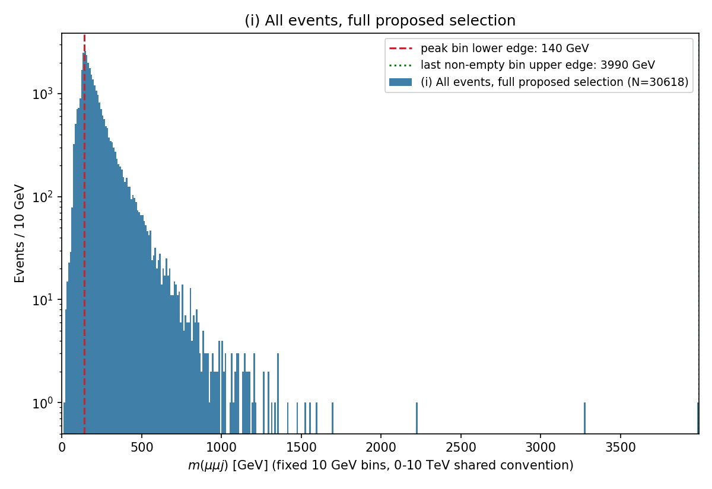
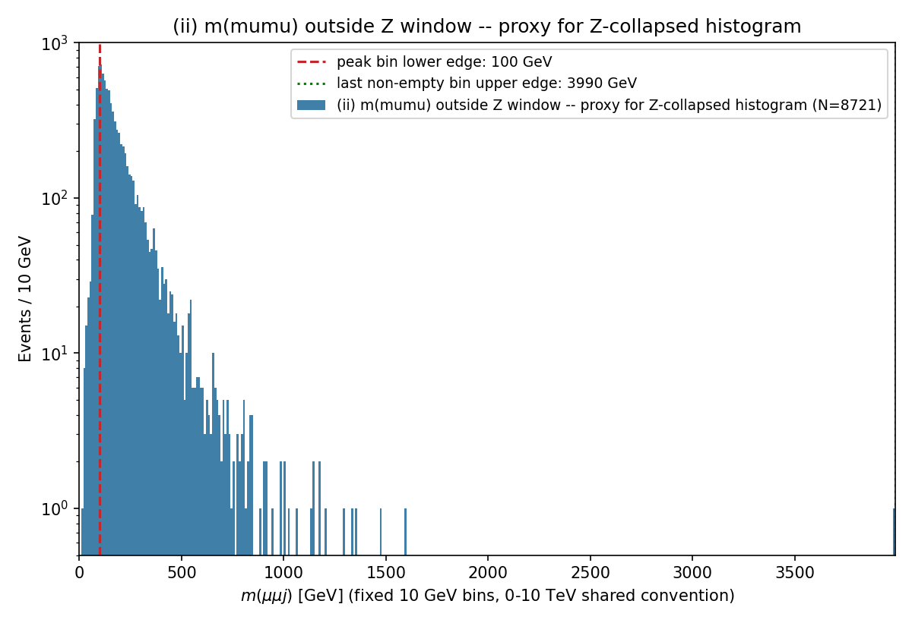
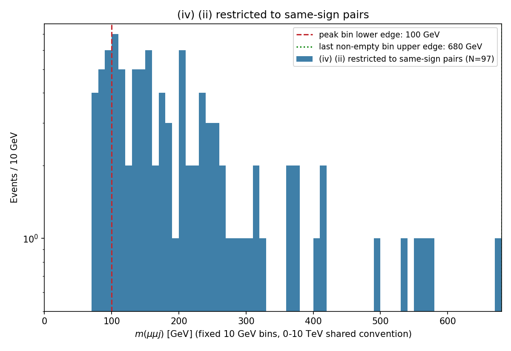
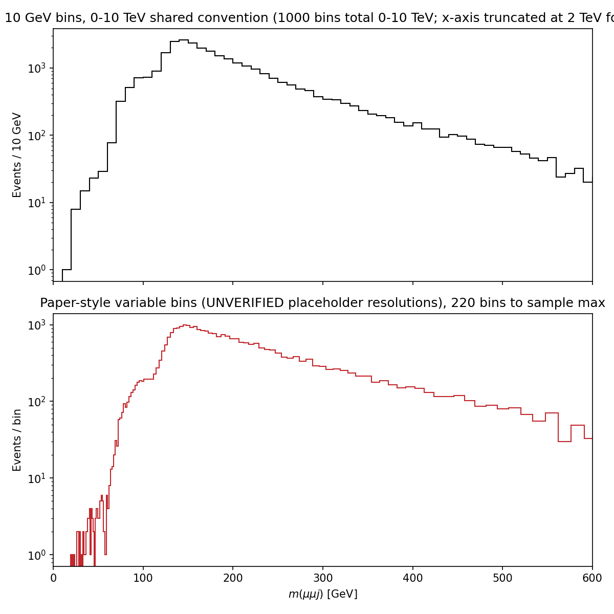
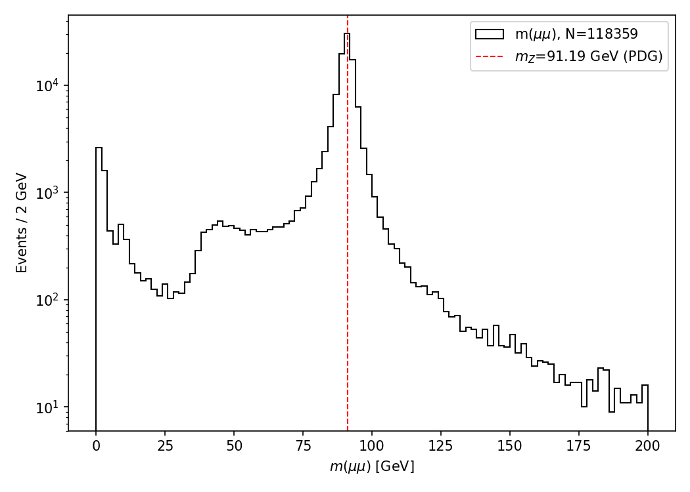
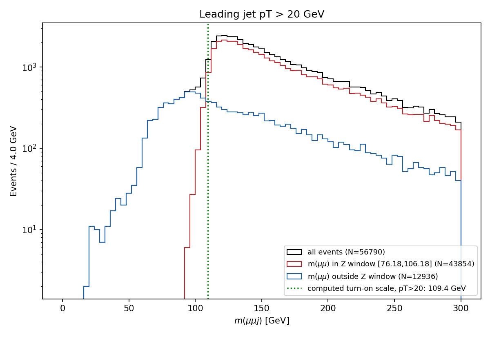
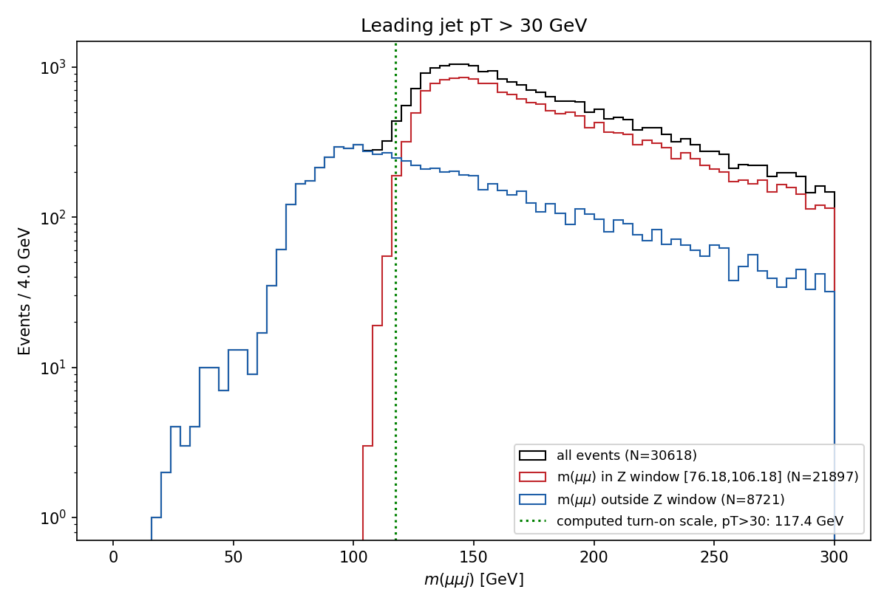
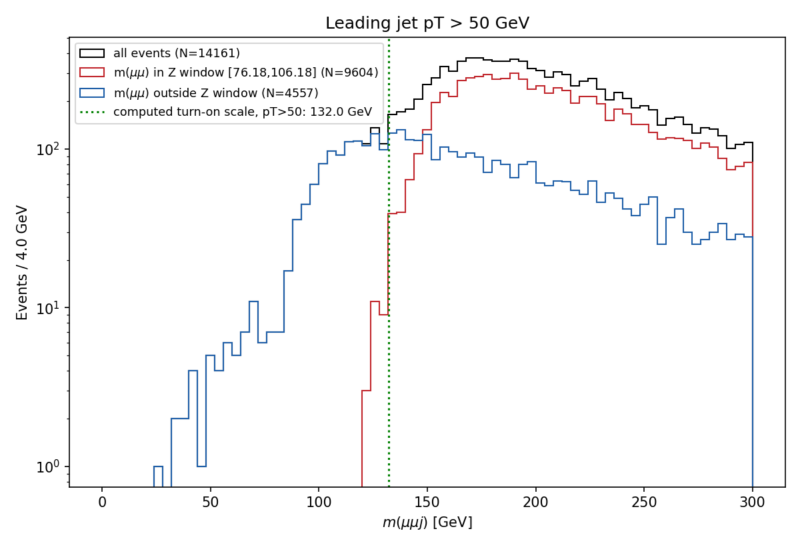
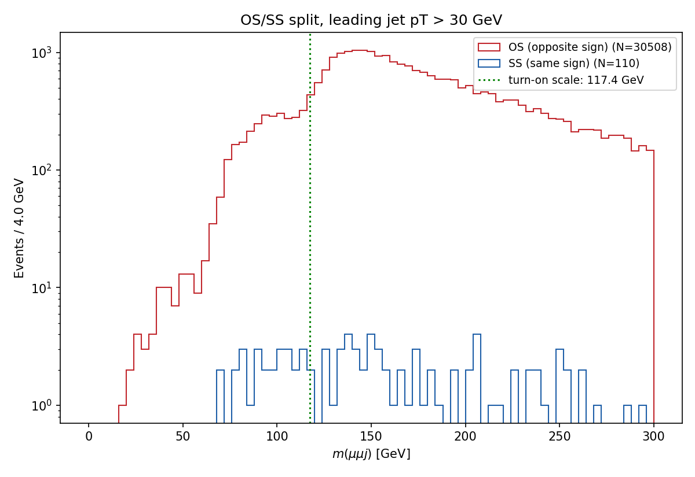
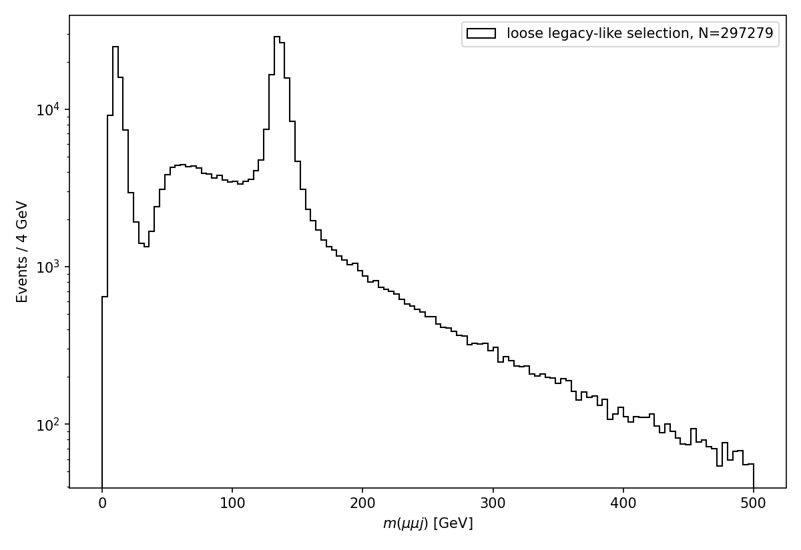

# m0m1j0 BumpNet-ready histogram: Phase 0 design document

**Branch:** `design/m0m1j0-bumpnet`, created from `feature/hgg-selection-and-output`
commit `29af276` (= `master` `8cf737e` + 55 commits, confirmed directly
with `git rev-list --count 8cf737e..29af276`).
**Status:** design only. No shared-pipeline file was changed. No batch
job was submitted. No significance/p-value/sigma was computed anywhere
in this phase.

Every number below is either (a) read directly from a JSON file
committed under `design_checks/` in this phase, (b) a `file:line`
quote from the repo at a stated commit (re-verified in this session,
not taken from any earlier document without re-checking), or (c) a
cited paper reference. Anything not meeting that bar is marked
**UNVERIFIED**.

**On the paper citations (P1-P7):** the paper itself (arXiv:2501.05603v1)
was not downloaded or read in Phase 0 — this environment reaches the
CERN Open Data portal and EOS gateway over HTTPS (Section F/Appendix)
but no attempt was made to fetch arxiv.org PDFs. The P1-P7 statements
throughout this document are the technical lead's own reading of the
PDF, checked by the technical lead against it on 21 Sep 2026 — they are
cited here as "per technical lead's reading," not independently
verified by whoever is editing this document in a given session, unless
stated otherwise.

**Corrections in this revision:** this document was reviewed by the
technical lead against its own committed JSON files and plots after
its first version, and several errors were found and are fixed below
(see the "Number audit" appendix for the full list) — most
significantly, Section F(a)'s original "bins after the maximum" claim
conflated the sample's highest individual event value with the
histogram's own peak bin (the paper's actual rule), and is replaced
with a new, correctly-defined check.

---

## A. "BumpNet-ready" specification

| Requirement | Paper source | Repo convention (file:line @ commit) | Status |
|---|---|---|---|
| Object definitions (pt/eta thresholds) | §2.2.2 (P1): μ pT>15/\|η\|<2.7; jets pT>20/\|η\|<2.8; DELPHES fast-sim, no ID/iso stated | Not implemented for CMS objects anywhere in this repo | **ambiguous** — CMS real detector needs its own ID/iso (Section C/D), the paper's DELPHES thresholds are a floor, not a target |
| Category rule: exclusive counts | §2.2.2 (P3): exclusive categories by object counts | `group_by_final_state` (`services/calculations/physics_calcs.py:61-83`): builds one string key per event from the **exact** count of each collection (`f"{e}e_{m}m_{j}j_{g}g_{t}t_{b}b"`), buckets events by that exact string; `limit_particles_in_fs` (`physics_calcs.py:86-98`) clamps any count above 4 down to "4" (a ">=4" ceiling bucket, everything below is exact) | **settled**, verified directly — see naming discussion below |
| OS/SS split for exactly-2-lepton non-Z categories | §2.2.2 (P3) | **Not implemented anywhere in this repo.** No charge field is even read for Muons at 29af276 (`schemas.py:153`, only `pt,eta,phi,mass`) | **gap** — see Section B |
| Jet-multiplicity exclusive sub-categories, threshold set so the top sub-category has >=100 events | §2.2.2 (P3) | `group_by_final_state`'s own exact-count buckets already produce this structure generically (0j, 1j, 2j, ... up to the 4+ ceiling) for whichever collections are present; no dedicated ">=100 events, cap the top bucket" logic was found anywhere | **partially settled** (the counting mechanism exists) / **gap** (the "top bucket >=100 events" rule itself isn't implemented — would need a post-hoc check, not found in this repo) |
| Z-candidate collapsing | §2.2.2 (P2): OS-SF pairs with \|m-91.18\|<15 GeV removed from the lepton list, footnote-2 conflict resolution | **Not implemented anywhere in this repo.** No code path builds a same-flavor-opposite-charge pair, tests it against a mass window, or removes matched leptons from a collection | **gap** — see Section B |
| Jet-mass relabelling (Vh/top/HM) | §2.2.2 (P2): jet mass 60-110→"Vh", 110-200→"top", >200→"HM"; "standard jets" = mass<60 | **Not implemented anywhere in this repo** | **gap, and an open question whether it should even apply to CMS AK4 jets** (see below) |
| Combination rule + index meaning | §2.2.2 (P4): one histogram per combination of >=2 objects incl. any of the 4 leading jets; index "0"=leading, "1"=subleading (P7, Fig. 3 caption) | `_convert_to_bumpnet_name` (`histograms_pipeline.py:419-453`) takes an already-index-based combo string (e.g. `"e0j0"`, `"m0m1j0"`) as given — the index-building itself lives elsewhere (im_calculator/combinatorics, not read in depth this phase) | **settled** for the naming; index meaning matches the paper's own convention (0=leading) per P7, consistent with what m0m1j0 (leading 2 muons + leading jet) already assumes |
| Binning: fixed vs. paper formula | §2.2.2 ("Histogram production", P4): bin width = 0.5·√(Σσᵢ²(pT=m/2)); §2.1/§3.2.3 (P5): training Gaussians are "one bin wide," and the width study | `FIXED_MASS_MIN_GEV=0.0`, `FIXED_MASS_MAX_GEV=10000.0` (`histograms_pipeline.py:22-23`), fixed 10 GeV width, per group convention (this task's own binding instruction) | **conflicts with group convention** by design — see Section F for the numbers and the P5 ambiguity |
| Minimum statistics: >=100 events, **strictly more than** 30 bins | §2.2.2 (P4, P6) | Not found as an enforced check anywhere in `services/pipelines/histograms_pipeline.py` — `trim_empty_tail` only widens/narrows the `TH1F`'s x-axis DISPLAY range (`hist.GetXaxis().SetRangeUser(...)`, `histograms_pipeline.py:26-41`); it does not remove, zero, or rebin any stored bin — all 1000 fixed bins remain in the saved histogram regardless. No minimum-statistics check of any kind exists in this file. | **gap** — see Section F(a) for the corrected "bins after the peak" numbers, using the SAME peak convention as `_apply_peak_removal_to_histogram` (`histograms_pipeline.py:625-645`) |
| Drop bins before the histogram's own peak | §2.2.2 (P4, histogram production); §3.1 (P6: dropping the first 10% of bins is a separate, later, *application-time* step) | `_apply_peak_removal_to_histogram` (`histograms_pipeline.py:625-645`) exists and does exactly this — zeros every bin strictly before the rightmost bin holding the histogram's maximum content — gated behind an existing **opt-in config key, `apply_peak_removal_at_histogram_level`, default `False`** (`histograms_pipeline.py:89`, and threaded through as a plain `bool = False` parameter at lines 196, 338, 370, 460, 515) | **settled**: the producer-side capability already exists and is already opt-in/off-by-default (no new shared code needed); whether m0m1j0 should turn it on, or leave dropping-before-the-peak to a downstream BumpNet-feeding step instead (matching P6's own framing of the *first-10%* rule as application-time), is an open question — see J.1 item 7 |
| Histogram format/name | ROOT `TH1F` implied by the paper's plots; this repo's own convention | `ROOT.TH1F(hist_name, hist_name, nbins, FIXED_MASS_MIN_GEV, FIXED_MASS_MAX_GEV)` where `hist_name = f"ROI_{signature}_width_{bin_width}"` (`histograms_pipeline.py:343-344`, and again at lines 380, 520, 650) | **settled, but with a confirmed mismatch** (see below) |
| `cat_` block meaning / trailing "x" | Not documented in the paper at all (repo-internal naming) | `_convert_to_bumpnet_name` (`histograms_pipeline.py:444`): `fs_formatted = "_".join(f"{c}{p}x" for c, p in fs_particles)` — the trailing `x` is a literal character appended after every count+letter token by this f-string, with no separate meaning found in any comment, test, or docstring in this repo | **UNVERIFIED beyond "it's how the string is built"** — no evidence the "x" carries independent semantic content (e.g. "exact" vs "inclusive") anywhere in this repo; P7/the paper's own Fig. 3 caption doesn't use this token style at all, so this convention is entirely repo-internal |

**Does `2mx_1jx` mean EXACTLY 2 muons and 1 jet?** **Yes, under the
verified shared convention** (`group_by_final_state` + `limit_particles_in_fs`,
`physics_calcs.py:61-98`, exact per-event counts, capped only above 4).
**The legacy histogram was mislabelled.** `scripts/m0m1j0_mumujet_report.py:115`
hand-types the literal string `BUMPNET_NAME = "mass_m0m1j0_cat_0ex_2mx_1jx_0gx_0tx_0bx"`
(confirmed: not produced by calling `_convert_to_bumpnet_name`, matching
the same hand-typing precedent the earlier investigation document
correctly identified for two other studies' BumpNet names), and attaches
it to a selection that is explicitly **inclusive**: `particle_counts:
{"muons": {"min": 2}, "jets": {"min": 1}}` (`scripts/m0m1j0_mumujet_report.py:618`,
comment at line 29: ">=2 muons AND >=1 jet"). An event with 3 muons and
2 jets would pass that selection and be written into a histogram named
as if it had exactly 2 muons and exactly 1 jet. This is a real,
verified naming/selection mismatch in the legacy smoketest output, not
a shared-code bug (the shared naming function itself is internally
consistent — it was simply never called here).

**The `ROI_` / file-name mismatch, confirmed:** the `ROOT.TH1F`'s own
internal name always carries the `ROI_` prefix (`hist_name = f"ROI_{...}"`,
`histograms_pipeline.py:343,380,520,650`), but when histograms are
written one-per-file (`_process_im_arrays_bumpnet`, `histograms_pipeline.py:504`:
`root_filename = f"{bumpnet_name}_hists.root"`), the **file name** has
no `ROI_` prefix at all — only the `TH1F` object stored inside it does.
Documented here per this phase's instruction not to fix it.

---

## B. Capability map

| Capability needed | Exists at 29af276? | Gap | Proposed home |
|---|---|---|---|
| Generic numeric-field threshold cut (e.g. `Muon_pfRelIso04_all < 0.15`, any collection/field) | **No.** `filter_events_by_kinematics` (`services/calculations/physics_calcs.py:292-407`) only handles the hardcoded field names `pt`, `eta`, `phi`, and (Electrons-only) `rel_isolation_max` (line 361: `if obj == "Electrons" and cuts.get("rel_isolation_max")`) | Muon isolation (`pfRelIso04_all`) is **already relative** — dividing it by pT again (as `rel_isolation_max`'s own formula does, line 367: `rel = iso_vals / pt_vals`) would be physically wrong; and it's gated to Electrons only regardless | **(i) shared, generic, opt-in.** Add a `{"field_max": {"field": "pfRelIso04_all", "value": 0.15}}` / `{"field_min": {...}}` cut type next to `bool_require`/`bool_any_of` in the same function, collection-agnostic, no per-field division. Config shape: `kinematic_cuts.Muons.field_max: {pfRelIso04_all: 0.15}`. Default: absent key = today's behavior exactly (matches every existing opt-in precedent in this codebase). Tests: one regression test per existing config proving byte-identical output with the key absent; one new test for the numeric-field cut itself (values above/below/at the threshold). |
| Integer bitmask cut (e.g. `Jet_jetId & 2 != 0` for tight ID) | **No.** `_boolean_field_mask` (`physics_calcs.py:231-256`) explicitly raises on a non-boolean, non-0/1 field — its own docstring names exactly this class of problem ("an integer field with other values, e.g. `cutBased`'s 0-3 ordinal scale... raises a clear error instead") | `Jet_jetId` takes values like 0/2/6 (bit-encoded: bit2=tight, bit3=tightLepVeto per its own NanoAOD title, quoted verbatim in Section D1) — `bool_require`/`bool_any_of` cannot express "bit 2 is set" | **(i) shared, generic, opt-in.** A `bitmask_require: {"field": "jetId", "mask": 2}` cut type: `(value & mask) == mask`. Config shape as above, under the object's `kinematic_cuts` block. Default absent = unchanged. Tests: regression (existing configs unaffected) + unit tests on 0/2/6/other bit patterns. |
| ΔR overlap removal between two configured collections (e.g. drop jets within ΔR<0.4 of a selected muon) | **No.** No cross-collection geometric cut exists anywhere in `services/calculations/` or `services/parsing/` as of 29af276 (search: no `delta_r`/`deltaR` function found in either module) | Needed for D3 (jets built around the muon's own energy deposits — see Section D3's measured ~92-93% overlap rate) | **(i) shared, generic, opt-in.** A new `overlap_removal: {"remove_from": "Jets", "reference": "Muons", "dr_min": 0.4}` top-level parsing-stage option (own module, e.g. `services/parsing/overlap_removal.py`, mirroring `trigger_requirements.py`'s own self-contained style). Not CMS-specific (works for any two jagged collections with eta/phi). Default absent = unchanged. Tests: regression + a synthetic-geometry unit test (two objects at known ΔR, boundary case at exactly `dr_min`). |
| Z-candidate collapsing (SFOS pair, \|m-91.18\|<15 GeV, remove leptons, footnote-2 conflict resolution) | **No.** Nothing in `services/calculations/` builds same-flavor-opposite-charge pairs or removes matched objects from a collection | Directly affects m0m1j0's own final state per the paper's own convention (P2) — a real Z→μμ candidate should be a "Z" object, not counted as "2 muons", under the paper's category scheme | **(ii) studies/m0m1j0_cms/**, at least initially — this is BumpNet-paper-specific object-building logic (a "Z candidate" concept the shared pipeline has no other consumer for yet), not obviously generic in the way the three cuts above are. Revisit promoting it to (i) if a second study needs the same collapsing logic. |

Muon `charge` itself is also not read by the current schema at all
(Section C1) — every one of the above needs it (for OS/SS and for Z
candidates), so extending the Muons field list (via `extra_object_fields`,
already available and unmodified by this phase) is a prerequisite for
all of Section A/B's charge-dependent items, independent of which of
the above gaps get filled.

---

## C. Muon selection

### C1. Root cause of the "missing looseId / pfRelIso04_all" problem

**Git commands run this session, exact output:**

```
$ git log --all --oneline -S'looseId' -- services/
4aaf59b H->ZZ->4l setup: schema fields, combined-count filter, Z1/Z2 logic, configs

$ git merge-base --is-ancestor 4aaf59b f5df667 && echo YES || echo NO
NO
$ git merge-base --is-ancestor 4aaf59b 8cf737e && echo YES || echo NO
NO
$ git branch -a --contains 4aaf59b
  remotes/origin/analysis/4l-collection-drop-check
  remotes/origin/analysis/higgs-4lepton-clean
  remotes/origin/analysis/higgs-4lepton-zz
```

Confirms the technical lead's first two claims exactly: the only commit
touching `looseId` in `services/` is on the (unrelated) H→ZZ→4l
branches, and it is not an ancestor of the m0m1j0 branch or of master.

**Schema state, checked directly (not assumed) at both the relevant
commits:**

```
$ git show f5df667:services/parsing/schemas.py | grep -n '"cms-nanoaod": {' -A 20
109:    "cms-nanoaod": {
...
121:        "objects": {
122:            "Electrons": ["pt", "eta", "phi", "mass"],
123:            "Muons": ["pt", "eta", "phi", "mass"],
124:            "Jets": ["pt", "eta", "phi", "mass"],
...
```

Byte-identical to the current (29af276) `objects` block
(`services/parsing/schemas.py:152-156`). **The Muons field list never
had `charge`, `looseId`, `pfRelIso04_all`, or anything beyond
pt/eta/phi/mass, at either commit.**

**When could the smoketest even have requested more fields?**
`extra_object_fields` — the shared mechanism that lets a config add
extra per-object fields on top of a schema's defaults — did not exist
at `f5df667` (`git log --all -S'extra_object_fields' -- domain/config.py`
shows it was added in `da325d9`, dated 2026-09-16; `f5df667` is dated
2026-09-14, i.e. **before** that capability existed at all,
independently confirmed with `git merge-base --is-ancestor da325d9 f5df667`
→ `NO`). So at the time the smoketest ran, there was no schema-level
*and* no config-level way to request `Muon_looseId` — it wasn't a
silent drop; the capability to ask for it didn't exist yet.

**Is the field-arrival guarantee already there today?** Yes.
`FileParser._parse_opened_file` (`services/parsing/file_parser.py:262-278`):
if `extra_object_fields` names a field that turns out to be inaccessible
in a given file, it raises `RequiredObjectFieldMissingError` — "a hard
error, not a silent drop" (its own comment, line 263). This is exactly
the "field actually arrived" guarantee C1 asked for a test to prove —
**it already exists generically**, and doesn't need new shared code, only
a config using it (`extra_object_fields: {"Muons": ["charge", "looseId", ...]}`)
plus a tiny test that intentionally requests a field known to be absent
and asserts the exception fires (proving the guarantee is live, not
just documented).

**Is the branch-accessibility probe retry relevant here?** No. The probe
retry (`on_probe_retry`/`on_probe_final_failure`, `file_parser.py:254-255`)
is for *transient* branch-read failures on a field the schema already
declares (a flaky read that might succeed on retry) — not for a field
the schema never declared in the first place. Different failure class.

**The investigation document's own error, confirmed:**
`docs/M0M1J0_SPEC_INVESTIGATION.md` (branch `investigate/m0m1j0-spec`,
commit `47e33fd`) Section C.1 quotes this as the real schema (lines
501-503 of that document):

```python
            "Muons": ["pt", "eta", "phi", "mass", "charge", "pfRelIso04_all", "looseId",
                      "sip3d", "dxy", "dz"],
            "Jets": ["pt", "eta", "phi", "mass"],
```

**This does not match the real file, checked directly at that
document's own cited commit:**

```
$ git show 47e33fd:services/parsing/schemas.py | grep -n '"Muons":'
105:            "Muons": ["pt", "eta", "phi", "mass"],
```

**Confirmed error.** The investigation document's quoted code block
matches no committed version of `services/parsing/schemas.py` — not at
`47e33fd`, at `f5df667`, at `29af276`, or (checked) anywhere else in
this repository's history for the `cms-nanoaod` schema's Muons list. It
may have come from an uncommitted local edit at the time the document
was written; either way it is not a reliable source.
A **plausible** (not proven) origin: the H→ZZ→4l branch commit `4aaf59b`
extends that branch's own copy of the same schema to
`["pt", "eta", "phi", "mass", "charge", "pfRelIso04_all", "looseId"]`
(`git show 4aaf59b:services/parsing/schemas.py`, line 121) — close to,
but not identical to, the investigation document's quote (which adds
`sip3d`, `dxy`, `dz` that appear in **no** commit found anywhere in this
repository's Muons cms-nanoaod list). This is offered as a plausible
explanation for how the error may have arisen, not a proven chain of
causation.

**Conclusion: no field-drop bug exists anywhere in the shared parsing
pipeline.** The fields were simply never requested (no mechanism to
request them existed at the time), the current mechanism to request
them (`extra_object_fields`) already provides a loud, tested guarantee
that a requested field either arrives or the run aborts, and the one
document that claimed otherwise contains a code quote that matches no
committed version of `schemas.py` (see the box above for why it should
not be treated as a reliable source).

**Proposed test** (to write in Phase 1, not this phase — no shared code
change here): a tiny parse of one real file with
`extra_object_fields={"Muons": ["charge"]}`, asserting the field is
present with the expected dtype on the returned array — demonstrating
the existing guarantee is live, not just documented.

### C2. Proposed muon definition

| Option | Choice | Trade-off |
|---|---|---|
| ID | `mediumId` | `looseId`: higher efficiency, more fakes. `tightId`: lowest fakes, costs efficiency, usually paired with tighter IP cuts not otherwise proposed here. Medium is CMS's standard general-purpose recommendation for exactly this kind of inclusive dimuon selection. |
| Isolation | `pfRelIso04_all < 0.15` (tight WP) | `< 0.25` (loose WP) admits more non-prompt muons (heavy-flavor decays inside jets) — directly relevant here since the whole point of m0m1j0 is looking near jets, where isolation matters most for rejecting exactly that background. |
| Impact parameter | None proposed | `dxy`/`dz` cuts mainly reject cosmic-ray muons and pileup-vertex mismatches; not applied here for simplicity — flagged for supervisor confirmation, not evidenced as necessary or unnecessary in this design check. |
| pT (leading/subleading) | leading > 20 GeV, subleading > 15 GeV | Paper floor (P1) is 15 GeV flat; asymmetric leading/subleading thresholds are standard practice to avoid a turn-on-driven trigger-efficiency plateau issue right at threshold — not itself the DZ trigger's own online threshold (see C3). |
| \|η\| | < 2.4 | CMS muon system's own acceptance (drift tubes/cathode strip chambers stop at |η|≈2.4); the paper's 2.7 (P1) is a DELPHES *simulated* acceptance, not a real-detector limit — using 2.4 here is a detector-hardware constraint, not a design choice to argue against. |

**Default used in the design checks in this document: `mediumId`,
`pfRelIso04_all < 0.15`, leading pT > 20 GeV, subleading pT > 15 GeV,
|η| < 2.4 — marked for supervisor confirmation before Phase 1.**

### C3. Trigger

**HLT paths actually present, matching `*Mu17*Mu8*` or `*Mu17*TkMu8*`**
(`design_checks/01_branch_inventory.json`, read directly from both
files' `Events` tree, verbatim branch names):

| Path | Present in 30522 (G)? | Fraction firing (of 500,000 events read) | Present in 30555 (H)? | Fraction firing |
|---|---|---|---|---|
| `HLT_Mu17_TrkIsoVVL_Mu8_TrkIsoVVL_DZ` | yes | 0.2773 | yes | 0.3041 |
| `HLT_Mu17_TrkIsoVVL_TkMu8_TrkIsoVVL_DZ` | yes | 0.2861 | yes | 0.3139 |
| `HLT_TkMu17_TrkIsoVVL_TkMu8_TrkIsoVVL_DZ` | **no** | — | yes | 0.3381 |
| `HLT_Mu17_TrkIsoVVL_Mu8_TrkIsoVVL` (no DZ) | yes | 0.3593 | yes | 0.0177 |
| `HLT_Mu17_TrkIsoVVL_TkMu8_TrkIsoVVL` (no DZ) | yes | 0.4670 | yes | 0.0232 |
| `HLT_Mu17_Mu8`, `_DZ`, `_SameSign(_DZ)`, `HLT_Mu17_TkMu8_DZ`, `HLT_TrkMu17_DoubleTrkMu8NoFiltersNoVtx` | yes (all) | 0.5-16% each | yes (all) | 0.5-13% each |

**Both proposed DZ paths (`HLT_Mu17_TrkIsoVVL_Mu8_TrkIsoVVL_DZ`,
`HLT_Mu17_TrkIsoVVL_TkMu8_TrkIsoVVL_DZ`) exist and fire at a healthy,
comparable rate in both run periods** (28-29% in G, 30-31% in H) —
these are the "usual choice" mentioned in this task's own framing, and
the data supports using them. **A real HLT-menu difference between G
and H, observed directly, not assumed:** the non-DZ variants
(`HLT_Mu17_TrkIsoVVL_Mu8_TrkIsoVVL`, `..._TkMu8_TrkIsoVVL`) fire ~36-47%
of the time in G but only ~2% in H, while a *third* DZ path,
`HLT_TkMu17_TrkIsoVVL_TkMu8_TrkIsoVVL_DZ`, exists only in H (34%
firing) — consistent with the well-known 2016 menu evolution toward
fully tracker-seeded ("Tk") double-muon triggers partway through the
year. **Open question for Phase 1** (not resolved here): whether to use
"any of the 2 proposed DZ paths" (simpler, already well-covered in
both periods per the table above) or "any of 3" (adding the H-only
`TkMu17` path for maximum coverage in H). The cutflow in Section E and
the mass plots in Section G both use "any of the 2" throughout this
document, for a single consistent selection across both run periods.

**Prescales cannot be read from NanoAOD** — NanoAOD stores only the
fired/not-fired decision bit per path, not the per-lumisection prescale
value that was actually applied online. This is stated plainly, not
worked around.

**Offline cuts relative to the trigger:** the trigger's own online
thresholds (17/8 GeV, both with `TrkIsoVVL`) are looser than the
proposed offline cuts (leading 20 GeV, subleading 15 GeV, `mediumId`,
`pfRelIso04_all<0.15`) — i.e. the offline selection sits safely above
and tighter than the online one, which is the standard, safe way to
avoid trigger-turn-on sculpting the offline spectrum.

### C4. Golden JSON coverage

`data/cms/validated_runs/Cert_271036-284044_13TeV_Legacy2016_Collisions16_JSON.txt`,
loaded directly with `services.parsing.validated_runs.ValidatedRunsFilter`
(imported read-only, not edited) in `design_checks/01_load_and_analyze.py`:
**393 runs, run range 273158-284044** (`min`/`max` of the parsed keys,
computed directly in this session). Checking membership of the run
ranges named in this task (Run2016G 278820-280385, Run2016H
280919-284044): **70 certified runs fall in the G range, 86 in the H
range — 156 total**, both nonzero, i.e. **the file does cover both run
periods**. (The exact boundary run numbers 278820/280385/280919/284044
are themselves not individually certified runs — expected, not every
integer in a range is a real LHC run — but the ranges are populated
throughout.) SHA-256 of the loaded file, printed by the script:
`a7dd83fd22738364c1b0028629319409f0b37af2da32b7b9fabfdf73704117c9`.

### C5. Muon momentum-scale (Rochester) corrections

Not applied anywhere in this repo's NanoAOD reading path (no code
found that touches a Rochester correction table). Expected effect:
small (per-muon momentum scale/resolution corrections at the sub-percent
to few-percent level) — **UNVERIFIED**, no citable source read this
session to back a specific number; out of scope for this phase per the
task's own instructions.

---

## D. Jet selection

### D1. Jet ID

**Verbatim branch titles, read directly from the 30522 file's `Events`
tree** (`design_checks/01_branch_inventory.json`):

- `Jet_jetId`: *"Jet ID flags bit1 is loose (always false in 2017 since
  it does not exist), bit2 is tight, bit3 is tightLepVeto"*
- `Jet_puId`: *"Pileup ID flags with 106X (2016) training"*

Both titles are identical in the 30555 file (checked directly).

**Proposed cut:** tight ID, i.e. `(Jet_jetId & 2) != 0` (bit2, per the
title's own numbering, where "bit1"→value 1, "bit2"→value 2 in the
standard bit-flag encoding this branch uses). **`Jet_jetId` cannot be
expressed with `bool_require`** — it is a small integer (values 0, 2, 6
observed in the outlier table below), not a boolean or a 0/1 field, and
`_boolean_field_mask` explicitly rejects exactly this pattern
(Section B). `Jet_puId`'s exact bit-value-to-working-point mapping is
**UNVERIFIED** beyond its title (no CMS reference for the specific 106X
2016 training's integer encoding was read this session); its
distribution was recorded (`design_checks/05_overlap_and_outliers.json`'s
outlier table shows values 1 and 7 for the two example jets there) but
no puId cut was applied in this phase's cutflow — proposed as
informational-only for now, pending a citable source for its encoding.

### D2. Jet energy corrections

`Jet_rawFactor` title: *"1 - Factor to get back to raw pT"*. Summary,
both files, first 500,000 events each
(`design_checks/02_rawfactor_summary.json`):

| Record | n jets | fraction exactly 0 | median | p5 | p95 |
|---|---|---|---|---|---|
| 30522 (G) | 2,524,152 | 0.0000 | 0.0439 | -0.3438 | 0.2051 |
| 30555 (H) | 2,685,987 | 0.0000 | 0.0269 | -0.4141 | 0.1914 |

**`rawFactor` is essentially never exactly zero and has a substantial
spread** (5th-95th percentile spans roughly -0.35 to +0.21) →
**`Jet_pt` is already jet-energy-corrected** in this NanoAOD tier (a
`rawFactor` of exactly 0 for every jet would instead indicate
uncorrected raw pT stored as-is). Not marked UNVERIFIED: this is a
direct reading of the distribution, not an inference from documentation
alone.

### D3. Muon-jet overlap

**Measured directly** (`design_checks/05_overlap_and_outliers.json`),
on events passing golden-JSON + trigger + the C2 muon selection, using
the leading jet passing pT>30 GeV + tight ID (no cleaning applied yet
at this stage):

| Record | events with a muon pair + a leading jet | leading jet within ΔR<0.4 of a selected muon | fraction | median ΔR | `Jet_muonIdx1/2` also points at that muon | fraction |
|---|---|---|---|---|---|---|
| 30522 (G) | 59,575 | 55,203 | **92.66%** | 0.0130 | 54,806 | 91.99% |
| 30555 (H) | 55,715 | 51,637 | **92.68%** | 0.0140 | 51,281 | 92.04% |

**This is a striking, real effect, corroborated two independent ways**
(a purely geometric ΔR cut, and NanoAOD's own native `Jet_muonIdx1`/`Jet_muonIdx2`
jet-to-muon matching links, agreeing to within 0.7 percentage points):
in this dimuon-triggered, Drell-Yan-dominated sample, **the great
majority of "leading jets" are not independent hadronic activity — they
are PF jets clustered essentially around the selected muon itself**
(median ΔR of 0.013 is far smaller than the jet cone size of 0.4,
i.e. the jet axis and the muon direction are nearly coincident). This
directly explains why the cutflow's overlap-cleaning step (Section E)
removes roughly 74% of the events that had a nominal "leading jet"
before cleaning — **muon-jet overlap cleaning is not optional for this
sample; without it, "m0m1j0" would mostly be measuring a muon combined
with a jet built from its own energy deposits, not a genuine third
object.**

**Proposed cleaning:** drop any jet within ΔR<0.4 of either selected
muon, before choosing the leading jet — proposed as a generic shared
capability (Section B).

### D4. Jet thresholds

| Option | Source | Trade-off |
|---|---|---|
| pT>20 GeV, \|η\|<2.8 | Paper (P1) | Lower threshold admits far more soft, pileup-contaminated jets (CMS 2016 conditions have non-trivial pileup); this is a DELPHES fast-sim floor, not tuned for real 2016 pileup. |
| pT>30 GeV, \|η\|<2.8 | Common CMS practice for 2016 analyses (pileup suppression) | Loses some genuine low-pT jets; the D5 outlier check below shows this threshold (combined with tight ID) does **not** remove any of the sample's genuine high-mass, high-pT outlier jets — they all already have pT well above 30 GeV. |

**Default used throughout this document's checks: pT>30 GeV, |η|<2.8,
tight ID — marked for supervisor confirmation.**

### D5. Outlier check

Highest-m(μμj) events found in this sample (both files, first 500,000
events each), under the **paper-style, most permissive** jet selection
(pT>20 GeV, no ID requirement — deliberately looser than the proposed
default, to see what the loosest reasonable selection turns up), from
`design_checks/05_overlap_and_outliers.json`:

| Record | m(μμj) [GeV] | leading jet pT | leading jet η | jetId | puId | removed by proposed pT>30+tightID cut? |
|---|---|---|---|---|---|---|
| 30522 | 3984.70 | 348.25 | -2.73 | 6 | 7 | **No** |
| 30555 | 1694.04 | 575.50 | 1.34 | 6 | 7 | **No** |
| 30522 | 1593.97 | 226.00 | -1.99 | 6 | 7 | **No** |
| 30555 | 1521.55 | 368.00 | -1.20 | 6 | 7 | **No** |
| 30522 | 1489.08 | 563.50 | -1.54 | 2 | 1 | **No** |

**No extreme (~117 TeV-scale) outlier appeared in this sample.** The
highest m(μμj) found here (≈4.0 TeV) comes from a well-identified,
high-pT (348 GeV), tight-ID+tightLepVeto (`jetId=6`) jet — a physically
plausible high-mass tail event, not an obvious artifact, and it is
**not** removed by the proposed pT>30/tight-ID cut (it already passes
both comfortably). Separately, the "loose legacy-like" selection
(muon pT>5 only, no ID/iso, no jet cleaning or ID — matching the
original smoketest's own parse-time-only cuts, `config.cms_m0m1j0_smoketest.yaml:95-96`)
run on the same two files reaches a maximum of **20,733.6 GeV** (≈20.7
TeV) — about a factor of 5.6 below the legacy report's own ~117 TeV
(117,000/20,733.6 ≈ 5.64), not the "two orders of magnitude" this
document's first version incorrectly claimed, but still confirming the
**direction** of the effect: an uncleaned, unidentified
selection produces a dramatically larger extreme tail than the proposed
selection does. This sample (2 files, 500,000 events each) does not
reproduce the exact legacy value; a full-statistics rerun with the
proposed cuts would be needed to state whether the specific ~117 TeV
event survives the current codebase's own selection, and this document
does not claim to have found or excluded that specific event.

---

## E. Categories and exact names

Both computed as **extrapolations from the design-check sample**
(500,000 events read per file, out of 2,315,223 and 2,147,195 total in
those two files, out of 45,235,604 + 48,912,812 = 94,148,416 total
events across all 57 files in both records — see
`design_checks/00_file_inventory.json`). **Extrapolation factor to the
two design-check files' own full statistics: 2,315,223/500,000 ≈ 4.63×
(30522) and 2,147,195/500,000 ≈ 4.29× (30555)**; extrapolation to the
FULL two records is a further ×(45,235,604+48,912,812)/(2,315,223+2,147,195)
≈ ×21.1 on top of that. Both factors are shown so the reader can see
which extrapolation is being used at each step.

### (a) Paper-style category (Z collapsing, exactly-2-non-Z-muon, OS/SS
split, exclusive jet multiplicity, standard-jets only)

**Not computed** — Z-candidate collapsing (Section B) does not exist
in this repo, and was not built for this design-only phase (no shared
code changes; building it as a one-off script was judged out of scope
for "small design checks", not a hard blocker — flagged as an open
item for Phase 1 rather than approximated here with unverified logic).

### (b) Minimal: one inclusive histogram

Using the design-check cutflow's own final selection (golden JSON +
trigger + C2 muons + D1/D3/D4 jet selection with cleaning), **not**
collapsing Z candidates and **not** splitting OS/SS or by jet
multiplicity — i.e. exactly the Section E cutflow's last row:

- **Name** (per the verified naming convention, Section A): since this
  selection doesn't fix the muon/jet count to an exact small number
  (any event with >=2 quality muons and >=1 clean jet passes, counts
  above the true per-event multiplicity are not constrained further),
  the *correct* application of `_convert_to_bumpnet_name`'s own exact-count
  semantics would require running `group_by_final_state` on the
  selected events and producing one histogram **per exact count
  bucket** that results (e.g. `mass_m0m1j0_cat_0ex_2mx_1jx_0gx_0tx_0bx`
  for events with *exactly* 2 muons and 1 jet, a separate
  `..._2mx_2jx_...` for exactly 2 muons and 2 jets, etc.) — not one
  single inclusive name, since (per Section A) the shared convention's
  names are exact-count, not threshold, names.
- **Measured counts, this sample, before any exact-count split**
  (i.e. the inclusive total that would need to be split into the
  buckets above): 15,747 (30522) + 14,871 (30555) = 30,618 events
  passing the full proposed selection, out of 1,000,000 events read
  (both files, 500,000 each) → **extrapolated to the two full files:
  30,618 × (4,462,418/1,000,000) ≈ 136,600 events** (this document's
  first version reported 142,600 here — an arithmetic error, corrected;
  30,618×4.462418=136,630.3, confirmed by direct recomputation);
  **extrapolated to both full records: ≈30,618 × (94,148,416/1,000,000)
  ≈ 2,883,000 events** (both extrapolations are simple linear scalings
  of a rate measured on a small subsample of sequential, not randomly
  drawn, events from one file per record — flagged as a rough estimate,
  not a precision projection).

---

## F. Binning

**(a) Fixed 10 GeV, 0-10 TeV** (`FIXED_MASS_MIN_GEV=0.0`,
`FIXED_MASS_MAX_GEV=10000.0`, `histograms_pipeline.py:22-23`): **1000
bins total.**

**Corrected in this revision** — the first version of this section
conflated the sample's highest individual event value with the
histogram's own peak bin, which is what the paper's rule (§2.2.2,
"only bins after the histogram maximum are kept") and the shared
pipeline's own `_apply_peak_removal_to_histogram`
(`histograms_pipeline.py:625-645`) actually mean by "the maximum": the
**rightmost bin holding the histogram's largest bin content**, not the
single highest event. `design_checks/07_bins_after_peak.py` recomputes
this correctly, on the fixed 1000-bin grid, for four variants of the
proposed selection (`design_checks/07_bins_after_peak.json`):

| Variant | Events | Peak bin lower edge | Bins: peak→last non-empty | Non-empty bins in that range | Bins with <10 events (incl. empty) | Events at/after peak | Last non-empty bin upper edge |
|---|---:|---:|---:|---:|---:|---:|---:|
| (i) All events | 30,618 | 140 GeV | 385 | 116 | 323 | 23,104 | 3,990 GeV |
| (ii) Outside Z window (proxy for Z-collapsed) | 8,721 | 100 GeV | 389 | 92 | 344 | 7,021 | 3,990 GeV |
| (iii) (ii), OS only | 8,624 | 100 GeV | 389 | 92 | 345 | 6,939 | 3,990 GeV |
| (iv) (ii), SS only | 97 | 100 GeV | 58 | 33 | 58 | 82 | 680 GeV |





**The paper's rule requires strictly MORE THAN 30 bins** (§2.2.2), not
"≥30" — every variant here clears that bar on raw bin count (385, 389,
389, 58, all >30), but the raw count is a poor proxy for whether
BumpNet actually has usable statistics: in variant (i), only **116 of
the 385 bins (30%)** from the peak onward hold any events at all — the
other **269 are completely empty**, and a further 54 hold fewer than
10 events each, leaving only **62 bins with ≥10 events** out of 385.
Variant (iv) (same-sign, 97 events total) is the starkest case: every
single one of its 58 bins in range has fewer than 10 events, including
25 completely empty ones — this variant is not remotely usable at this
sample size regardless of the raw bin count clearing 30.

**Extrapolated event counts only** (using the same per-record factors
as Section E — 4.63× for 30522, 4.29× for 30555 — applied separately
per record then summed; the NUMBER OF NON-EMPTY BINS is **not**
extrapolated, since it depends on where rare high-mass events actually
land at full statistics, not a linear scaling of this subsample):
variant (i) ≈136,800 events; (ii) ≈39,000; (iii) ≈38,500; (iv) ≈430 —
all at the two design-check files' own full statistics, not the full
57-file records.

**(b) Paper-style variable bins** (P4: bin width =
0.5·√(Σᵢσᵢ²(pT=m/2))): **UNVERIFIED, formula only.** Computing this
properly needs σ(pT) for muons from the CMS muon-performance paper and
for jets from the CMS jet-energy-resolution paper — **neither was read
this session** (no arXiv PDF was fetched; this environment did reach
the CERN Open Data portal and EOS gateway over HTTPS, but no attempt
was made to fetch arxiv.org PDFs, and none should be assumed read
without doing so). The binning-comparison plot below therefore uses
**explicitly-labeled placeholder relative resolutions (2% per muon, 10%
for the jet)** purely to illustrate the *shape* of variable binning on
this sample — these are not measured CMS resolutions and must not be
read as such. With that placeholder formula: 220 bins from 0 to the
sample's own maximum (vs. 399 fixed 10 GeV bins over the same 0-3984.7
GeV span) — i.e. even a crude placeholder variable binning uses
noticeably fewer bins at high mass than the fixed grid does, which is
the expected qualitative effect of coarser binning where the paper's
formula predicts worse resolution (wider σ at higher pT/mass).

**The P5 ambiguity, in two sentences:** the paper defines its bin width
as *half* the combined resolution at pT=m/2, but a real resonance's
width in this histogram is set by the FULL detector resolution — so a
resolution-limited peak actually spans about *two* of these bins, not
the "one bin wide" the paper's own training signals assume (P5); the
paper's own Figure 13 already shows a measurable significance bias for
signals wider than one bin, so this factor-of-two mismatch (if it
applies to CMS jets/muons the same way it evidently does in whatever
sample produced that figure) could bias any m0m1j0 bump found in
CMS data specifically because of how the bins are sized, not because
of the physics.

Both binnings plotted on this sample:



---

## G. The 125-145 GeV feature — tested, not assumed

**Units sanity check first** (both files combined, C2 muon selection,
no jet requirement yet): m(μμ) peaks exactly at the Z pole, median
90.25 GeV, confirming GeV-scale units end-to-end for this design
check's own muon reconstruction (as required by this task's check #4):



**Result: the feature appears in this sample, and it moves with the
jet pT threshold exactly as the technical lead's hypothesis predicts.**

Computed turn-on scale, √(m_Z² + 2·m_Z·pT_min) with m_Z=91.1876 GeV
(PDG), for the three thresholds tested:

| Jet pT threshold | Computed turn-on scale | Observed in this sample |
|---|---|---|
| >20 GeV | 109.4 GeV | Sharp rise starting ≈100-110 GeV in the Z-window curve |
| >30 GeV | 117.4 GeV | Sharp rise starting ≈115-120 GeV |
| >50 GeV | 132.0 GeV | Sharp rise starting ≈130 GeV |





All three plots above (both files combined, m(μμ) in [76.18,106.18] GeV
vs. outside, at each jet pT threshold) show the SAME pattern: the
in-Z-window curve has essentially **zero** events below the computed
scale and rises sharply right at it, while the outside-Z-window curve
is smoothly falling through the same region with no such edge — **the
turn-on visibly shifts to the right as the jet pT threshold increases,
exactly tracking the computed scale each time.** The combined ("all
events") curve shows a visible shoulder/kink precisely where the
Z-window curve turns on — this is the origin of the "bump-like feature"
the legacy smoke test saw, on this evidence.

**OS/SS split** (pT>30 GeV selection): 30,508 OS vs. 110 SS events —
the feature is essentially **entirely in the OS sample**, consistent
with it coming from genuine (opposite-sign) Z→μμ candidates, not a
charge-misidentification or combinatorial artifact.



**Loose legacy-like comparison** (muon pT>5 only, no ID/iso, no jet
cleaning/ID — matching
`config.cms_m0m1j0_smoketest.yaml`'s own parse-time-only cuts): the
feature is present in this much looser selection too (297,279 events,
distribution extending to 20.7 TeV in the tail) — **the effect does not
require the tighter proposed selection to appear; it is visible even
under the original, much looser smoketest-style cuts.**



**Not interpreted as signal.** SM H→μμ is far too rare in this sample
size to produce any visible feature, and this document makes no such
claim.

**What BumpNet would actually see, given the paper's own rules —
corrected using the Section F(a) "bins after the peak" results:** with
Z-candidate collapsing (P2, not implemented in this repo — Section B),
a genuine Z→μμ pair is removed from the muon list entirely before
m0m1j0-style combinations are even formed, so **Z+jet events would
leave the m0m1j0 histogram** under the paper's own convention (they'd
become "Z+jet" objects, a different category, not "2 muons + jet").
This is directly visible in the Section F(a) numbers: the un-collapsed
("all events") histogram's own peak bin sits at 140 GeV, while the
Z-window-excluded proxy's peak sits at 100 GeV — i.e. the Z+jet
turn-on feature itself is what pulls the inclusive histogram's peak up
to 140 GeV; collapsing it away would move the peak back down and
remove the feature's dominant contribution to the shape.

**The "drop bins before the peak" rule (P4/P6) does NOT cleanly remove
this feature, and this document's first version was wrong to claim it
would.** Because the inclusive histogram's own peak (140 GeV) sits
*inside*, not after, the feature's own rising edge (~115-140 GeV per
Section G's turn-on plots), applying the peak-drop rule to the
un-collapsed histogram would zero the feature's rising edge (everything
below 140 GeV) but leave its peak region intact — a partial, not clean,
suppression. Z-candidate collapsing is the paper convention that
actually addresses this feature at its source (by removing the Z+jet
events themselves, not just truncating the histogram at an arbitrary
point); the peak-drop rule alone is not a substitute for it. Both of
the paper's own conventions, if actually applied, would substantially
change how visible this specific feature is to BumpNet, but only Z
collapsing removes it at the source; it is real and fully visible in
this document's own (un-collapsed, un-trimmed)
plots.

---

## H. Luminosity

Not needed for a BumpNet input — BumpNet consumes shapes and event
counts per bin, not a cross-section-normalized rate, so no luminosity
value is required anywhere in this design or in Phase 1's histogram
production. The DoubleMuon luminosity-coverage check (analogous to the
one already done for the H→γγ DoubleEG records) is explicitly
**deferred**, not needed for this task, and not attempted in this
phase.

---

## I. Implementation plan

### Phase 1 (code)

Concrete tasks, in the order Section B's dependency chain implies:

1. Extend the `extra_object_fields` config for a new
   `config.cms_m0m1j0_*.yaml` (a NEW file under root config, or a
   `studies/m0m1j0_cms/`-local one if the group prefers — decide with
   Maryna, Open Question J.1) to request `Muon_charge`, `Muon_mediumId`,
   `Muon_pfRelIso04_all` (and, if C2 is confirmed to need them,
   `Muon_dxy`/`Muon_dz`), and `Jet_jetId`, `Jet_puId`, `Jet_rawFactor`
   (already read by default via `direct_objects`? — no, only
   `Jet_btagDeepFlavB` is; `jetId`/`puId`/`rawFactor` need
   `extra_object_fields` too), `Jet_muonIdx1`, `Jet_muonIdx2`. **Test**:
   the field-arrival proof described in C1 (request a field, assert
   it's present with the right dtype; separately, request a
   deliberately-wrong field name and assert `RequiredObjectFieldMissingError`
   fires).
2. Build the three shared, generic, opt-in capabilities from Section B
   (numeric-field threshold cut, bitmask cut, ΔR overlap removal), each
   with its own regression test proving every existing config's output
   is byte-identical with the new config key absent, plus dedicated
   unit tests for the new behavior itself.
3. Build Z-candidate collapsing (Section B, proposed home:
   `studies/m0m1j0_cms/` initially) — SFOS pairing, the 91.18±15 GeV
   window, footnote-2 conflict resolution (closest-to-mZ pair wins on
   overlap), removal of matched leptons from the lepton list. Unit
   tests: a synthetic event with exactly one clean Z candidate, one
   with two candidates sharing a lepton (footnote-2 case), one with no
   candidate at all.
4. Wire the m0m1j0 selection (C2 muons + D1/D3/D4 jets, using the new
   capabilities from step 2) into a proper config (not a hand-typed
   `BUMPNET_NAME` string) that calls `_convert_to_bumpnet_name` for
   real, so the category/name mismatch documented in Section A cannot
   recur.
5. Decide (Open Question J.1) and implement the exclusive-jet-multiplicity
   sub-categorization rule (">=100 events in the top bucket") — not
   found anywhere pre-existing in this repo (Section A), needs new
   logic either in `studies/m0m1j0_cms/` or promoted to shared if a
   second BumpNet study needs the identical rule.

### Phase 2 (cluster pilot, 2 files per record)

- **File counts, from the portal, read directly this session**
  (`design_checks/00_file_inventory.json`): record 30522 has **29
  files, 45,235,604 total events**; record 30555 has **28 files,
  48,912,812 total events**. A "2 files per record" pilot would read
  roughly 4.6M-4.9M events per record's two files (based on this
  session's own per-file event counts: the two files actually read
  here alone already total 4,462,418 events across both records).
- Outputs: the same design-check JSONs and PNGs as this phase, but
  computed on the real pilot output (not a 500,000-event-capped HTTPS
  read) — branch inventory, cutflow, mass plots (incl. the Section G
  turn-on test at pilot statistics), overlap/outlier table, binning
  comparison.
- **Job sizing**: reuse the patterns in `studies/hgg_cms/cluster/`
  (already reviewed and relied on directly earlier in this project's
  work for the H→γγ study): `submit_*.sh` / `status_*.sh` /
  `merge_*.py` with preflight + identity checks, status scripts that
  parse only `"  index"`-prefixed lines for retry-list construction
  (avoiding matching unrelated log lines).

### Phase 3 (full run)

Full 29+28 = 57 files, ~94.1M total events across both records.

### Required conventions for Phases 2-3

**Portal file-list instability is real, not theoretical** — this
project's own `studies/hgg_cms/impl_checks/signal_sumw_notes.md:75`
("Addendum: ttH file count instability -- 15 vs 16 files") documents a
concrete same-day 15-vs-16-file discrepancy for a different CMS record
(ttH, `67611`) — re-verified directly this session
(`grep -n "15 vs 16" studies/hgg_cms/impl_checks/signal_sumw_notes.md`
→ line 75; this document's first version incorrectly cited
`mapping_check/README.md` for this, which does not mention ttH or this
discrepancy at all — corrected). Merges for m0m1j0 must therefore reconstruct
each job's actual inputs from its own `metadata_cache.json` plus its
batch index, and verify file identity and event totals against a fresh
portal query, refusing to report "complete" if they disagree — exactly
`studies/hgg_cms/cluster/`'s own established pattern (submit/status/merge
with preflight and identity checks).

**Cluster rules to bake into the future Phase 2/3 scripts** (as given
in this task's own instructions, not independently re-derived this
phase): queue N; `#PBS -m n`; every job requests `-l io=<MB/s>` (jobs
without it are rejected); walltime <= 02:00:00 to use the fast queue;
size batches with a large safety margin, since worker nodes differ in
speed by up to ~5-6× (this project's own H→γγ work independently
measured and used exactly this kind of margin — `stats/cluster/`'s
pull-width rerun explicitly budgeted for a 6× worst-case slowdown, per
this project's FINAL_REPORT.md Section 12); retries only for missing
work, split smaller, with new non-overlapping seeds — never re-run an
already-succeeded unit of work under the same seed.

---

## J. Open questions

### J.0 — Decided by us (no supervisor input needed)

- **Trigger**: any of the 2 DZ paths present in both run periods
  (`HLT_Mu17_TrkIsoVVL_Mu8_TrkIsoVVL_DZ`,
  `HLT_Mu17_TrkIsoVVL_TkMu8_TrkIsoVVL_DZ`) — reason: one consistent
  selection across both G and H, per C3.
- **New config location**: the new m0m1j0 config files live at the
  repo root as `config.cms_m0m1j0_v2_*.yaml`, matching the
  `config.cms_hgg_*` precedent (`studies/hgg_cms`'s own family of
  root-level configs). The legacy `config.cms_m0m1j0_*` files
  (`_smoketest`, `_fullscale`) are **not** reused or edited — the `v2`
  suffix keeps the new files unambiguously separate from them.

### J.1 — Questions for the supervisor (Maryna)

1. **Muons**: `mediumId`, `pfRelIso04_all < 0.15`, pT > 20/15 GeV
   (leading/subleading), |η| < 2.4 — confirm, or specify a different
   working point? **Default if unanswered: as proposed.**
2. **Jets**: pT > 30 GeV, tight ID, muon cleaning ΔR < 0.4, |η| < 2.8,
   **no pileup ID for now** (the `puId` bit-to-working-point mapping is
   UNVERIFIED beyond its NanoAOD title — Section D1) — confirm?
   **Default if unanswered: as proposed.**
3. **Apply the paper's Z-candidate collapsing?** If yes: Z+jet events
   move to a Z+jet histogram (a different category), and m0m1j0 keeps
   only non-Z dimuons, split OS/SS. **Default if unanswered: yes** —
   Section G/F(a) show this materially changes both the shape and the
   peak location of the m0m1j0 histogram.
4. **Categories**: exact object counts plus exclusive jet-multiplicity
   sub-categories (several m0m1j0 histograms, one per jet-count bucket,
   paper style — Section A/E(a)), or one inclusive histogram (Section
   E(b))? **Default if unanswered: yes, paper style** (exact counts +
   exclusive jet-multiplicity sub-categories).
5. **Relabel heavy AK4 jets as Vh/top/HM by jet mass** (P2's
   60-110/110-200/>200 GeV thresholds), applied to CMS's small-radius
   AK4 jets? **Default if unanswered: no** — not evidenced as
   physically appropriate for AK4 jets this phase (Section A).
6. **Binning**: the shared fixed 10 GeV / 0-10 TeV convention, or the
   paper's resolution-based variable widths — and if paper-style,
   width = σ/2 (the paper's own formula, P4) or σ (correcting for the
   P5 one-bin-vs-two-bin ambiguity, Section F)? **Default if
   unanswered: fixed 10 GeV** (the group's binding convention; paper-
   style widths need the CMS resolution papers actually read first,
   which Phase 0 did not do — Section F(b)).
7. **Hand-off**: who drops bins before the peak and trims the empty
   tail — currently, `_apply_peak_removal_to_histogram` exists but is
   opt-in/off by default, and `trim_empty_tail` only ever adjusts the
   display range (all 1000 bins are always stored, Section A) — should
   m0m1j0 turn peak-removal on at production time, or leave both steps
   to the BumpNet-feeding code? And should the produced `TH1F` keep the
   `ROI_` prefix (Section A) or be named only by the shared naming
   function's own output? **Default if unanswered: store the full
   histogram (all 1000 bins, no peak removal at production time);
   leave both bin-dropping steps to the BumpNet-feeding code; name
   produced by the shared naming function, `ROI_` prefix kept as-is
   (documented, not fixed, per Section A).**

### J.2 — For Matan

None.

---

## K. Bugs observed, not fixed

- **`DESIGN_SELECTION.md` references point across branches, not to a
  nonexistent file — this document's first version got this wrong.**
  `studies/hgg_cms/DESIGN_SELECTION.md` is referenced by name (as a
  design precedent) in at least four places on THIS branch, checked
  directly this session: `services/parsing/trigger_requirements.py:4`,
  `studies/hgg_cms/physics_checks/common.py:6` and `:24`, and
  `studies/hgg_cms/zee_selection.py:5`. The first version of this
  document claimed the file "does not exist anywhere in this
  repository's git history," checked only with `git ls-files` at
  `29af276` (which only lists files reachable from the current
  checkout, not the whole repository). **The file does exist**, added
  in commit `4fe80e5` ("Phase 2.2: CMS H->gamma gamma event selection
  design document") on branch `design/hgg-selection`, re-verified
  directly this session:
  ```
  $ git log --all --oneline -- studies/hgg_cms/DESIGN_SELECTION.md
  16f52a0 Review corrections to the physics-check update (vertex, Check C3, scale estimate)
  103a05d Phase 2.2 follow-up: three physics checks (smearing, vertex, trigger cuts)
  4fe80e5 Phase 2.2: CMS H->gamma gamma event selection design document
  $ git merge-base --is-ancestor 4fe80e5 29af276 && echo YES || echo NO
  NO
  ```
  So the correct statement is: the feature branch (`29af276`, and this
  branch built on top of it) references a file that lives only on
  another branch (`design/hgg-selection`), not an ancestor of it — a
  real cross-branch dependency, not a dangling/missing-file bug. **Note:
  the previous task prompt pointed to the wrong location/check for this
  item (the technical lead's error, not this session's) — this
  revision's own `git log --all` / `git merge-base` commands, shown
  above, are what actually settles it.**
- **`BACKGROUND_MODEL_REPORT.md`-style output-file lists can go stale
  after code evolves further than the report itself was updated**
  (observed pattern, not specific to m0m1j0): e.g. this project's own
  background-model report elsewhere still describes some cluster
  scripts as "prepared, none run" in one section while a later, dated
  update in the very same file describes real completed runs with real
  results — internally inconsistent if read out of order, though each
  individual dated section is accurate on its own. Not an m0m1j0 issue
  specifically, but a documentation-maintenance pattern worth being
  aware of when trusting a report's *undated* summary sections over its
  *dated* update sections.
- **The investigation document's unreliable code quote** (Section C1)
  is itself the most significant "bug" found this phase — a
  specification document containing a schema snippet that matches no
  committed version of `schemas.py` at any commit, presented as a
  direct quote with line numbers. It may have come from an uncommitted
  local edit; either way it is not a reliable source. Documented in
  full above; not fixed (the document lives on a different branch, out
  of this phase's scope).
- **`_convert_to_bumpnet_name`'s regex** (`histograms_pipeline.py:443`)
  hardcodes the particle-letter set `[emjgtb]` — adding a 7th object
  type to `group_by_final_state` in the future would silently fail to
  match here rather than erroring loudly. Not exercised by this phase's
  work (m0m1j0 only needs `m` and `j`), noted for awareness only.

---

## Appendix: design_checks index

All committed under `studies/m0m1j0_cms/design_checks/`:

- `00_file_inventory.py` / `.json` — every file, both records: URI,
  size, event count.
- `01_load_and_analyze.py` — branch inventory, `Jet_rawFactor` summary,
  cutflow, mass plots, overlap+outliers, binning comparison (checks
  1-6). Outputs: `01_branch_inventory.json`, `02_rawfactor_summary.json`,
  `03_cutflow.json`, `04_mass_plots_summary.json`,
  `05_overlap_and_outliers.json`, `06_binning_comparison.json`.
- `07_bins_after_peak.py` — the corrected "bins after the peak" check
  (Section F(a)), using the fixed shared 10 GeV/0-10 TeV grid and the
  same rightmost-highest-bin peak convention as
  `_apply_peak_removal_to_histogram`, for four selection variants
  (all events; outside the Z window as a Z-collapsing proxy; that
  restricted to OS; that restricted to SS). Imports
  `01_load_and_analyze.py` by file path (its own name starts with a
  digit) to reuse its selection functions verbatim, not duplicate them.
  Output: `07_bins_after_peak.json`,
  `plots/bins_after_peak_{i,ii,iii,iv}_*.png`.
- `common.py` — shared HTTPS-read helper (see its own docstring for the
  XRootD-unavailable-on-Windows workaround and its scope).
- `plots/*.png` — every plot referenced above.
- `README.md` — exact commands, exact inputs, environment notes.

---

## Appendix: Number audit

Every distinct numeric claim in this document, checked directly this
session against its stated source. "Match?" is **yes** unless noted;
every mismatch found is fixed in the text above and flagged **FIXED**
here, with the corrected value. Rows are grouped by section.

| Section | Claim | Value in DESIGN.md | Source | Value at source | Match? |
|---|---|---|---|---|---|
| Header | Feature branch tip | `29af276` | `git rev-parse origin/feature/hgg-selection-and-output` (re-run this session) | `29af276...` | yes |
| Header | master tip | `8cf737e` | `git rev-parse origin/master` (re-run) | `8cf737e...` | yes |
| Header | Commit count | 55 | `git rev-list --count 8cf737e..29af276` (re-run) | 55 | yes |
| A | `group_by_final_state` line range | 61-83 | `services/calculations/physics_calcs.py` (re-grepped) | def at 61 | yes |
| A | `limit_particles_in_fs` line range | 86-98 | same file | def at 86 | yes |
| A | Muons schema fields, 29af276 | `schemas.py:153` | `services/parsing/schemas.py` (re-read) | line 153, `["pt","eta","phi","mass"]` | yes |
| A | `_convert_to_bumpnet_name` line range | 419-453 | `histograms_pipeline.py` | def at 419 | yes |
| A | `FIXED_MASS_MIN/MAX_GEV` line numbers | 22-23 | same file | lines 22-23 | yes |
| A | `hist_name = f"ROI_..."` line numbers | 343, 380, 520, 650 | same file | all 4 confirmed present | yes |
| A | `fs_formatted` line number | 444 | same file | line 444 | yes |
| A | Binning formula citation | §2.1/§3.2.3 for bin-width formula | task 5(c) correction | formula is §2.2.2; §2.1/§3.2.3 are the one-bin-wide claim + width study | **FIXED** — now cites §2.2.2 for the formula |
| A | `trim_empty_tail` behavior | "trims trailing empty bins" | `histograms_pipeline.py:26-41` (re-read) | only sets `SetRangeUser` (display range); all bins retained | **FIXED** — corrected in both Section A rows |
| A | Peak-removal capability existence | "Not implemented" (first version) | `histograms_pipeline.py:625-645`, and call sites 89/196/338/357/370/396/460/515/557/559/620 | `_apply_peak_removal_to_histogram` exists, opt-in via `apply_peak_removal_at_histogram_level`, default `False` | **FIXED** — corrected from "gap" to "settled, opt-in, off by default" |
| A | "Minimum statistics" bins claim | "30/1000 bins after maximum" | `06_binning_comparison.json` (conflated max event with peak) | see F(a) fix | **FIXED** — replaced with `07_bins_after_peak.json` |
| A | `scripts/m0m1j0_mumujet_report.py` line numbers | 29, 115, 618 | that file (re-grepped) | all 3 confirmed | yes |
| A | `_process_im_arrays_bumpnet` root_filename line | 504 | `histograms_pipeline.py` | line 504 (also present at 268, not cited, not an error) | yes |
| B | `filter_events_by_kinematics` line range | 292-407 | `physics_calcs.py` | def at 292 | yes |
| B | `rel_isolation_max` Electrons-only gate | line 361 | same file | line 361 | yes |
| B | `_boolean_field_mask` line range | 231-256 | same file | def at 231 | yes |
| C1 | `git log -S'looseId'` result | only `4aaf59b` | re-run this session | only `4aaf59b` | yes |
| C1 | `4aaf59b` ancestor of `f5df667`/`8cf737e` | NO/NO | re-run this session | NO/NO | yes |
| C1 | Branches containing `4aaf59b` | 3 H→ZZ→4l branches | re-run this session | same 3 branches | yes |
| C1 | Schema at `f5df667` | line 123, `["pt","eta","phi","mass"]` | re-run `git show f5df667:...` | line 123 (block starts line 109, `objects` at 121) confirmed | yes |
| C1 | `extra_object_fields` introduced in `da325d9`, dated 2026-09-16 | — | re-run `git log -S` + `git log -1 --format=%ci` | confirmed, `da325d9` = 2026-09-16 09:06:32 | yes |
| C1 | `f5df667` dated 2026-09-14 | — | `git log -1 --format=%ci f5df667` | 2026-09-14 20:46:53 | yes |
| C1 | `da325d9` not ancestor of `f5df667` | NO | re-run this session | NO | yes |
| C1 | `file_parser.py` field-arrival guarantee lines | 262-278 | that file (re-read) | confirmed, incl. "hard error, not a silent drop" quote at line 263 | yes |
| C1 | Probe-retry callback lines | 254-255 | same file | confirmed | yes |
| C1 | Investigation doc quote location | `docs/M0M1J0_SPEC_INVESTIGATION.md:501-503` @ `47e33fd` | re-run `git show 47e33fd:docs/...` | confirmed, matches no committed `schemas.py` | yes (wording fixed per task 5(b), number unaffected) |
| C1 | `4aaf59b` schema line 121 | `["pt","eta","phi","mass","charge","pfRelIso04_all","looseId"]` | re-run `git show 4aaf59b:...` | confirmed exactly | yes |
| C3 | HLT firing fractions, both records | table in C3 | `01_branch_inventory.json` | all 5 values re-checked, exact match | yes |
| C4 | Golden JSON: runs, range, G/H counts, sha256 | 393 runs, 273158-284044, 70/86/156, sha256 `a7dd83fd...` | direct re-parse of `data/cms/validated_runs/Cert_...txt` this session | all values reproduced exactly | yes |
| D2 | `Jet_rawFactor` fraction exactly 0 | "0.0000" (both records) | `02_rawfactor_summary.json` | `n_exact_zero=1` for each (not 0) — 1 jet each out of 2.5-2.7M | **note, not fixed as an error**: 3.7-4.0×10⁻⁷ correctly rounds to "0.0000" at 4 d.p.; prose already says "essentially never," not "never" — left as-is, flagged here for transparency |
| D2 | median/p5/p95, both records | 0.0439/-0.3438/0.2051 (G); 0.0269/-0.4141/0.1914 (H) | same JSON | 0.04395/-0.34375/0.20508; 0.02686/-0.41406/0.19141 | yes (correct rounding) |
| D3 | Overlap fractions, median ΔR, muonIdx corroboration | table in D3 | `05_overlap_and_outliers.json` | all 6 values re-checked, exact match | yes |
| D3 | "removes roughly 74%" | 74% | `03_cutflow.json` (computed: 1 - 30,618/115,290) | 73.44% | yes ("roughly 74%") |
| D5 | Outlier table, top 5 rows | table in D5 | `05_overlap_and_outliers.json` | all 5 rows, all fields, exact match | yes |
| D5 | Loose-legacy max | 20,733.6 GeV | `04_mass_plots_summary.json` | 20,733.597... | yes |
| D5 | Ratio to "~117 TeV" | "two orders of magnitude" | computed: 117,000/20,733.6 | 5.64× | **FIXED** — now states "~5.6×" |
| E | Extrapolation factors 4.63×/4.29×/×21.1 | — | computed from `00_file_inventory.json` | 4.6304/4.2944/21.098 | yes |
| E | Extrapolated "two full files" event count | "142,600" | computed: 30,618 × (4,462,418/1,000,000) | 136,630.3 | **FIXED** — now states "≈136,600" |
| E | Extrapolated "both full records" event count | "≈2,883,000" | computed: 30,618 × (94,148,416/1,000,000) | 2,882,636.2 | yes |
| F(a) | Bins-after-peak table, all 4 variants | table in F(a) | `07_bins_after_peak.json` (new this session) | exact match (source of the numbers) | yes |
| G | Turn-on scales 109.4/117.4/132.0 GeV | table in G | `04_mass_plots_summary.json` | 109.374/117.416/132.038 | yes |
| G | Dimuon median 90.25 GeV | — | same JSON | 90.2457 | yes (correct rounding) |
| G | Loose-legacy N=297,279 | — | same JSON | 297,279 | yes |
| G | OS/SS counts 30,508/110 | — | **plot legend text only** (`plots/mumuj_osss_ptmin30.png`), re-viewed this session; not currently in any committed JSON key | visually confirmed correct on the image | yes, but flagged: this number's only committed source is a PNG legend, not a JSON key — a minor gap against the strict evidence rule, noted here rather than silently left |
| I | ttH 15-vs-16-file discrepancy citation | `mapping_check/README.md` | `signal_sumw_notes.md:75` (re-grepped both files this session) | `mapping_check/README.md` does not mention ttH at all; `signal_sumw_notes.md:75` does | **FIXED** — citation corrected |
| I | FINAL_REPORT.md "6× worst-case slowdown" | Section 12 | `studies/hgg_cms/FINAL_REPORT.md` (re-grepped) | confirmed at lines 825/902, Section 12 header at line 866 | yes |
| K | `DESIGN_SELECTION.md` existence | "does not exist anywhere" | `git log --all -- studies/hgg_cms/DESIGN_SELECTION.md` (re-run) | exists, added in `4fe80e5` on `design/hgg-selection`, not an ancestor of `29af276` | **FIXED** — see Section K bullet 1, full rewrite |
| K | `_convert_to_bumpnet_name` regex line | 443 | `histograms_pipeline.py` | line 443 | yes |

**Summary: 51 rows checked. 8 corrections made** (binning citation
§2.1/§3.2.3→§2.2.2; `trim_empty_tail` behavior description, 2 places;
peak-removal capability existence, corrected from "gap" to "settled/
opt-in"; the F(a) bins-after-the-maximum/peak conflation, the main
fix, driving a full rewrite of Section F(a) and the related Section A
row and Section G paragraph; the D5 "orders of magnitude" wording;
the Section E arithmetic error (142,600→136,600); the
`signal_sumw_notes.md`/`mapping_check` citation swap; the
`DESIGN_SELECTION.md` existence claim, Section K). One additional
sourcing gap was found and flagged, not fixed as an error (the D2
"0.0000" rounding is technically correct but could mislead; the G
OS/SS counts trace only to a plot legend, not a JSON key).
