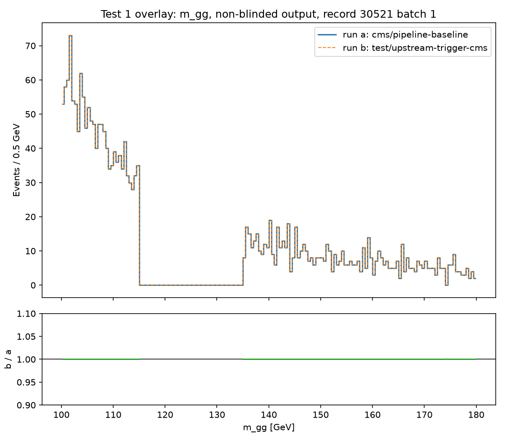

# Upstream trigger-matching (`bea982d`, "Feat/trigger matching (#22)") cherry-picked onto CMS pipeline-baseline — test report

**Branch:** `test/upstream-trigger-cms` (fork only, never merged anywhere)
**Base:** `cms/pipeline-baseline` @ `f33d8d47a060082d70c4dd1451e81ad29cd0950d`
**Cherry-picked commit:** upstream `bea982d` ("Feat/trigger matching (#22)"), applied as fork commit `8631a1dc98a32fad0b007a806377e8753e800869`

Every claim below is labeled **VERIFIED BY RUNNING** (an actual command was executed and its output is quoted/summarized) or **CODE-READING ONLY** (the source was read but nothing was executed for that specific claim). Nothing in this document should be read as the stronger of the two unless labeled so.

---

## 1. What this test is, and is not

Upstream added a new, per-object *geometric trigger-matching* feature (ATLAS-only: it reads the `AnalysisTrigMatch_HLT_*` branches that ATLAS's own derivation already precomputes). This is a **different feature** from the fork's pre-existing `trigger_requirements.py`, which is an event-level boolean trigger **requirement** (CMS already uses this today, unaffected by this test).

This test asks one question only: **does cherry-picking upstream's trigger-matching feature onto the shared pipeline, with the feature switched off (as it is by default), change any CMS result?** It does not implement, run, or design CMS trigger matching itself — that is Deliverable 2, and it is explicitly reading/description only, not code.

---

## 2. Setup: the cherry-pick and its five conflicts

A cherry-pick of `bea982d` alone (not a merge of upstream's branch) was used specifically so the change stays attributable to this one commit; a full branch merge would have conflicted in 7 files instead of 3. **VERIFIED BY RUNNING:** `git cherry-pick bea982d` on top of `cms/pipeline-baseline` produced conflicts in exactly 3 files, 5 conflict regions, matching the brief's prediction.

All five were resolved by **keeping both sides** — in every case, the fork's CMS-specific code and upstream's new ATLAS-specific code were adding *different, non-overlapping* things in the same textual region, not disagreeing about the behavior of the same thing. None required a stop-and-report as a genuine disagreement. Each is described below.

### Conflict 1 — `orchestration/handlers/parsing_handler.py`, imports
Fork's side added an import of `EventDeduplicator`; upstream's side added an import of `apply_trigger_selection` alongside `apply_parsing_event_selection`. Both are needed; both imports were kept.

### Conflict 2 — `orchestration/handlers/parsing_handler.py`, main batch loop
Fork's side had the CMS trigger-**requirement** call (event-level boolean) already in the `working_events` chain. Upstream's side inserted its new trigger-**matching** call at the same point in its own branch. Resolution: kept the fork's CMS trigger-requirement block, then inserted upstream's `apply_trigger_selection(...)` call immediately after it (gated on `trigger_cfg.get("enabled", False)`), before the existing kinematic-cuts block. Because `trigger_cfg` defaults to `{}` when `trigger_config` is absent from a config file (see §3), this call is a no-op for every CMS config unless someone explicitly adds `trigger_config: enabled: true`.

### Conflict 3 — `services/parsing/file_parser.py`, `_extract_branches_by_schema`
Fork's side added CMS's `scalar_groups` resolution block. Upstream's side added detection of trigger-matching branches (`_triggerMatch`) and the random-run-number branch (`_runNumber`). Both kept, in sequence — CMS's scalar groups first, then upstream's trigger/run-number detection. Both blocks only add to `obj_branches` if the relevant branches are actually found on the file (`available_trigger = [b for b in trigger_branches if b in tree_branches]`), so on a CMS file with no `AnalysisTrigMatch_HLT_*` branches, `_triggerMatch` is simply never added. **VERIFIED BY RUNNING** in §5 below (branch-list comparison): confirmed no `_triggerMatch` group was created on the actual CMS file used.

### Conflict 4 — `services/parsing/file_parser.py`, `_filter_accessible_branches` (the one requiring real investigation)
This was the only conflict where the two sides' pre-existing code (before either patch) already differed subtly, so it needed tracing rather than a mechanical "keep both". Fork's pre-existing code used a single `if`, always inserting an (possibly empty) `"DirectObjects"` entry into `accessible_obj_branches`. Upstream's pre-existing code used `if`/`elif`, only inserting non-particle-type entries (`"DirectObjects"`, and now also `"_triggerMatch"`/`"_runNumber"`) when non-empty. Read via `git show origin/cms/pipeline-baseline:...` and `git show bea982d:...` directly to confirm this was the real difference, not a merge artifact.

Traced the one consumer of this dict, `_parse_opened_file`, which reads it via `obj_events.pop(group_name, None)` — a default of `None` for a missing key. This makes "key present with an empty dict" and "key absent entirely" produce an *identical* downstream `actual_branches = set()`, so the two versions' behavior is indistinguishable to every consumer. This extends the brief's own pre-cleared finding about the `DirectObjects`/`_can_calculate_inv_mass` restructure (already investigated and found to have no downstream effect, and explicitly not to be re-litigated) to also cover the CMS-specific `scalar_group_names` case, which is new in this cherry-pick and wasn't covered by the earlier finding. Resolved by keeping the `if`/`elif` structure (upstream's), extended to also cover `scalar_group_names`.

### Conflict 5 — `services/parsing/schemas.py`
Fork's side added `NANOAOD_EVENT_ID_BRANCHES` (a CMS constant). Upstream's side added its entire trigger-chain block (`SINGLE_LEPTON_TRIGGER_CHAINS`, `TRIGGER_BRANCH_SUFFIX`, `RANDOM_RUN_NUMBER_BRANCH`, `YEAR_RUN_RANGES`, `RELEASE_TRIGGER_YEARS`, `get_all_trigger_branches()`). Both are independent, unrelated constants/functions; both kept in sequence. One dangling `>>>>>>> bea982d` marker line was left behind ~100 lines after the first resolution edit (the closing marker of a conflict region whose opening marker had already been handled) — caught and fixed by re-grepping for conflict markers (`^<<<<<<<|^=======|^>>>>>>>`) across all three files after every edit, which then came back clean.

**VERIFIED BY RUNNING:** `py_compile` on all three touched files, plus the local test suite, ran clean after resolution (see §4).

---

## 3. Post-merge CMS capability check (before running any physics)

Per the brief, before running Test 1, confirmed the existing CMS capabilities are still wired: extra per-object fields, boolean cuts, the HLT trigger **requirement** (distinct from the new matching feature), the validated-runs filter, and MC weights.

**VERIFIED BY RUNNING:**
- Full local test suite on `test/upstream-trigger-cms`: **346 passed, 7 failed, 11 skipped**. The 7 failures are a pre-existing Windows-only test-teardown issue (`PermissionError: [WinError 32]` cleaning up a temporary SQLite file during test fixture teardown, in `test_global_final_state_threshold.py` and `test_mass_calculation_stats.py`) — a Windows temp-file-locking artifact of the local dev machine, unrelated to this cherry-pick, and not present when the same code runs on the cluster (see §4/§5, which ran without this issue on Linux).
- A CMS-focused subset of the same suite (test files/functions whose names reference CMS): **133 passed, 11 skipped, 0 failed**.
- `config.cms_hgg_data.yaml` has no `trigger_config` key at all. `Config.trigger_config` defaults to `None` when the key is absent (`domain/config.py`); `parsing_handler.py` then computes `trigger_cfg = getattr(context.config, "trigger_config", None) or {}` → `{}`, so `trigger_cfg.get("enabled", False)` → `False`. The new call is a no-op for every existing CMS config without any change needed to those configs.

No CMS capability broke. This is not the headline result — Test 1 below is — but it is the gate that had to pass before Test 1 was meaningful at all.

---

## 4. Test 1 — does the (switched-off) change alter CMS results?

**Why H→γγ, not m0m1j0.** m0m1j0 is a standalone analysis script that runs on already-parsed chunks and never itself invokes the shared pipeline's parsing entry point — testing it would not exercise the code this cherry-pick touched. **VERIFIED BY RUNNING (confirmed, not assumed):** read `studies/hgg_cms/cluster/pbs_hgg_data_array.sh`, which genuinely invokes `main.py --config config.cms_hgg_data.yaml --tasks parsing --batch-job-index N --total-batch-jobs 133` (the real shared pipeline, going through `orchestration.handlers.parsing_handler.ParsingHandler`) before its own `run_selection_on_chunks.py`. H→γγ was used for this reason.

**Dataset.** Same dataset that produced the existing committed reference result at `/storage/agrp/berkom/atlas-utilization/output/hgg_full/data/job_1/` — record 30521 (DoubleEG, Run2016G), file index 0 (`--batch-job-index 1 --total-batch-jobs 133`, the same 1-based convention the production job used). Reference cutflow (from that job's own `job_metadata.json`, not re-derived): `n_input_events: 11826, n_with_ge2_tm_photons: 10820, n_selected: 2974, n_written_normal: 2036, n_written_blinded_signal_region: 938`.

**Runs.**
- **(a)** `cms/pipeline-baseline` (`f33d8d4`), unmodified, in a fresh isolated cluster checkout.
- **(b)** `test/upstream-trigger-cms` (`8631a1d`), `trigger_config` absent (confirmed in §3), in a separate `git worktree` of the same fork clone, so it could not collide with run (a)'s files.

**VERIFIED BY RUNNING** — parsing stage, both runs:

| | run (a) baseline | run (b) test branch | reference (job_1) |
|---|---|---|---|
| total events parsed | 2,014,154 | 2,014,154 | 2,014,154 |
| trigger requirement kept | 440,641 / 1,912,413 (23.0%) | 440,641 / 1,912,413 (23.0%) | (not recorded separately) |

**VERIFIED BY RUNNING** — selection stage, both runs (`run_selection_on_chunks.py`), exact cutflow:

| stage | run (a) | run (b) | reference |
|---|---|---|---|
| n_input_events | 11,826 | 11,826 | 11,826 |
| n_with_ge2_tm_photons | 10,820 | 10,820 | 10,820 |
| n_selected | 2,974 | 2,974 | 2,974 |
| n_written_normal | 2,036 | 2,036 | 2,036 |
| n_written_blinded_signal_region | 938 | 938 | 938 |

All three — run (a), run (b), and the pre-existing reference — are **identical at every stage**.

**Bin-by-bin histogram comparison** (built from the *normal*, non-blinded output only — `studies/hgg_cms/output.py`'s `read_output(path, unblind=False)` default, which independently asserts no blind-window event is present; the blinded-signal-region file was never opened):

- `m_gg` histogram, 100–180 GeV, 0.5 GeV bins (160 bins; same binning convention already used for `m_gg` display histograms in `studies/hgg_cms/cluster/d3_analysis.py` — not a new/invented choice).
- n_events run (a) = 2036, run (b) = 2036 — identical.
- Sorted `m_gg` value arrays for (a) and (b): **bit-for-bit identical** (`np.array_equal` on the sorted arrays returned `True`).
- **All 160 bins identical, zero differing bins.** No bin required investigation.
- Per-category counts (`EBEB`/`notEBEB`) also identical: `{"EBEB": 1050, "notEBEB": 986}` in both runs.

Plots (`studies/upstream_trigger_cms/assets/`):
- `test1_hist_run_a.png` — run (a) histogram alone.
- `test1_hist_run_b.png` — run (b) histogram alone.
- `test1_overlay_ratio.png` — overlay of both + a ratio panel (b/a), which is exactly flat at 1.00 across the full range (the zero-event gap between 115–135 GeV is the blind window, correctly present as zero in both since only the non-blinded output was read).

**Resolved branch list.** **VERIFIED BY RUNNING:** compared the actual branch sets read into the parsed ROOT files of both runs: 46 branches each, sets identical, and **zero** trigger-matching-related branch names present in either (confirmed no `_triggerMatch`/`TrigMatch`-named branch was created for CMS, consistent with Conflict 3's guard).

**Conclusion of Test 1:** the cherry-picked, switched-off feature changes nothing for CMS at this dataset/scale — parsing counts, selection cutflow, per-bin histogram contents, category counts, and resolved branch list are all identical to the pre-existing baseline.

---

## 5. Deliverable 2 — CMS trigger-object inventory (reading only, nothing implemented)

Opened the actual NanoAOD files directly via XRootD (`root://eospublic.cern.ch/...`), no local copy needed. **VERIFIED BY RUNNING** (full detail in `studies/upstream_trigger_cms/assets/deliverable2_trigobj_inventory.json`):

### H→γγ file (record 30521, file index 0 — the same file used in Test 1)
`root://eospublic.cern.ch//eos/opendata/cms/Run2016G/DoubleEG/NANOAOD/UL2016_MiniAODv2_NanoAODv9-v1/100000/11DA657F-5262-BD4A-AD1E-8E53BE62A601.root`, 2,014,154 events total.

- `TrigObj_*` branches present (10): `TrigObj_eta` (float[]), `TrigObj_filterBits` (int32_t[]), `TrigObj_id` (int32_t[]), `TrigObj_l1charge` (int32_t[]), `TrigObj_l1iso` (int32_t[]), `TrigObj_l1pt` (float[]), `TrigObj_l1pt_2` (float[]), `TrigObj_l2pt` (float[]), `TrigObj_phi` (float[]), `TrigObj_pt` (float[]).
- `TrigObj_id`: range 1–15 (a 20,000-event sample); observed values and counts: `1`: 35680, `3`: 3813, `11`: 21572, `13`: 86, `15`: 13553.
- `TrigObj_filterBits`: range 1–14493; most frequent sampled values: `16` (23959), `144` (12094), `288` (9196), `32` (4750), `3` (3865), `292` (3514), `17` (2909), `1` (1079), and several smaller ones — full list in the JSON.
- Relevant `HLT_*` branches present (of 546 total `HLT_*` branches): `HLT_Diphoton30_18_R9Id_OR_IsoCaloId_AND_HE_R9Id_Mass90` (the one the existing CMS trigger *requirement* selection already uses — pass rate 24.0% in the 20,000-event sample), plus several related Diphoton/DoublePhoton/Mu+Photon paths.
- Trigger objects per event (sampled): mean 3.74, range 0–37.

### m0m1j0 file (record 30522, DoubleMuon, file index 0)
`root://eospublic.cern.ch//eos/opendata/cms/Run2016G/DoubleMuon/NANOAOD/UL2016_MiniAODv2_NanoAODv9-v2/2430000/05DD095C-F6C3-9A4F-9FB3-348A5A6403D5.root`, 2,315,223 events total.

- Same 10 `TrigObj_*` branches present, same types.
- `TrigObj_id`: range 1–15; sampled counts: `1`: 16251, `3`: 1869, `11`: 834, `13`: 25888, `15`: 9121.
- `TrigObj_filterBits`: range 1–10512; most frequent sampled values: `1` (17683), `3` (7381), `144` (5266), `8` (4784), `288` (3999), `16` (3270), and more in the JSON.
- 201 `HLT_*` branches relevant to muon triggers found (of 556 total), e.g. the `Dimuon*`/`BTagMu*`/`DiMu*` families.
- Trigger objects per event (sampled): mean 2.70, range 0–33.

**CMS ships the ingredients, ATLAS ships the answer.** Both files have real, populated `TrigObj_*` collections — CMS is not missing trigger objects. What's missing is a precomputed *per-offline-object* match flag: ATLAS's `AnalysisTrigMatch_HLT_*AuxDyn.TrigMatchedObjects` already tells you, for a given electron/muon, whether it was the object that fired the trigger. CMS gives you the raw trigger-object collection (pt/eta/phi/id/filterBits) and expects the analysis to do the matching itself.

### What CMS trigger matching would require (description only — nothing built, not even a stub)

Two capabilities, neither of which exists in this pipeline today, both already independently identified and recorded in `docs/UPSTREAM_DIVERGENCE_MAP.md`:

1. **ΔR-based matching between two object collections** (an offline object — electron/muon/photon — and the `TrigObj` collection), selecting the trigger object within some ΔR threshold. This is the same generic capability already tracked as **Issue I — ΔR-based overlap removal between object collections** (currently framed there for *removal*, but the identical geometric primitive — "is any object in collection B within ΔR of this object in collection A" — is what trigger matching also needs; matching keeps the close pair rather than removing it).
2. **A bit-mask cut on an integer field** (`TrigObj_filterBits`, to select trigger objects that passed a specific HLT filter leg), tracked as **Issue H — Integer/bit-mask per-object cuts (e.g. CMS `Jet_jetId`)**. The existing boolean-cut machinery (`bool_require`/`bool_any_of`) explicitly rejects non-0/1-valued integer fields as a probable configuration mistake, so `filterBits` cannot be expressed with it as-is; a distinct `bit_require`-style check (bitwise AND against specific bits) is what Issue H proposes.

**Flagged, not decided, per the brief:**
- **ΔR threshold.** ATLAS's own trigger-matching convention (as read in `event_selection.py`) uses a tight ΔR (on the order of 0.07). CMS analyses conventionally use a looser threshold, often around 0.1, reflecting different detector granularity and trigger-object reconstruction. Which threshold (or whether it should be configurable per object type) is a physics decision this report does not make.
- **`filterBits` semantics.** The bit values observed above (e.g. `16`, `144`, `288` for photons; `1`, `3`, `144` for muons) are raw integers read directly from the file — their *meaning* (which bit corresponds to which HLT filter leg) is defined by the specific NanoAOD campaign's documentation, not by the file itself. **UNVERIFIED:** the exact bit-to-filter mapping for UL2016 NanoAODv9 (the campaign used here) has not been confirmed against CMS's own NanoAOD documentation for this specific sample/production; this report only reports the observed integer values and their frequencies. What would settle it: the NanoAOD content/POG documentation page for UL2016 NanoAODv9 (or the `nanoAOD-tools`/`PhysicsTools/NanoAOD` C++ producer source that assigns these bits for the `Photon`/`Muon` trigger-object collections in that campaign), which was not accessed in the course of this task.

---

## 6. CODE-READING ONLY — what happens if trigger matching were switched on for CMS

**This paragraph describes code that was read but never executed.** If a CMS config set `trigger_config: enabled: true`, `apply_trigger_selection` (in `services/parsing/event_selection.py`) would run and immediately check `if "_triggerMatch" not in events.fields`. Since Conflict 3's branch-detection guard only creates a `_triggerMatch` group when `AnalysisTrigMatch_HLT_*`-style branches are actually present on the file — and no CMS NanoAOD file has them (§5) — that condition would be true. The function would log a warning (`"Skipping file %s: no trigger-match branches on file (%d events dropped)"`) and return `events[:0]`: every event in the batch dropped, not a crash. Enabling the switch today would silently zero out CMS's output, not error loudly — this was not run, only read directly in the current source.

---

## 7. For Maryna

**This change is safe and changes nothing for CMS today.** It was tested end-to-end through the real shared pipeline on the H→γγ path with the feature switched off (which is its default state), and every number — event counts at every stage, the full 160-bin `m_gg` histogram, category counts, and the list of branches actually read from the file — came back identical to the existing baseline. Nothing needs to change in any CMS config for this to remain true.

**It cannot do anything for CMS as written, and that's a schema difference, not a bug.** The reason isn't that CMS lacks trigger objects — it has them, and they're populated (§5). The reason is that ATLAS's derivation ships the *answer* (a precomputed per-object match flag), while CMS's NanoAOD ships the *ingredients* (raw trigger-object pt/eta/phi/id/filterBits) with no matching done. If this feature were switched on for CMS as-is, it would find no matching branches and quietly drop every event (§6) — not fail loudly, just silently zero out the output. It isn't switched on anywhere for CMS, and shouldn't be until CMS has a way to do the matching itself.

**Giving CMS the same physics needs two capabilities the pipeline doesn't have yet, and both are already proposed, not invented for this task.** ΔR-based matching between two object collections (already tracked as Issue I in the divergence map, currently framed for overlap removal — the same geometric building block also does matching) and a bit-mask cut on an integer field (Issue H, needed because `TrigObj_filterBits` is a real bitmask, not a plain boolean, and the existing boolean-cut code correctly refuses to treat it as one). Building CMS trigger matching is not this task, and nothing toward it was implemented here — only the gap and the two building blocks it needs are described.

---

## 8. Scope notes

- Nothing was written to `Zhavi221/atlas-utilization` (upstream) at any point — every git write action targeted `MatanBerko/atlas-utilization` only.
- No merge occurred into `master`, `cms/pipeline-baseline`, `feature/hgg-selection-and-output`, or `docs/upstream-divergence-map`. Confirmed all four at their exact starting commits (final confirmation in the closing status message, outside this document).
- The trigger-matching-enabled-on-CMS case was not run — §6 is code-reading only, as required.
- CMS trigger matching, ΔR-between-collections, and the bit-mask cut were described, not implemented — no stub code exists anywhere in this branch for any of them.
- The `DirectObjects`/`_can_calculate_inv_mass` restructure was not re-litigated or re-tested beyond extending its already-established reasoning to the one new case this cherry-pick introduced (Conflict 4).
- `KNOWN_MASSES`, binning/bin widths/ranges (beyond reusing an existing convention for a new plot), and the H→γγ/m0m1j0 results/branches themselves were not touched.
